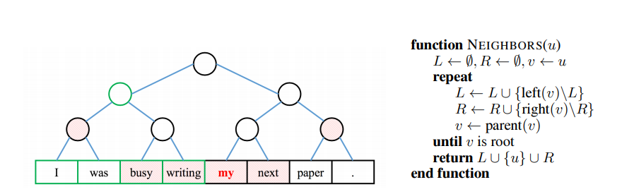
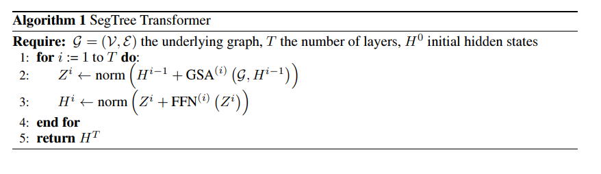

> **SegTree Transformer: Iterative Refinement of Hirarchical Features(ICLR19)**  
Zihao Ye, Qipeng Guo, Quan Gan, Zheng Zhang  
https://rlgm.github.io/papers/67.pdf

# Abstract
* Transformer의 building block은 node가 input token에 해당하는 전체 graph에서 message passing을 유도하는 것을 볼 수 있다. 이러한 dense connection으로 인해 무거워진다.
* Star-Transformer는 인접 token사이의 연결을 유지하면서 중앙 node를 통해 long-term dependency를 중계함으로써 short-term dependency을 보다 많이 활용한다. 이러한 structure는 long sentence를 처리하는데 어려움이 있다.
* 본 논문에서는 input token을 word span의 tree로 구성하고 attention을 확장하는 Segment Tree Transformer을 제안.
* 공간과 시간 복잡성을 크게 개선하여 NLP task에 대해 $O(n\ log\ n)$을 달성

# 1 Introduction
Self-attention base model인 transformer는 NLP downstream task(NMT, language modeling, text classification)에서 많은 성능 향상을 보여줬다.
그러나 Transformer의 무거운 architecture는 large-scale training data가 필요하거나 성능 손실을 겪는다.
Battaglia et al., (2018)은 transformer의 내부 동작을 graph로 전달하는 message로 보고, input token을 node와 attention으로 사용한다. fully connected nature는 각 word가 정확히 한 단계에서 다른 token과 communicate할 수 있게 한다.  

Star-Transformer(Guo et al., 2019)는 relay node를 사용하여 input token의 정보를 중앙 집중화 한 다음 각 node가 인접한 node뿐만 아니라 relay에도 참석할 수 있게 한다.
이러한 가벼운 star-topology에서의 2단계 message passing은 단거리 의존성(n-gram 형태)과 장거리 의존성의 중요성을 균형있게 조정하여 $O({n}^{2})$에서 $O(n)$으로 계산 복잡도를 크게 감소시켰다.
* Vanilla Transformer와 Star-Transformer는 spectrum의 two end로 볼 수 있다.
  * Vanilla Transformer: non-local relationship이 완벽하게 분산되므로 overfitting을 방지하기 위해 큰 memory 공간과 큰 training set이 필요.
  * Star-Transformer: 인접하지 않은 모든 dependency를 완전히 중앙 집중화 하므로 relay node는 특히 long sentence에서 over-stretched 될 수 있다.  
  
본 논문에서는 Segment Tree data structure(De Berg et al., 1997)를 Transformer에 통합하는 architecture를 중점으로 탐구한다.
주어진 sentence에 대해 leaf node가 각 단어에 mapping되는 완전한 binary tree와 그 자식 node에 mapping된 모든 단어에 걸쳐 span을 나타내는 descendant leaf들을 생성한다.
계산복잡도는 $O(n\ log \ n)$ 달성.  
SegTree-Transformer를 단순화하면 가까운 이웃에 더 많이 attend하고 멀리있는 이웃에는 덜 attend하는 inductive bias를 효율적으로 encoding한다.(Khandelwal et al.(2018))

# 2 Model
## 2.1 Recap: Transformer
n개의 input token이 있는 sentence가 주어지면 Transformer는 step t에서 각 input token ${ H }^{ t }\in \mathbb{ R }^{ n\times d }$의 $d$ dim representation을 반복적으로 계산한다. ${ H }^{ 0 }$은 token embedding
* Transformer의 핵심은 다음과 같이 공식화 할 수 있는 MSA(Multi-head Self-Attention)이다.
$$
MSA\left( H \right) =\left[ { head }_{ 1 },\cdots ,{ head }_{ N } \right] { W }^{ O }\qquad { head }_{ i }=softmax\left( \frac { { Q }_{ i }{ K }_{ i }^{ T } }{ \sqrt { d }  }  \right) { V }_{ i }\qquad (1)
$$
$$
{ Q }_{ i }=H{ W }_{ i }^{ Q }\qquad { K }_{ i }=H{ W }_{ i }^{ K }\qquad { V }_{ i }=H{ W }_{ i }^{ V }
$$
$N$은 head의 갯수이고, ${ W }_{ i }^{ Q },{ W }_{ i }^{ K },{ W }_{ i }^{ V },{ W }^{ O }$는 learnable parameter이다.
${H}^{t+1}$은 ${H}^{t}$로부터 계산된다.
$$
{ Z }^{ t }=norm\left( { H }^{ t }+MSA\left( { H }^{ t } \right)  \right) \qquad { H }^{ t+1 }=norm\left( { Z }^{ t }+FFN\left( { Z }^{ t } \right)  \right) \qquad (2)
$$

## 2.2 SegTree-Transformer: Graph Construction
* SegTree-Transformer는 모든 single token에 attend하는 대신 token을 span으로 구성하고 각 token이 span 또는 다른 token을 처리하므로 node 수를 줄인다.
* SegTree-Transformer는 leaf node가 input token에 해당하는 완전한 binary tree를 구성하여 이를 수행한다.
* internal node는 descendant leaf들에 mapping된 단어를 포함하는 span에 해당한다.
* node를 word span에 mapping하고 양방향으로 node를 다시 연결한다.
    * bottom-up: directed edge는 각 leaf를 original binary tree에 연결한다.
    * top-down: directed edge는 attend할 node를 각 leaf에 연결한다. 각각의 leaf에 대해 (1) leaf자체와 그 좌우에 leaf가 포함되어있고 (2) 모든 선택된 node들의 span이 전체 sentence를 포함하면서 분리되어 있는 경우 entire node들의 최소 set가 선택됨
* 그림1은 그러한 context node를 찾는 알고리즘을 보여준다.

그림 1: sentence위에 구성된 binary tree. 굵게 표시된 단어는 shaded node(top-down edges)에서 자기 자신을 계산하는 반면, 녹색원이있는 internal node는 녹생상자로 강조 표시된 모든 descendant leaf들에 걸쳐 나타남.

## 2.3 SegTree-Transformer: Message Passing
* SegTree-Transformer layer내에서 주어진 node $u$에 대해 ${h}^{u}$를 $GSA\left( \mathcal{G},{ h }^{ u } \right) $로 update한다.
* $\mathcal{G}$는 기본 그래프, $GSA$는 다음과 같이 Graph Self-Attention을 나타낸다.

$$
{ A }^{ u }=concat\left( \left\{ { h }_{ v }|v\in \mathcal{A}\left( u \right)  \right\}  \right) \qquad (3)
$$

$$
{ Q }_{ i }^{ u }={ H }_{ k }{ W }_{ i }^{ Q }\qquad { K }_{ i }^{ u }={ A }^{ u }{ W }_{ i }^{ K }\qquad { V }_{ i }^{ u }={ A }^{ u }{ W }_{ i }^{ V }\qquad (4)
$$

$$
{ head }_{ i }^{ u }=softmax\left( \frac { { Q }_{ i }^{ u }{ { K }_{ i }^{ u } }^{ T } }{ \sqrt { d }  }  \right) { V }_{ i }^{ u }\qquad (5)
$$

$$
GSA\left( \mathcal{G},{ h }_{ u } \right) =\left[ { head }_{ 1 }^{ u },\cdots ,{ head }_{ N }^{ u } \right] { W }^{ O }\qquad (6)
$$

$\mathcal{A}\left(u\right)$는 $\mathcal{G}$와 $i$의 predecessor이며 모든 attention head에 대해 반복한다. option으로 relative positional embedding을 사용할 수 있으며 Appendix 2.에서 설명한다.
internal node의 predecessor은 모두 descendant leaf이다.
위의 식에서 모든 leaf node에 대해 $\mathcal{A}\left(u\right)$를 설정하면 vanilla transformer와 동일하다는것을 알 수 있다.  

실험에서 SegTree-Transformer layer내에서 모든 node를 동기적으로 업데이트 한다.
internal node representation은 모두 0으로 초기화되고 leaf node representation은 해당 단어 embedding으로 초기화 된다.
vanilla transformer와 같이 여러개의 SegTree-Transformer layer를 쌓을 수 있다.
downstream task에 따라 SegTree Transformer model의 output으로 최종 root node representation(e.g. Text Classification) 또는 최종 layer의 모든 leaf node representation(e.g. Language Modeling)을 취한다.

## A Appendix
### A.1 Pseudo Code of SegTree-Transformer

### A.2 Relative Position Representations
* 단어 사이의 상대 거리를 self-attention계산으로 유도하는 것이 도움이 된다.
* $\mathcal{A}\left(u\right)$의 각 node $v$에 대해 $u$와 $v$사이의 tree상에서의 상대적인 위치 차이를 고려하고, 그러한 차이의 latent representation ${r}_{v,u}$를 할당한다.
    * ${ r }_{ v,u }={ r }_{ self }\quad if\quad v=u.$
    * ${ r }_{ v,u }={ r }_{ left }^{ j }\quad or\quad { r }_{ right }^{ j }$, $v$가 top-down context node를 찾는 알고리즘에서 $j$번째 $u$의 이웃 집합에 합류하는 노드가 왼쪽/오른쪽 인 경우.
    * ${ r }_{ v,u }={ r }_{ anc }^{ j }$, $u$가 level $j$의 tree에서 $v$의 ancestor이면.
* $r$: trainable parameters
* positional representation을 포함한 식2.3의 수정 버전은 다음과 같다.
$$
{ R }^{ u }=concat\left( \left\{ { r }_{ v,u }|v\in \mathcal{A}\left( u \right)  \right\}  \right) \qquad { head }_{ i }^{ u }=softmax\left( \frac { { Q }_{ i }^{ u }{ \left( { K }_{ i }^{ u }+{ R }^{ u } \right)  }^{ T } }{ \sqrt { d }  }  \right) { V }_{ i }^{ u }\qquad (7)
$$
* relative positional representation $r$은 attention head끼리 공유된다.
