> **Image as a Foreign Language: BEiT Pretraining for All Vision and Vision-Language Tasks**  
Wenhui Wang, Hangbo Bao, Li Dong, Johan Bjorck, Zhiliang Peng, Qiang Liu, Kriti Aggarwal, Owais Khan Mohammed, Saksham Singhal, Subhojit Som, Furu Wei  
https://arxiv.org/abs/2208.10442

**부제: BEiT-3: A General-Purpose Multimodal Foundation Model**

## Overview
최근 자연어, 비전 멀티모달 연구가 활발하게 진행되고 있는데 BEiT-3 가 발표되면서 비전, 비전+자연어 benchmark중 12개 데이터셋(7개 task)에서 SotA를 갱신하였음.
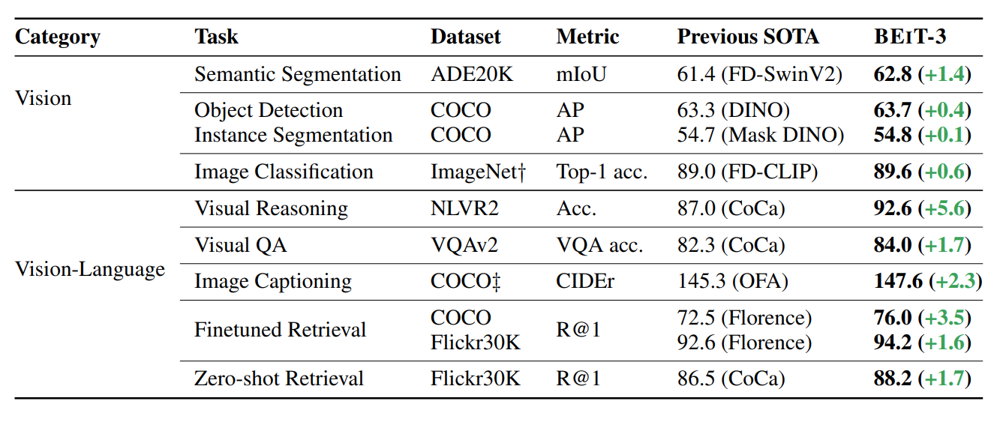
**표 1: 비전, 비전+자연어 벤치마크에 대한 BEiT-3 결과**
* SotA 갱신 task
  1. 의미론적 분할
  2. 객체 탐지
  3. 이미지 분류
  4. 시각적 추론
  5. 시각적 질문답변
  6. 이미지 캡셔닝
  7. 이미지 검색

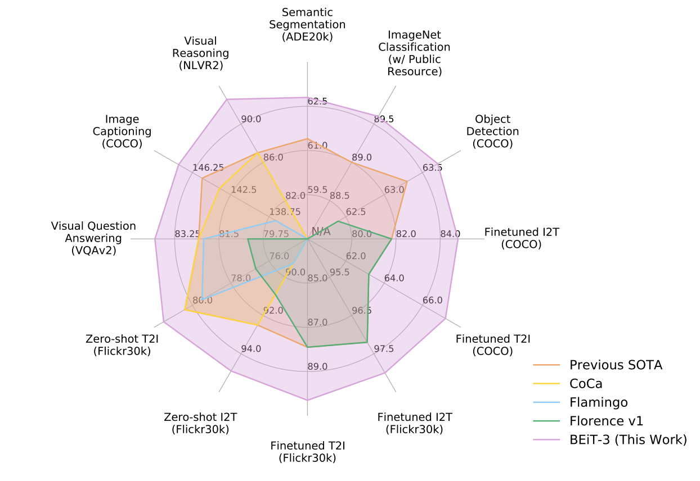

## 1. Problem
* 최근 몇년간 언어, 비전, 멀티모달 사전학습을 위한 연구들이 진행되고 있음
  * 대규모 데이터를 통해 대규모 사전학습을 수행하면 모델을 다양한 downstream task로 미세조정하여 사용할 수 있음.
  * 여러가지 모달리티(modality)를 처리한다는 점에서 범용 기초모델(general-purpose foundation model)을 사전학습 하는것은 이점이 많다.
  * 본 논문에서는 다음과같은 세 가지 측면에서 기존 멀티모달 사전학습 연구에 공헌함.

### Contribution
1. 비전+언어 멀티모달 downstream task 마다 특성이 달라 transformer를 적용하는 다양한 방법이 존재.
  * 통합 아키텍쳐인 Multiway Transformer를 사용하여 모달리티별 인코딩과 융합을 고려하게 모델링
2. 현재 비전+언어 멀티모달 사전학습은 일반적으로 서로 다른 사전학습 방식이라 비효율적임.
  * 범용 기초모델 학습을 위해 mask-then-predict(masked modeling) 사전학습 방식만 사용함
3. 모델크기와 데이터크기를 확장하면 일반화 성능이 향상된다는 관례에 따라 기존보다 모델크기를 확장.
  * 모델, 데이터 scale-up을 통해 내부 데이터(JFT-3B)를 사용하는 기존 StoA 모델(Google CoCa)과 근접한 성능을 보여줌.

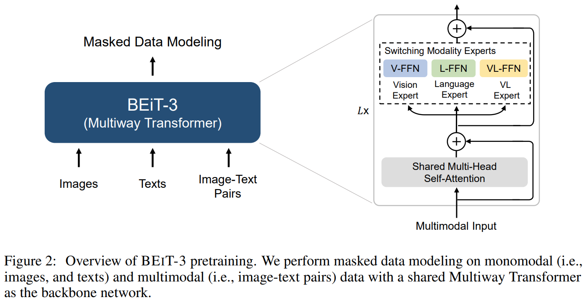

## 2. Method
### 2.1. Backbone Network: Multiway Transformers
* 본 논문에서 사용하는 백본 네트워크인 Multiway Transformer는 저자들의 이전논문 [VLMo](https://arxiv.org/abs/2111.02358)에서 제안된 아키텍쳐.
* Multiway Transformer block은 다음 그림과 같이 구성된다.
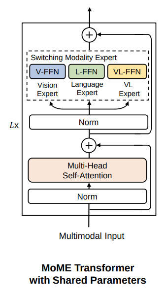
* 기존의 Self-attention module은 각 layer간 공유되게 구성.
  * Self-attention을 공유하여 모달리티간 alignment를 추가적으로 학습할 수 있음
* 기존의 FFN(FeedForward Network) module은 MoE(Mixture-of-Expert)에 영감을 받아 Vision Expert, Language Expert, VL Expert 세 가지로 구성(Switching Modality Experts).
* Switching Modality Experts를 통해 하나의 네트워크로 멀티모달 downstream task를 수행할 수 있는 통합 아키텍쳐가 구성됨

### 2.2. Pretraining Task: Masked Data Modeling
* 사전학습은 BEiT(**BE**RT Pre-Training of **I**mage **T**ransformers) 라는 이름에서 알 수 있듯이 Masked Modeling 방식 하나만으로 수행됨 (simple is best).
* 사전학습 과정은 다음과 같이 수행함.

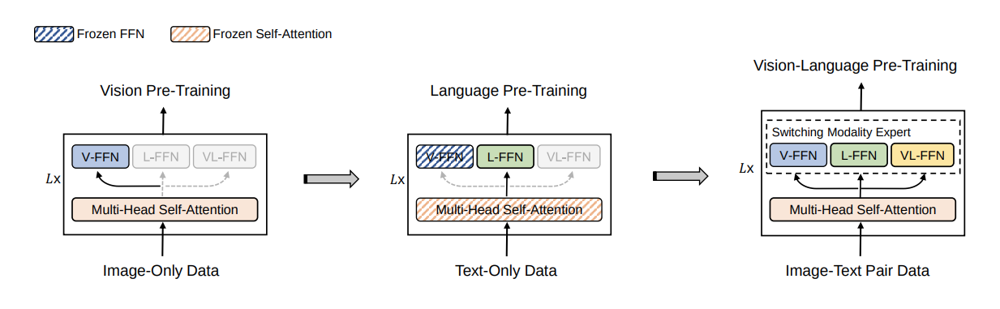

1. 비전 사전학습
  * Vision Expert인 V-FFN만 활성화하여 이미지 데이터 학습
2. 언어 사전학습
  * Self-attention과 V-FFN은 Frozen시키고 Language Expert인 L-FFN만 활성화하여 언어 데이터 학습
3. 멀티모달 사전학습
  * 모든 module을 활성화하고 비전+언어 쌍 데이터 학습

* 사전학습 모델구성과 데이터셋은 다음과 같음
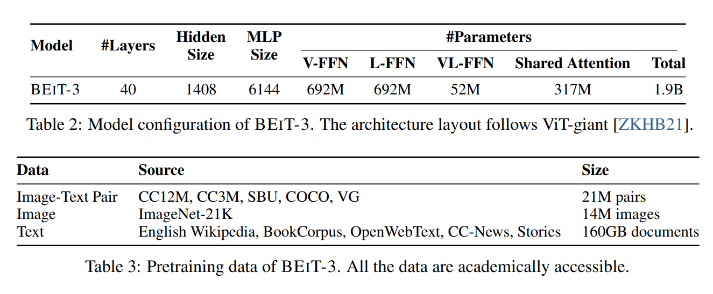

### 2.3. Downstream Task: Vision Encoder, Dual Encoder, Fusion Encoder
* 사전학습된 BEiT-3은 다양한 비전, 비전+언어 멀티모달 downstream task로 미세조정 할 수 있음
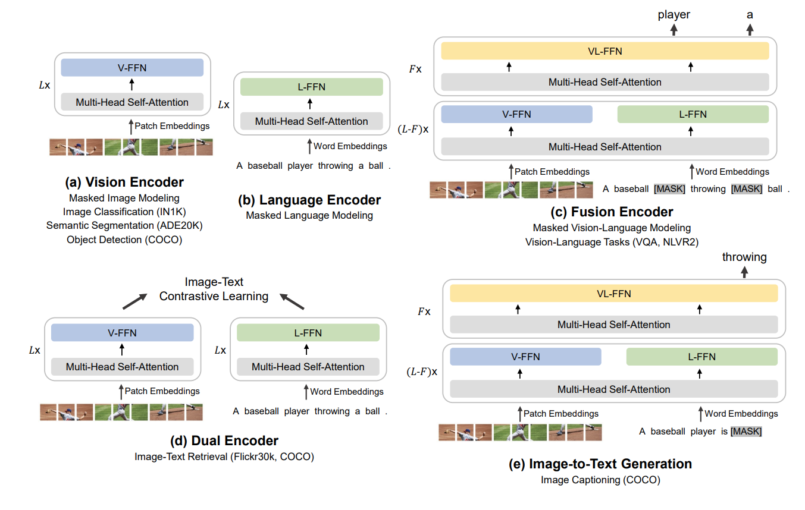

* 비전 downstream task에서는 통합 아키텍쳐에서 (a)만 사용하여 미세조정 (Vision Expert만 활성화)
* 이미지-언어 검색 task(Flicker30k, COCO)에서는 (d)의 Dual Encoder 사용하여 미세조정
* 이외 비전+언어 멀티모달 downstream task는 (c)의 Fusion Encoder를 사용하여 미세조정

**저자들이 그림을 이해하기 힘들게 그려놨는데 멀티모달 task의 경우 text, image pair가 input으로 들어왔을때 text는 language exprt, image는 vision expert를 forward하고 마지막 3개 layer에서는 VL Expert를 forward하는 구조임**

## 3. Result
### 3.1. Vision-Language Downstream Tasks
### 시각적 질문답변 VQAv2, 시각적 추론 NLVR2, 이미지 캡셔닝 COCO에 대한 벤치마크 결과
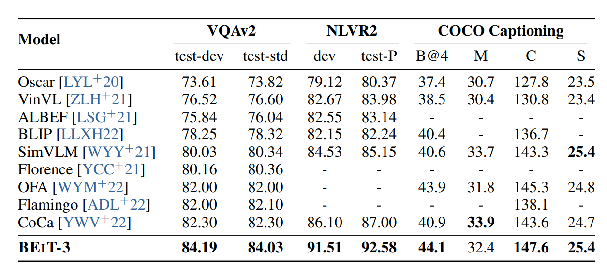

### 이미지-자연어 검색 MSCOCO, Flicker30K에 대한 벤치마크 결과
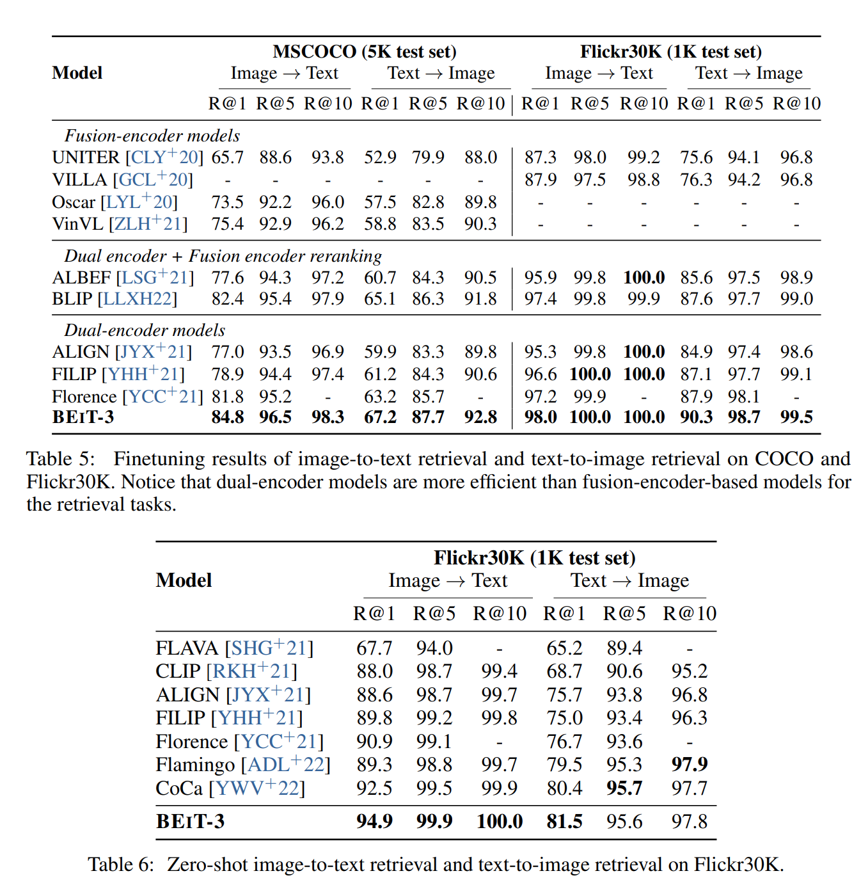

### 객체탐지 COCO에 대한 벤치마크 결과
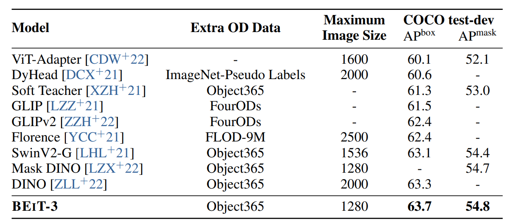

### 3.2. Vision Downstream Tasks
### ImageNet-1K 벤치마크 결과
* Google의 내부데이터를 사용한 모델들보다 성능은 떨어지지만 public 데이터인 ImageNet-21k를 사용한 모델중에선 가장 성능이 좋음.
* CoCa와 비교하여 공개데이터 사용 및 이미지사이즈 336x336을 사용하였지만 성능차이가 크지않고 512x512 사이즈를 사용한 다른 모델보다 더 좋은 성능을 보이는것은 고무적이라 생각됨.

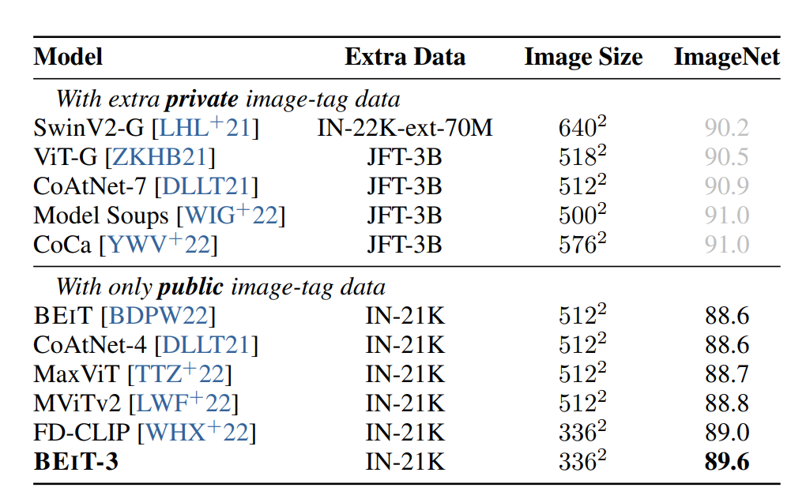