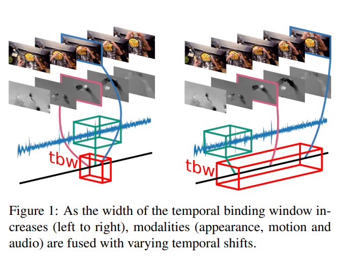
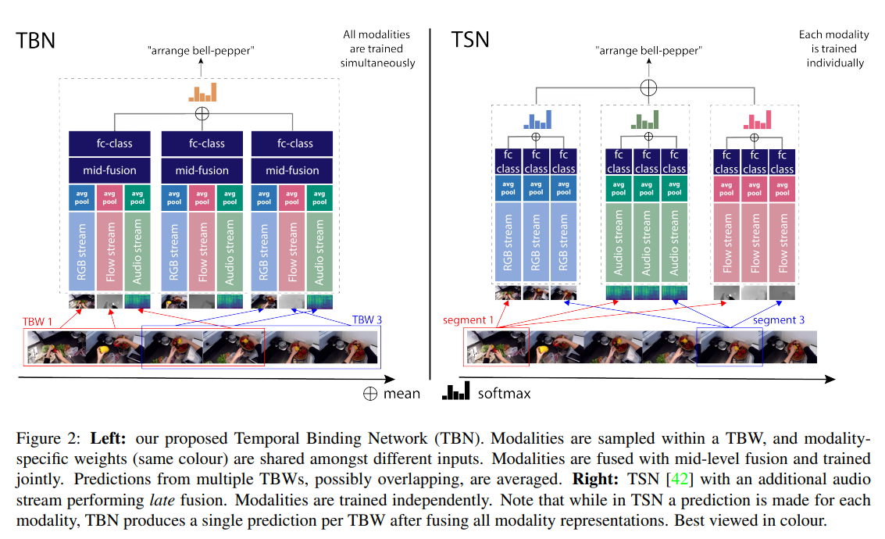
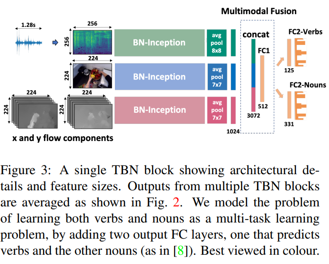

> **REPIC-Fusion: Audio-Visual Temporal Binding for Egocentric Action Recognition**  
Evangelos Kazakos, Arsha Nagrani, Andrew Zisserman, Dima Damen  
https://arxiv.org/abs/1908.08498

# 1. Introduction
egocentric(자아중심)action recognition의 **visual** modality(apperance and motion(모양과 움직임))에 정보를 제공하기 위해 **audio**를 prime modality로 연구를 진행한다.
audio는 video understanding분야에서 연구되었지만, egocentric domain은 손과 물체간의 interaction에서 비롯되는 풍부한 소리뿐 아니라 진행중인 동작에 대한 웨어러블 마이크의 접근성을 제공.
audio는 시각적으로 모호한 동작 (e.g. 'open tap' vs 'close tap')을 분리할 수 있다.  

egocentric action recognition에 audio를 통합하여 action의 appearance와 audio signal 사이의 잠재적인 시간적 비동기성과 관련된 새로운 다중 감각 융합 접근법(multi-sensory fusion approach)을 탐색할 수 있다.
action recognition을 위해 여러개의 다중 모드 융합 architecture가 존재하지만 기존의 접근법은 modality를 fusion하기전에 각 modality내에서 시간집계를 수행한다.
그림1에서는 EPICKitchens 데이터셋에서 '계란에 계란을 깨는'예를 보여준다.

알을 cracking하는 뚜렷한 소리, 알을 분리하는 움직임 및 알의 모양 변화는 video내의 다른 frame/temporal position에서 발생한다.
이에 따라 동기화된 입력으로 modality를 통합하는 접근 방식은 그러한 동작을 배우는 능력이 제한된다.  

본 논문에서는 TBW(Temporal Binding Window)(그림1) 내에서 fusing input에 대해 탐색을 진행하여 다양한 형식의 asynchronous input을 사용한 모델을 학습할 수 있다.
신경과학과 행동과학에서 인간에게 그러한 TBW가 존재한다는 점을 알려준다[30, 41].
흥미롭게도 인간의 TBW width는 task에 따라 그게 달라지며, flash 및 경고음의 간단한 자극의 경우는 짧고 망치가 못을 치는것과 같은 complex한 자극의 경우 중간이다[41].

egocentric action recognition을 위해 audio와 결합하고 비동기 modality fusion을 위해 TBW를 사용하여 다음과 같이 논문을 통한 기여를 요약할 수 있다.
  1. end-to-end로 학습이 가능한 **중간레벨 fusion Temporal Binding Network(TBN)**를 제안한다.
  2. 자기 중심적 행동 인식에서 최초로 **audio-visual 융합 시도**를 제시
  3. EPICK-Kitchens leaderboard에서 SOTA를 달성
    
# 2. Related Work
action recognition을 위한 visual modality를 융합시키는 연구는 크게 세가지로 나뉜다.
* **Visual Fusion for AR:**
    * [10]은 공간 및 시간 스트림의 mid-level 융합을 제안했으며, 마지막 convolution layer이후의 스트림을 결합하여 최적의 결과를 보여줌.
    * TSN(Temporal Segment Networks)은 sparse temporal 샘플링을 수행한후 다음 sample전체에서 softmax score의 시간집계(평균)을 수행.
    * [18]에서 시간적 집계전의 modality 융합이 제안되었으며, 여기서 현재 frame의 apperance는 2개의 LSTM을 사용하여 균일하게 sampling된 5개의 motion frame과 융합됨.
    * [18]은 본 논문의 동기와 유사하지만, 그들의 접근 방식은 두 modality사이에 미리 정의된 asynchrony offset을 사용하는데 중점을 둠.
* **Fusion in Egocentric AR:**
    * appearance와 motion의 late fusion은 egocentric AR[8, 24, 38, 40]에서 자주사용되었으며 egocentric 신호를 포착하기 위한 추가 스트림으로 확장되었다[21, 37, 38].
    * [37]은 2D와 3D ConvNet모두에 쌓여서 fed되고 늦게 fusion되어 결합된 head motion feature, hand mask, saliency map을 사용.
* **Audio-Visual Learning:**
    * 지난 3년동안, 비디오에 존재하는 audio stream에 computer vision분야에서 상당하게 관심을 가졌다.
    * 이것들은 4가지 범주중 하나에 속함.
        1. audio-visual representation learning
        2. sound-source localisation
        3. audio-visual source separation
        4. visual-question answering(VQA)
    * 이러한 접근법을은 fusion 또는 공통 공간에 embedding을 사용
    * [16, 28]은 audio-visual representation learning을 self-supervised task에 학습시킨다음 fine-tune하여 AR에 사용될 수 있음을 주목하였음. 
    
    
    
# 3. The Temporal Binding Network
* 본 논문의 목표는 sampling을 통한 시간적 진행을 modeling하면서 여러 modality 입력을 fusion하는 최적의 방법을 찾는것이다.
* Sec 3.1에서 여러 modality의 temporal binding에 대한 일반적인 개념을 설명하고 3.2에서 architecture를 자세히 설명함.

## 3.1 Multimodal Temporal Binding
video stream에서 modality의 sample sequence를 다음과 같이 가정 ${ m }_{ i }=\left({ m }_{ i1 },{ m }_{ i2 },\cdots ,{ m }_{ iT/{ r }_{ i } } \right) $.
$T$는 video의 길이이며 ${ r }_{ i }$는 framerate(또는 sampling frequency)를 나타냄.  

input sample은 먼저 unimodal feature extraction function ${f}_{i}$를 통과.
다양한 representation 크기와 famerate를 계산하기위해, 대부분의 multi-modal architecture는 multimodal fusion을 하기전에 average pooling 또는 temporal pooling function의 형태로 각 modality에 pooling function $G$를 적용한다.
modelity pair ${m}_{1}$과 ${m}_{2}$가 주어지면, video에 대한 final class prediction은 다음과 같이 얻어진다.

$$
y=h\left( G\left( { f }_{ 1 }\left( { m }_{ 1 } \right)  \right) ,G\left( { f }_{ 2 }\left( { m }_{ 2 } \right)  \right)  \right) \quad \quad (1)
$$

${f}_{1}$ 및 ${f}_{2}$는 unimodal feature extraction fuction이고, $G$는 temporal aggregation function, $h$는 multimodal fusion function, $y$는 video의 output label이다.
이러한 architecture(e.g. TSN)에서, modality는 다른 modality이 fusion되기전에 prediction을 위해 시간적으로 aggregation된다. 이것을 일반적으로 'late fusion'이라고 부른다.  

반대로, multimodal fusion은 [10]에서와 같이 각 time step에서 수행될 수 있다.
이를 수행하는 한가지 방법은 modality를 동기화하고 각 단계에서 prediction을 수행하는것이다.
framerate가 일치하는 모드의 경우 동기화된 multi-modal sample(${m}_{1j},{m}_{2j}$) 선택하고 다음 수식에 따라 fusion할 수 있다.

$$
y=h\left( G\left( { f }_{ sync }\left( { m }_{ 1j },{ m }_{ 2j } \right)  \right)  \right) \quad \quad (2)
$$

${ f }_{ sync }$는 time step $j$에 대한 representation을 생성하는 multi-modal feature extractor이고, $G$는 모든 time step에 대해 temporal aggregation을 수행한다.
framerate가 다양하고 representation 크기가 더 중요한 경우 대략적인 동기화만 시도할 수 있다.
$$
y=h\left( G\left( { f }_{ sync }\left( { m }_{ 1j },{ m }_{ 2k } \right)  \right)  \right) \quad \quad :k=\left\lceil \frac { { jr }_{ 2 } }{ { r }_{ 1 } }  \right\rceil \quad \quad (3)
$$
이 접근방식을 **'synchronous fusion'**이라고 부른다.  

**본 논문에서 temporal window내에서 fusing modality을 제안한다.**
여기서 modality는 시간적으로 offset의 범위 내에서 fusion되며, 모든 offset은 finite time window내에 놓이도록 제한된다.
따라서 우리는 temporal binding window(TBW)로 간주한다.
$$y=h\left( G\left( { f }_{ tbw }\left( { m }_{ 1j },{ m }_{ 2k } \right)  \right)  \right) \quad \quad :k\in \left[ \left\lceil \frac { { jr }_{ 2 } }{ { r }_{ 1 } } -b \right\rceil ,\left\lceil \frac { { jr }_{ 2 } }{ { r }_{ 1 } } +b \right\rceil  \right] \quad \quad (4)
$$
여기서 ${ f }_{ tbw }$는 width $\pm b$의 binding window내에서 input을 결합하는 multimodal feature extractor이다.  

modality의 수가 2~3개로 증가함에 따라 TBW representation은 각기 다른 temporal offset을 갖지만 동일한 binding window $\pm b$내에서 modality의 fusion을 허용한다.
$$
y=h\left( G\left( { f }_{ tbw }\left( { m }_{ 1j },{ m }_{ 2k },{ m }_{ 3l } \right)  \right)  \right) \quad \quad :k\in \left[ \left\lceil \frac { { jr }_{ 2 } }{ { r }_{ 1 } } -b \right\rceil ,\left\lceil \frac { { jr }_{ 2 } }{ { r }_{ 1 } } +b \right\rceil  \right] \quad \quad :l\in \left[ \left\lceil \frac { { jr }_{ 3 } }{ { r }_{ 1 } } -b \right\rceil ,\left\lceil \frac { { jr }_{ 3 } }{ { r }_{ 1 } } +b \right\rceil  \right] \quad \quad (5)
$$
이 식은 다수의 다른 input 조합이 fusion될 수 있게 한다. 이는 predefine된 temporal difference([18])보다 input을 fusion하는 제안과 다르다.  

temporal window내에서 sampling하면 temporal window width $\pm b$까지 다양한 temporal shift로 modality를 fusion할 수 있다.
TBW의 기본 개념을 바탕으로 제안된 audio-visual fusion model인 TBN를 설명한다.

## 3.2 TBN with Sparse Temporal Sampling
제안된 TBN architecture는 그림 2 왼쪽에 나와있다.
action video는 동일한 width인 $K$개의 segment로 분할된다.
각 segment내에서 첫번째 modality $\forall k\in K: { m }_{ 1k }.$의 random sample을 선택한다.
이전의 연구[42,45]에서와 같이 modality의 sparse temporal sampling에 의해 action의 시간적 진행이 포착되는 것을 보장하는 반면, segment내의 random sampling은 학습을 위한 추가 데이터를 제공한다.
sampling된 ${m}_{1k}$는 width $\pm b$의 TBW centre(중심)으로 사용된다.
다른 modality는 각 TBW내에서 random하게 선택된다.(식5)
train, test 모두에서 architecture에 대한 input은 $M$ modality의 $K\times M$ sample이다.  

각 $K$ TBW내에서 temporal aggregation이전에 각 modality의 internal representation을 결합하여 audio 및 vision의 보완정보를 더 잘 활용할 수 있다고 주장하므로 mid-level 수준의 fusion을 제안한다.
ConvNet(각 modality 마다)은 mid-level feature를 추출한다음 modal feature를 concatenation하고 fully connected layer에 feed하여 TBW당 multi-modal prediction을 통해 fusion된다.

그림 3은 제안된 TBN 블록을 자세히 보여준다.
이러한 통합된 multimodal representation 각각에 대한 prediction은 video level prediction을 위해 aggregation된다.
제안된 architecture에서 모든 modality들을 동시에 학습한다.
각 modality의 convolution weight는 $K$ segment를 통해 공유된다.
또한 mid-level 수준의 fusion weight와 class prediction weight도 segment 전체에서 공유된다.  

더 길거나 짧은 action 길이로 fusion을 편향하는것을을 피하기위해 action video 길에 대해 window width $\pm b$을 계산한다.
제안하는 TBW는 width가 가변적으며 width는 action length의 function이다.
$b$는 segment의 수 $K$와 무관하게 설정될 수 있으며, temporal window가 중첩되도록 한다.

* **Relation to TSN.**
    * 그림 2에서 TBW architecture(왼쪽)와 TSN architecture(오른쪽)의 확장 버전을 비교한다.
    * 원래 TSN은 appearance와 motion stream만 사용하므로 확장 기능은 audio modality를 포함하는 것이다.
    * 여기에 두가지 차이점이 있다.
        1. TSN에서 각 modality는 독립적으로 segment에 걸쳐 temporal aggregation되고, 그 modality는 late fusion에 의해서만 결합된다.(예를들어 각 segment의 RGB score는 temporal aggregation되고, 각 segment의 flow score는 개별적으로 temporal aggregation됨) 따라서 TBN의 경우 **segment내에서 modality를 결합**함으로써 이득을 취할수 없다.
        2. TSN에서 각 modality는 독립적으로 먼저 train된 후 inference를 하면서 결합을 통해 prediction이 만들어진다. TBN model에서는 **모든 modality가 동시에 train되며 이들의 조합도 train**된다.