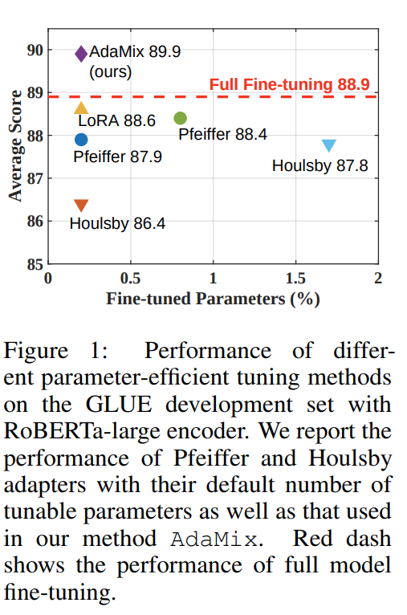
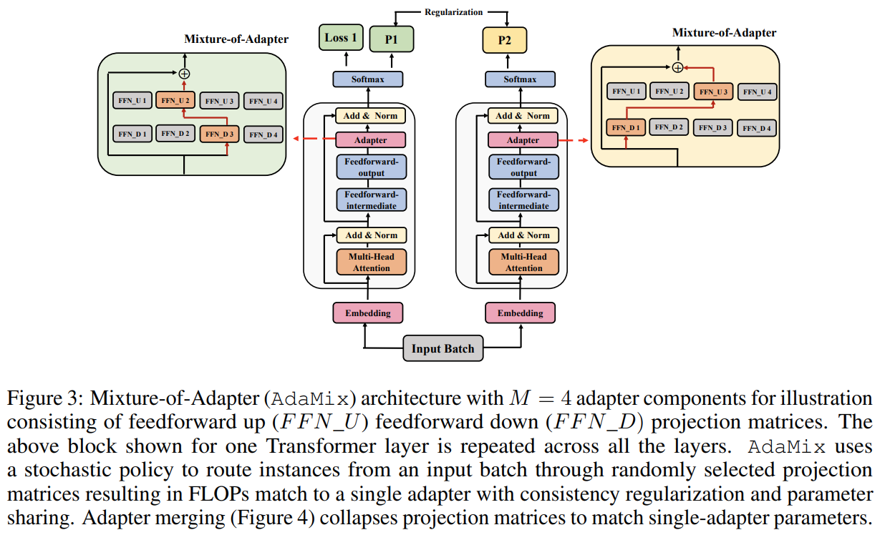
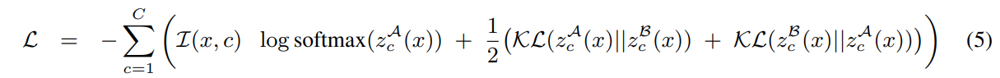
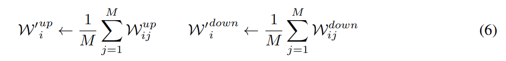
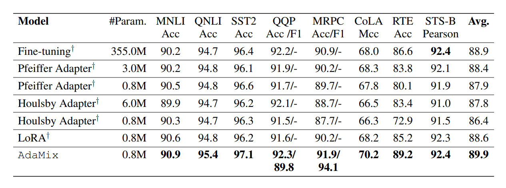
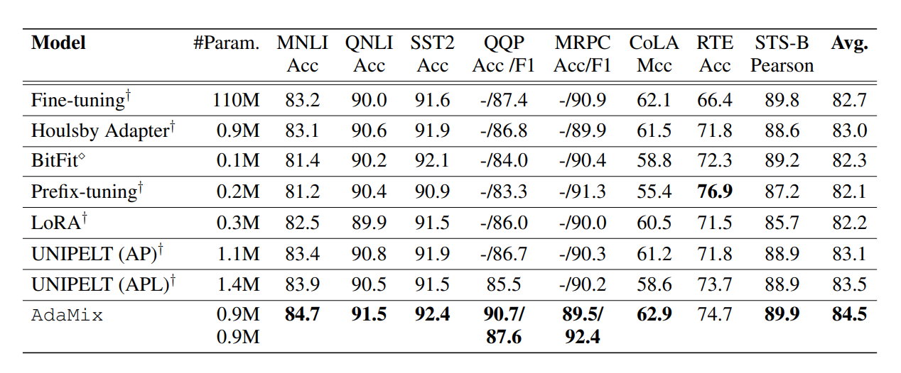
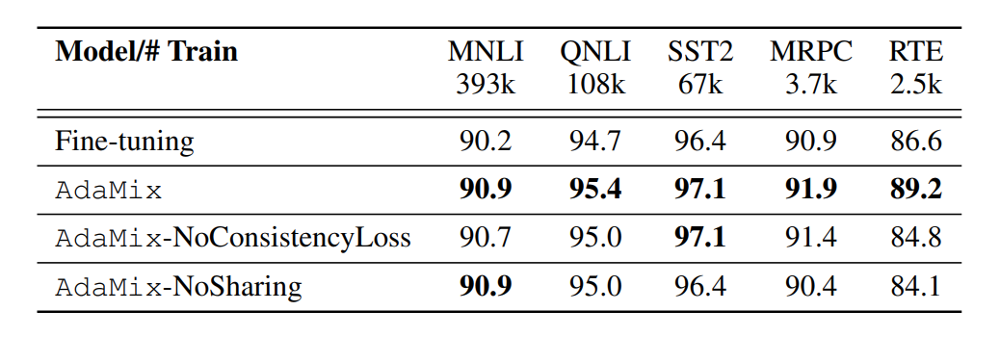

> **AdaMix: Mixture-of-Adapter for Parameter-efficient Tuning of Large Language Models**  
Yaqing Wang, Subhabrata Mukherjee, Xiaodong Liu, Jing Gao, Ahmed Hassan Awadallah, Jianfeng Gao  
https://arxiv.org/abs/2205.12410

## 1. Problem
* 사전학습된 large-scale LM을 downstream task에 적용하려면 모든 모델 파라미터를 fine-tuning 해야하고 이는 큰 리소스를 필요로 함.
* 최근 연구들에서 이러한 문제를 해결하기 위해 모델 파라미터의 일부분만 업데이트하거나 transformer layer에 학습가능한 모듈을 추가함.
* 그러나 이러한 방법들은 모든 파라미터가 업데이트되는 방식과 비교할때 성능 격차가 관찰됨.
* 본 논문에서는 FLOPs를 늘리지 않으면서 성능을 향상시킬 수 있는 sparsely-activated mixture-of-experts(MoE) 에서 영감을 받는 방법을 제안함.
* **Contribution**
  * single adapter 설계와 동일한 FLOPs를 유지하면서 stochastic routing을 통해 fine-tuning을 위한 adapter capacity를 늘리는 새로운 매커니즘 제안.
  * 파라미터를 single adapter와 동일하게 유지하면서 성능 향상을 위해 weight를 평균화하는 병합 매커니즘 제안.
  * 제안하는 기법이 잘 동작하는걸 검증하고, pre-trained 모델의 0.23% 파라미터만 업데이트하여 downstream task들에서 기존 성능을 능가.

## 2. Method
### Mixture-of-Adapter.
* 논문에서 제안하는 Mixture-of-Adapter 아키텍쳐는 그림 3과 같음.
* Transformer layer에 $M$ 개의 adapter $A_{ij}$를 추가.
* $A_{ij}:i\in \left\{1\cdots L \right\}, j\left\{1\cdots M \right\}$ 은 $i^{th}$ transformer layer의 $j^{th}$ adapter를 의미함.
* Adapter 구성요소 $A_{ij}$는 feedforward up $\mathcal{W}_{ij}^{up}$ feedforward down $\mathcal{W}_{ij}^{down}$ 으로 구성됨.

* 학습
  * $i$ 번째 transformer layer에서 한쌍의 feedforward up, down projection matrix $A_{i}=\left\{\mathcal{W}_{ij}^{up},\mathcal{W}_{ik}^{down} \right\}
B_{i}=\left\{\mathcal{W}_{ij'}^{up},\mathcal{W}_{ik'}^{down} \right\}$를 무작위로 선택.
  * 여기서 $i\neq j', k\neq k'$
  * 이후 동일한 input batch가 각 선택된 adapter set을 통해 처리됨.

* 이렇게 stochastic routing을 사용하면 학습 중 다양한 transformation을 학습할 수 있지만 추론단계 에서는 문제를 야기할 수 있음.
* 이를 해결하기 위해 두 가지 기법을 제안하여 문제를 해결함.

### Consistency regularization.
* $\mathcal{A}=\left\{A_{i=1}^{L} \right\}, \mathcal{B}=\left\{B_{i=1}^{L} \right\}$ 를 Transformer의 $L$ layer에 해당되는 adapter component 라고 가정.
* Adapter component가 정보를 공유하고 발산을 방지할 수 있도록 consistency regularization 수행.
* 다음 식 5.의 consistency loss를 task-specific loss에 추가하여 학습.

### Adapter merging.
* 학습단계에서 수행되는 consistency regularization과 달리 adapter merging은 추론단계에서만 사용된다.

### Adapter sharing.
* Labeled dataset이 적은 downstream task에서도 잘 작동하기 위해 adapter parameter를 공유.
* 절제연구를 통해 다양한 디자인을 실험하고 최종적으로 feedforward projection matrix만 공유.
* $\mathcal{W}_{ij}^{up}=\mathcal{W}_{i}^{up}.$

## 3. Result
### GLUE
* RoBERTa-large

* BERT-base

### Ablation Study

* **Analysis of consistency loss.**
  * consistency regularization이 성능향상에 기여한다는 것을 확인 할 수 있음.
  * 특히 consistency regularization을 제거한 경우 5개의 task중 4개의 task에서 상당한 성능 저하를 보여줌.

* **Analysis of adapter weight sharing.**
  * adapter weight sharing이 성능향상에 기여하는것을 확인할 수 있음.
  * 특히 dataset의 크기가 감소함에 따라 AdaMix와 AdaMix-NoShraing의 성능격차가 더 커짐을 확인할 수 있음.
  * 특히 dataset 크기가 작은 RTE 에서는 정확도가 9.4% 저하됨. (MNLI:393k, RTE:2.5k)
