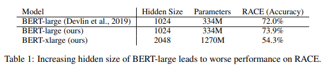
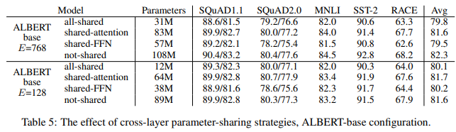
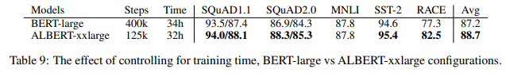

> **ALBERT: A Lite BERT for Self-supervised Learning of Language Representations**  
Zhenzhong Lan, Mingda Chen, Sebastian Goodman, Kevin Gimpel, Piyush Sharma, Radu Soricut  
https://arxiv.org/abs/1909.11942

# 1. Introduction
full-network pre-training(Radford et al., 2018; Devlin et al., 2019)은 language representation learning에서 큰 발전을 이뤘다.
가장 큰 발전은 RACE test(Lai et al., 2017)의 성능을 많이 개선한것.
- RACE test paper기준 baseline 44.1%.
- ALBERT는 89.4%를 달성하여 +45.3%를 개선.
    
 
network 성능을 개선하기위해 **large network를 training하고 더 작은 model로 distill하는것이 일반적인 관행**이 되었다.
NLP task의 성능을 높이는 쉬운 방법이 더 큰 모델을 사용하는 것인가?

large network를 train함에 있어 memory limitation problem이 있고, communication overhead는 parameter 갯수에 의존하므로 distributed training에서는 속도가 크게 저하될 수 있다.
또한 BERT-large를 단순하게 hideen size만 증가시키면 성능이 저하 될 수 있다.
그림1과 표1은 BERT-large의 hidden size를 2배로 늘리고 BERT-xlarge가 더 나쁜 결과를 얻는 예시를 보여줌.

앞에서 제시한 문제에 대한 solution은 model parallelization(Shoeybi et al., 2019) 및 clever memory management(Chen et al., 2016; Gomez et al., 2017)가 있다.
그러나 이 solution들은 memory limitation problem은 해결하지만 communication overhead 및 model degradation problem은 해결하지 못한다.  

본 논문에서는 ALBERT architecture를 제안하여 위의 문제들을 모두 해결함.

- ALBERT에서 제안하는 두 가지 prameter reduction technic:
  1. **factorized embedding parameterization**: large vocabulrary embedding matrix를 두 개의 small matrices로 분리.
  2. **cross-layer parameter sharing**: network depth에 따라 parameter가 커지는 것을 방지.  
  
두 개의 technic 모두 성능을 크게 저하시키지 않으면서 BERT의 parameter를 크게 reduction하여 parameter-efficiency를 향상.
BERT-large와 유사한 ALBERT의 configuration은 parameter가 18배 적으며 약 1.7배 더 빠르게 train.
parameter reduction technic은 training을 안정화 시키고 일반화를 돕는 정규화의 형태로도 작용 함.

ALBERT의 성능을 더욱 향상시키기 위해 **SOP(Sentence-Order Prediction)**에 대한 self-supervised loss 제안. 
SOP는 inter-sentence coherence(일관성)에 중점을 두고 있으며 NSP(Next Sentence Prediction) ineffectiveness를 개선하도록 설계.

이러한 설계를 통해 BERT를 ALBERT로 확장시켜 GLUE, SQuAD, RACE benchmark에서 SotA를 달성.

# 2. Related Work
## 2.1 Scaling up Representation Learning for Natural Language
Devlin et al. (2019)는 더 큰 hidden size, hidden layer, attention head를 사용하면 더 나은 성능을 보여줄 수 있음을 확인할 수 있었다.
그러나 1024 hidden size까지만 확인을 했으며 2048로 늘리면 오히려 성능이 저하되는 것을 확인할 수 있었다.
따라서 natural language에 대한 representation learning을 확장하는 것은 model size를 늘리는 것만큼 단순하지는 않다.  

또한 GPU / TPU의 메모리는 제한적이고 최신 모델들은 수억 또는 수십억 개의 parameter를 가지므로 memory limitation problem이 쉽게 발생한다.
이 문제를 해결하기 위해 Chen et al. (2016)은 gradient checkpointing이라는 방법을 제안하였고 Gomez et al. (2017)은 각 layer의 activation을 재구성하여 intermediate activation을 저장할 필요가 없도록 하는 방법을 제안하였다.
두 방법 모두 속도비용으로 메모리 메모리 소비를 줄인다.
반대로, parameter reduction techniques는 메모리 소비를 줄이고 학습 속도를 높인다.

## 2.2 Cross-Layer Parameter Sharing
Dehghani et al., (2018)에 따르면 cross-layer parameter sharing이 있는 network는 standard transformer보다 language modeling 및 subject-verb agreement task에서 더 나은 성능을 보여줬음.  

Bai et al., (2019)는 transformer network를 위한 DQE(Deep Equilibrium model)을 제안하고 DQE가 특정 layer의 input embedding과 output embedding이 동일하게 유지되는 equilibrium point(평형점) 도달할 수 있음을 보여주었음.저자들의 관찰에 따르면 BERT의 embedding이 수렴하기 보다는 진동하고 있음.  

Hao et al., (2019)는 parameter-sharing transformer를 standard transformer와 결합하여 standard transformer보다 더 높은 성능을 달성.

## 2.3 Sentence Ordering Objectives
* ALBERT는 두 개의 text segment의 순서를 예측하여 pre-train loss로 사용한다.
* BERT에서 사용하는 NSP는 SOP와 비교하여 더 쉬운 task.
* NSP loss는 single task에서 topic prediction과 coherence prediction을 수행하는데 topic prediction은 coherence prediction에 비해 쉬운 task이고 MLM loss를 사용하여 학습한 내용과 겹치게 됨.
* SOP는 특정 downstream task에서 더 효과적임을 알아냈음.

# 3. The Elements of ALBERT
## 3.1 Model Architecture Choices
* ALBERT architecture의 backbone은 transformer encoder와 GLEU activation function을 사용한다는 점에서 BERT와 유사함.

* **Factorized embedding parameterization**
    * modeling 관점에서 Wordpiece embedding은 context-independent representation을 배우고 hidden-layer embedding은 context-dependent representation을 배운다.
    * 자연어 처리는 일반적으로 vocabulary size $V$가 클수록 좋다.
    * 이로 인해 수십억개의 parameter가 있는 model이 쉽게 생성될 수 있으며, 대부분은 training에서 드물게 업데이트 된다.
    * ALBERT는 embedding parameter를 factorization하여 두 개의 작은 matrices로 분해한다.
    * $O\left( V\times X \right) $ -> $O\left( V\times E+E\times H \right) $
    * parameter reduction은 $H\gg E$일 때 의미가 있다.

* **Cross-layer parameter sharing**
    * parameter sharing 방법(only sharing feed-forward network (FFN) parameters across layers, or only sharing attention parameters)
    * ALBERT의 default decision은 share all parameters across layers.
    * 이러한 design decision을 Section 4.5에서 실험.
    * 그림 2는 BERT-large 및 ALBERT-large configuration을 사용하여 각 layer에 대한 input, output embedding의 L2 distance 및 cosine similarity를 보여줌.
    
    * parameter sharing이 network의 parameter 안정화에 영향을 주는것을 알 수 있음
    
    
    
* **Inter-sentence coherence loss**
    * BERT는 MLM loss와 NSP loss를 사용한다.
    * 그러나 후속연구(Yang et al., 2019; Liu et al., 2019)는 NSP의 영향을 신뢰할 수 없으며 이를 제거한다.
    * NSP의 ineffectiveness의 주된 이유는 MLM과 비교할 때 쉬운 task이기 때문이라고 추측한다.
    * 이를 개선하기 위해 SOP loss를 사용하여 문장간 일관성을 모델링함.
    * SOP loss는 동일한 document에서 두 개의 연속 segment를 positive sample로 사용, 두 개의 segment의 순서가 바뀐것은 negative sample로 사용한다.

## 3.2 Model setup
표2에서 비슷한 hyper-parameter setting을 사용하여 BERT와 ALBERT의 차이점을 설명. 앞에서 설명한 설계 선택으로 인해 ALBERT의 model은 해당되는 BERT model에 비해 parameter size가 훨씬 작음.

* 예시로, ALBERT-large는 BERT-large에 비해 18배 더 적은 parameter(18M, 334M).
* 이러한 parameter efficiency 개선은 ALBERT의 설계 선택에서 가장 중요한 이점이다.
* 이 장점을 정량화하기 전에 실험 설정을 보다 자세하게 소개함.

# 4. Experimental Results
## 4.1 Experimental Setup
* Pre-train corpora: BookCorpus, Wikipedia (약 16GB)
* BERT와 동일한 input format: $[CLS]{ x }_{ 1 }[SEP]{ x }_{ 2 }[SEP]$
* maximum input length:512 10% 확률로 512보다 짧은 input sequence를 random하게 생성.
* Wordpiece vocab size: 30,000 (BERT, XLNet)
* n-gram masking을 사용하며 각 n-gram masking의 길이를 random하게 선택. 길이 n의 확률은 $p\left( n \right) =\frac { 1/n }{ \sum _{ k=1 }^{ N }{ 1/k }  } $
* n-gram 최대 길이: 3
* batch size: 4096
* optimizer: Lamb(You et al., 2019)
* learning rate: 0.00176
* Cloud TPU v3에서 진행하였으며 사용된 TPU의 수는 model size에 따라 64~1024

## 4.3 Overall Comparison between BERT and ALBERT
* ALBERT-xxlarge는 표3과 같이 ALBERT 설계 선택의 가장 중요한 이점을 보여줌.
* BERT-large parameter의 약 70%만으로 ALBERT-xxlarge는 개발 차이에 의해 측정된 BERT-large보다 크게 개선되었음.(SQuAD v1.1 (+1.7%), SQuAD v2.0 (+4.2%), MNLI (+2.2%), SST-2 (+3.0%), and RACE (+8.5%))

* 또한 BERT-xlarge는 모든 metric에서 BERT보다 낮은 성능을 보여줌
* 이는 BERT-xlarge와 같은 model이 더 작은 parameter를 가진 model보다 train하기 더 어렵다는 것을 보여줌.
* 또 다른 흥미로운 점은 동일한 training configuration(동일한 수의 TPU)에서 training time의 데이터 처리 속도이다.
* 통신과 계산이 적기 때문에 ALBERT model은 BERT model에 비해 데이터 처리량이 더 높다.
* 예시로 ALBERT-xlarge는 BERT-xlarge보다 2.4배 빠르게 train할 수 있다.

## 4.4 Factorized Embedding Parameterization
* 표4는 대표적인 downstream task에서 ALBERT 기반 configuration을 사용하여(표 2) embedding size를 변경한 결과를 보여줌
* non-shared condition(BERT-style)에서는 embedding size가 클수록 성능이 향상되지만 그다지 크진 않다.
* all-shared condition(ALBERT-style)에서는 128 size가 가장 좋다.
* 이러한 결과를 바탕으로 향후 모든 설정에서 embedding size $E=128$을 사용한다.

## 4.5 Cross-layer parameter sharing
* 표 5는 두가지 embedding size(768, 128)를 가진 ALBERT 기반 configuration(표 2)을 사용하여 cross-layer parameter sharing에 대한 실험을 보여줌.
* all-shared stategy(ALBERT-style), non-shared strategy(BERT-style) 및 only the attention parameter share, FFN parameter share

* all-shared strategy는 두 조건 모두에서 성능을 저하시킨다. 그러나 $E=768$(Avg에서 -2.5)에 비해 $E=128$(Avg에서 -1.5)에 대해서는 덜 감소한다.
* 또한 대부분의 성능 저하는 FFN layer parameter sharing에서 비롯된 것으로 나타났지만 attention parameter를 sharing하면 $E=128$(Avg에서 +0.1)일 때 하락이 발생하지 않으며 $E=768$(Avg에서 -0.7)에서 약간의 하락이 발생한다.

## 4.6 Sentence order prediction (SOP)
* ALBERT base configuration을 사용하여 SOP에 대한 세가지 실험을 head-to-head로 비교한다.
    1. none(XLNet and RoBERTa)
    2. NSP(BERT)
    3. SOP(ALBERT)

* NSP loss가 SOP task에 이점이 없음을 보여줌.(none과 비슷한 52.0%의 정확도)
* 이를 통해 NSP는 topic shift만 modeling한다는 결론을 내릴 수 있음.
* 반대로 SOP loss는 NSP task를 잘 해결하고(78.9% 정확도), SOP task도 잘 수행함.(86.5% 정확도)
* 더 중요한 점은 SOP loss가 multi-sentence encoding task에서 개선되었다는 점.(+1% for SQuAD1.1, +2% for SQuAD2.0, +1.7% for RACE)

# 4.7 Effect of network depth and width
* depth(number of layers)와 width(hidden size)가 ALBERT의 성능에 미치는 영향에 대해 조사함.
* 표 7은 다른 수의 layer를 사용하는 ALBERT-large configuration의 성능을 보여줌.

* 모두 1-layer ALBERT model과 동일한 parameter를 갖지만 성능이 크게 향상됨.
* 그러나 layer수를 계속 늘릴수록 증가의 폭이 줄어듦. 12-layer는 24-layer와 비교적 비슷하며 48-layer는 성능이 저하됨.

* hidden size를 늘리면 증가의 폭이 줄지만 성능이 향상됨.
* hidden size 6144에서는 성능이 크게 저하됨.

## 4.8 What if we train for the same amount of time?
* 표 3의 속도 향상 결과를 보면 BERT-large의 데이터 처리량이 ALBERT-xxlarge에 비해 약 3.17배 더 높음을 보여줌.
* 일반적으로 training time이 길수록 성능이 향상되므로 training step을 제어하는 대신 실제 training time을 제어하는 비교를 수행.

* BERT-large model(400k step)과 ALBERT-xxlarge model(125k step)의 training time은 거의 같다.(34h, 32h)
* ALBERT-xxlarge는 BERT-large와 거의 같은 시간을 training한 후 성능을 훨씬 더 좋음.
* average 1.5% 향상, RACE에서는 5.2% 향상

## 4.9 Do very wide ALBERT models need to be deep(er) too?
* section 4.7에서 ALBERT-large의 경우 12-layer와 24-layer의 차이는 작다는 것을 확인할 수 있었음.
* 이 결과가 ALBERT-xxlarge에도 적용되는지 확인.

* downstream task accuracy 측면에서 12-layer와 24-layer ALBERT-xxlarge 차이는 무시할 수 있으며 average 점수는 동일함.
* all cross-layer parameter를 sharing할 때 12-layer 구성보다 더 깊은 model이 필요하지 않다고 결론짓는다.

## 4.10 Additional training data and dropout effects
* 이 section에서는 XLNet, RoBERTa와 같이 additional data의 영향에 대한 결과를 보여줌.

* 그림 3a는 additional data가 있거나 없는 두 가지 조건에서 MLM accuracy를 나타내며, additional data가 있는 조간이 크게 향상되었음.
* 또한 SQuAD benchmark(wikipedia 기반이므로 외부 domain data로부터 부정적인 영향)를 제외하고 표11의 downstream task에서도 성능 향상을 확인할 수 있음.

* 또한 1M step을 training한 후에도 가장 큰 model은 train data에 대해 overfit되지 않는다.
* 결과적으로 model capacity를 늘리기 위해 dropout을 제거하기로 하였음.
* 그림 3b는 dropout을 제거하면 MLM의 정확도가 크게 향상됨을 보여줌.
* 또한 ALBERT-xxlarge에 대한 중간 평가(표 12)는 dropout 제거가 downstream task에 도움이 되는 것을 확인할 수 있음.
* CNN(Convolutional Neural Network)에서 batch normalization과 dropout의 조합이 model의 성능을 저하시키는 경험적인 결과(Szegedy et al., 2017)와 이론적 증거(Li et al., 2019)가 있다.
* 이를 통해 large transformer based model에서 dropout이 성능을 저하시킬 수 있음을 가장 먼저 보여준다.

## 4.11 Current State-of-the-aft on NLU Tasks
* 이 결과에서는 Devlin et al. 이 사용한 training data를 사용한다.
* single-model ALBERT configuration에는 MLM 및 SOP loss를 결합하고 dropout을 사용하지 않는 ALBERT-xxlarge configuration과 같은 SotA가 통합되어 있다.
* 최종 ensemble model에 기여하는 checkpoint는 devset에 따라 결정함.

* single-model 및 ensemble-model의 결과는 ALBERT가 모두 SotA를 달성하였으며 GLUE score 89.4, SQuAD 2.0 F1 92.2 및 RACE test accuracy 89.4를 달성함을 확인할 수 있다.
* RACE의 경우 BERT에 비해 +17.4% XLNet에 비해 +7.6% RoBERTa에 비해 +6.2% DCMI에 비해 +5.3% 향상시켰다.

# 5. Discussion
* ALBERT-xxlarge는 BERT-large보다 parameter가 적고 훨씬 더 좋은 성능을 보여줌. 그러나 large structure로 인해 계산비용이 더 비싸다.
* 따라서 중요한 다음 단계는 sparse attention[(link)](https://arxiv.org/abs/1904.10509) 및 block attention[(link)](https://arxiv.org/abs/1804.00857)과 같은 방법을 통해 ALBERT의 train 및 inference속도를 높이는 것이다.
* 추가적인 representation power를 연구는 hard example mining[(link)](https://arxiv.org/abs/1310.4546)과 보다 효율적인 modeling training(XLNet)이 포함된다.
* 또한 SOP가 더 나은 language representation으로 이어지는 설득력 있는 증거를 가지고 있지만, 우리는 self-supervised training에서 결과적인 representation에 대한 추가적인 representation을 생성할 수있는 더 많은 차원이 있을 수 있다고 가정한다.

# A. Appendix
## A.2 Hyperparamters

