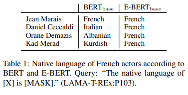
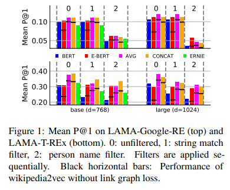
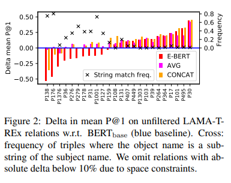
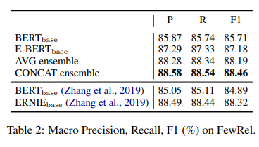
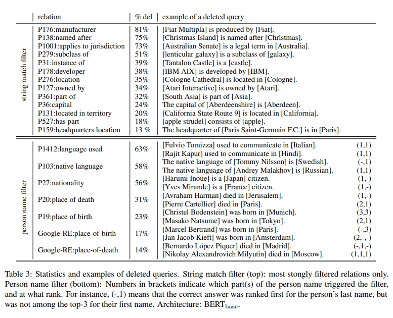

> **BERT is Not a Knowledge Base (Yet): Factual Knowledge vs. Name-Based Reasoning in Unsupervised QA**  
Nina Poerner, Ulli Waltinger, Hinrich Schütze  
https://arxiv.org/abs/1911.03681

# Abstract
* BERT는 relational fact에 대한 cloze-style question에 대해 능숙함.
* LAMA에서는 BERT가 pre-training동안 factual knowledge를 암기한다고 주장.
* 이러한 해석에 문제를 제기, BERT의 성능이 entity name을 reasoning하기 때문이라고 주장.
* easy-to-guess fact를 필터링할때 BERT의 정밀도가 떨어짐을 보여줌.
* entity mention을 symbolic entity embedding으로 대체하는 E-BERT를 제안.

# 1. Introduction
많은 상식을 알고있다고 주장하는 친구가 있다고 상상해보자.
* Q1: Jean Marais의 모국어 A1: Fench
* Q2: Diniel Ceccaldi(프랑스 배우지만 italian-sounding name)의 모국어 A2: Italian  

이것이 QA benchmark인 경우 50%의 정확도이다.
그러나 performance는 배우의 모국어에 대한 factual knowledge를 나타내지 않음
사람들 이름의 기원에 대해 reasoning할 수 있음을 보여줌

LAMA에서는 unsupervised BERT LM이 factual knowledge를 암기한다고 주장.
BERT가 relation extraction에 의해 구축된 knowledge base에 필적하는 unsupervised QA benchmark LAMA에 이 진술을 근거로 함.
그들은 BERT와 유사한 LM이 "text로부터 추출된 기존의 knowledge base에 대한 대안"이 될 수 있다고 주장.
BERT의 성능은 부분적으로 entity name의 reasoning에 기인한다고 주장.  

section 2.1에서는 entity name만으로 쉽게 응답할 수 있는 quert를 filtering하여 LAMA-Google-RE 및 LAMA-UHN 구성.(UnHelpfulNames, LAMA-T-REx의 actual" 하위집합)
LAMA-UHN에서 BERT의 성능이 크게 저하됨을 보여줌.

section 3에서는 entity mention을 wikipedia2vec entity embedding으로 대체하는 E-BERT를 제안.  

section 4에서는 E-BERT가 BERT와 LAMA에서 최근 제안된 entity enhanced ERNIE와 경쟁한다는 것을 보여줌.  

E-BERT는 LAMA-UHN의 두 기준선에서 실직적인 우위를 점하고 있음.
또한, E-BERT와 BERT의 ensemble은 original LAMA의 모든 baseline을 능가.

# 2. LAMA
LAMA benchmark는 LM 고유의 "factual and commonsense knowledge"를 조사한다.
본 논문에서는 factual knowledge을 목표로하는 LAMA-GoogleRE 및 LAMA-T-REx에 중점을 둠.
QA에 대한 대부분의 이전 연구와 달리 LAMA는 w/o supervised finetuing으로 LM을 그대로 테스트함.

* LAMA의 조사 방법은 다음과 같은 schema를 따른다.
    * KB triple 형식(S,R,O)가 주어졌을때 cloze-style question(Jean Marais, native-language, French)으로 객체가 도출됨.
    * "The native language of Jean Marais is [MASK]."
    * LM은 gold answer에 대해 [MASK]를 대체할 limited vocaulary에 대한 distribution을 예측
    
## 2.1 LAMA-UHN
entity에 대한 factual knowledge가 전혀없는 entity의 이름으로 entitny의 특성을 추측하는것이 종종 가능함.
entity는 암묵적 또는 명시적 규칙.(작명을 하는데 관련된 문화적인 규범, 산업제품에 대한 저작권법)
LAMA는 limited vocabulary로 추측하기가 훨씬 쉬우며, 특정 entity type 대한 일부 후보만 포함할 수 있음.

entity name을 control하지 않는 QA benchmark가 추론에 도움이 되는지, fact를 암기하는데 도움이 되는지 또는 두 가지 모두에 도움이 되는지 평가하지 않는다고 주장.
이 section에서는 LAMA-Google-RE, LAMA-T-REx의 subset인 LAMA-UHN(UnHelpfulNames)생성에 대해 설명.  

### Filter1:
* 문자열 일치 필터(string match filter)는 answer(e.g., Apple)가 subject entity name(e.g., Apple Watch)의 대소문자를 구분하지 않고 하위 문자열인 모든 KB triple을 삭제.
* 이 간단한 heuristic은 individual relation에서 triple의 최대 81%를 삭제. (부록 참고)

### Filter2:
* entity name은 더 미묘한 방식으로 드러날 수 있음.
* 프랑스 배우의 예시에서 알 수 있듯이 사람의 이름은 모국어와 확장, 국적, 출생지 등을 추측하기 전에 유용할 수 있다.
* 개인이름 필터는 cloze-style question을 사용하여 BERT에 내재된 name associations을 이끌어내고 이와 연관된 KB triple을 삭제
* subject name을 Jean과 Marais 공백으로 tokenization.
* BERT가 두 이름 중 하나를 공통 프랑스 이름으로 간주하면 Jean Marais entity에 대한 factual knowledge 증거가 충분하지 않음.
* 반면에 Jean 이나 Marais도 프랑스어로 간주되지는 않지만 정답이 제시되면, factual knowledge에 대한 충분한 증거를 고려함.
* “[X] is a common name in the following language: [MASK].”
* for both [X] = Jean and [X] = Marais.
* correct answer가 두 query에서 top-3중 하나인 경우 triple을 삭제.
* 그림 1은(blue bars) BERT가 필터링에 의해 크게 영향을 받는것으로 나타났으며, LAMA에서 LAMA-UHN 평균 P@1이 5%~10% 떨어졌다.

이것은 BERT가 entity name에 대하여 추론하기때문에 LAMA에서 부분적으로 잘 작동한다는 것을 나타냄.
물론 name-based 추론은 그 자체로 유용한 능력이지만 factual knowledge로 그것을 혼란시키는 것은 오해의 소지가 있을 수 있다.

# 3. E-BERT

### Wikipedia2vec
* Yamada et al., 2016은 단어와 wikipedia page(entity)를 common space에 embedding.
* 단어 $\mathbb{{ L }}_{ w }$ 와 entity $\mathbb{{L}}_{e}$에 대한 embedding function을 학습.
* wikipedia2vec loss에는 세가지 구성 요소가 있음.
    * (a) skipgram word2vec
    * (b) wikipedia link graph의 graph loss
    * (c) entity mention으로부터 word가 예측되는 word2vec
    * loss (c)는 word와 entity embedding이 공간을 공유하도록 함
    * 그림1의 검은 가로 막대는 loss(b)가 중요하다는것을 보여줌

### E-BERT
* transformed wikipedia2vec word vector와 BERT subword vector의 squared distance를 minimizing 하는것으로 최적화함.
$${ argmin }_\mathcal{{ W} }\quad \mathbb{{ E }}_{ x\in \mathbb{{ L }}_{ b }\cap \mathbb{{ L} }_{ w } }{ \left\| \mathcal{W}\left( \mathcal{F}\left( x \right)  \right) -\mathcal{{ E }}_\mathcal{{ B }}\left( x \right)  \right\|  }_{ 2 }^{ 2 }$$
* $\mathcal{W}$는 linear projection
* $\mathcal{F}$는 같은 space에서 $\mathbb{{ L }}_{ e }, \mathbb{{ L} }_{ w }$를 포함하기때문에 $\mathbb{{ L} }_{ w }$를 통해 학습하면 $\mathbb{{ L }}_{ e }$에게도 적용됨.

# 4. Experiments
* Examples: The native language of Jean marais is [MASK].
  * E-BERT: The naitive language of Jean_Marais is [MASK]
  * BERT and E-BERT ensemble (AVG): mean-polling their outputs
  * BERT and E-BERT ensemble (CONCAT): e.g.: Jean_Marais / Jean Mara ##is
  

* 그림 1에서 E-BERT는 factual knowledge를 통해 BERT보다 더 뛰어난 성능을 보여줌.
* GoogleRE중 46%는 entity가 포함되지 않음.(성능 차이가 크게 없는 이유)

* string match filter를 통해 BERT에 대한 E-BERT의 차이가 부분 문자열 응답과 관련이 높은것을 알 수 있음.
* ensemble model은 대부분의 relation에서 높은 성능을 보여줌.
* 이는 BERT의 entity name에 대한 reasoning 능력과 E-BERT의 향상된 factual knowledge를 성공적으로 결합한 것.

* FewRel relation classification dataset에서도 E-BERT가 BERT보다 좋은 성능을 보여줌.
* ensemble model은 ERNIE와 비슷한 성능을 보여줌.

* ERNIE와 KnowBERT는 architecture에 새로운 parameter를 추가하여 추가 pre-train을 수행해서 통합 되어야 함.
* 그러나 E-BERT는 통합 단계 없이 기존의 Pre-trained BERT와 함께 사용가능.
* 본 논문에서 most expensive operation은 CPU에서 몇 시간정도 소요되는 wikipedia2vec.

# Appendix
## LAMA-UHN filtering 결과
