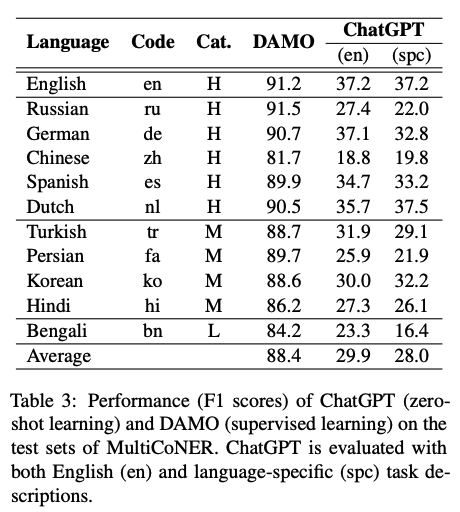
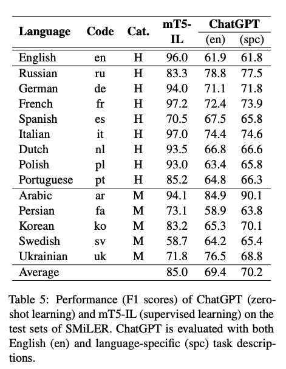

> **ChatGPT Beyond English: Towards a Comprehensive Evaluation of Large Language Models in Multilingual Learning**
Viet Dac Lai, Nghia Trung Ngo, Amir Pouran Ben Veyseh, Hieu Man, Franck Dernoncourt, Trung Bui, Thien Huu Nguyen
https://arxiv.org/abs/2304.05613

- ChatGPT는 이전보다 발전된 생성 능력을 갖추어 많은 관심을 받고 있음.
- ChatGPT는 영어기반 다양한 task에서 우수한 성능을 보여줌.
- 하지만, 다른 언어에 대해서도 ChatGPT를 효과적으로 적용할 수 있는지에 대한 의문이 있으며, 이를 평가하기 위해 다양한 언어와 작업에 대한 평가가 필요.
- 이를 위해 37개의 언어와 7가지 다른 NLP task에 대해 ChatGPT 평가를 수행.

**한국어가 포함된 downstream task 결과**
- 개체명 인식

- 관계 추출

**결과**
- 다른 NLP task와 언어에 대해서 ChatGPT의 성능이 이전 모델보다 나쁘게 나타났으며, 최적의 성능을 보장하기 위해 task에 specific한 모델을 개발해야 함을 제안.