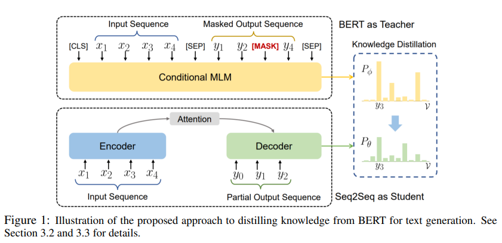
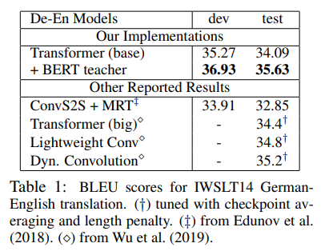
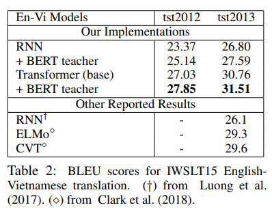
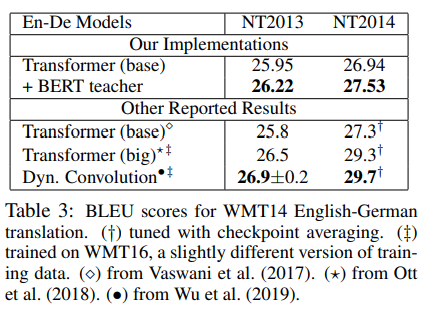

> **Distilling The Knowledge of BERT for Text Generation**  
Yen-Chun Chen, Zhe Gan, Yu Cheng, Jingzhou Liu, Jingjing Liu  
https://arxiv.org/abs/1911.03829

# Short Review
* text generation task에 BERT를 사용하는것은 아직 의문점이 있음.
* 이를 해결하기 위해 text generation dataset에서 BERT를 fine-tuning할 수 있는 새로운 task인 Conditional Maksed Language Modeling(C-MLM)을 제안.
* fine-tuned BERT를 seq2seq model로 distill함으로써 일관성있는 text generation을 위한 sequence-level supervised learning을 시도.
* 제안한 방식은 NMT, Summarization에서 transformer baseline보다 좋은 성능을 보여줌.
* 또한 IWSLT 독일어-영어, 영어-베트남어에 대한 SotA를 달성.

* 본 논문의 접근방식은 BERT의 parameter을 직접 사용하지 않는다는 점이 related work들과 큰 차이점.

## Fine-tuning BERT with Conditional MLM
* seq2seq는 left-to-right 방식이기 때문에 $t$번째 token ${y}_{t}$를 예측하기위해 ${y}_{1:t-1}$만 볼 수 있음.
* 이러한 single directional limitation을 보완하기위해 target generation task에서 BERT를 fine-tuning할 수 있는 C-MLM 제안.
* fine-tuned BERT를 통해 더 나은 text를 generation할 수 있음.

* knowledge distillation을 사용하여 fine-tuned BERT에서 배운 knowledge를 text generation을 위한 seq2seq model로 distillation함.  
* fine-tuned BERT(teacher)는 텍스트 생성을 위한 기존의 seq2seq 모델(student)을 개선하기 위해 추가 감독으로 활용.

