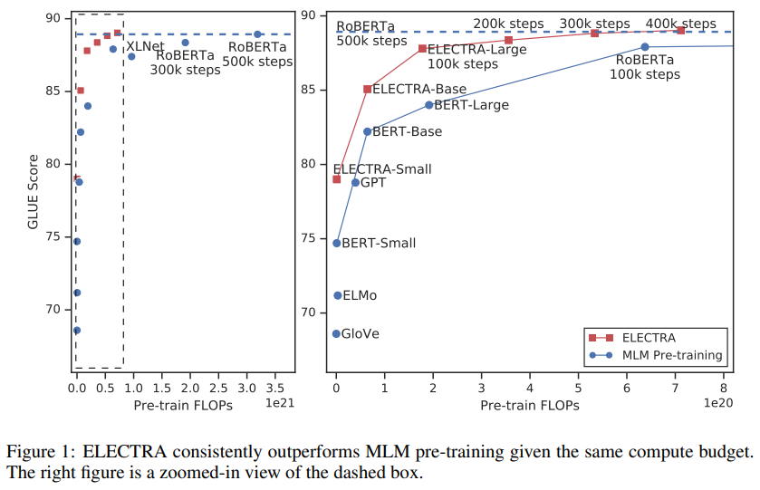

> **ELECTRA: Pre-training Text Encoders as Discriminators Rather Than Generators**  
Kevin Clark, Minh-Thang Luong, Quoc V. Le, Christopher D. Manning  
https://openreview.net/forum?id=r1xMH1BtvB

# Abstract
* input을 masking하는것 대신 generator network를 통해 token을 적절한 대안으로 대체하여 input을 손상.
* token의 ID를 예측하는 model대신 discriminator network를 통해 각 token이 generator sample로 대체되었는지 여부를 예측.
* 기존의 MLM보다 효율적이며 동일한 model size, data, compute에서 BERT 및 XLNet과 같은 방법보다 실질적으로 우수함을 보여줌.

# 1. Introduction
language에 대한 SotA representation learning은 DAE(denoising Autoencoder)를 learning하는것으로 볼 수 있다.
BERT의 MLM은 bi-directional representation learning으로 효과적이지만 example당 token의 15%만 배우기 때문에 상당한 계산비용이 발생.

대안으로 replaced token detection task를 제안.
masking대신 일부 token을 small masked language model의 output을 통해 sample로 대체하여 input을 corrupt시킴.
모든 token에 대해 original token or replacement token인지 예측하는 discriminator network 학습.
이러한 방식의 장점은 model이 small masked out subset이 아닌 모든 input token에서 학습하여 계산 효율성이 향상된다는 것.
GAN과 유사해보이지만 text에 GAN을 적용하기 어렵기 때문에 maximum-likelihood로 train한다는 점에서 제안하는 방식은 "adversarial"이 아님.

We call our approach ELECTRA for “Efficiently Learning an Encoder that Classifies Token Replacements Accurately.”.
ELECTRA-Small의 경우 single gpu에서 4일만에 학습됨. (It has 1/20th the parameters and requires 1/135th the pre-training compute of BERT-Larg)
또한 BERT-Small과 비교하여 5point더 높고 더 큰 GPT model을 능가.
RoBERTa의 1/4 compute만 사용하였으나 성능을 일치.

# 2. Method
replaced token detection task에 대한 설명
* 그림 2: overview

본 논문의 **approach는 generator $G$와 discriminator $D$를 train**.
각 network는 transforemr encoder로 구성.
position $t$에 대해 generator는 softmax layer로 token ${x}_{t}$를 generation할 확률을 출력.
$$
{ p }_{ G }\left( { x }_{ t }|\mathbf{x} \right) =exp\left( e{ \left( { x }_{ t } \right)  }^{ T }{ h }_{ G }{ \left( \mathbf{x} \right)  }_{ t } \right) /\sum _{ { x }^{ \prime  } }^{  }{ exp\left( e{ \left( { x }^{ \prime  } \right)  }^{ T }{ h }_{ G }{ \left( x \right)  }_{ t } \right)  }
$$

$e$는 token embedding.
주어진 position $t$에 대해 discriminator는 token ${x}_{t}$가 "fake"인지, 즉 data distribution이 아닌 generator에서 나온것인지 예측
$$
D\left( \mathbf{x},t \right) =sigmoid\left( { w }^{ T }{ h }_{ D }{ \left( \mathbf{x} \right)  }_{ t } \right)
$$

generator는 MLM(masked language modeling)을 수행하도록 train.
input $x=\left[ { x }_{ 1 },{ x }_{ 2 },\dots ,{ x }_{ n } \right] $이 주어지면 $m=\left[ { m }_{ 1 },{ m }_{ 2 },\dots ,{ m }_{ k } \right] $를 masking하기위해 random set of position를 선택.
선택된 position의 token을 $[MASK]$ token으로 replace.  
$$
{ x }^{ masked }=REPLACE\left( x,m,[MASK] \right)
$$

generator는 maskedout token의 likelihood를 maximize하는 방법을 배움.
discriminator는 data의 token을 generator sample로 replace된 token과 구별하도록 train.  

보다 구체적으로 **masked-out token을 generator sample로 replace하여 corrupted example $x$를 generation하고 discriminator에게 $x$의 어떤 token이 원래의 input $x$와 일치하는지 예측하도록 train**.

# 3. Experiments

## 3.2 Model Extensions
### Weight Sharing
* generator와 discriminator의 크기가 동일하면 weight sharing이 가능.
* 그러나 small generator를 사용하는것이 더 효율적이였음.
* small generator의 경우 tokem embedding만 sharing.

### Small Generator
* generator와 discriminator의 크기가 동일한 경우 ELECTRA는 masked language modeling보다 약 2배많은 계산을 수행.
* 결과적으로 generator가 discriminator network의 1/4~2/1수준일때 가장 잘 작동함.
* generator가 너무 강하면 discriminator에 너무 도전적인 과제가 되어 효과적인 학습을 방해할 수 있다고 추측.

## 3.3 Small Models

single GPU에서 빠르게 학습할 수 있는 small model
* sequence length: 512->128
* batch size: 256 -> 128
* hidden size: 768 -> 256
* token embedding: 768 -> 128

공정한 비교를 위해 BERT-Small도 학습.(1.5M)
결과는 표1과 같으며 ELECTRA-Small은 주어진 크기에 비해 상당히 우수한 성능을 보여줌.  
ELECTRA-Base는 BERT-Base보다 뛰어날 뿐 아니라 BERT-Large보다 우수.

## 3.5 Efficiency Analysis

ELECTRA의 성능 향상을 이해하기위해 다른 pretrain objective와 비교.
* **ELECTRA 15%:** discriminator loss는 input에서 masking된 15%만 계산.
* **Replace MLM:** masked-out token을 $[MASK]$로 바꾸는 대신 generator model의 token으로 바꾸는것을 제외하고는 기존의 MLM과 동일. 이 목표는 $[MASK]$ token의 discrepancy 문제를 해결함으로써 ELECTRA 이익이 어느정도까지 있는지 테스트
* **ALL-Tokens MLM:** MLM replace와 같이 masked token은 generator sample로 바꿈. masked token뿐만 아니라 모든 token의 ID를 예측.
