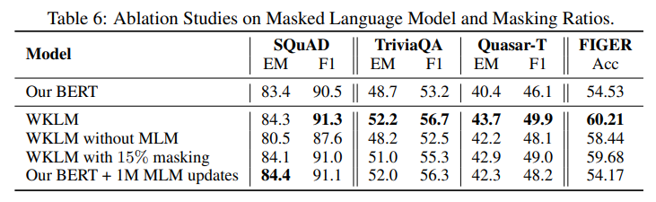

> **Pretrained Encyclopedia: Weakly Supervised Knowledge-Pretrained Language Model**  
Wenhan Xiong, Jingfei Du, William Yang Wang, Veselin Stoyanov  
https://arxiv.org/abs/1912.09637

# Short Review
* zero-shot fact completion task를 통해 BERT와 같은 pre-train model이 knowledge를 capture하는 정도를 조사.
* 단순하지만 효과적인 weakly supvervised training objective를 제안.
* 제안하는 training objective는 model이 real-world entities에 대한 knowledge를 포함하도록 함.

## Entity Replacement Training

* input document가 주어지면 entity를 인식하여 wikipedia entity에 linking.
* 원문을 positive konwledge로 entity와 동일한 유형의 다른 entity로 변경하여 negative knowledge로 샘플링.(negative sampling과 유사)
* context $C$에서 특정 entity $e$에 대해 entity가 대체되었는지 binary classification.
* entity가 같은 유형이기때문에 원문어 언어 정확성을 유지하면서 system은 사실적인 측면에 근거하여 판단하는법을 배워야함.

