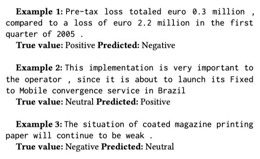

> **FinBERT: Financial Sentiment Analysis with Pre-trained Language Models**  
Dogu Araci  
https://arxiv.org/abs/1908.10063

# Abstract
* Financial sentiment analysis는 specialized language와 labled data가 없기 때문에 어렵고 general-purpose model은 domain에서 사용되는 specialized language때문에 효과적이지 않다.
* pre-trained model은 더 적은 labled data를 필요로 하고 domain specific corpora에서 train할 수 있기 때문에 이 문제에 도움이 될거라고 가정
* financial domain에서 NLP task를 처리하기 위해 BERT기반 language model인 FinBERT를 제안
* FinBERT는 2가지 financial sentiment analysis task에서 SotA를 달성
* FinBERT는 smaller training set과 model의 일부만 fine-tune해도 기존의 SotA보다 우수한 것을 발견

# 1. Introduction
open market의 가격은 경제에서 교환되는 자산과 관련하여 사용 가능한 모든 정보를 반영.
뉴스, 분석가의 보고서, 공식 회사발표 등 financial text analysis는 새로운 정보의 source.
전례없는 양의 text가 매일 만들어짐에 따라 이러한 text를 수동으로 분석하고 그로부터 actionable insight를 얻는것은 single entity에게는 너무 큰 과제임.  

이에 따라 NLP의 방법을 사용하여 financial actor가 작성한 text의 automated sentiment analysis는 지난 10년동안 큰 인기를 얻었다.
본 논문의 주요 연구 관심사는 polarity analysis(긍,부정 classification 같은 예를 말하는거같음)이다.  

이를 위해 두가지 task를 해결해야 함
1. neural network를 사용하는 classification method는 많은 양의 labled data가 필요하여 financial text에 lable을 지정하려면 전문 지식이 필요.
2. financial text에는 unique vocabulary를 가진 specialized language가 있고 쉽게 식별되는 긍/부정 단어 대신 모호한 표현을 사용하는 경향이 있기 때문에 일반적인 copora에 대해 학습된 model은 적합하지 않음.

Loughran and McDonald(2011)는 신중하게 만들어진 financial sentiment lexicons를 사용하여 해결책으로 보일 수 있으나 이러한 방식은 text의 semantic meaning을 분석하는데는 부족함.  

NLP transfer learning은 위에서 언급한 두개의 task에 대한 solution으로 보이며 논문의 이 초점을 맞추고 있는 점이다.
핵심 아이디어는 매우 큰 corpora에서 language model을 학습하고 language modeling task에서 배운 가중치로 downstream task를 초기화함으로써 훨씬 더 나은 성능을 달성할 수 있다는것 이다.

* 본 논문의 main contribution은 다음과 같음
    * financial NLP task를 위한 BERT기반의 language model인 FinBERT를 제안하고 두 가지 financial sentiment analysis dataset에서 성능을 검증.
    * FiQA sentiment scoring과 Financial PhraseBank에 대해 SotA를 달성.
    * financial sentiment analysis를 위한 pre-trained language model ULMFit, ELMo를 구현하고 이를 FinBERT와 비교.
    * 다음을 포함하여 모델의 여러 측면을 조사하기 위한 실험을 수행.
        * financial corpus에 대한 추가 pre-training의 효과.
        * 성능 감소없이 학습시 forgetting을 막기위한 것과 학습시간 단축을 위해 model의 일부 집합만 fine-tune하는 training strategy.
        
* 논문은 다음과 같이 구성됨
    1. financial polarity analysis와 pre-trained language model에 관한 관련연구에 대해 discuss(Section 2.)
    2. evaluated model에 대해 설명(Section 3.)
    3. 사용한 experimental setup에 대한 설명(Section 4.)
    4. financial sentiment dataset에 대한 experimental result 제시(Section 5.)
    5. 다른 관점에서 FinBERT를 추가적으로 분석(Section 6.)

# 2. Realted Literature
* 본 섹션에서는 finance sentiment analysis와 language model을 이용한 text classification에 대한 previous research에 대해 설명.

## 2.1 Sentiment analysis in finance
senmiment analysis는 사람의 감정이나 의견을 추출하는 task이며 다음과 같이 두가지로 나눌 수 있다.
1. "word counting"을 기반으로 feautre를 추출하는 machine learning 방법.
2. text가 sequence of embedding으로 representation되는 deep learning method.  

전자는 특정 단어 sequence에서 발생하는 semantic information을 표현할 수 없는 반면 후자는 훨씬 더 많은 parameter를 배우기 때문에 "data-hungry"현상이 발생한다.

financial sentiment analysis는 domain뿐만 아니라 목적도 일반적인 sentiment analysis와 다르고 financial sentiment analysis의 목적은 일반적으로 시장이 text에 제시된 정보와 어떻게 반응하는지 추측하는 것이다.  

Loughran and McDonald(2016)은 "back-of-words"접근법 또는 어휘 기반의 방법을 based로한 machine learning을 사용하여 financial text analysis에 관해 연구를 진행.
textural polarity analysis에 deep learning을 사용한 첫번째 논문에서는 LSTM neural network를 사용하여 주식 시장의 움직임을 예측하고 기존의 machine learning보다 더 정확한 성능을 보여줌.
위의 연구는 결과를 향상시키기 위해 더 큰 corpus에서 pre-train을 하지만 pre-train은 lable이 없는 dataset에서 수행됨.  

neural architecture를 사용하는 financial sentiment analysis는 Sohangir et al.(2018), Lutz et al.(2018), Maia et al.(2018)등이 있다.  

Sohangir et al.(2018)은 여러가지 일반적인 neural architecture를 StockTwits dataset에 적용하여 CNN이 neural architecture중 가장 성능이 좋다고 인식.  

Lutz et al. (2018)은 doc2vec을 사용하여 특정 회사 발표에서 sentence embedding을 수행하고 multi-instance learning을 활용하여 주식 시장 결과를 예측하는 접근 방식을 취함.  

Maia et al.(2018)은 text simplification과 LSTM network 조합을 사용하여 financial news의 sentence set를 semantic에 따라 classification하고 FinancialPhraseBank에 대해 SotA를 달성

labled financial dataset이 많지 않아 neural network를 sentiment analysis를 위해 사용하기는 어렵다.
embedding layer에 해당하는 pre-trained된 값으로 init하더라도(e.g. Glove)나머지 layer는 상대적으로 적은 양의 data로 학습해야 함.
가능성이 있는 solution은 model을 pre-train하여 전체를 init하고 classification task와 관련하여 해당 값을 fine-tune하는것.

## 2.2 Text classification using pre-trained language models
최근 NLP에서 가장 중요한 발전 중 하나는 language modeling을 위해 pre-trained model을 약간만 수정하여 대부분의 downstream NLP task에 맞게 fine-tune할 수 있다는 사실이다.
이 model들은 very large corpora에 대해 train된 다음 target dataset에서 fine-tune한다.  

ELMo(Embeddings from Language Models)는 이 접근법의 첫번째 성공적인 적용 중 하나이다.
ELMo는 large corpus로부터 pre-train된 deep bidirectional language model이다.
ELMo는 contexualizing representation을 위해 pre-trained language model을 사용하지만 여전히 language model을 사용하여 추출된 정보는 모든 모델의 첫번째 layer에만 존재.  

ULMFit(Universal Language Model Fine-tuning)은 차별적인 fine-tune, slanted triangular learning rate, gradual unfreezing을 사용하여 NLP에 대한 진정한 fine-tuning을 달성한 최초의 연구.
ULMFit의 주요 아이디어는 BERT(Bidirectional Encoder Representation from Transformers)를 통해 한단계 더 향상되었다.  

BERT가 이전과 다른 두가지는 다음과 같다.
1. language modeling task는 두개의 문장을 서로 뒤따르는 것을 classification하는것 이외에도 다음 token이 아닌 순서대로 무작위 masked token을 예측하는것으로 정의
2. large corpus에 대해 very big network에서 학습된 전례없는 사례.

이와같은 두가지를 통해 여러 NLP task에서 SotA를 달성.  

text classification에 대한 fine-tuning BERT는 연구가 활발하진 않음.
이러한 연구 중 하나는 Sun et al.(2019)[(How to Fine-Tune BERT for Text Classification?)](https://arxiv.org/pdf/1905.05583v1.pdf%20http://arxiv.org/abs/1905.05583.pdf)

# 3. Method
* 이 section에서는 financial domain을 위해 구현된 FinBERT에 대해 소개.

## 3.1 Preliminaries
* 3.1.1 ~ 3.1.5 LSTM, ELMo, ULMFit, Transformer, BERT에 대한 설명이며 생략.

## 3.2 BERT for financial domain: FinBERT
* 3.2의 subsection에서는 **1)** domain corpus에 대한 further pre-training이 수행되는 방식. **2-3)** classification, regression task를 위해 BERT를 구현한 방법. **4)** fine-tuning중 사용된 training strategy들을 설명

### 3.2.1. Further pre-training
* Howard and Ruder(2018)는 target domain corpus에서 language model을 추가로 pre-train하면 최종 classification 성능이 향상됨을 보여줌.
* 이러한 adaptation이 도움이 되는지 관찰하기 위해 further pre-training을 구현.
* further pre-training을 위해 두가지 접근방식을 실험.
  1. target domain의 large corpus에서 model을 pre-training. 이를 위해 financial corpus에 대한 BERT language model을 pre-training함.(corpus에 대한 자세한 내용은 section 4.2.1 참조)
  2. classification dataset에서 sentence에 대해서만 model을 pre-training. 이 방식은 train data가 훨씬 적지만 직접 target의 dataset 사용하면 더 나은 domain adaptation을 제공할 수 있음.

### 3.2.2 FinBERT for text classification
* sentiment classification은 **[CLS]** token의 last hidden state다음에 dense layer를 추가하여 수행됨.
* 이후 classifier network는 labled sentiment dataset에 대해 학습되며 모든 단계의 개요는 그림 1과 같음.
    

### 3.2.3 FinBERT for regression
* 본 논문에서는 classification에 중점을 두지만 연속 대상이 있는 다른 dataset에서 거의 동일한 architecture로 regression을 구현
* 유일한 차이점은 사용되는 loss function이 MSE(Mean Squared Error)라는것.
      
### 3.2.4 Traning strategies to prevent catastrophic forgetting (치명적인 forgetting을 방지하기 위한 training strategy)
* Howard and Ruder(2018)에 의해 지적된바와 같이, catastrophic forgetting은 fine-tuning 접근법에서 중대한 위험이다.
* fine-tuning을 진행중에 model이 새로운 task에 adaptation하려고 시도할 때 language modeling task에서 정보를 "forget"할 수 있다.
* 이러한 현상을 처리하기 위해 Howard and Ruder(2018)가 제안한 3가지 기술인 **slanted triangular learning rate, discriminative fine-tuning, gradual unfreezing**을 적용한다.

* Slanted triangular learning rate는 기울어진 삼각형 모양으로 learning rate를 적용한다. 즉, 학습속도는 어느 시점까지 linear하게 증가하고 그 이후에는 linear하게 감소.

* Discriminative fine-tuning은 networ의 하위 layer에 대해 낮은 learning rate를 사용.
* layer $l$에서 learning rate가 $\alpha $라고 가정.
* $\theta $에 대해 layer $l-1$의 learning rate를 ${\alpha}_{l-1}={\theta \alpha}_{l}$ 로 계산.
* 이 방법은 하위 layer에는 deep-level language information, 상위 layer에는 actial classification task에 대한 information 이 있다는 가정이 있음.

* Gradual freezing을 통해 classifier layer를 제외한 모든 layer에 대해 고정된 training을 수행.
* training을 하는동안 가장 높은 layer부터 시작하여 모든 layer를 점차 unfreeze하여 lower level feature가 가장 미세하게 조정됨.
* 따라서, training의 초기단계에서, 모델이 pre-training으로부터 배운 low-level language를 "forget"하는것이 방지됨.    

# 4. Experimantal Setup
## 4.1 Research Questions
* 우리는 다음과 같은 research questions들에 대해 답하고자 함.
    1. ELMo 및 ULMFit과 같은 다른 fine-tune 방법과 비교하여 short sentence classification에서 FinBERT의 성능은 어떤지?
    2. FinBERT는 target이 discrete하거나 continuous한 financial sentiment analysis task에서 SotA와 어떻게 비교되는지?
    3. financial domain 또는 target corpus에서 further pre-training BERT는 classification performance에 어떤 영향을 주는지?
    4. triangular learning rates, discriminative fine-tuning and gradual unfreezing이 classification performance에 미치는 영향이 무엇인지? 이를 통해 catastrophic forgetting을 방지할 수 있는지?
    5. sentence classification에 가장 적합한(또는 더 안좋은)encoder layer는 무엇인지?
    6. fine-tuning만으로 충분한지? 즉, pre-train이후 전체 model을 fine-tune하는데 얼마나 많은 layer들은 fine-tune해야 하는지.
     
## 4.2 Datasets
* **TRC2-finalcial**
    * BERT를 further pre-train하기위해 TRC2-financial이라고 하는 재정적인 자료를 사용.
    * 2008년~2010년 사이에 Reuters에서 발행한 1.8M 뉴스 기사로 구성된 Reuters TRC2의 subset
    * TRC2-financial은 29M이상의 단어와 400K문장을 가진 46,143개의 document를 포함.
  
  
* **Financial PhraseBank**
    * 본 논문에 사용된 main sentiment analysis dataset은 Financial PhraseBank
    * LexisNexis database의 financial news에서 무작위로 선택된 4845개의 영어 문장으로 구성.
    * 모든 문장의 20% test 20% validation으로 설정하며 train에는 3101 example이 포함됨.
    * 일부 실험에는 10-fold cross validation을 사용.
    
  
* **FiQA Sentiment**
    * FiQA는 WWW'18 financial opinion mining과 QA challenge를 위해 만들어진 dataset.
    * Financial Phrasebank와 달리 이 dataset의 목표는 [-1. 1]사이의 contunuous한 값이며 1이 가장 긍정적이다.
    * 10-fold cross validation을 사용하여 검증
  
   
## 4.3 Baseline Methods
* contrastive experiment에서 GLoVe embedding을 포함한 LSTM classifier, ELMo embbeding을 포함한 LSTM classifier, ULMFit classifier를 사용.

## 4.4 Evaluation Metrics
* classification model을 검증하기 위해, Accuracy, Cross entropy loss, F1 average를 사용.

# 5. Experimental Results(RQ1, RQ2)
* Financial PhraseBank dataset classification task에 대한 FinBERT의 결과는 표2에서 확인할 수 있음.

* FinBERT는 가장 높은 성능을 보여주며, language model information이 없는 LSTM classifier는 가장 성능이 떨어짐.  

* FiQA sentiment dataset에 대한 결과는 표3과 같다.

* FinBERT는 좋은 성능을 보여줌.
* testset은 사용할 수 없으므로 10-fold cross validation으로 검증.

# 6. Experimental Analysis
## 6.1 Effects of further pre-training (RQ3)
* classifier performance에 대한 further pre-train의 효과를 측정.
* 비교는 세가지 모델을 사용:
  1. No further pre-traing
  2. Further pre-training on classification training dataset(FinBERT-domain으로 표시)
  3. Further pre-training on domain corpus, TRC-financial(FinBERT-domain으로 표시)

* 차이는 크지 않지만 financial domain corpus에서 pre-training을 진행한 classifier는 세 가지 중에서 가장 잘 수행됨.
* 4가지 이유라고 가정.
    1. corpus는 task set과 다른 distribution을 가질 수 있음.
    2. BERT classifier는 further pre-training을 통해 크게 향상되지 않을 수 있음.
    3. short sentence classification은 further pre-training이 큰 도움이 되지 않을 수 있음.
    4. 성능이 이미 우수하여 개선의 여지가 많이 없음.

* 가능성은 마지막이 젤 크다고 추측. 이미 Vanilla BERT의 정확도는 0.96임.
* domain corpus에 대한 further pre-training의 효과가 중요하지 않다는 결론을 내리려면 다른 financial labled dataset에 대한 실험이 필요.

## 6.2 Catastrophic forgetting (RQ4)
* Catastrophic forgetting에 대한 techniques를 측정하기 위해 4가지 설정을 진행:
    1. No adjustment(NA)
    2. only with slanted triangular learning rate(STL)
    3. slanted triangular learning rate and gradual unfreezing(STL+GU)
    4. discrimanative fine-tuning + 이전

* language modeling에서 배운 정보는 대부분 low-level layer에 존재하기 때문에 STL+DFT만 사용하면 STL만 사용한것보다 성능이 저하된다는 것을 알 수 있다.
* gradual unfreezing이 가장 중요한 기술임을 보여줌.

* NA의 경우 심각하게 overfitting이 되며 GU를 사용하여 이를 방지할 수 있음.

## 6.5 Where does the model fail?
* model이 예측하지 못한 몇가지 example에 대하여 조사.

* 첫번째 예는 가장 일반적인 실패 유형이다. model은 수학을 수행하지 못하고 "increased"와 같은 방향성을 나타내는 단어가 없으면 neutral을 예측할 수 있다.
* 두번째, 세번째 예는 동일한 유형의 실패 유형이다. model은 주어진 상황에 대한 중립적 진술을 회사에 대한 polarity를 나타내는 진술과 구별하지 못함.
* 세번째 예에서는 회사의 비지니스에 대한 정보가 도움이 될것이다.

* confusion matrix는 그림 4와 같다.

## 7. Conclusion and Future Work
* 본 논문에서는 financial sentiment analysis를 위해 FinBERT를 제안.
* BERT를 financial domain에 최초로 적용했으며 사용한 dataset에서 SotA를 달성하였고 classification task의 경우 정확도가 15% 향상됨.
* 또 다른 확장은 FinBERT를 사용하여 financial domain에서 entity recognition이나 QA같은 다른 NLP task에 사용될 수 있다는것.
