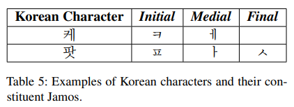

> **Integrated Eojeol Embeddings for Erroneous Sentence Classification in Korean Chatbots**  
DongHyun Choi, IlNam Park, Myeong Cheol Shin, EungGyun Kim and Dong Ryeol Shin  
https://arxiv.org/abs/2004.05744

# 1. Introduction
챗봇에 대한 자연어이해는 **(1) input sentence의 사용자 의도를 분석하는 intent classification module** 과 **(2) input sentence에서 entity를 추출하는 entity extraction module**로 구성된다.
표1은 한국어 input sentence를 분석하는 방법을 보여주는 예시이다. 첫 번째 단계는 "play music"라는 사용자의 의도를 분류하는 것이다.
의도가 올바르게 분류되면 분류된 의도가 input sentence에 대해 entity를 결정하는데 도움이되므로 상대적으로 더 쉬워질 수 있다.

사용자가 textual interface를 통해 챗봇에 접근하면 input sentence에 오타 또는 공백오류가 포함될 수 있다.
사용자는 비슷하게 발음된 단어의 철자를 혼동하거나 오타를 만들거나 또는 단어 사이에 필요한 공백을 생략한다.

한국어는 agglutinative language이기 때문에 의미를 결정하기 위해 단어에 둘 이상의 형태소가 포함될 수 있다.
이로인해 형태소분석기를 사용하여 input sentence를 형태소로 토큰화하여 결과를 classification system에 feed한다.
이러한 접근방식은 문법적으로 올바른 문장에서는 잘 작동하지만 입력 문장의 오류로 인해 형태소 분석 과정에서 문제가 생길 수 있기 때문에 잘못된 입력에서는 성능이 좋지 않다.

본 논문에서는 이러한 문제를 해결하기 위해 IEE(Integrated Eojeol Embedding)을 제안한다.  
IEE의 main idea는 형태소 또는 subword unit의 embedding vector 대신 Eojeol embedding vector를 classification network에 feed 하는것이다.
어절 $w$의 경우 subword unit-based 어절 embedding vector는 $w$의 다른 subword unit을 base로하여 먼저 계산되고 resultant vector는 single IEE vector를 형성하도록 integrated된다. 이로인해 철자 또는 기타 오류로 인한 잘못된 subword unit tokenization의 문제를 크게 줄이면서 GloVE, BPEmb와 같은 pre-trained subword unit embedding vector의 이점을 유지할 수 있다.

또한 Jamo dropout과 space-missing sentence generation이라는 두 가지 noise insertion 방법을 통해 noise data를 training corpus에 삽입하고 제안된 IEE 접근방식의 성능을 향상시키기 위해 제안한다.
제안하는 system은 sentencen classification task에서 baseline system보다 18% point이상 뛰어난것을 보여주었다.

# 2. Related Works
English sentence classification에 대해 많은 이전연구가 있다. Kim(2014)은 sentence classification을 위해 CNN과 max-pooling을 사용했다.  
Bowman et al.(2015)은 BiLSTM을 사용하여 NLI task에 대한 sentence embedding을 얻었으며 Zhou et al.(2015)는 LSTM과 CNN을 combine하려고 시도했다.  
Im and Cho(2017)와 Yoon et al.(2018)은 sentence encoding을 위해 self-attention mechanism을 explore했다.

그러나 erroneous sentence에 대한 classification task는 주목을 받지 못했다.

본 논문에서는 multiple embedding을 통합하는데 중점을 둔다. Yin and Schutze(2015)는 multiple embedding을 통합하는 아이디어를 제안하고 different embedding을 multiple channel로 간주하고 multiple channel input을 처리하기 위해 Kim(2014)의 algorithm을 확장했다.  
본 논문과의 차이점은 IEE는 input embedding이 동일한 subword tokenization을 가질 필요가 없고 various embedding을 integrate한다.

# 3. Classifying Erroneous Korean Sentences
이 섹션에서는 잘못된 한국어 sentence를 올바르게 classification하는 algorithm을 제안한다.

## 3.1 Brief Introduction to Korean Word and Syntatic Structures
논문 이해를 위해 한국어 단어와 문장의 구조를 간략하게 설명.

어절은 공백으로 구분된 한글 sequence로 정의된다.
주어진 input sentence는 어절 list $\left\{ { w }_{ 1 },{ w }_{ 2 },\dots ,{ w }_{ s } \right\} $를 얻기 위해 공백을 사용하여 tokenize된다.
어절에는 형태소 분석기를 사용하여 추출할 수 있는 하나 이상의 형태소가 들어있다.
표2, 표3은 예시 문장의 어절 및 형태소를 보여준다.

한글은 2~3개의 한글 또는 자모로 구성된다. 19개의 자음이 초성(initial), 21개의 모음이 중성(medial), 23개의 자음이 종성(final)로 사용된다.
표4는 가능한 Jamo 후보 목록을 보여준다.
이론적으로 한글은 총 $11,172$($=19\times 21\times \left( 27+1 \right) $)가 존재하지만 real-world 에서는 2,000~3,000자가 사용된다.

표5는 한글의 몇 가지 예시를 보여준다.
첫 번째 예는 종성은 없지만 여전히 유효한 한국어 문자를 만든다.
중복을 제외하고 한글 자모 51개, 자음 30개, 모음 21개가 있다.

## 3.2 Integrated Eojeol Embedding
그림 1은 주어진 어절 $w$에 대해 IEE vector를 계산하기 위한 network architecture를 보여준다.

어절 $w$의 경우 $t$개의 subword unit list가 먼저 생성된다.  
본 논문에서 네가지 유형의 subword unit list는 다음과 같이 정의된다.
* Jamo list: ${ L }_{ j }\left( w \right) =\left\{ { j }_{ 1 },\dots ,{ j }_{ { l }_{ j }\left( w \right)  } \right\} $
* Character list: ${ L }_{ C }\left( w \right) =\left\{ { c }_{ 1 },\dots ,{ c }_{ { l }_{ j }\left( w \right)  } \right\} $
* byte-pair encoding(BPE) subunit list: ${ L }_{ B }\left( w \right) =\left\{ { b }_{ 1 },\dots ,{b }_{ { l }_{ j }\left( w \right)  } \right\} $
* Morpheme list: ${ L }_{ M }\left( w \right) =\left\{ { m }_{ 1 },\dots ,{ m }_{ { l }_{ j }\left( w \right)  } \right\} $

${ l }_{ j }\left( w \right) ,{ l }_{ c }\left( w \right) ,{ l }_{ b }\left( w \right) ,{ l }_{ m }\left( w \right) $는 각 list의 길이를 뜻한다.

표6은 어절 "팟 케스트로"의 subword unit list의 목록을 보여준다.

각 subword unit list는 subword unit merge(SUM) network에 feed 된다.
subword unit list ${ L }_{ S }\left( w \right) $의 경우, SUM network는 먼저 각 list item을 대응하는 embedding vector로 변환하여 embedding matrix ${ E }_{ S }\left( w \right) $를 얻는다.  
이후 kernel size $k=2,3,4,5$ 및 filter size $F$를 갖는 one-dimensional depthwise separable convolution에 ${ E }_{ S }\left( w \right) $가 적용된다. 이후 max-pooling과 LayerNorm을 수행한다.

SUM network의 결과는 subword unit-based Eojeol embedding vector ${ e }_{ S }\left( w \right) \in \mathbb{ R }^{ 4F }$ 이다.

subword unit types $T=\left\{ { s }_{ 1 },\dots ,{ s }_{ t } \right\} $의 경우, IEE를 구성하기 위한 3가지 다른 algorithm이 다음과 같이 제안된다.

* **IEE by Concatenation.** 모든 subword unit-based Eojeol embedding vector 들을 하나의 IEE vector를 형성하도록 concatenation한다.: ${ e }_{ i }\left( w \right) =\left[ { e }_{ { s }_{ 1 } }\left( w \right) ;\dots ;{ e }_{ { s }_{ t } }\left( w \right)  \right] \in \mathbb{ R }^{ 4tF }.$
* **IEE by Weighted Sum.** IEE vector는 subword unit-based Eojeol embedding vector의 weighted sum으로 정의된다.: ${ e }_{ i }\left( w \right) =W\cdot \left[ { e }_{ { s }_{ 1 } }\left( w \right) ,\dots ,{ e }_{ { s }_{ t } }\left( w \right)  \right] \in \mathbb{{ R }}^{ 4F }$ 여기서 $W=M\cdot tanh\left( \sum _{ s\in T }^{  }{ { M }_{ s }{ e }_{ s }\left( w \right)  }  \right) \in \mathbb{{ R} }^{ t }, M\in \mathbb{{ R }}^{ t\times 4F },\quad { M }_{ s }\in \mathbb{{ R }}^{ 4F\times 4F }.$ 이다.
* **IEE by Max Pooling.** IEE의 $j$번째 요소를 subword unit-based eojeol embedding vector의 $j$번째 요소의 maximal value로 설정한다.: ${ e }_{ i }\left( w \right) =max\left[ { e }_{ { s }_{ 1 } }\left( w \right) ,\dots ,{ e }_{ { s }_{ t } }\left( w \right)  \right] \in \mathbb{{ R} }^{ 4F }.$

## 3.3 IEE-based Sentence Classification
그림2는 제안하는 IEE를 사용하는 sentence classification을 위한 network architecture를 보여준다.

주어진 한국어 문장은 어절 리스트 $\left\{ { w }_{ 1 },{ w }_{ 2 },\dots ,{ w }_{ s } \right\} .$ 이다.
각 어절 ${w}_{i}$에 대해 ${ e }_{ i }\left( { w }_{ i } \right) $는 IEE matrix $E\left( s \right) =\left[ { e }_{ i }\left( { w }_{ 1 } \right) ,{ e }_{ i }\left( { w }_{ 2 } \right) ,\dots ,{ e }_{ i }\left( { w }_{ s } \right)  \right] \in \mathbb{ {R} }^{ s\times d\left( I \right)  }$를 얻기 위해 3.2절에서 제안하는 IEE network로 먼저 계산된다. 위 공식에서 $d\left( I \right)$는 IEE vector의 차원이다.  
위 공식에서 Concatenation의 경우 ${ R }^{ 4tF }$  이다.

${E}_{(s)}$가 계산되면, kernel size $k\prime =1,2,3,4,5$를 갖는 depthwise seperable convolution에 적용되고 결과는 max-pooling, layernorm으로 이어진다.
마지막으로 2개의 fully-connected feed-forward layer는 final output score vector $O\in \mathbb{ {R} }^{ c }$를 얻는다.

## 3.4 Noise Insertion Methods to Improve the Integrated Eojeol Embedding
IEE vector의 성능을 더욱 향상시키기 위해 두 가지 noise insertion method를 제안한다.
* **Jamo dropout:**
  * training 단계에서 jamo dropout probability를 통해 jamo를 masking한다.
  * input embedding vector의 일부 요소를 dropout으로 masking하는대신 jamo dropout은 전체 jamo embedding vector를 masking한다.
  * 또한 다른 유형의 subword unit에 mask된 jamo가 포함된 경우 해당 subword unit embedding vector도 masking한다.

예상되는 역할은 다음과 같다.
* 학습 단계에 noise를 추가하여 학습된 classification model이 더 잘 작동하도록 한다.
* masked jamo를 포함하는 다른 subword unit을 masking함으로써 subword unit vocab에서 input subword를 알수없는 경우 system은 jamo embedding에 집중하는 방법을 배울 수 있다.

공백을 기준으로 input sentence로부터 어절을 tokenization하기 때문에 morpheme embedding-based방식과 비교하여 eojeol embedding-based 방식은 공백이 없는 문장에 대해 성능이 떨어질 것으로 예상된다. 따라서 이러한 문제를 해결하기 위해 spacemissing sentence generation이라는 noise insertion을 제안한다.
* **Spacemissing:**
  * msp(msiing space probability)를 갖는 training corpus를 무작위로 선택하고 선택된 문장의 모든 공간을 제거한다.

# 4. Experiments
해당 섹션에서는 experimental settings and evaluation results에 대해 설명한다.

## 4.1 Corpus
실험에 사용한 corpus는 48개의 intent를 가진 문법적으로 정확한 한국어 문장 127,322개 문장.
학습,검증 및 테스트를 위해 8:1:1 비율로 무작위로 나눠 진행.
테스트 데이터셋은 논문에서 WF(Well-Formed) corpus라고 하며 12,711개의 문장으로 구성된다.

한국어 철자가 틀린 KM corpus는 erroneous input sentence의 성능을 측정하기 위해 수동으로 주석을 추가한다.
KM corpus는 46개의 intent로 WF corpus보다 2개의 intent가 줄어든다.
제거된 두 가지 intent는 OOD 및 Common이다. OOD는 무의미한 문장의 의도이며 Common은 "응(yes)"와 같은 짧은 답변 의도를 뜻한다.

KM corpus의 46개의 intent에 대해 2개의 annotator가 각각 23개의 intent에 대한 문장을 작성한다. 각 intent에 대해 annotator는 먼저 오류없이 45개의 문장을 작성하고 다음 annotator는 작성된 문장에 오류를 삽입한다. 오류 삽입 지침은 표7과 같다. 결과적으로 KM corpus에는 총 2,070개의 잘못된 문장이 포함되며 testset으로만 사용된다.

또한 WF 및 KM corpus를 기반으로 space-missing(SM) test corpus가 생성되어 필요한 공백이 없는 문장의 성능을 평가한다. corpus는 다른 test corpus의 문장으로 구성되지만 단어 사이의 공백은 0.5 확률로 무작위로 제거되며 원래 문장에서 하나 이상의 공백이 제거된다. SM corpus에는 14,781개의 문장이 포함되어 있으며 testset으로만 사용된다.

### Annotation guidelines
**Rule 1.** 각 문장마다 하나 이상의 오류를 삽입. 몇 가지 권장사항은 다음과 같다.
  * 자모를 제거하거나 복제
  * 둘 이상의 자모 순서를 바꿈
  * 자모를 비슷한 발음으로 교체
  * 자모를 키보드 위치에서 가까운 것으로 교체

**Rule 2.** 잘못된 문장을 이해할 수 있어야 한다.
  * 각 annotator는 다른 작업자의 결과를 분류할 수 있어야 한다.
  * 잘못 분류된 문장은 재작업 한다.

**Rule 3.** 각 의도의 45문장에 대해 25문장은 유효한 문자만 포함하고 20 문장은 하나 이상의 잘못된 문자를 포함해야 한다.
  * "잘못된"한국어 문자는 초성 또는 종성 문자가 없는것으로 정의된다.

## 4.2 Experimental Setup
Sentence accuracy는 각 corpus에서 sentence classification system의 성능을 측정하는 기준으로 사용된다. sentence accuracy는 다음과 같이 정의된다.

$$
SA=\frac {\# \ correct\ sentences }{\#\ total\ sentences } \quad (1)
$$

실험 전체에서 jdp 값은 0.05로 설정되고 msp는 0.4로 설정된다. jdp = {0.00, 0.05, 0.10, 0.15, 0.20} 및 msp = {0.0, 0.1, 0.2, 0.3, 0.4} 범위의 grid search를 통해 얻은 값이다.

Adam optimizer를 사용하며 3epoch까지 learning rate가 0.0에서 0.1로 증가하고 5epoch이후에 0.75 exponential learning rate decay를 적용한다.  
각 epoch에서 devset으로 검증하고 4개의 결과에서 검증 정확도가 개선되지 않으면 early stop.  
mini-batch size=128, dropout prob=0.1 사용.

Choi et al.(2018)이 제안한 Korean GloVe는 morpheme embedding vector에 사용된다.  
Heinzerling and Strube (2018)에서 제안한 BPEmb가 bpe unit embedding에 사용된다.  
BPEmb의 경우 vector dimension과 vocabulary는 실험적으로 각각 300, 25,000이 사용된다.  
morpheme embedding vector와 BPE unit embedding vector는 학습중에 고정되며 Jamo embedding vector와 character embedding은 parameter로 학습된다.  
Jamo 및 character embedding size는 모두 300으로 설정되고 convolution filter size F는 128로 설정된다.

형태소 분석기는 KHAIII를 사용.

## 4.3 Evaluation Results
해당 하위섹션에서 시스템 구성은 다음과 같이 표기된다.  
$\mathbf{{ IEE }_{ C }}$는 **IEE by Concatenation** $\mathbf{{ IEE }_{ W }}$는 **IEE by Weighted Sum** $\mathbf{{ IEE }_{ M }}$은 **IEE by Max-pooling**을 나타낸다.  
또한 적용된 subword unit은 대괄호로 표시된다. 형태소의 경우 $m$ BPE unit의 경우 $b$ 자모의 경우 $j$ 문자의 경우 $c$이며 noise insertion 사용은 $+$뒤에 표시된다. **SG**는 *space-missing corpus generation*을 나타내고 **JD**는 *Jamo dropout*을 나타내며 **ALL**은 둘다 적용한 것을 의미한다.

  
  

IME(Integrated morpheme embedding)
IBE(Integrated BPE unit embedding)

표10에서 IME와 IBE에 대한 비교실험을 진행. KM corpus의 경우 어절 기반 embedding이 형태소, BPE 기반의 방식에 비해 3% point더 높다.  
이는 어절 기반 embedding 방식이 subword unit  analysis 오류를 효율적으로 처리함을 보여준다.

표11에서 Jamo subword를 적용하면 KM corpus에선 성능이 크게 향상됨.  
그러나 Jamo subword unit은 pre-trained embedding이 없기 때문에 WF Corpus에서는 상대적으로 성능이 저하된다.

## 4.4 Error Analysis
제안된 어절 기반 접근방식이 기존 형태소 기반 접근 방식보다 더 나은 이유를 알아내기 위해 몇 가지 예를 관찰하였다.(표12)  
문장 분류에 대한 중요한 단서는 굵은 글씨로 표시되어 있다.

Case1의 경우 철자 오류로 인해 중요한 단서 "불(light)"이 형태소로 추출되지 않는다. 그러나 단서는 BPE subword unit으로 성공적으로 복구가 된다.

Case2의 경우 오타는 Jamo subword unit을 고려하여 처리할 수 있다. 올바른 문장과 잘못된 문장의 Jamo subword unit list는 동일하지만 형태소와 BPE subword unit list는 다르다.

제안하는 알고리즘은 중복된 간격의 문장에서 여전히 단점을 가지고 있다. 이는 "ㅈ ㅗ명 꺼줘"문장으로 설명할 수 있다.  
"조명 꺼줘"에서 중요한 단서 "조명"은 서로 다른 두 개의 어절"ㅈ"과 "ㅗ명"으로 구분된다.
두 개의 어절로 분리되어 있기 때문에 제안된 어절 기반 알고리즘은 중요한 단서"조명"을 복구하지 못하고 정확한 분류 결과를 얻지 못한다.

