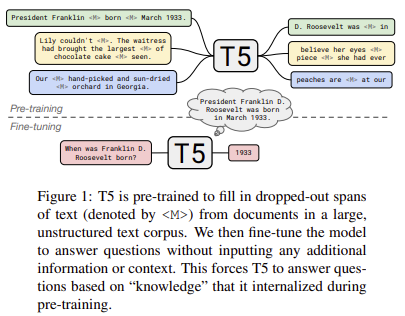
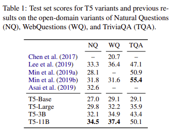

> **How Much Knowledge Can You Pack Into the Parameters of a Language Model?**  
Adam Roberts, Colin Raffel, Noam Shazeer  
https://colinraffel.com/publications/arxiv2020how.pdf

# Abstract
최근 비정형 텍스트로부터 학습된 language model이 natural language query를 사용하여 knowledge를 암시적으로 저장하고 검색할 수 있는것이 관찰되었다.
본 논문에서는 pre-trained model을 fine-tuning 하여 external context 및 knowledge에 접근하지 않고도 질문에 대답할 수 있는 유용성을 측정한다.
놀랍게도 이러한 접근방식이 model size에 따라 잘 확장되고 natural questions와 WebQuestions에서 뛰어나다는 것을 확인하였다.

# 1. Introduction
Label이 없는 text에 대해 pre-train을 수행한 language model은 NLP downstream task를 fine-tuning할 때 성능이 매우 뛰어났다.
최근에는 이러한 language model이 pre-train 이후 일종의 암시적인 "knowledge base"를 내재화 할 수 있는것으로 관찰되었다.
이런점은 잠재적으로 다음의 이유로 유용할 수 있다.
1. Knowledge base는 인터넷에서 대량으로 자유롭게 이용할 수 있는 unstructured and unlabeled text data에 대한 pre-train을 통해 구축됨.
2. Pre-trained language model은 language understanding task에 맞게 fine-tuning 될 때 우수하기 때문에 natural query를 사용하여 knowledge base에서 정보를 검샐할 수 있음.

"Language models as knowledge bases"를 조사한 과거 연구는 일반적으로 pre-train objective와 유사한 synthetic task 및 추론 기능을 측정하여 model에 저장된 정보의 범위를 이해하는데 중점을 두었다.
본 논문에서는 open-domain QA task에서 language model의 기능을 평가하는 다른 접근방식을 취한다.
특히 external knowledge 및 context에 접근하지 않고도 질문에 응답하도록 model을 fine-tuning 한다.
이를 위해서는 model이 natural query를 구문 분석 한 이후 질문에 대답하기 위해 parameter에 저장된 "정보를 검색" 해야 한다.
Questions Answering에 대한 대부분의 과거 연구는 질문과 함께 model에 적절한 정보를 명시적으로 제공하거나 model이 external knowledge source에서 정보를 조회할 수 있도록 한다.
Input question에만 model 접근을 허용함으로써 실제 문제에 대한 성능을 측정하고 parameter에 저장된 knowledge의 양을 측정할 수 있다.

본 논문에서 다루는 질문은 "더 많은 parameter를 가진 model이 더 많은 information을 저장하는지"의 여부이다.
많은 downstream task에 대한 연구에서 transfer learning 성능은 model size와 unsupervised pre-train의 양이 증가함에 따라 향상되는 경향이 있는것으로 나타났다.
과거 연구에서 고려한 것보다 훨씬 더 많은 parameter를 가진 model을 포함하여 다양한 크기의 model에 대한 knowledge retrieval 기능을 측정함으로써 이 접근방식이 얼마나 잘 확장되는지 탐색할 수 있다.
본 논문에서는 pre-trained "T5"를 활용한며 가장 큰 model의 parameter는 11 billion 이다.

# 2. Background
## 2.1 Question Answering
Questions Answering 이란 질문을 model에 input으로 feed하고 정답을 선택하거나 출력하도록 train 시키는 task를 말한다.
현재 가장 인기있는 변형은 질문과 함께 답변을 포함하는 일부 "context"를 model에 제공하는 것이다.
답변을 포함하는 context의 span을 나타내거나 답변 자체의 text를 출력하도록 model을 train할 수 있다.
이 형식은 일부 text를 읽고 그것에 대한 질문에 답변하는 것으로 볼 수 있다.
이를 다른 형식의 question answering task와 구별하기 위해 "reading comprehension"이라고도 부른다.

더 어려운 변형은 "open-domain question answering"인데 여기서 model에 context-independent questions(e.g. 잘 알려진 사실 또는 역사의 세부사항)를 질문할 수 있다.
일반적으로 model은 질문에 대답할 때 external knowledge collection(e.g., 구조화된 knowledge base 또는 구조화 되지 않은 text corpus)에 접근할 수 있다고 가정하지만, model에 답이 나타나는 위치 정보는 제공되지 않는다.

본 논문에서는 질문에 대답할 때 model이 external knowledge에 접근할 수 없다는 추가 제약조건으로 open-domain question answering을 고려한다.
대신 질문에 대한 답변을 위해 fine-tuning 하기 전에 model 자체가 parameter에 knowledge를 저장하도록 pre-train을 수행해야 한다.
하나의 관점에서 볼때, 이것은 external knowledge에 접근하는 것을 배우는 대신 질문에 답을 하기 위해 model이 "기억"하여 open-domain에 접근하는 대안적인 방법으로 볼 수 있다.
또 다른 관점은, 이러한 제약은 더 잠재력있는 question-answering task의 변형을 만들어낸다.
이런 방식으로 질문에 답하는 model은 closed-book exam을 보는 학생과 은유적으로 유사하다.
여기서 시험전에 모든 관련 정보를 연구하고 암기해야 한다.

## 2.2 Transfer Learning with Language Models
지난 몇 년간, 구조화되지 않은 large-scale text corpus에 대해 unsupervised objective를 사용하여 language model을 pre-train하는게 점차 보편화 도었다.
이러한 형태의 "transfer learning"의 인기는 많은 NLP task에서 경험적으로 성공한데 기인한다.
Pre-traiun 단계는 model에 meaninmg, syntax 및 "world knowledge"와 같은 일반적으로 유용한 awareness를 제공할 수 있다.
특히 대부분의 SotA system은 some form of transfer learning을  사용한다.

현재 NLP의 transfer learning에 사용되는 가장 인기있는 model architecture는 BERT와 같은 Transformer based "encoder-only" model이다.
이러한 model은 각 input token에 대한 single prediction을 추출할 수 있으며, context의 어떤 token에 정답이 포함되어 있는지 예측하여 reading comprehension-style QA에 적용되었다.
Encoder-only model은 input에서 answer span을 선택할 수 없으므로 closed-book QA에는 적용되지 않는다.
Raffel et al. (2019)가 제안한 framework는 모든 NLP task를 encoder-decoder transformer를 사용하여 text-to-text problem으로 취급한다.
이 framework가 QA에 적용될 때, model은 자유형식으로 답변의 문자 텍스트를 generation 하도록 train된다.
Raffel et al.은 답을 식별하는 것이 아닌 생성하는 것이 더 어려움에도 불구하고 SQuAD, MultiRC, BoolQ, ReCoRD MRC dataset에서 SotA를 달성하였다.

Text-to-text framework는 input에 추가 정보가 있든 없든 model이 응답을 generation 하도록 train할 수 있기 때문에 closed-book QA에 적용할 수 있다.
중요한것은, context없이 질문에 답하기 위해 text-to-text model을 fine-tuning 하려면 model이 pre-train중에 학습한 parameter들로부터 정보를 검색해야 한다는 것이다.
GPT-2는 이런 형태의 QA를 통해 language model의 zero-shot QA 성능을 평가했다.
Petroni et al.,2019 은 일부 질문을 encoder only model에 적합하게 수정할 수 있는 빈칸채우기 format으로 수동 변환할 수 있음을 보여준다.(e.g., "상대성 이론을 발표한 사람은 누구입니까?" -> "상대성 이론을 발표한 사람은 \_\_\_")

# 3. Experiments
## 3.1 Datasets
다음과 같은 open-domain QA dataset을 고려한다.
**Natural Questions**는 web query의 question dataset이며 각 질문에는 답변이 포함된 Wikipedia article이 함께 제공된다.  
**WebQuestions**는 FreeBase의 해당 항목과 일치하는 web query의 question도 포함한다.  
**TriviaQA**는 quiz league website의 question datset이다. 각 질문에는 답변이 포함된 web search 및 Wikipedia search page가 함께 제공된다.

본 논문에서는 각 dataset의 질문만 사용한다. 각 질문에 제공되는 document는 모두 무시한다.

Evaluation 측면에서 WebQuestions 및 TriviaQA의 경우 예측된 답변의 구두점 및 공백, 소문자 치환을 수행한 후 표준 평가 절차를 따른다.
Natural Questions는 "unanswerable" 및 예/아니오 답변도 포함된다. 우리는 "unanswerable"과 long answer을 생략한 Natural Questions의 두 가지 변형을 고려한다.
1. "open-domain" 버전의 변형
    * model을 single answer을 출력하도록 train
    * token이 5개보다 긴 답변의 질문은 제거
    * 답변은 WebQuestions 및 TriviaQA 와 같이 정규화됨
    * 예측된 답변이 일치하는 경우 올바른것으로 간주

2. Natural Questions에서 사용하는 공식 평가 절차와 거의 일치
    * model을 실제 사실 답변을 예측하도록 train
    * annotation중 하나에 대한 모든 답을 예측하는 경우만 올바른것으로 간주

## 3.2 Training
Reffel et al.,2019 에서 제공한 pre-train model을 "text-to-text transfer transformer(T5)" 라고 한다.
이 모델들은 unsupervised fill-in-the-blank task 뿐만 아니라 supervised translation, summarization, classification, reading comprehension을 포함한 multi-task mixture에 대해 pre-train을 수행했다.
모델 크기에 따른 closed-book QA 성능을 측정하기 위해 Base, Large, 3B, 11B의 model을 실험한다.

Fine-tuning을 위해 T5 논문에서 사용된 절차를 따른다. AdaFactor optimizer를 사용하고 constant learning rate는 0.001, 10%의 dropout prob 사용.
각 단계에서 가장 가능성이 높은 token을 선택하여 model의 예측을 decode.
각 dataset을 검증할때 성능이 빠르게 증가한 후 정체되는 경향이 있음을 발견.
그래서 train 및 validation set에 각각 196,608개의 token으로 10,000개의 batch에서 model을 train하고 평가함.

Question-answering task를 text-to-text 형식으로 mapping하기위해 task-specific prefix가 있는 질문을 input으로 model에 입력하고 문자 그대로의 응답 text를 출력으로 예측하도록 train. 여러 답변이 포함된 natural questions는 다음과 같이 수행.(for example, “answer: John Lennon answer: Ringo Starr answer: George Harrison answer: Paul McCartney”)

## 3.3 Results
Natural Questions, WebQustions, TriviaQA에 대한 결과는 표1과 같다.

각 dataset의 성능은 model size가 증가함에 따라 증가하고 T5-11B가 최고 성능을 보여주었다.
이러한 dataset에 대한 이전 결과와 비교하여 T5-11B는 Natural Questions 및 WebQuestions에서 SotA를 달성하지만 TriviaQA의 모든 previous model보다 성능이 떨어진다. 우리는 Guu et al.,(2020)의 연구가 관련 document를 검색하고 end-to-end로 질문에 대한 답변을 하는 model 을 train 함으로써 Natural Questions 및 WebQuestions에서 우리의 결과를 능가한다는 점에 주목한다.
중요한 것은 previous work에서 사용된 모든 model은 external knowledge를 명시적으로 검색하여 사용함으로써 "open-book"설정으로 동작한다는 점이다.
반대로 우리의 model은 질문에 대답할 때 external knowledge에 접근할 수 없으므로 pre-train중에 knowledge를 내재화 해야한다.
"closed-book" system이 경쟁력있는 결과를 달성한다는 사실은 open-domain QA problem에 대응하는 근본적으로 다른 방식을 암시한다.

다음으로 다중 답변 Natural Questions에 대해 평가한다.
이 task는 거의 모든 model이 oracle context에서 정답을 선택하는 system을 사용한다.
Fine-tuning 이후 T5-11B는 validation set에서 34.6을 달성했는데 이는 SotA 인 51.9보다 떨어지지만 dataset paper baseline보다는 높다.(which achieved a recall of 33.2 (Kwiatkowski et al., 2019))
이는 T5가 다중 답변이 있는 질문에서도 합리적으로 잘 수행할 수 있음을 보여준다.

# 4. Conclusion
Pre-train을 수행한 large language model이 external knowledge에 접근하지 않고도 open-domain QA benchmark 에서도 경쟁력이 있음을 보여주었다.
이는 QA system 설계에 근본적으로 다른 접근 방식을 제시하며 결점은 future work를 위해 많은 thread를 유발한다.
1. 110억개의 parameter를 가진 가장 큰 model로만 SotA를 얻음. 이 model size는 resource constrained settings에서 엄청나게 비싸다.
2. "open-book" model은 일반적으로 유용한 해석 형식을 제공하는 질문에 대답할 때 어떤 정보에 접근했는지 표시한다. 그러나 우리의 model은 parameter에 대한 knowledge을 분산시켜 해석이 불가능하다.
3. Model을 train하는데 사용된 maximum-likelihood objective는 model이 사실을 배울지 여부에 대한 보장을 제공하지 않는다. 이것은 model이 pre-train 과정에 대한 specific knowledge를 얻는 것을 보장하기 어렵게 만듦.

우리는 우리의 접근방식과 동시에 제안된 Retrieval Augmented Language Model과 같은 아이디어를 결합하는것에 흥분된다. Retrieval Augmented Language Model은 model을 end-to-end 방식으로 external knowledge에 명시적으로 접근하도록 train함으로써 이러한 단점들 중 일부를 해결한다.

또한 추론 기능이 필요한 DROP(Dua et al., 2019)과 같이 보다 어려운 질문에 답하는 task의 성과를 측정하고 개선하는데 관심이 있다.
