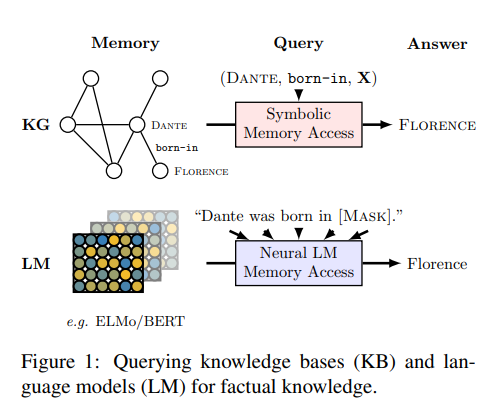
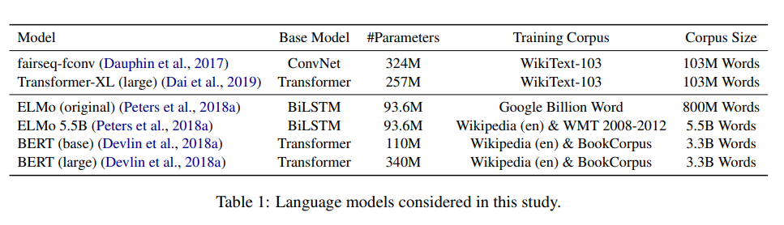
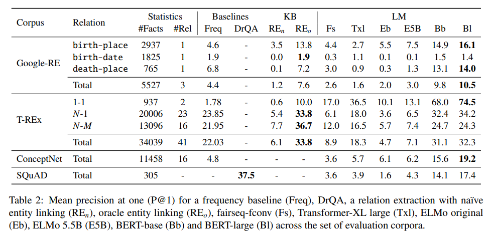
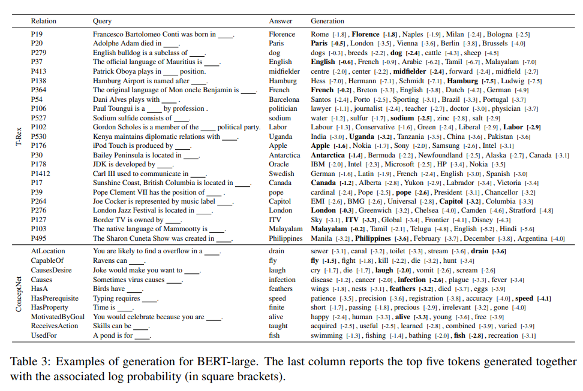
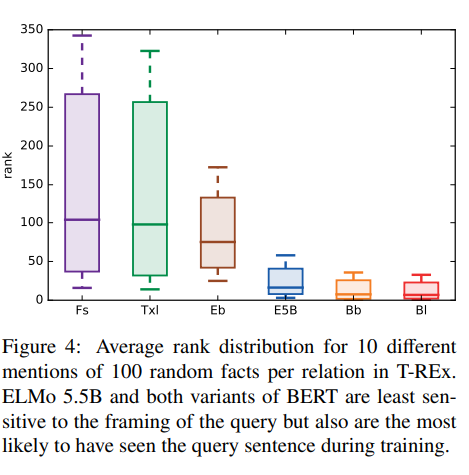

> **Language Models as Knowledge Bases?**  
Fabio Petroni, Tim Rocktäschel, Patrick Lewis, Anton Bakhtin, Yuxiang Wu, Alexander H. Miller, Sebastian Riedel  
https://arxiv.org/abs/1909.01066

# 1. Introduction
최근 ELMO나 BERT같은 high-capacity의 pretrain language model이 NLP에서 중요해지고 있다.
위 model들은 다음 단어를 예측하거나 주어진 sequence의 mask된 단어를 예측하도록 최적화 되어있는데 이러한 방식은 downstream task의 유용한 방대한 지식을 저장하는 것으로 보인다.(Peters et al., 2018b; Goldberg, 2019; Tenney et al., 2019)
이러한 지식은 latent context representation을 조정하거나 fine-tune을 통해 access할 수 있다.  

반면 knowledge base는 (Dante, born-in, X)와 같은 query를 사용하여 관계형 데이터에 접근하기 위한 효과적인 솔루션이지만 이러한 knowledge를 채우기위해 text나 다른 양식에서 관계형 데이터를 추출해야 하며 entity extraction, entity linking, relation extraction 등의 복잡한 NLP pipeline이 필요하다.
또한 오류가 pipeline전체에 쉽게 전파되고 누적될 수 있다.
반면 그림1과 같이 "Dante was born in [MASK]"와 같은 순서로 mask된 token을 예측하는것을 요구함으로써 관계형 데이터에 대한 neural network model을 사용할 수 있다.
위와 같은 방법은 scheme engineering이 필요없고 수작업의 annotation이 필요하지않다.

LAMA(LAnguage Model Analysis)를 제안하여 pre-trained model이 (Dante, born-in, Florence)와 같은 사실(subject, relation, object)을 알고있다는 것을 보여준다.  

wikidata에 저장된 entity간의 관계, ConceptNet의 개념간 상식 관계 및 SQuAD의 자연어 질문에 대답하는데 필요한 지식등 다양한 지식 유형 테스트.  

저자들의 실험에 따르면
1. BERT는 관련 지식을 표현하는 것으로 알려진 corpus에서 off-the-shelf 관계추출과 Oracle 기반 entity linker로 추출한 지식 기반의 지식과 비교할 수 있는 정확한 관계형 지식을 캡처함.
2. fact 지식은 pre-trained language model에서 잘 회복될 수 있지만 일부관계(N-to-M 관계)의 성능은 매우 낮음.
3. BERT-large는 fact, common sense를 회복하는 동시에 다른 언어모델보다 성능이 뛰어나면서 동시에 쿼리 구문에 더욱 강력함.
4. BERT-large는 task-specific supervised relation extraction을 사용하여 구축된 지식기반의 성능에 비해 더 높은 결과를 달성.놀라움.

# 2. Background
* 이 section에서는 language model에 대한 배경지식을 제공

## 2.1 Undirectional Language Models
* 대표적인 Undirectional Language Model은 fairseq-fconv(Gated CNN)과 Transformer-XL이 있음
* 두 모델 모두 Training Corpus는 Wikitext-103

## 2.2 Bidirectional "Language Models"
* 대표적인 Bidicrectional Language Model은 ELMO, BERT
* ELMO: LSTM을 사용하여 Traing Corpus는 Google Billion Word Dataset 사용. 5.5B 버전은 wiki+wmt 2008-2012
* BERT: Transformer를 사용하여 input sequence를 random하게 masking하고 단어를 복원하는 task. Traning Corpus는 wiki+bookcorpus

# 3. Related Work
기존의 연구들은 word representation의 언어 및 의미 특성 이해와 pre-trained lm이 downstream task로 얼마나 잘 전달되는지에 중점을 둔다.  

대조적으로, 본 논문에서는 pre-trained lm이 factual과 commonsense knowledge를 전통적인 relation extraction으로 채워진 knowledge base와 비교함으로써 어느 정도까지 factual과 commonsense를 저장하는 지에 대한 답을 찾고자 함.  

* **Baroni et al.(2014)**
  * semantic relation 및 concept categorization과 같은 작업에서 neural network representation방법과 전통적인 count-based방법을 비교분석. 
  * neural network representation이 성능이 더 우수하다는 사실 발견.
* **Hill et al.(2015)**
  * 단어쌍들간 similarity에 의해 측정된 representation이 semantic meaning을 포착하는 정도 조사.
* **Marvin and Linzen. (2018)**
  * pre-trained lm의 문법을 평가.
  * 좋은 lm은 문법 문장에 더 높은 확률을 할당해야하지만 LSTM은 구문을 잘 배우지 못하는 것을 알게됨.
* **Wang et al.(2018)**
  * pre-trained lm이 knowledge를 downstream NLU task로 transfer하는 능력을 조사.

이러한 분석들은 short text를 이해하기위한 pre-trained lm의 transfer능력에 대해 알 수 있지만, 이러한 모델이 symbolic knowledge base와 같은 전통적인 방식과 경쟁할 수 있는지에 대한 insight는 거의 없음.  

* **McCoy et al.(2019)**
  * NLI의 경우 BERT가 자연어 입력에 대한 더 깊은 이해가 아니라 syntactic heuristic에 더 크기 의존하는것을 알게 되었음.
* **Peters et al.(2018)**
  * ELMO의 하위 layer가 local 구문 관계를 전문하는반면 high layer는 long-range relationship을 modeling하는 방법을 배울수 있음을 발견.
* **Tenney et al.(2019)**
  * language model이 다양한 구문 및 의미론적 현상에 대한 문장 구조를 어느정도까지 encoding하는지 조사
  * 전자에 대해서는 우수, 후자의 속하는 작업에 대해서는 약간의 개선만 제공하는것을 발견.

# 4. The LAMA Probe
* language model에서 사실적이고 상식을 테스트하기위해 LAMA를 소개.
* corpus of fact는 subject-relation-object trible 또는 question-answer 쌍으로 구성됨.
* 각 fact는 cloze statement로 변환됨.

## 4.1 Knowledge Source
* 다양한 언어모델을 평가하기위해 다양한 fact or commonsense knowledge source를 다룬다.
* 각 source에 대해 fact triple (또는 question-answer pair), cloze template로 변환하는 방법 및 특정 fact를 표현하는 것으로 알려진 wikipedia에 정렬된 text가 어느정도 존재하는지 설명.

### 4.1.1 Google-RE
* Google-RE에는 Wikipedia에서 수동으로 추출한 ~60k개의 fact가 포함.
* 다섯가지 관계가 포함되어있지만 "태어난곳" "생년월일" "사망지" 세가지만 고려한다.
* 각각의 고려된 관계에 대한 템플릿을 수동으로 정의(e.g., "[S] was born in [O]" "for place of birth")

### 4.1.2 T-REx
* T-REx knowledge source는 wikipedia triple의 subset.
* T-REx dataset에서 파생되었으며 더 광범위한 관계를 가진 Google-RE보다 훨씬 큼.
* Google-RE과 마찬가지로 각 관계에 대한 템플릿을 수동으로 정의.(표3)

### 4.1.3 ConceptNet
* ConceptNet은 다국어 지식 기반의 OMCS(Open Mind Common Sense).
* OMCS는 단어 및 phrase간의 상식 관계를 나타냄.

### 4.1.4 SQuAD
* 단일 토큰 답변이 있는 SQuAD Dev set에서 305개의 문맥에 구애받지 않는 질문의 하위 세트 선택.
* 이러한 질문으로부터 cloze style 질문을 수동으로 생성.(e.g., rewriting “Who developed the theory of relativity?” as “The theory of relativity was developed by ”.)

## 4.2 Models
* 본 연구에서 표1에 있는 모델들을 테스트 진행.
* position $t$에서 token generation을 진행한다고 가정한다.
* undirectional model은 token바로앞에 network output $({h}_{t-1})$을 사용하여 output layer softmax를 생성.
* ELMO의 경우 output은 forward는 $({h}_{t-1})$ backward는 $({h}_{t+1})$ 이며 forward,backward distribution의 평균사용.
* BERT의 경우 position $t$에서 token을 masking하고 mask된 token $({h}_{t})$에 해당하는 output vector를 softmax layer에 feed.
* 공정한 평가를 위해 모델이 단일화된 어휘를 통해 생성하도록 함.

## 4.3 Baselines
* symbolic knowledge를 추출하고 질문에 답에대한 표준 방법과 언어모델을 비교하기 위해 다음 기준을 고려한다.

**Freq:**
   * 주제와 관계쌍의 경우 이 기준선은 test data에서 주어진 관계에 대한 개체로 나타나는 frequency에 따라 순위를 지정.
   * 특정한 관계에 대해 항상 동일한 객체를 예측하는 모델의 performance을 나타냄.
    
**RE:**
   * relation-based knowledge source의 경우 pre-trained Relation Extraction(RE) model을 고려한다.
    
**DrQA:**
   * DrQA는 2단계 pipeline을 사용하여 자연어 질문에 대한 답변을 예측하는 model.
   * 먼저 TF-IDF retrieval step은 대규모 문서 저장소(e.g. wikipedia)에서 관련 기사를 찾는데 사용
   * 검색된 상위 k 기사에서 neural reading comprehension model은 답을 추출한다.
   * language model에 competitive advantage(경쟁 우위)를 제공하지 않기 위해 DrQA의 예측을 단일 토큰 답변으로 제한

## 4.4 Metrics
* 순위 기반 측정 항목을 고려하고 모든 관계의 평균값과 함께 관계당 결과를 계산.
* subject-relation pair에 대해 여러개의 유효한 object를 설명하기 위해 테스트하는것 이외의 훈련 데이터에서 다른 모든 유효한 개체의 순위를 매길때 candidate를 제거.
* k$(P@K)$의 mean precision을 사용.
* 주어진 사실에대해 객체가 상위 k개의 결과 중에서 순위가 매겨지면 값은 1 아니면 0.

## 4.5 Considerations
* LAMA Probe를 만들때 결정한 몇가지 중요한 설계 결정이 있다.  

**Manually Defined Templates:**
  * 각 관계에 대해 해당 관계에서 객체 슬롯을 쿼리하는 템플릿을 수동으로 정의
  * 일부의 경우 템플릿 선택이 결과에 영향을 줌
   
**Single Token:**
  * single token object만 예측 대상으로 간주.
  * 제한을 하는 이유는 multi token decoding이 측정하려는 지식을 모호하게하는 hyperparameter(beam size, candidate scoring weights, length normalization, n-gram repetition penalty, etc.)를 추가하기 때문.
* 또한 multi token generation은 연구가 활발반 분야이다.

# 5. Results
* 표 2의 주요 결과를 요약.
* 고려된 일련의 corpora에서 mean precision(P@1)을 보여줌.

**Google-RE**
* 각 relation에 대해 cloze template를 사용하여 LM을 query함.
* BERT base와 large는 다른 모델보다 성능이 훨씬 뛰어남.
* Google-RE문장은 train set에 있을 가능성이 있지만(wikipedia) 결과를 도출하는데 있어 "understand"하지 못할 수도 있다.
* 대신 패턴으로부터 object간의 연관성을 배웠을 수 있음.

**T-REx**
* Google-RE knowledge source에는 사실이 거의 없고 세가지 관계만 존재함.
* T-REx를 통해 더 큰 사실과 관계에 대한 실험을 수행.
* BERT의 성능은 off-the-shelf relatuon extraction 및 oracle-based entity linking 기반의 knowledge base 시스템과 성능이 비슷하다.
* relation type 별로 보면 BERT의 성능은 1:1관계에 대해 높고 N:M관계에서는 낮다.
* table3은 cloze template query를 위한 bert-large의 생성결과를 보여줌.
* bert-large는 예측된 객체가 정확하지 않은 경우도 올바른 유형의 객체를 예측함.

* pre-trained language model 성능이 특정 사실을 query하는 다양한 방법에 따라 어떻게 다른지 이해하기 위해 T-REx에서 Wikipedia의 10개문장을 무작위로 선택하는 random fact를 분석.
* 각 문장에서 fact의 object를 숨겨 모델이 예측하게 함.
* Wikipedia에 대해 학습된 후 훈련셋에서 문장을 기억하고 있는지도 테스트함.

* 그림 4는 10개 query에 대한 average rank distribution을 나타냄.
* BERT base,large와 ELMO 5.5B는 변동성이 가장 낮으며 올바른 object를 average top에 가깝게 rank함.
* 놀랍게도 ELMO ori성능은 wikipedia를 학습하지 않았지만 BERT와 멀지는 않다.
* fconv, txl은 큰 변동을 보여줌.

**ConceptNet**
* ConceptNet에 대한 결과는 Google-RE 및 T-REx에 대한 실제 지식을 검색한 결과이다.
* BERT-large model은 최고성능을 달성하며 factual knowledge와 유사한 수준에서 commonsense knowledge를 검색할 수 있다.

**SQuAD**
* open domain cloze-style 질문답변에 대한 시스템을 평가하고 DrQA모델과 비교.
* BERT-large와 DrQA는 Domain QA 시스템 간의 성능 격차를 보여줌.
* P@10의 간점에서 DrQA와 BERT-large를 비교할 때 격차가 현저히 작다는 것을 발견(Bert-large 57.1 DrQA 63.5)

# 6. Discussion and Conclusion
* pre-trained model에서 사실과 상식 지식에 대한 체계적인 분석을 제시.
* BERT-large는 이러한 지식을 더 잘 기억할 수 있으며 non-neural, supervised 모델과 경쟁이 가능성을 보여줌.
