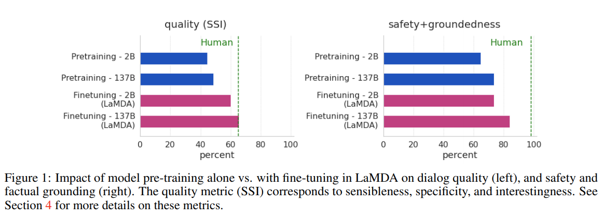
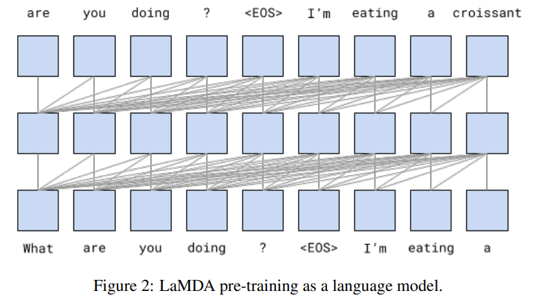
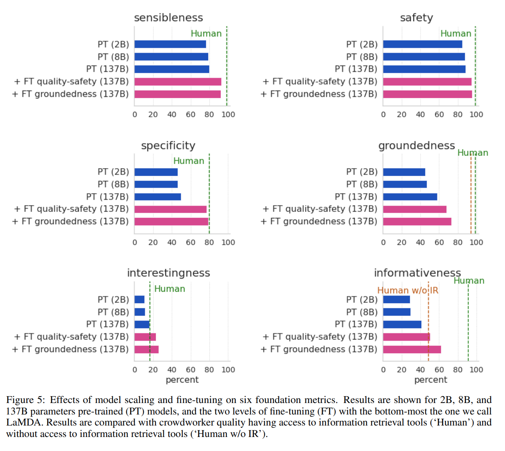
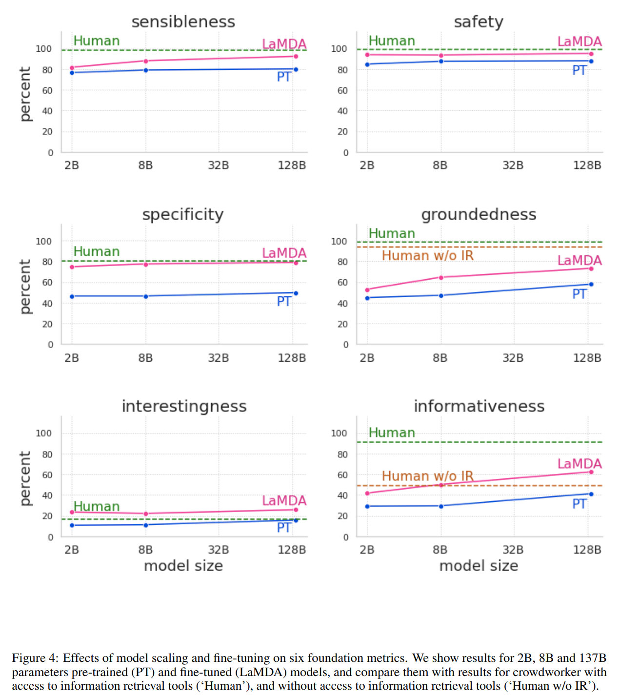

> **LaMDA: Language Models for Dialog Applications**  
Romal Thoppilan, Daniel De Freitas, Jamie Hall, Noam Shazeer, Apoorv Kulshreshtha, Heng-Tze Cheng, Alicia Jin, Taylor Bos, Leslie Baker, Yu Du, YaGuang Li, Hongrae Lee, Huaixiu Steven Zheng, Amin Ghafouri, Marcelo Menegali, Yanping Huang, Maxim Krikun, Dmitry Lepikhin, James Qin, Dehao Chen, Yuanzhong Xu, Zhifeng Chen, Adam Roberts, Maarten Bosma, Vincent Zhao, Yanqi Zhou, Chung-Ching Chang, Igor Krivokon, Will Rusch, Marc Pickett, Pranesh Srinivasan, Laichee Man, Kathleen Meier-Hellstern, Meredith Ringel Morris, Tulsee Doshi, Renelito Delos Santos, Toju Duke, Johnny Soraker, Ben Zevenbergen, Vinodkumar Prabhakaran, Mark Diaz, Ben Hutchinson, Kristen Olson, Alejandra Molina, Erin Hoffman-John, Josh Lee, Lora Aroyo, Ravi Rajakumar, Alena Butryna, Matthew Lamm, Viktoriya Kuzmina, Joe Fenton, Aaron Cohen, Rachel Bernstein, Ray Kurzweil, Blaise Aguera-Arcas, Claire Cui, Marian Croak, Ed Chi, Quoc Le  
https://arxiv.org/abs/2201.08239

# 1. Introduction
Language model pre-train은 NLP에서 점점 더 유망한 연구 접근법이다.
pre-train은 model size 및 dataset size를 증가시켜 더 나은 성능이나 새로운 기능을 달성할 수 있다.
예를들어, large-scale unlabeled text corpus에서 학습된 GPT-3(175B)는 few-shot learning에서 좋은 성능을 보여준다.

Large language model의 응용프로그램 중 하나인 대화모델은 transformer의 능력을 성공적으로 활용한다([Adiwardana, Daniel, et al.](https://arxiv.org/abs/2001.09977), [Roller, Stephen, et al.](https://arxiv.org/abs/2004.13637)).
General language model과 유사하게 [Adiwardana, Daniel, et al.](https://arxiv.org/abs/2001.09977) 연구에서는 대화모델도 모델크기 증가에 매우 적합함을 보여준다.
모델의 크기와 대화품질 사이에는 강한 correlation이 있다.

이러한 연구들에 영감을 받아 대화를 위한 transformer 기반의 모델인 LaMDA를 학습한다.
모델의 크기는 parameter 2B~137B까지이며 공개된 대화데이터 및 기타 공개 웹 문서(section 3)의 1.56T words 데이터셋을 통해 사전학습을 진행했다.
LaMDA는 단일모델을 사용하여 여러 task를 수행한다:
1. 가능성 높은 response을 생성
2. 안전성을 위해 필터링
3. external knowledge를 기반으로 re-rank하고 고품질의 response 선택

본 논문에서는 quality, safety, groundedness 세 가지 metric에서 LaMDA를 사용한 model scaling의 이점을 연구한다.
1. model scaling 만으로도 quality가 향상되지만 safety 및 groundedness는 human performance에 비해 떨어짐
2. model scaling 과 fine-tuning을 결합하면 모든 metric에서 LaMDA가 크게 향상되고 safety 및 groundedness 측면에서는 human performance 밑으로 유지되지만 crowdworker 수준과의 quality 차이는 좁힐수 있었음.

* quality는 sensibleness, specificity, interestingness를 기반으로 한다.
* safety는 model이 생성하는 response중 안전하지 않은 response를 줄이기 위해 추가했다.
* groundedness는 external knowledge에 기반한 response를 생성하기 위해 추가했다.

# 2. Related Work
**Language models and dialog models:**  
Model size와 관련된 scaling laws에 대한 본 논문의 연구는 [Scaling Laws for Neural Language Models](https://arxiv.org/abs/2001.08361)에 대한 최근 연구에서 영감을 받았다.
해당 논문과 유사하게 본 논문의 결과는 model scaling이 quality, safety, groundedness를 어느정도 향상시킨다는 것을 보여준다.
model scaling과 fine-tuning이 결합될때 모든 metric에서 성능을 크게 향상시킨다.

Model의 groundedness를 개선하기 위한 접근방식은 retrieval system을 사용하여 language model을 보강하는 연구들과 대체로 일치한다.
기존연구 대부분은 대화생성 보다는 QA(Question-Answering)에 초점을 두고 있으며, model 자체를 사용하여 knowledge source를 색인화하고 순위를 지정한다.
이러한 차이점을 감안할때 기존 접근방식의 범위에는 [RNNLM](https://arxiv.org/abs/1911.00172), [RAG](https://arxiv.org/abs/2005.11401) ([논문리뷰](https://jeonsworld.github.io/NLP/rag/)), [REALM](https://arxiv.org/abs/2002.08909) ([논문리뷰](https://jeonsworld.github.io/NLP/realm/)), [FiD](https://arxiv.org/abs/2007.01282) 아키텍쳐가 포함된다.  
[RETRO](https://arxiv.org/abs/2112.04426) 아키텍쳐는 language model이 최대 2조 개의 token을 통해 개선될 수 있음을 보여준다.  
넓은 수준에서 본 논문의 접근방식은 [TicketTalk](https://arxiv.org/abs/2012.12458)의 접근방식과 비슷하다. 해당 논문은 영화 티케팅 대화에서 external API를 사용하도록 fine-tuning을 수행한다.

본 논문의 결과중 일부는 대화기반에 대한 최근연구와 유사하다.
[Kurt Shuster et al.](https://arxiv.org/abs/2104.07567)연구 에서는 external knowledge에 대한 접근권한을 부여하면 모델이 출처가 없는 response 비율이 줄어드는 것으로 나타났다.  
[WebGPT](https://arxiv.org/abs/2112.09332)는 개방형 웹고 상호작용을 통해 질문에 답변을 할때 인간을 모방하는 방법을 학습한다.  
[Komeili et al.](https://arxiv.org/abs/2107.07566) 연구는 다양한 유형의 pre-trained model과 retreival method를 비교하고 검색엔진으로 language model을 보강하는 것이 더 사실에 기반한 response를 제공한다는 유사한 결론에 도달한다.
그들은 next response를 생성하기 위해 검색의 정보로 input context를 encoding하는 반면, 본 논문에서는 external knowledge의 정보를 통해 generated response를 보강한다.

**Dialog metrics:**
대화모델에 대한 효과적인 metric을 정의하는 것은 열런 연구주제로 남아있다.
본 논문의 접근방식은 sensibleness 및 specificity와 같은 인간과 유사한 metric을 주장한 [Adiwardana et al.](https://arxiv.org/abs/2001.09977) 연구에서 영감을 받았다.
perplexity, F1, Hits@1/N, USR 및 BLEU/ROUGE를 포함하여 많은 metric이 연구되었으나 이러한 metric은 인간의 판단과는 연관되지 않을 수 있다.  
대화 모델링을 보다 신뢰할 수 있는 metric은 human evaluation이 필요하다.

[Adiwardana et al.](https://arxiv.org/abs/2001.09977) 연구의 sensibleness 및 specificity 이외에도 본 논문에서는 interestingness, safety, groundedness와 같은 새로운 metric을 추가했다.
이러한 metric에서 오는 이점은 디버깅 가능성이다.
낮은 safety 및 groundedness를 가진 response를 탐색하여 이를 개선하기 위한 방법을 개발할 수 있었다.

**Safety and safety of dialog models:**
Language model의 부적절하고 안전하지 않은 위험은 이전 연구들에서 광범위하게 연구되어오고 있다.
[Weidinger et al.](https://arxiv.org/abs/2112.04359) 연구에서는 large-scale language model과 관련된 21가지 위험을 식별하고 이에대해 논의한다.
많은 완화 전략들이 제안되었지만 이러한 문제를 의미있게 해결하는것은 여전히 활발한 연구 영역이다.

대화모델에 대해서도 유사한 문제가 구체적의로 논의되었다.
예를 들면 편견, 공격성 및 증오심 표현의 예시는 소셜 미디어의 학습데이터와 이러한 데이터에 대해 학습된 대화모델의 출력에서 모두 발견되었다.
대화모델은 학습데이터의 bias를 학습하고 더 나아가 더 증폭될 수 있다.  
[Gehman et al.](https://arxiv.org/abs/2009.11462) 연구에서는 fine-tuning이 안전을 위해 language model을 보강하는것이 효과적이라는것을 발견했다.
해당 논문에서 사용하는 방법은 안전하지 않은 output을 감지하기 위해 별도의 layer를 학습하여 이러한 문제를 해결하려는 연구들을 바탕으로 한다.

본 논문의 전략은 fine-tuning을 사용하는 [Solaiman and Dennison](https://arxiv.org/abs/2106.10328)연구와 유사하다.

**Groundedness metrics:**
위의 다른 최근연구들과 유사하게 본 논문에서는 모델의 output이 external source와 일치하는지 여부를 판단하기 위해 crowdworker에게 요청하여 평가를 진행한다.

최근에 제안된 [AIS(Attributable to Identified Sources)](https://arxiv.org/abs/2112.12870) 프레임워크는 external world와 관련된 language model의 output을 평가하기 위한 보다 정확한 접근방식을 설명한다.
평가는 crowdworker에게 (1)대화에서 공유되는 정보를 이해하고 식별할 수 있는지, (2) 모든 정보가 source에 귀속될 수 있는지를 묻는 두 단계로 나뉜다.  
한편, 최근연구 [Honovich et al.](https://arxiv.org/abs/2104.08202)는 자동 평가에 대한 의문을 다시 제기했으며, Q2 metric은 인간의 주석에 필적하는 성능을 보여준다.

# 3. LaMDA pre-training
LaMDA는 text corpus를 통해 next token을 예측하도록 pre-train 되었다.
대화 데이터만으로 학습된 대화모델([Adiwardana, Daniel, et al.](https://arxiv.org/abs/2001.09977), [Roller, Stephen, et al.](https://arxiv.org/abs/2004.13637)) 과 달리 공개 대화데이터 및 기타 공개 웹 문서에서 생성된 데이터셋으로 LaMDA를 pre-train 했다.
이에따라 LaMDA는 fine-tuning 이전에 general language model로도 사용할 수 있다.

Pre-train 데이터셋은 총 1.56T 단어로 2.97B 문서, 1.12B 대화 및 13.39B 대화발화로 구성된다.

가장 큰 LaMDA 모델은 137B 파라미터를 가지고 있으며 [Meena](https://arxiv.org/abs/2001.09977)와 비교하여 50배더 많은 매개변수를 가진다.
LaMDA의 model architecture는 decoder-only Transformer Language Model을 사용한다.
* LaMDA configuration
  * $d_{model}$: $8192$
  * $d_{ff}$: $65536$
  * $h$: $128$
  * $d_{k}, d_{v}$: $128$
  * relative attention (described in T5)
  * gated-GELU activation function (described [GLU Variants Improve Transformer](https://arxiv.org/abs/2002.05202))
    * $\mathrm{GEGLU}(x, W, V, b, c)=\mathrm{GELU}(xW+b)\otimes (xV+c)$

Pre-train은 1024개의 TPU-v3칩과 배치당 256k token을 사용해 57.7일동안 수행했다.

그림 2는 pre-train의 개요를 보여주며 본 논문에서 fine-tuning 단계 이전의 pre-trained 모델을 "PT"라고 부른다.

PT는 decoding을 위해 Meena와 동일한 sample-and-rank strategy를 사용한다.  
top-k sampling($k=40$, no temperature)을 사용하여 16개의 독립적인 candidate response를 샘플링한다.
최종 출력은 가장 높은 점수를 받은 candidate이며, 여기서 점수는 candidate의 log-likelihood와 length를 기반으로 한다.

# 4. Metrics
일반적으로 open-ended 대화모델을 평가하는것은 어렵다.
이 분야의 최근연구에 대한 일반적인 방법은 Related work section을 참고.

해당 section에서는 평가에 사용되는 metric에 대해 설명한다.

## 4.1 Foundation metrics: Quality, Safety and Groundedness
**Sensibleness, Specificity, Interestingness (SSI):**
Quality에 대한 점수는 sensibleness, specificity, interestingness의 평균이다.

Meena에서는 quality를 평가하기 위해 sensibility and specificity average(SSA) metric을 제안한다.
해당 metric은 감성과 특이성이라는 두 가지 점수의 단순평균값이다.

감성은 모델의 response가 context에서 의미가 있고 이전에 말한것과 모순되지 않는지 여부를 측정한다.
인간은 의사소통에서 이 부분을 당연하게 생각하는 경향이 있지만 생성모델은 종종 해당 요구사항을 충족하기 위해 노력한다.
그러나 sensibleness만 사용하여 모델을 평가하는경우 모델은 항상 일반적이며 짧고 지루한 response를 생성할것이다.
모든 질문에 "I don't know"로 대답하고 모든 문장에 "Ok"로 대답하는 GenericBot 알고리즘은 sensibleness에서 70% 성능을 기록하여 일부 large dialog model 연구결과를 능가한다.

Specificity는 response가 주어진 context에 적절한지 여부를 평가하는데 사용된다.
예를들어, 사용자가 "I love Eurovision"이라고 말하고 모델이 "Me too" response를 출력하면 이는 다양한 context에서 사용될 수 있으므로 specificity는 0점을 얻는다.
만약 "Me too. I love Eurovision songs"라고 한다면 1점을 받을것이다.  
Meena는 SSA metric에서 평균적인 human performance와 격차를 좁혔다고 보고했다.

그러나 모델의 성능이 향상됨에 따라 sensibleness, specificity이 대화모델의 quality를 측정하기에 충분하지 않다는것을 알게 되었다.  
예를들어, "공을 던지려면 어떻게 해야하나요?"에 대한 response로 "공을 집어어올린 다음 던지면 공을 던질 수 있다"가 될수있다.
이는 의미가 있고 질문에 특정한 것이다.  
더욱 만족스러운 response는 "공을 던지는 한 가지 방법은 양손으로 공을 단단히 잡고 팔을 아래로 내렸다가 다시 위로 휘드루며 팔꿈치를 뻗은 다음 공을 위로 놓는것이다." 이다.

이러한 직관을 "interestingness"라고 부른다.
crowdworker에 의해 0/1 label로 측정한다.
crwodworker에게 "누군가의 관심을 끌것", "호기심을 불러 일으킬것" 이라고 판단되는 경우 및 예상치 못한, 재치 또는 통찰력있는 response인 경우 label로 지정하도록 요청한다.

**Safety:**
대화모델은 high quality(SSI) 점수를 얻을 수 있지만 사용자에게 안전하지 않을 수 있다.
따라서 안전하지 않은 모델출력을 측정하기 위해 새로운 safety metric을 고안했다.
safety metric은 위험을 초래하는 의도하지 않은 결과를 방지하고 불공정한 편견을 만들거나 강화하는 것을 방지하기위한 목표를 따른다.

**Groundedness:**
현재 세대의 language model은 그럴듯하지만 잘못된 문장을 생성하는 경향이 있기 때문에 LaMDA가 가능한 경우 known source와 연관될 수 있는 response를 생성하고 원하는 경우 cross-checking을 가능하게 하는 것을 목표로 한다.

## 4.2 Role-specific metrics: Helpfulness and Role consistency
기본 metric(quality, safety, groundedness)은 일반적으로 대화 에이전트에게 중요하고 생각되는 속성을 측정한다.
그러나 에이전트가 설계될 수 있는 응용프로그램 역할(e.g., 동물에 대한 정보 교육)에 종속되지 않는다.
상담원이 특정 역할을 하는 대화 응용프로그램에서 helpfulness, role consistency을 측정한다.

**Helpfulness:**
모델 response는 사용자가 정보검색 시스템을 통해 독자적으로 조사하여 정확한 정보를 포함하고 있고 사용자가 유용하다고 판단되는 경우 유용한것으로 표시한다.
Helpful response는 사용자가 정확하고 유용하다가 판단하는 유익한 response의 하위 집합이다.

**Role consistency:**
모델 response는 역할을 수행하는 에이전트가 말하는 것과 같은 경우 role consistency로 표시한다.
에이전트가 대화에서 수행한 previous response와의 consistency와 구별되며 대화내 self-consistency는 sensibleness metric으로 측정된다.  
Role consistency는 대화에서 외부에이전트 역할정의와 consistency를 의미한다.

# 5. LaMDA fine-tuning and evaluation data
**Quality (Sensibleness, Specificity, Interestingness):**
Quality(SSI)를 개선하기 위해 모든 주제에 대해 LaMDA 인스턴스와 상호작용 하도록 요청하여 6400개의 대화를 수집한다.
각 response에 대해 주어진 상황에 맞는 response가 sensible, specific, interesting한지 평가하고 'yes','no','maybe' 레이블로 표시한다.  
Sensibleness label이 'no'일 경우 specificity, interestingness는 모두 'no'로 설정되고 sensibleness label이 'yes' specificity가 'no'인 경우 interestingness는 'no'로 설정된다.  
crowdworker 5명이 sensible label을 추가하면 sensible한것으로 간주하고, specific, intereting label은 5명 중 3명이 'yes'라고 표시하면 'yes'로 간주한다.

**Safety:**
Safety fine-tuning을 위해 safety objective를 정의하는 구조화된 접근방식을 사용한다.
이러한 목표는 인구 통계학적으로 다양한 crowdworker셋을 사용하여 인간이 생성한 prompt에 대한 response로 LaMDA 인스턴스에서 생성된 candidate response에 주석을 다는데 사용한다.

SSI와 유사하게 어떤 주제에 대해 LaMDA 인스턴스와 상호작용하도록 요청하여 8k 대화를 수집한다.

1. 자연스러운 형태의 상호작용
2. 민감한 주제를 다루는 상호작용
3. safety objective에 따라 적대적으로 시도하는 상호작용

위와 같은 세 가지 방식으로 모델과 상호작용 하도록 지시한다.
crowdworker는 'yes', 'no', 'maybe' 세 가지 label을 표시하며, 3명중 2명 이상이 'no'로 표시하면 안전점수가 1이 할당되고 그렇지 않으면 0으로 할당한다.

**Groundedness:**
SSI 및 safety와 유사하게 LaMDA 인스턴스와 상호작용하도록 요청하여 4k대화를 수집한다.  
모델의 각 대화턴을 평가하고 턴의 정보가 external world에 대해 주장하는지 여부를 평가하도록 한다.  
또한 crowdworker에게 그 주장이 사실인것을 알고 있는지 묻는다.
서로 다른 3명의 워커가 모두 알고 있는 경우, 이를 common knowledge로 가정하고 external source를 확인하지 않는다.  
확인해야하는 주장이 포함된 경우 워커에게 조사에 사용할 검색어를 기록하도록 요청한다.
워커에게 external knowledge retrieval system의 간단한 검색 결과를 통합하기위해 모델의 response를 편집하도록 요청한다.
검색결과에 공개 웹 콘텐츠가 포함된경우 해당 knowledge의 출처를 인용하는 URL을 포함하도록 한다.

**Estimating these metrics for human-generated responses:**
워커에게 평가 데이터셋의 무작위로 선택된 샘플에 응답하도록 요청한다.
워커는 safe, sensible, specific, interesting, grounded, informative한 방식으로 응답하도록 명시적으로 알려준다.
또한 이러한 response를 생성하는데 필요한 external tool을 사용하도록 요청한다.
그런다음 context-response pair가 평가를 위해 전송되고 모델 생성응답과 마찬가지로 과반수 투표에 의해 label을 할당한다.

# 6. LaMDA fine-tuning
## 6.1 Discriminative and generative fine-tuning for Quality (SSI) and Safety

Pre-trained model(PT)에 적용된 몇 가지 fine-tuning을 사용하여 LaMDA를 만든다.
여기에는 주어진 상황에서 response를 생성하는 생성 작업과 상황에서 response의 quality, safety를 평가하는 판별작업의 혼합이 포함된다.
결과적으로 generator, discriminator의 기능을 할 수 있는 single model이 생성된다.

LaMDA는 decoder-only generative language model로 모든 fine-tuning은 token sequence로 표현된다.
generative fine-tuning 예시는 "\<context\>\<sentinel\>\<response>\"로 표현되며 loss는 response 부분에만 적용된다.
* "What's up? RESPONSE not much."

discriminative fine-tuning 예시는 "\<context\>\<sentinel\>\<response\>\<attribute-name\>\<rating\>"으로 표현되며, attribute-name 뒤에 오는 rating에만 loss가 적용된다.
* "What's up? RESPONSE not much. SENSIBLE 1"
* "what's up? RESPONSE not much. INTERESTING 0"
* "What's up? RESPONSE not much. UNSAFE 0"

생성 및 판별 모두에 하나의 모델을 사용하면 효율적으로 결합된 생성 및 판별절차가 가능하다.
주어진 context에서 response를 생성한 후 판별자를 평가하려면 P("\<desired-rating\>" | "\<context\>\<sentinel\>\<response\>\<attritube-name\>")를 계산해야 한다.
모델은 이미 "\<context>\<sentinel\>\<response\>"를 계산했으므로 판별자를 평가하려면 몇 가지 추가 토큰인 "\<attribute-name\>\<desired-rating\>"만 계산하면 된다.

LaMDA를 fine-tuning하여 생성된 candidate response의 SSI 및 safety 등급을 예측한다.
모델의 safety 예측 임계값 아래로 떨어지는 candidate response를 필터링한다.
safety를 위해 필터링한 후 남아있는 candidate response에 대해 quality를 순위를 매긴다.
순위를 매기는동안 sensibleness는 specificity, interestingness보다 3배 더 높은 가중치를 부여한다.  
이는 ($3*P(sensible)+P(specific)+P(interesting)$)에서 잘 작동하였기 때문이다.

LaMDA SSI 및 safety discriminator는 pre-train dataset에서 샘플링된 대화데이터 2.5M turn에 대해 점수를 매기고 필터링하는데 사용되어 safe, sensible, specific, interesting한 대화 800k turn을 생성한다.
다음 생성된 대화 데이터셋을 통해 LaMDA 모델을 fine-tuning하여 주어진 context에서 response를 생성한다.

이 기술을 사용하면 LaMDA의 safety, quality가 크게 향상된다 (그림 5).

## 6.2 Fine-tuning to learn to call an external information retrieval system
LaMDA와 같은 language model은 그럴듯해 보이지만 알려진 external source에 의해 확립된 사실과 모순되는 출력을 생성하는 경향이 있다.
예를들어, 뉴스기사의 시작 문장과 같은 prompt가 주어지면 large language model은 저널리즘 스타일의 자신감있는 진술로 계속 진행한다.
그러나 이런 콘텐츠는 신뢰할 수 있는 external reference에 연결되지 않고 뉴스기사에서 찾을 수 있을것으로 예상되는 내용을 모방할 뿐이다.

이 문제에 대한 한가지 가능한 솔루션은 모델이 더 많은 학습데이터를 효과적으로 기억할 수 있다는 가정으로 모델의 크기를 늘리는것이다.
그러나 "How old is Rafael Nadal?" 또는 "What time is it in California?"와 같은 사실은 시간이 지나면서 변한다.
이러한 문제를 "temporal generalization problem"이라고 부른다.  
이 문제를 완화하기 위해 동적 또는 증분 학습 아키텍쳐를 사용하는 최근연구([Lazaridou, Angeliki, et al.](https://openreview.net/forum?id=V4eHJxmMn-M), [Hombaiah, Spurthi Amba, et al.](https://arxiv.org/abs/2106.06297))가 있다.  
사용자는 human knowledge corpus내에서 대화하는것에 관심이 있을 수 있으므로 이를 달성하기 위한 학습데이터 및 모델사이즈를 얻는것은 어려운 일이다.

본 논문에서는 일련의 external knowledge source 및 tool을 참조하는 방법을 학습하여 fine-tuning에 대한 접근방식을 제시한다.

**The toolset(TS):** 정보검색 시스템(information retrieval system), 계산기 및 번역기를 포함하는 도구집합을 만든다. TS는 단일 문자열을 입력으로 사용하고 문자열을 출력한다.  
예를들어 계산기는 "135+7721"을 입력으로 받아 ["7856"]을 출력한다.

**Dialog collection:** 40,000개의 주석이달린 dialog turn을 수집한다.  
또한 LaMDA에서 생성된 candidate가 "correct", "incorrect" 레이블이 지정된 9k dialog turn을 수집하여 raking task에 대한 input 데이터로 사용된다.

그림4와 같이 TS에 접근할 수 있는경우 높은 비율로 근거가 뒷바침된 주장을 하는것에 주목해야 한다.
Rafael Nadal의 나이를 물었을때 human expert는 답을 알지 못할 수 있지만 정보검색 시스템에 쿼리하여 쉽게 얻을 수 있다.

사용된 TS에 대한 인터페이스는 inference시 알고리즘에서 사용하는 서비스와 동일하다.
일반 쿼리가 주어지면 정보검색 시스템은 rank order로 텍스트 전용 snippet을 반환한다.
개방형 웹 콘텐츠의 snippet에는 해당소스의 URL이 포함되지만 정보검색 시스템에서 직접 제공하거나 계산기에서 제공하는 답변은 포함되지 않는다.

**Fine-tuning:** LaMDA를 미세조정하기 위해 두 가지 task를 수행한다.  
첫번째 task는 기본 모델에서 생성된 response와 날짜에 대한 multi-turn dialog context를 가져온다.
이후 다음 text가 TS로 전송되어야 하는 쿼리(e.g. "How old is Rafael Nadal?")임을 나타내는 특수 문자열을 생성한다. -> "TS, Rafael Nadal's age"

두번째 task는 TS에서 반환된 snippet과 대화(e.g., "He is 31 years old right now" + "Rafael Nadal / Age / 35")을 사용한다.
이후 context + base + query+ snippet -> "User, He is 35 years old right now"라고 예측한다.

"Research" 단계는 "base"출력을 평가하기 위해 일부 쿼리를 TS에 출력한다.
"Research"단계는 single multitasking model(e.g., "기본"대화 response 생성 task, safety and quality task)에 속하는 하나의 특별한 task이다.  
쿼리 생성은 model fine-tuning을 기반으로 하며 휴리스틱 요소는 없다.
