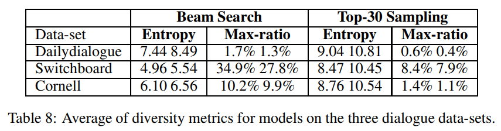

> **Mix-review: Alleviate Forgetting in the Pretrain-Finetune Framework for Neural Language Generation Models**  
Zhenzhong Lan, Mingda Chen, Sebastian Goodman, Kevin Gimpel, Piyush Sharma, Radu Soricut  
https://arxiv.org/abs/1910.07117

# 1. Introduction
large-scale unsupervised pre-training의 큰 성공과 함께 NLP model의 성능과 많은 연구 관심을 끌었다.
큰 성공에도 불구하고 다음과 같은 open question을 던질 수 있다.
"standard NLP pretrain-finetune framework에 weakness가 있습니까?"
본 논문에서는 language generation에 관점을 두며 위의 질문에 대답이 yes 라는 것을 보여준다.
특히, 이 질문에 답이 **data separation**으로 나타나는 개념이라는 것을 알게 되었음.

pretrain-finetune framework는 크게 두 가지 과정으로 볼 수 있다.
1. large-scale text data를 통해 model을 pre-train
2. target task data를 통해 model을 fine-tune

data separation은 두 단계에서(거의) 겹치지 않는 data usage를 나타낸다.

본 논문에서는 NLG(natural language generation)의 관점에서 pretrain-finetune framework를 연구하며 다음의 이유로 open-domain dialogue response task에 중점을 둔다.
1. target dialogue response task(conditional NLG)와 pre-training language modeling objective간에 similarity가 높으므로 pre-training과정에서 습득한 language generation 기술이 downstream target task로 잘 transfer될 수 있을것으로 기대.
2. model의 sequence-to-sequence 특성을 통해 model의 generation 동작을 다양한 방식(e.g., context sensitivity)으로 특성화 할 수 있음.
    
    

### Contribution
* pretrain-finetune이 model의 행동을 어떻게 변화시키는지 연구하기 위해 **context sensitivity와 knowledge transfer관점**에서 행동 분석을 수행.
* main finding은 fine-tuning 단계에서 data separation으로 인해 model이 pre-train과정에서 습득한 중요한 language generation skill을 잊게 한다는 것.
* 이러한 분석을 통해 data mixing concept를 채택하고 pre-training, fine-tuning을 결합한 **mix-review fine-tuning strategy를 제안**.
* mix-review가 fine-tuning process를 효과적으로 **regularization하고 forgetting problem을 크게 완화**함.

# 2. Training Objective for Seq2seq Tasks
End-to-End dialogue response generation은 seq2seq task로 공식화 할 수 있다.
dialogue context(previous utterances)가 주어지면 model은 response를 생성하도록 요청한다.
이러한 task에서는 encoder-decoder model architecture를 주로 사용.  

본 논문에서는 Vaswani et al.(2017)과 같이 6개의 transformer encoder/decoder를 사용한다.
* attention head:16, embedding dim:1024, ffn dim:4096

Adam optimizer를 사용하며 data distribution의 input sequence $\mathbf{x}$를 고려하여 target sentence $\mathbf{y}$의 negative log-likelihood를 최소화함.
$$
\mathcal{{ L  }}_{ MLE }\left( { P }_{ data };\theta  \right) ={ E }_{ \left( x,y \right) \sim { P }_{ data } }\left( \mathrm{-log}{ P }_{ \theta  }\left( \mathbf{y}|\mathbf{x} \right)  \right) ={ E }_{ \left( x,y \right) \sim { P }_{ data } }\left( -\sum _{ t=1 }^{ m }{ \mathrm{log}{ P }_{ \theta  }\left( { y }_{ t }|\mathbf{{ y }}_{ <t },\mathbf{x} \right)  }  \right) ,\quad (1)
$$

$\mathbf{{ y }}_{ <t }$는 $\left\{ { y }_{ 0 },{ y }_{ 1 },\dots ,{ y }_{ t-1 } \right\}$ 를 나타내며 ${ y }_{ 0 }$는 $<BOS>$ token이고 ${y}_{m}$은 $<EOS>$ token 이다.
dialogue response setting에서 input $x$는 이전 발화의 연결이며 $x$의 길이를 최대 128 word로 잘라낸다. 일반적으로 6개의 이전 발화가 포함됨.  

trained seq2seq model로 부터 contexual input에 맞는 response를 generation하기 위해 decoding method를 선택해야 함.
최근연구(Holtzman et al., 2019; Radford et al., 2019; Fan et al., 2018)에 따르면 top-k sampling이라는 strategy가 있으며 다음 단어는 k개의 가장 가능성이 높은 선택에서 샘플링된다.
* Holtzman et al.: The curious case of neural text degeneration.
* Radford et al.: Language models are unsupervised multitask learners.
* Fan et al.: Hierarchical neural story generation.  

이는 기존의 beam search decoding보다 더 나은 선택이다.
preliminary experiments(Appendix A)에서 결과를 확인할 수 있음.  

본 연구에서는 따로 언급하지 않는 한 top-k sampling을 기본 decoding method로 사용하며 $k$는 30으로 설정.

# 3. The Pretrain-Finetune Framework
본 Section에서는 encoder-decoder model을 위한 pretrain-finetune framework를 review.
pre-training과정에서 model이 습득할 수 있는 language generation skill과 target task로 얼마나 잘 transfer되는지에 대해 논의한다.
이 논의는 mix-review fine-tuning strategy 제안으로 이어짐.

## 3.1 Pre-training
large-scale unsupervised text data를 통해 seq2seq model을 pre-train하고 target dialogue data를 통해 fine-tune진행.
대표적인 두 가지 pre-train strategy next sentence(NS) pre-train과 masked seq2seq (MASS) pre-train를 비교.
* next sentence는 GPT style LM training을 개선한 버전.
* MASS는 encoder-decoder model을 위한 "BERT"의 개선 버전.

표1 에서는 NS pre-train과 전형적인 dialogue response training의 유사성을 보여준다.
NS pre-train에 비해 **MASS는 한 번에 하나의 문장에 집중**한다는 단점이 있음

pre-train에서 model이 획들 수 있는 두가지 중요한 generation 기능이 있으며, 이는 dialogue setting에 이점이 있다.
* knowledge 습득: **large-scale pre-train에는 많은 knowledge가 포함**되어 있으며 dialogue response을 보다 유익하고 흥미롭게 만드는데 사용될 수 있음.(e.g., model에게 어벤져스 영화를 주제로 학습)
* contextual input의 활용: 현재의 open-domain dialogue model(without pre-training)은 contextual input에 둔감하여 generic response problem을 야기함. NS pre-train에 대한 preliminary experiment에서 GPT와 유사하게 pre-train model이 이전 sentence를 입력으로하여 밀접하게 관련된 response를 generation할 수 있음을 발견함. 이상적으로 fine-tune을 진행하는 동안 model은 이러한 skill을 **target dialogue task로 transfer할 수 있음.** 

## 3.2 The Mix-review Fine-tuning Strategy
최근에는 다양한 NLP task에 대한 pre-train strategy가 제안되었지만 fine-tunuing 단계는 small lr로 parameter들을 fine-tune하기 때문에 간단함.

그림 1a에서 fine-tuning동안 다양한 eval set에 대한 model의 NLL를 확인할 수 있음.  

fine-tuning중 두 가지 잠재적 문제를 식별할 수 있음.
1. over-fitting: trainset NLL과 validation-set NLL사이의 간격이 빠르게 증가함.
2. forgetting: pre-train CC-NEWS data의 성능이 크게 떨어짐. 여기서 forgetting 현상은 sequential learning case에서와 같이 "재앙적(catastrophic)"이지는 않다. 
    * 그러나 model이 pre-training 과정에서 배운 중요한 skill을 잃어버렸다고 의심하게 만듦.(senction 5.2, 5.3)

forgetting 현상을 해결하기 위해 "Mix-Review"라는 fine-tuning strategy를 제안.
각 fine-tuning 단계마다 target dialogue data를 pre-train data의 random한 subset과 mix한다.
이에 해당하는 두 가지 hyper-param을 소개.
* mix-ratio는 pre-train data에서 얼마나 mix할껀지 제어하고, mix-decay는 mix data의 양을 각 epoch마다 감소시킨다.
* 예를들어, target dialogue trainingset에 100k의 발화(문맥), mix-ratio=4, mix-decay=0.9면 mix-review fine-tuning의 첫번째 epoch에는 400k pre-train 발화가 포함되며 두번째 epoch에는 360k 발화로 감소.
* mix-review objective는 다음과 같이 공식화 됨.

$$
\mathcal{{ L }}_{ fine-tune }\left( { P }_{ target-data };\theta  \right) +\mathrm{mix-}\mathrm{ratio}\cdot \mathcal{{ L }}_{ pre-train }\left(\mathcal{L}_{ pretrain-data };\theta  \right)
$$

mix-ratio와 mix-decay에 대해 $\left\{ 1,2,4,8,16 \right\} \times \left\{ 1,0.9,0.8,0.7,0.6,0.5 \right\} $ 로 hyperparam tune을 진행했음.
mix-review의 성능이 hyper-param에 민감하지 않다는 것을 발견. 일반적으로 4의 mix-ratio는 잘 작동함.

그림 1a에서 mix-ratio가 4이고 mix-decay가 0.7인 mix-review fine-tuning에 대한 loss curve를 확인할 수 있음.
pre-train CC-NEWS data의 성능이 보존되어 mix-review가 의미있다는 것을 확인할 수 있음.
또한 mix-review에서 regularization effect를 관찰.(training과 testing 성능 차이를 좁힘)  

pre-trained parameter ${ \theta  }_{ pre }$ 에 대한 L2 regularization(weight decay)와 mix-review를 비교한다. 이를 WD(${ \theta  }_{ pre }$)로 표시하고 다음과 같이 공식화함.

$$
\mathcal{{ L }}_{ fine-fune }\left( { P }_{ target-data };\theta  \right) +\lambda \cdot \parallel \theta -{ \theta  }_{ pre }{ \parallel  }_{ 2 }^{ 2 }
$$
실험에서 $\lambda$를 $\left\{ { 10 }^{ -1 },{ 10 }^{ -2 },{ 10 }^{ -3 },{ 10 }^{ -4 },{ 10 }^{ -5 } \right\} $로 조정하고 validation set에 기초한 최상의 모델로 첨부함.  

그림 1b에서 $\lambda$가 0.1인 WD(${ \theta  }_{ pre }$)에 대한 loss curve를 보여줌. WD(${ \theta  }_{ pre }$)에도 regularization 효과가 있지만 mix-review만큼 강력하진 않음.  
또한 추가적으로 다음 두 가지 regularization techniques를 적용함
1. dropout rate 증가
2. fine-tuning중에 하단 layer를 고정
      * 그러나 이 두가지 techniques를 통해 전혀 개선되지 않음. 그 이유는 transformer가 이미 well-tuned model이라고 생각(e.g., transformer에는 dropout, layer normalization이 포함되어 있음)

# 4. Data-sets and Implementation Details
## 4.1 Data-sets
* pre-training을 위해 CommonCrawl news dataset의 영어 부분에서 중복이 제거된 large-scale CC-NEWS data를 사용
* 총 10억개 문장 또는 270억개의 단어로 구성
* 합리적인 시간에 실험을 완료하기 위해 CCNEWS data의 처음 10%만 사용하여 pre-train 진행(1억개의 문장, 27억개의 단어)

fine-tuning을 위해 Dailydialogue, Switchboard, Cornell Movie의 세 가지 open-domain dialogue dataset을 사용.(450만 단어)(Appendix B참고)
CCNEWS-100m data에서 BPE 학습 진행했으며 62k vocab 생성.

## 4.2 Implementation
* Fairseq toolkit 기반
* Adam optimizer
* lr: 0.0001
* batch: 2048
* inverse square root LR scheduler
* 32 GPU, half-precision
* CCNEWS data 20 time swept
* 더 학습가능 하지만 실질적인 이유로 중단
* dropout prob:0.1
* fine-tune:
    * 2개의 gpu w/o float16 speed-up.
    * validation set에서 PPL이 개선되지 않으면 learning rate를 절반으로 줄임.
    * fine-tune에서 overfitting이 관찰되고 validation의 성능이 저하되기 시작하면 early-stop.
    * tuned learning rate {1e-3,1e-4,1e-5}

# 5. Experiment Results
* standard dialogue model evalution에 대한 결과 제시.
* 다양한 train strategy가 model의 행동을 어떻게 변화시키는지 상세한 분석을 함.
* 중요한점은 model이 standard fine-tuning중에 language generation skill을 잊어 버렸는지, 그리고 mix-review가 model이 skill을 기억하는데 도움이 되는지에 대한 결정적인 질문에 답하는 것을 목표로 함.

## 5.1 Standard Dialogue Model Evaluation
3가지 dialogue dataset에 대해 인간평가를 위해 Amazon mechanical Turk(AMT) 플랫폼을 사용.
AMT 등급의 경우 각 turker에는 dialogue context와 임의의 순열세트인 model sample response set가 제공됨
turker는유창성, 일관성 및 결합성에 따라 {-2, -1.0, 0, +1, +2}로 평가.
2,500개의 평가를 진행하며 Top-k sampling을 사용하므로 BLEU는 사용하지 않음.

**pre-train모델**은 trained model from scratch 보다 ppl 기준 40%이상 개선되었음.
**NS pre-training**은 MASS와 비교하여 7% 이상의 개선을 보여줌.
**NS pre-training**이 contextual input을 더 잘 활용함.
이 관찰에 기초하여 본 논문에서는 NS pre-training 분석에 대해 중점을 두고 진행.  

standard fine-tuning과 비교하여 mix-review는 더 개선됨.
이러한 이점은 강력한 regularization 효과 때문임.  
그러나 mix-review와 WD(${\theta}_{pre}$) 간의 성능차이는 크지 않음.
mix-review가 model의 generation 행동을 regularization하는데 너무 "공격적(aggressive)"일 수 있다고 추측하며, 보다 정교한 regularization 기법을 조사할 가치가 있음.(Section 6에서 진행)

표3 에서는 Dailydialogue testset에서 다른 model의 sample을 비교.  

baseline model과 비교할때 pre-trained model의 response가 context와 더 관련이 있는것으로 나타났음.
예를들어, 두 번째 response에서 baseline model은 "fruit cake"에 대해 말하고 pre-trained model은 이 대화의 주요 주제인 맥주에 대해서 말함.
**mix-review의 sample은 model이 "belgian ale", "medium-batch"와 같은 정교한 단어로 맥주를 설명할 수 있다는 점이 흥미로움.**
이는 pre-training 동안 얻은 지식임.(belgian ale과 medium-batch는 Dailydialogue training data에는 존재하지 않음)

## 5.2 Behavior Analysis: Context Sensitivity
context sensitivity는 NLG model의 중요한 속성임.
context input을 왜곡하기 위해 두가지 방법을 사용.
1. word-drop: context input에서 단어의 30%를 무작위로 drop
2. word-shuffle: context input에서 단어를 무작위로 shuffle

sensitivity를 정량화 하기위해 testset PPL의 상대적인 하락을 사용

scratch부터 training된 model이 상대적으로 둔감하다는것을 관찰.
standard pretrain-finetune process가 있는 model은 훨씬 더 민감하여 pre-train이 model의 동작을 효과적으로 변경함을 보여줌.
NS pre-train model은 MASS와 비교하여 더 나은 context을 제공하며, 이는 우수한 performance로 설명됨(section 5.1)

놀랍게도 NS pre-trained dialogue model은 fine-tune없이 pre-trained model보다 context input에 덜 민감.
이것은 3.2절의 model이 standard fine-tuning동안 중요한 generation skill을 잊어버렸다는것을 의미.
또한 **mix-review fine-tune strategy이 문제를 효과적으로 완화**할 수 있음을 발견.
sensitivity는 fine-tuning보다 훨씬 높으며 pre-trained model에 가까움.

## 5.3 Behavior Analysis: Knowledge Transfer
3.1에서 논의된 바와 같이, 이상적으로 이 model은 large-scale pretraining data로부터 "knowledge"를 회득할 수 있으며, 이는 downstream open-domain dialogue task에 유용할것임.
이 section에서는 model의 knowledge의 양을 정량화하는 precoess를 설계하고 이를 사용하여 pretrain-finetune framework가 model의 동작을 어떻게 변경하는지 모니터링 함.

pre-training CCNEWS data는 public news domain에 있으므로 model에 "big news"에 대한 knowledge가 있어야 함.
따라서 365개의 trend 용어(e.g., iPhone7, Deadpool, etc.)가 포함된 2016년 Google trend data를 활용함.

model에 특정 용어에 대한 knowledge가 있는지 query하기 위해 knowledge term과 관련된 response를 generation하도록 model을 trigger하는 3개의 뉴스 스타일과 3개의 대화 스타일 "trigger templates"를 설계.
각 트리거에 대해 10개의 샘플을 수집한 다음 참조 설명에 대해 generation된 샘플의 BLEU 점수를 계산.  

뉴스 트리거에 대해 pre-trained model의 점수와 대화 트리거에 대한 다른 대화 점수를 비교해야한다.
먼저 pre-trained model을 관찰. 뉴스 스타일 트리거는 대화 스타일 트리거보다 훨씬 더 관련성이 높은 결과를 얻을 수 있음.
pre-trained model에는 뉴스 데이터가 포함되어 있기 때문에 이는 직감과 일치하다.  

fine-tuned model은 baseline model보다 knowledge가 풍부하지만 pre-trained model보다 점수가 훨씬 낮음.
context sensitivity의 경우와 마찬가지로 standard fine-tune의 forgetting problem을 다시 보여줌.

mix-review와 WD(${ \theta  }_{ pre }$)가 pre-train 과정에서 얻은 knowledge를 효과적으로 유지하면서 standard fine-tune model보다 훨씬 높은 BLEU 점수를 얻음을 확인.
mix-review는 WD(${ \theta  }_{ pre }$)보다 높은 BLEU점수를 보여주므로 knowledge 보유에 있어 더 우수함을 보여줌.  

표5에 다양한 모델을 샘플을 소개함. 공간을 절약하기 위해 각 knowledge 용어에 대해 30개의 샘플 중에서 가장 관련성이 높은 샘플을 수동으로 선택하여 표시.
관측 결과는 정량적 결과와 일치: **standard fine-tuning은 knowledge 용어에 대한 자세한 정보를 잃어버리고 mix-review는 model이 이를 유지하는데 도움을 준다.**  

더 중요한 것은 **model이 dialogue에서 knowledge를 표현할 수 있다는 것이다.**

# 6. Implication and Discussion

그림 2에서는 function space의 model에 대한 UMAP projection을 보여줌.(세부사항 및 추가도표 append E)
standard fine-tuned model은 pre-trained model의 군집에 가깝지 않으므로 model의 generation 동작이 pre-trained model과 실질적으로 다르다.  

mix-review는 fine-tuning process를 regularization하여 model의 generation 동작을 pre-trained model에 가깝게 유지함.
이러한 관찰은 sec 5.2, 5.3결과와 일치함.

mix-review는 너무 "aggressive"일 수 있으며 target task에 충분한 attention을 하지 않음.
반면 WD(${ \theta }_{ pre }$)는 model의 generation 행동을 regularization하는데 충분하지 않음.(Appendix E 추가설명)

open-domain dialogue task관점에서, dialogue context에 대한 sensitivity와 pre-train으로부터 knowledge를 transfer할 수 있는 능력은 data중심의 knowledge가 풍부한 대화로 이어질 수 있는 가능성을 열어줌.

표7에서 mix-review에 의해 train된 model과의 multi-turn 및 single-turn 상호작용 예를 보여줌.
증명하고자 하는 목적으로 single-turn 예제를 위해 model에서 10개의 샘플 중 가장 흥미로운 응답을 수동으로 선택.
model이 pre-train 과정에서 얻은 knowledge로 흥미로운 response를 보여줄 수 있음을 관찰.
흥미롭게도 own "opinions"을 개발하여 사용자에게 조언을 제공할 수 있음.

마지막으로, open-domain dialogue model의 악의적인 response problem에 대해 논의.
He&Glass(2019a)에서 알 수 있듯이 악의적인 response를 출력하기 위해 scratch 부터 train된 dialogue model을 트리거하는 것은 상대적으로 어려움.
그러나 표7에서 볼 수 있듯이 pre-trained model은 "provoked(도발)"될 때 악의적인 방식으로 쉽게 반응하도록 트리거됨.
pre-trained model은 baseline model과 비교하여 contextual input에 더 민감하여 control하기 쉽기 때문.
이로인해 악의적인 response problem이 보다 관련성 높은 문제가 됨.

# 7. Related Works
### Forgetting
* 3.2절에서 논의된 바의 같이, sequential learning의 "catastrophic forgetting" problem과 대조적으로 pre-train data의 성능 저하가 반드시 나쁘지는 않음.
* NLP pretrain-finetune framework 5.2, 5.3절에서는 standard fine-tuning 중에 중요한 language generation skill을 "forgetting"하는 것을 확인.
* 제안된 mix-review strategy는 sequencial learning의 pseudo-rehearsal algorithm과 유사하지만, 우리는 여전히 pre-train data에 접근할 수 있다고 가정.
* mix-review는 NMT, speech recognition, OCR에 유용한 것으로 입증된 multi-task learning의 형태로 볼 수도 있음
* 그러나 이러한 작업은 주로 supervised task에 중점을 둠.
* 본 연구는 unsupervised pretrain-finetune 과정에서 NLG model의 forgetting problem을 분석하고 data mixing개념을 사용하여 해결하는 첫 번째 연구임.

### Pre-training for NLG Models
* NLG model에 대한 unsupervised pre-training은 최근 많은 연구 관심을 받았지만 어떻게 pre-train이 neural language generator의 동작을 변화시키는지는 잘 이해하지 못했음.
* 여러 연구에 따르면 large-scale training은 LM common-sense knowledge를 가르치는것으로 나타났음.
* 반면 knowledge-grounded chat-bots은 dialogue model에서 중요한 주제였음.
* 이러한 연구에는 일반적으로 model에 관한 정보를 제공하기위한 추가 retrieval module이 포함됨.
* 이러한 연구와 달리, 우리는 fine-tuning이 large-scale pre-training 동안 얻은 knowledge를 보존하는지 여부를 연구.

# 8. Conclusion
본 연구에서는 language generation 관점에서 standard NLP pretrain-finetune framework의 forgetting problem을 분석.
"data mixing"이라는 concept를 채택하고 mix-review fine-tuning strategy를 제안.
mix-review가 model이 pre-train 과정에서 배운 중요한 **language generation skill을 효과적으로 기억**하는데 도움이 될 수 있음을 보여줌.

자세한 행동 분석을 통해 standard metric의 성능 향상에 따라 large-scale pre-train을 통해 model의 generation 행동이 다양한 심오한 방식(e.g., context sensitivity)으로 변경됨.
더 중요한 것은 fine-tuning data가 news(Dailydialogue)에 관한것이 아닌 경우에도 dialogue 결과 model로 news를 논의할 수 있음을 보여줌.
이를 통해 language generator를 사용자 정의할 수 있는 완전한 data 중심적인 방식의 흥미로운 가능성이 열림.

# Appendix
## A. Beam-search VS. Top-k Sampling

beam-search를 top-k sampling과 비교하기 위해, 다른 절차에 의해 train된 model의 sample에 대한 다양한 metric을 계산.
top-k sampling으로 제공되는 response는 beam-search보다 훨씬 다양함.
beam-search는 "generic response" problem으로 인해 많은 어려움을 겪고 있음.  

예를 들어 response의 34%가 switchboard에서 "um-hum"이다.
또한 multi-turn dialogue 실험에서 beam-search는 반복적인 response를 제공할 가능성이 있음.  

마지막으로, 수동 검사를 통해 top-k sampling의 sample quality가 저하되지 않는 것으로 나타났음.
이러한 관찰로 인해 이 task의 주요 decoding method로 top-k sampling을 채택.

## B. Details on Data-sets
Dailydialogue는 고품질 multi-turn dialogue dataset.
사람이 직접 작성했고 noise가 적다.
dataset의 dialogue는 일상적인 의사소통을 반영하고 일상생활에 대한 다양한 주제를 다룸.
training split에는 약 11k의 dialogue(130만 단어)가 있으며, val 및 test set에는 모두 1k개의 대화(0.1백만 단어)가 있음.  

Switchboard Dialogue Act Corpus3은 utterance-level의 dialogue act로 주석이 달린 two-side telephone conversation 모음인 Switchboard Telephone Speech Corpus의 버전.
이 작업에서는 data의 dialogue text 부분만 사용하고 training을 위해 1.1k dialogue(181k문장/120만 단어), validation을 위해 50 dialogues, test를 위해 50 dialogues를 사용.

Cornell Movie Dialogue Corpus4는 영화 대본 모음집이다.
data를 처리할 때 영화의 전체 script를 long dialogue로 간주.
training split에는 9k개의 대화(450만 단어), val 및 test에는 180개의 dialogue(8만5천 단어)가 있음.

## C. Model Samples
* 표 9에 세 가지 dialogue dataset에 대해 서로 다른 training procedure의 sample이 나와 있음.

## D. Supplementary Experiment Results
* 이 section에서는 space limit으로 인해 본체에서 지연되는 결과를 보완.
* 표 10에는 AMT 등급의 유창성/일관성/강도 점수가 나와있음.

* 표 11에는 Switchboard 및 Cornell Movie dataset에 대한 context sensitivity 결과가 나와 있음.

* 표 12에는 Cornell Movie dataset에 대한 knowledge transfer 결과가 나와 있음.

## E. Details and Auxiliary Plots of UMAP Projection
function space projection의 경우 UMAP에 대한 input은 model의 output distribution이여야 한다.
CCNEWS validation set 및 Dailiydialogue validation set에 대해 10k 단어로 model의 ouput distribution을 수집 (따라서 두 개의 긴 vector가 concat됨)
python UMAP의 기본 hyperparam을 사용.
CCNEWS data를 pre-train하는 동안 20epoch가 하나의 전체 data pass.  
pre-train checkpoint의 epoch 100, 200, 300, 400, 500 에서 fine-tuning 진행.

* 그림 3에서는 동일한 model set에 대한 parameter space UMAP projection을 보여줌.
* UMAP에 대한 input은 transformer model의 flattened weight matrix를 concat.
* 중요한 점은 fine-tuned model이 일반적으로 starting point(pretrained models)에 매우 가깝다는 것.
* 그러나 그림2와 매우 다르다. 이는 WD(${ \theta  }_{ pre }$)와 같은 parameter space regularization이 model의 regularization에 효과적이지 않을 수 있음을 나타냄.
