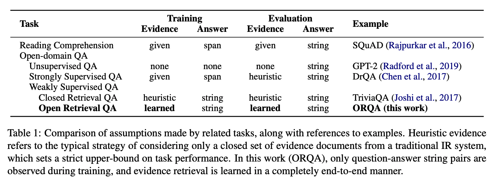
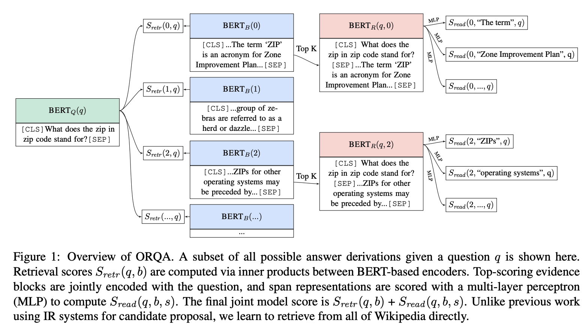
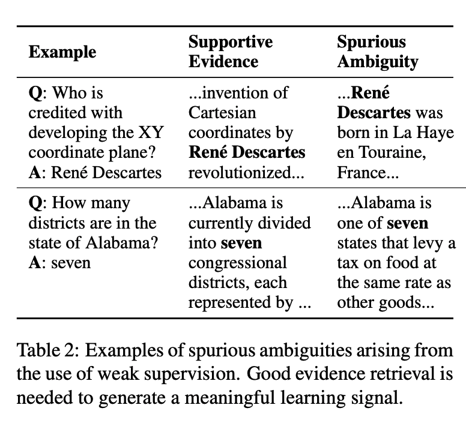
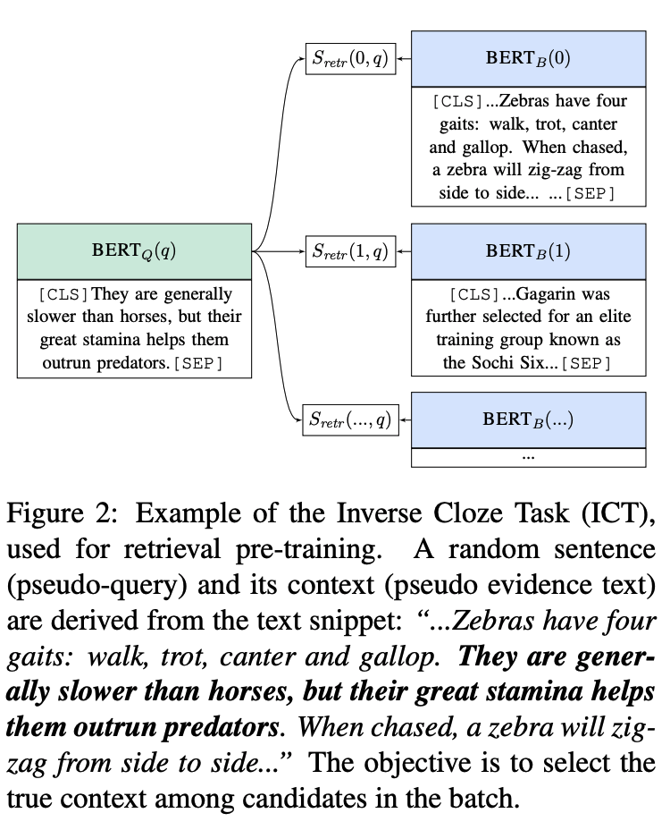

> **Latent Retrieval for Weakly Supervised Open Domain Question Answering**  
Kenton Lee, Ming-Wei Chang, Kristina Toutanova  
https://arxiv.org/abs/1906.00300

# 1. Introduction
MRC의 발전으로 Open-domain question answering(QA)가 관심받고 있는데, 이는 evidence는 input으로 제공되지 않고 open corpus에서 검색되어야 한다.
Open-QA는 실제 응용프로그램에 대해 보다 현실적인 시나리오를 제공한다.

현재 대부분의 접근 방식은 information retrieval(IR)을 통해 evidence candidate를 찾고 이를 통해 gold answer를 생성한다.
대표적으로 DrQA가 있는데 IR system을 사용하여 많은 양의 task를 수행해야 한다.

근본적으로 QA와 IR은 다르다.
IR은 lexical 및 semantic 매칭이 필요한 반면, 사용자들은 명확하게 알려지지 않은 정보를 질문하기 때문에 질문들은 정의가 불충분하고 더 많은 언어 이해를 필요로 한다.
IR system이 recall 상한을 받는 대신, QA data를 이용하여 검색하는 방법을 직접 배워야 한다.

본 논문에서는 Open Retrieval Question Answering(ORQA) System을 제안한다.
ORQA는 open corpus에서 evidence를 검색하는 방법을 배우고 question-answer pair로만 학습이 된다.

본 논문의 핵심은 unsupervised Inverse Cloze Task(ICT)를 통해 retriever를 pre-train하면 end-to-end 학습이 가능하다는 것이다.
ICT에서 sentence는 pseudo-question으로 처리되고 context는 pseudo-evidence로 처리된다.
ICT pre-training은 정답을 marginal log-likelihood로 최적화하여 ORQA를 end-to-end로 fine-tuning할 수 있도록 초기화할 수 있다.

다음과 같은 기존의 QA dataset을 통해 model을 평가한다.
1. SQuAD
2. TriviaQA
3. Natural Questions
4. WebQuestion
5. CuratedTrec

# 2. Overview
2절 에서는 prior work, baseline, 제안하는 model을 비교하는데 유용한 Open-QA 표기법을 설명한다.

## 2.1 Task
Open-QA에서 input $q$는 question string이고 output $a$는 answer string이다.
Reading comprehension과 달리 evidence는 task의 일부가 아닌 model로부터 검색된다.
표1의 reading comprehension 및 question answering의 변형에 의해 만들어진 가정을 비교한다.

## 2.2 Formal Definitions
Model은 evidence text block $B$로 분할되는 unstructured text corpus와 관련하여 정의된다.
답변 도출은 pair $(b,s)$이며 여기서 $1\le b\le B$는 evidence block의 index를 나타내고 $s$는 block $b$의 text span을 나타낸다.
Span의 시작 및 끝의 token index는 각각 $\mathsf{START}(s)$ 및 $\mathsf{END}(s)$로 나타낸다.

Model은 questions $q$에 대한 답변 도출 $(b,s)$를 나타내는 scoring function $S(b,s,q)$를 정의한다.
일반적으로 scoring function은 retrieval component ${ S }_{ retr }\left( b,q \right) $ 맟 reader component ${ S }_{ read }\left( b,s,q \right) $에 대해 decompose된다.
$$
S(b,s,q)={ S }_{ retr }(b,q)+{ S }_{ read }(b,s,q)
$$

Inference동안 model은 가장 높은 score를 가진 answer string을 출력한다.
$$
{ a }^{ * }=TEXT(\underset { b,s }{ argmax } S(b,s,q))
$$

$TEXT(b,s)$는 결정적으로 answer string에 대한 answer derivation $(b,s)$를 mapping한다.
Open-QA system의 주요 task는 scale을 처리하는 것이다.
영어 위키에 대한 실험에서 본 논문은 1,300만 이상의 evidence block $b$를 고려한다.

## 2.3 Existing Pipelined Models
기존의 검색 기반 Open-QA system에서 blackbox IR system은 먼저 closed evidence candidate를 선택한다.
예를 들어 DrQA의 retriever component의 점수는 다음과 같이 정의된다.

$$
{ S }_{ retr }\left( b,q \right) =\begin{cases} 0\quad b\in \mathsf{TOP}\left( k,\mathsf{TF-IDF}\left( q,b \right)  \right)  \\ -\infty \quad \mathsf{otherwise} \end{cases}
$$

DrQA 이후의 연구들은 대부분 TF-IDF를 사용하여 evidence를 찾고 reading comprehension 및 re-reanking을 수행하는 것에 focus를 둔다.
Reading comprehension component ${ S }_{ read }(b,s,q)$는 SQuAD dataset의 gold answer를 통해 학습된다.

위의 연구들과 비슷하게 우리의 접근방식에서 reader는 weak supervision을 통해 학습한다.
모호성은 검색 시스템에 의해 제거되고, cleaned result는 gold derivation으로 처리된다.

# 3. Open-Retrieval Question Answering (ORQA)
Retriever와 reader component가 joint learn되는 end-to-end model을 제안하는데 이를 ORQA(Open-Retrieval Question Answering)model 이라고 한다.
ORQA의 중요한 측면은 표현성이다.
이는 blackbox IR system으로부터 반환된 closed set로 제한되지 않고 open corpus에서 text를 검색할 수 있다.
ORQA의 점수 도출 방식은 그림1에서 확인할 수 있다.

Transfer learning의 최근 발전에 따라 모든 scoring component는 unsupervised language modeling data로 부터 pre-train된 bidirectional transformer인 BERT에서 파생된다.
해당 task에서 relevant abstraction은 다음 function으로 설명할 수 있다.
$$
\mathsf{BERT}({ x }_{ 1 },\left[ { x }_{ 2 } \right] =\left\{ \mathsf{CLS}:{ h }_{ CLS },1:{ h }_{ 1 },2:{ h }_{ 2 },\dots  \right\}
$$

BERT function은 하나 또는 두 개의 string input(${x}_{1}$ 및 선택적으로 ${x}_{2}$)을 argument로 사용한다.
CLS pooling token 또는 input token representation에 해당하는 vector를 반환한다.

**Retriever component:**
Retriever를 학습할 수 있도록 retrieval score를 question $q$와 evidence block $b$의 inner product로 정의한다.  
$$
{ h }_{ q }=\mathbf{{ W }_{ q }{ BERT }_{ Q }}(q)\mathsf{[CLS]}\\ { h }_{ b }=\mathbf{{ W }_{ b }{ BERT }_{ B }}(b)\mathsf{[CLS]}\\ { S }_{ retr }(b,q)={ h }_{ q }^{ \intercal  }{ h }_{ b }
$$

여기서 $\mathbf{{ W }}_{ q }$ 및 $\mathbf{{ W }}_{ b }$는 BERT output을 128 dimension vector로 projection하는 matrix이다.

**Reader component:**
Reader는 BERT에서 제안된 reading comprehension model의 span-based 변형이다.  
$$
{ h }_{ start }=\mathbf{{ BERT }}_{ R }(q,b)[\mathbf{START}(s)]\\ { h }_{ end }=\mathbf{{ BERT }}_{ R }(q,b)[\mathbf{END}(s)]\\ { S }_{ read }(b,s,q)=\mathbf{MLP}\left( \left[ { h }_{ start };{ h }_{ end } \right]  \right)
$$

Lee et al.,(2016)에서 span은 end point의 concatenation이며, 시작 및 종료 interaction을 가능하게 하는 multi-layer perceptron으로 score가 매겨진다.

**Inference & Learning Challenges:**
위에서 설명한 model은 개념적으로 간단하다.
그러나 (1)open dvidence corpus가 거대한 검색 공간을 제공하고(1,300만개가 넘는 evidence block) (2) 공간을 탐색하는 방법이 완전히 잠재되어 있으므로 standard teacher-forcing 접근방식이 적용되지 않아 inference 및 train이 까다롭다.
Latent-variable method는 모호성으로 인해 naive하게 적용하기 어렵다.
예를 들어 표2에 표시된 것처럼 Wikipedia의 많은 구절에는 "seven"이라는 관련이 없는 answer string이 포함된다.

우리는 unsupervised pre-training을 통해 retriever를 신중하게 초기화하여 이러한 문제를 해결한다.
Pre-trained retriever를 사용하면 (1) Wikipedia의 모든 evidence block을 pre-encode하여 fine-tuning중에 동적이지만 빠른 top-k 검색을 수행할 수 있으며 (2) 모호성에서 멀어지게 검색에 편향을 줄 수 있다.

# 4. Inverse Cloze Task
제안된 pre-training procedure의 objective는 retriever가 QA에 대한 evidence retriever와 매우 유사한 unsupervised task를 해결하는 것이다.

직관적으로 useful evidence는 질문의 entity, event, 및 relation에 대해 논의한다.
또한 질문에 없는 추가 정보(답변)가 포함되어 있다.
Question-evidence pair의 unsupervised analog는 sentence-context pair이다.
Sentence에 context는서 의미상으로 관련이 있으며 sentence에서 누락된 정보를 유추하는데 사용될 수 있다.

직관에 따라 본 논문에서는 ICT(Inverse Cloze Task)로 retrieval module을 pre-train할 것을 제안한다.
Standard Cloze task에서 objective는 context를 기반으로 masked-out text를 예측하는 것이다.
대신 ICT는 문장의 역추정을 요구하고 문장의 맥락을 예측한다(그림2).
다음과 같이 Downstream retrieval과 유사한 차별적인 objective를 사용한다.  
$$
{ P }_{ ICT }\left( b|q \right) =\frac { exp\left( { S }_{ retr }\left( b,q \right)  \right)  }{ \sum _{ { b }^{ \prime  }\in BATCH }^{  }{ exp\left( { S }_{ retr }\left( { b }^{ \prime  },q \right)  \right)  }  }
$$

여기서 $q$는 pseudo-question으로 처리되는 임의의 문장이고 $b$는 $q$ 둘러싼 text이며 $BATCH$는 sampled negative로 사용되는 batch의 evidence block 집합이다.

Pseudo-question이 evidence에 없기 때문에 ICT의 중요한 측면은 word matching feature 이상을 학습하는 것이 필요하다.
예를 들어 그림2의 pseudo-question은 "Zebras"를 명시적으로 언급하지 않지만, retriever는 Zebra에 대해 설명하는 context를 선택할 수 있어야 한다.
불특정 언어에서 의미를 유추할 수 있다는 것이 QA를 전통적인 IR과 차별화하는 이유이다.

그러나 retriever가 단어 매칭의 중첩을 수행하는 것을 배우게 하고싶지는 않다.
이는 궁극적으로 검색에 매우 유용한 기능이기 때문이다.
따라서 문장의 문맥에서 90%를 제거하여 model이 필요할 때 추상적인 표현과 사용 가능한 낮은 수준의 word matching feature를 모두 배우도록 권장한다.

ICT pre-training은 두 가지 주요 목표를 달성한다.
1. Pre-train 및 fine-tuning동안 질문 사이의 불일치에도 불구하고, zero-shot evidence retrieval 성능이 latent-variable 학습을 bootstrap하기에 충분할 것으로 기대한다.
2. Pre-trained evidence block과 downstream evidence block간에는 이러한 불일치가 없다. Block encoder ${ BERT }_{ B }\left( b \right) $가 추가적인 학습 없이 잘 작동할 것으로 기대할 수 있다. Downstream data에서는 question encoder만 fine-tuning하면 된다.

다음절에서 볼 수 있듯이, 이 두가지 속성은 계산 가능한 inference 및 end-to-end learning을 가능하게 하는데 중요하다.

# 5. Inference
Fixed block encoder는 이미 유용한 검색 표현을 제공하기 때문에 evidence corpus에서 모든 block encoding을 pre-compute할 수 있다.
결과적으로 fine-tuning중에 많은 evidence block을 다시 encoding할 필요가 없으며 Locality Sensitive Hashing과 같은 도구를 사용하여 pre-compile할 수 있다.

Pre-complie된 index의 경우 inference는 standard beam-search procedure를 따른다.
Top-k evidence block를 검색하고 해당 k block에 대한 reader socre만 계산한다.
Single inference step에서 top-k evidence block을 고려하지만 다음절에서 논의되는 것처럼 weakly supervised QA data에 따라 question encoder가 fine-tuning되므로 이 set는 학습중에 동적으로 변경된다.

# 6. Learning
ICT는 trivial zero-shot retrieval를 제공해야 하기 때문에 학습은 비교적으로 간단하다.
먼저 answer derivation에 대한 분포를 다음과 같이 정의한다.  
$$
P\left( b,s|q \right) =\frac { exp\left( S\left( b,s,q \right)  \right)  }{ \sum _{ b\prime \in TOP\left( K \right)  }^{  }{ \sum _{ s\prime \in b\prime  }^{  }{ exp\left( S\left( b\prime ,s\prime ,q \right)  \right)  }  }  }
$$

$TOP(K)$는 ${S}_{retr}$를 통해 검색된 top $k$ block을 의미한다.
Experiment에서는 $k=5$를 사용한다.
Gold answer string $a$가 주어지면 beam을 통해 marginal log-likelihood를 최적화한다.  
$$
{ L }_{ full }\left( q,a \right) =-log\sum _{ b\in TOP\left( K \right)  }^{  }{ \sum _{ s\in b,a=TEXT\left( s \right)  }^{  }{ P\prime \left( b,s|q \right)  }  }
$$

$a=TEXT\left( s \right)$는 answer string $a$가 정확히 span $s$와 일치하는지 여부를 나타낸다.  
보다 적극적인 학습을 장려하기 위해 초기 update도 포함한다.
여기서 더 많은 evidence blocks $c$를 고려하지만 검색 점수만 update하므로 계산은 저렴하다.  
$$
{ P }_{ early }\left( b|q \right) =\frac { exp\left( { S }_{ retr }\left( b,q \right)  \right)  }{ \sum _{ b\prime \in TOP\left( C \right)  }^{  }{ exp\left( { S }_{ retr }\left( b\prime ,q \right)  \right)  }  } \\ { L }_{ early }\left( q,a \right) =-log\sum _{ b\in TOP\left( C \right) ,a\in TEXT\left( b \right)  }^{  }{ { P }_{ early }\left( b|q \right)  }
$$

$a\in TEXT\left( b \right) $는 answer string $a$가 evidence block $b$에 나타나는지 여부를 나타낸다.
Expereiment에서 $c=5000$을 사용한다.
Final loss에는 두 가지 update가 다음과 같이 포함된다.  
$$
L\left( q,a \right) ={ L }_{ early }\left( q,a \right) +{ L }_{ full }\left( q,a \right)
$$

일치하는 답변이 발견되지 않으면 example이 폐기된다.
무작위 초기화로 거의 모든 사례가 폐기될것으로 예상하겠지만, ICT pre-train으로 인해 실제 사례의 10% 미만을 폐기한다.

앞에서 언급했듯이 evidence block encoder의 parameter를 제외한 모든 parameter를 fine-tuning한다.
Query encoder는 학습 가능하므로 model은 evidence block을 검색하는 방법을 학습할 수 있다.
이 표현력은 blackbox IR system과의 중요한 차이점으로, 더 많은 증거를 검색해야만 recall을 개선할 수 있다.