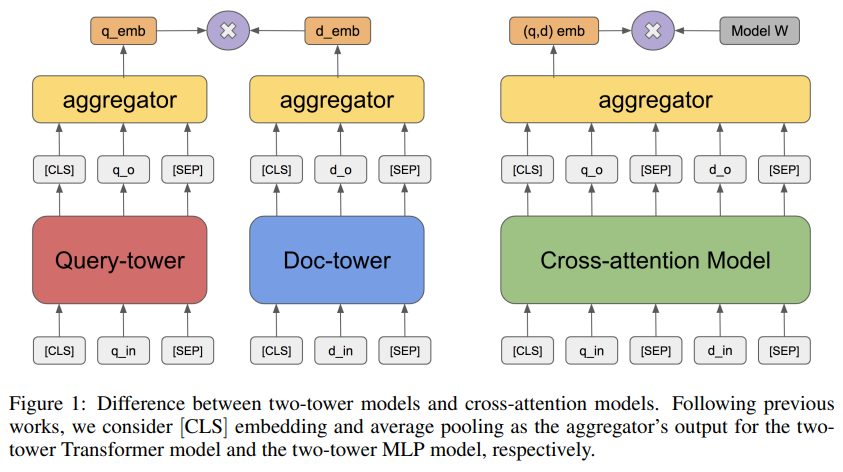
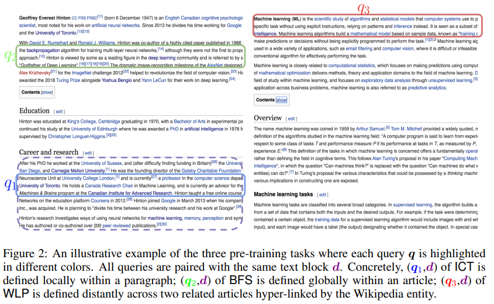
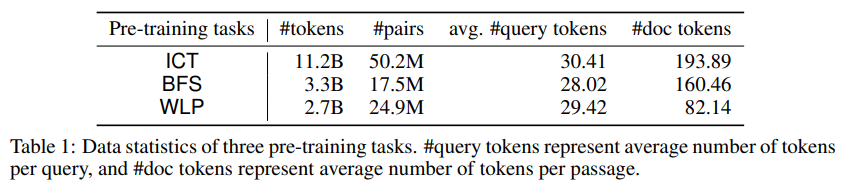
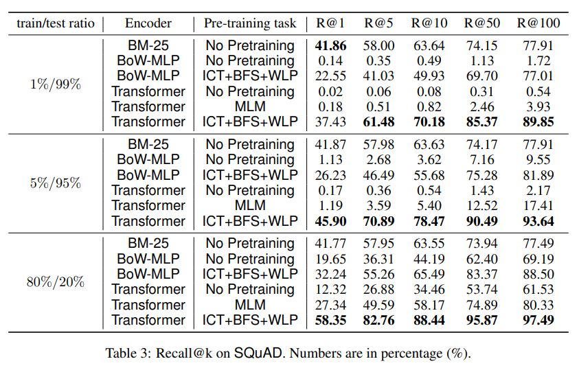
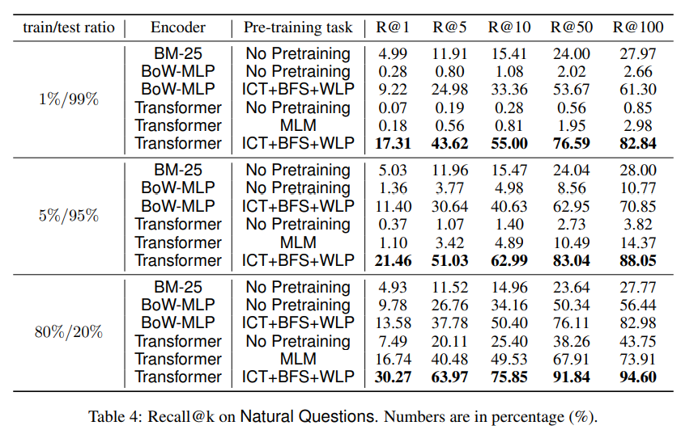
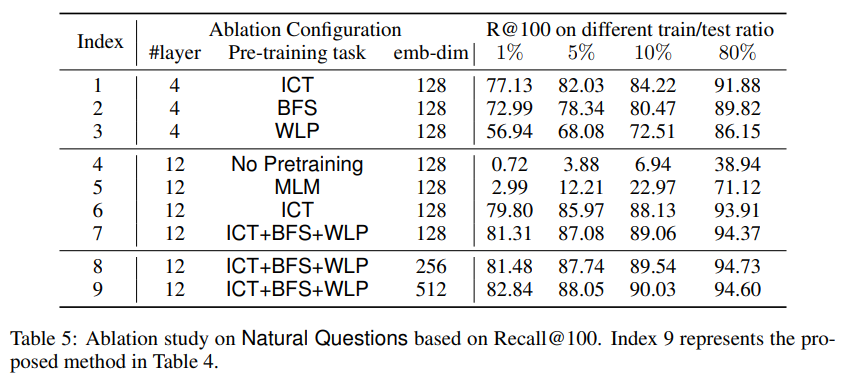
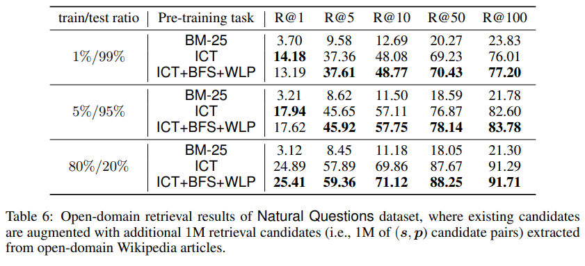

> **Pre-training Tasks for Embedding-based Large-scale Retrieval**  
Wei-Cheng Chang, Felix X. Yu, Yin-Wen Chang, Yiming Yang, Sanjiv Kumar  
https://openreview.net/pdf?id=rkg-mA4FDr

# 1. Introduction
본 논문에서는 large-scale retrieval problem을 고려한다.
Query가 주어지면 크기가 수십만 이상한 corpus에서 가장 관련이 높은 document를 반환한다.
이 문제를 한 쌍의 query와 document $\left( q,d \right) \in \mathcal{X}\times \mathcal{Y}$를 score $f\left( q,d \right) $에 mapping하는 scoring function $f:\mathcal{X}\times \mathcal{Y}\rightarrow \mathbb{R}$ 를 학습하는 것으로 볼 수 있다.  
Query-document retrieval 이외에 다른 application을 이러한 형식으로 적용할 수 있다.
  * Recommendation system: q는 사용자 쿼리, d는 추천할 후보 항목
  * Multi-label classification: q는 웹 페이지 문서, d는 관심있는 카테고리 또는 hashtag
  * Open-domain QA: q는 질문, d는 답변이 포함된 evidence passage

위 항목들의 중점은 scoring function $f$를 설계하는 것이다.
최근 BERT는 XLNet, RoBERTa와 같은 후속연구들과 함께 sentence pair classification, question-answering과 같은 NLP task에 크게 개선하였다.
BERT에서 scoring function $f$는 pre-trained deep bidirectional Transformer model이다.
BERT 스타일의 cross-attention model은 매우 성공적이지만 가능한 모든 document에 대해 $f(q,d)$를 계산하는 것은 computational cost가 매우 비싸기 때문에 large-scale retrieval problem에 직접 적용할 수 없다.  
따라서 일반적으로 덜 강력하지만 효율적인 알고리즘(another scoring function $f$)를 사용하여 solution space를 줄인다음("retrieval phase") BERT style model을 사용하여 검색된 document의 순위를 re-rank한다.("scoring phase")

Retrieval phase가 중요하며 이상적으로 말해 알고리즘은 recall이 높아야한다.
그렇지 않으면 scroing phase에서 많은 관련 document가 고려되지 않는다.  
또한 매우 효율적이여야 한다. 모든 document의 수보다 작은 시간내에 관련 document의 subset를 반환해야 한다.  
Scoring algorithm이 발전하고 있지만 retrieval algorithm은 덜 연구되고 있으며 이것에 본 논문은 초점을 둔다.

검색 알고리즘은 크게 두 가지로 나눌 수 있다.
  1. Classic Information Retrieval(IR)
  2. Embedding-based Model

**1.Classic IR**: BM-25가 일반적으로 사용된다. Scoring function $f$는 TF-IDF token weight를 갖는 2개의 high-dimensional sparse vector간의 token matching에 기초한다.

**2.Embedding-based Model**: query와 document를 동일한 embedding space에 embed하고 inner product 또는 cosine distance를 사용하여 query와 document간의 similarity를 측정. Query embedding model을 $\phi (\cdot )$ document embedding model을 $\phi (\cdot )$라 할때 scoring function은 다음과 같다.
$$
f\left( q,d \right) =\left< \phi \left( q \right) ,\psi \left( d \right)  \right> . (1)
$$

본 논문에서는 query와 document embedding이 두 개의 "tower"에서 나오기 때문에 위의 embedding-based model을 two-tower retrieval model이라고 한다.  
sparse token-based model과 비교할 때 two-tower model은 query와 document내에서 더 깊은 semantic relationship을 capture할 수 있으며 task에 맞게 model을 최적화 할 수 있다.

**Contribute insight**
* 적절한 pre-training 수행한 two-tower transformer model은 BM-25 algorithm보다 훨씬 뛰어남.
* ICT(Inverse Cloze Task), BFS(Body First Selection) 및 WLP(Wiki Link Prediction)와 같은 paragraph-level pre-training은 retrieval quality를 크게 향상시킴.
* Deep transformer encoder로 구성된 two-tower model은 shallow bag-of-word(BoW-MLP)에 비해 paragraph-level pre-training의 이점을 더 많이 제공함

# 2. The two-tower retrieval model
Query $q\in X$와 document $d\in Y$가 주어지면 $X$와 $Y$의 token sequence를 embedding $\phi \left( q \right)$와 $\psi \left( d \right)$에 mapping하는 두개의 encoder $\phi :X\rightarrow \mathbb{{ R} }^{ k }$와 $\psi :Y\rightarrow \mathbb{{ R }}^{ k }$로 구성된 two-tower retrieval model을 정의.  
Scoring function $f:\mathbb{ {R} }^{ k }\times \mathbb{{ R }}^{ k }\rightarrow \mathbb{R}$은 embedding의 inner product로 정의.

**Inference**:
Two-tower model과 cross-attention model의 차이는 그림1과 같다. Two-tower model의 장점은 inference time의 효율성이다.  
Inference step에서 모든 document embedding을 pre-compute할 수 있고 query $q$가 주어지면 query embedding와 inner product를 통해 document의 rank를 지정할 수 있다.  
이는 cross-attention BERT-style model보다 훨씬 효율적이다.
이를 확인하기 위한 BERT-style model의 scoring function은 다음과 같다.  
$$
{ f }_{ \theta ,w }\left( q,d \right) ={ { \psi  }_{ \theta  }\left( q\oplus d \right)  }^{ T }w,\quad (2)
$$

여기서 $\oplus$는 query와 document sequence의 concatenation을 나타내고 $w\in \mathbb{{ R} }^{ k }$는 추가 parameter이다.
BERT에서 각 query에는 모든 document에 대해 값비싼 inference를 수행해야 한다.  
예를들어 128 dimension의 embedding space를 사용하면 백만개의 document embedding과 1000개의 query embedding의 inner-product는 CPU에서 수백 ms가 걸리지만 cross-attention model은 GPU에서 수시간이 걸린다.

또한 MIPS(Maximum Internal Product) algorithm을 사용하여 sublinear time 시간으로 수행할 수 있다.

**Learning**:
기존 IR algorithm과 비교할 때 two-tower model의 이점은 specific task를 위해 학습할 수 있다는 점이다.  
Relevant "positive" query-document pair $\mathcal{T}={ \left\{ \left( { q }_{ i },{ d }_{ i } \right)  \right\}  }_{ i=1 }^{ \left| \mathcal{T} \right|  }$가 있다고 가정한다.  
조건부 확률이 Softmax에 의해 정의되는 log-likelihood ${ max }_{ \theta  }\sum _{ \left( q,d \right) \in T }^{  }{ \log { { p }_{ \theta  } } \left( d|q \right)  } $ 를 maximize하여 model parameter를 estimation한다.  
$$
{ p }_{ \theta  }\left( d|q \right) =\frac { exp\left( { f }_{ \theta  }\left( q,d \right)  \right)  }{ \sum _{ d\prime \in \mathcal{D} }^{  }{ exp\left( { f }_{ \theta  }\left( q,d\prime  \right)  \right)  }  } ,\quad (3)
$$

$\mathcal{D}$는 가능한 모든 document의 집합이다. 실제로 논문에서는 Full-Softmax의 근사값인 Sampled Softmax를 사용한다. $\mathcal{D}$는 batch에서 document의 subset으로 대체되고 partition function의 unbiasedness를 보장하기 위한 correcting term이 있다.

# 3. Pre-training tasks of different semantic granularities
2장에서 언급했듯이 downstream task에서 관린되는 data의 양이 제한되어 있기 때문에 deep retrieval model을 학습하는 중요한 단계는 일련의 pre-train task로 model을 학습하는 것이다.

본 논문에서는 pre-train data가 positive query-document $(q,d)$ pair로 정의된다고 가정한다.
좋은 pre-train task에는 다음과 같은 두 가지 속성이 있어야 한다.
1. Downstream task와 관련이 있어야 한다. 예를 들어, question-answering retrieval problem을 해결할 때 model은 query와 document사이의 서로 다른 의미를 capture해야 한다.
2. pre-train data를 수집하는 것이 비용적으로 효율적이어야 하며 추가로 human supervision이 필요하지 않아야 한다.

위의 요구사항에 비추어 query-document 간 의미의 다른 측면을 강조하는 세 가지 pre-train task인 ICT(Inverse Cloze Task), BFS(Body First Selection) 및 WLP(Wiki Link Prediction)를 제시한다.

**Inverse Cloze Task(ICT):** $n$개의 sentence로 구성된 passage $p=\left\{ { s }_{ 1 },\dots ,{ s }_{ n } \right\} $이고 query $q$는 passage로부터 무작위로 도출된 문장 $q={ s }_{ i },i\sim \left[ 1,n \right] $이며 document $d$는 나머지 문장 $d=\left\{ { s }_{ 1 },\dots ,{ s }_{ i-1 },{ s }_{ i+1 },\dots ,{ s }_{ n } \right\} $이다.  
그림 2의 $({q}_{1}, d)$ 참고

**Body First Selection(BFS):** Local paragraph밖에서 의미론적 관계를 capture하기위해 BFS를 제안.  
여기서 query ${q}_{2}$는 wikipedia page의 첫 번째 section에 있는 임의의 문장이고 document $d$는 같은 페이지의 임의의 passage이다.
Wikipedia의 첫 번째 section은 전체 페이지의 설명 또는 요약이므로 해당 주제의 중심에 정보가 포함될것으로 예상한다.

**Wiki Link Prediction(WLP):** 페이지간 의미 관계를 capture하기위해 WLP를 제안.  
Query ${q}_{3}$은 위키 페이지의 첫 번째 섹션에 있는 임의의 문장이고 document $d$는 ${q}_{3}$의 페이지에 대한 hyper-link가 있는 다른 페이지의 구절이다.  
직관적으로 hyper-link는 두 위키페이지 간의 관계를 나타낸다.

# 4. Experiments
## 4.1 Experimental Setting
**The two-tower retrieval model**: Two-tower model은 BERT-base model의 architecture와 hyper-parameter를 사용.
두 개의 tower embedding은 [CLS] token의 hidden-state에 linear layer를 적용하여 생성한다. 여기서 embedding dimension은 512를 사용한다.  
Query encoder와 document encoder의 sequence length는 각각 64, 288를 사용한다.  
Adam optimizer를 사용하고 lr 1e-4 batch size 8192로 setting하고 100k step을 pre-train.  
Fine-tuning stage에서는 lr 5e-5 WS(warmup-step) 2000 사용.

**Pre-training tasks**: Token-level pre-training task MLM과 3가지 paragraph-level pre-training ICT, BFS 및 WLP를 비교한다.  
ICT, BFS 및 WLP는 Wikipedia corpus에서 생성되며 데이터 통계는 표1과 같다.  
ICT의 경우 $d$는 article title과 passage에 대한 pair로 [SEP] 기호로 구분된다.

**Downstream tasks**: 본 논문에서 고려하는 두 가지 QA dataset는 SQuAD와 Natural Questions이다. QA dataset의 각 항목은 tuple $(q, a, p)$이며 여기서 $q$는 question, $a$는 answer span, $p$는 $a$를 포함하는 evidence passage이다.  
이를 tuple $(q, {s}_{i}, p)$로 변환한다. ${s}_{i}$는 answer span이 포함된 sentence이다.

**Evaluation**: Fine-tuning단계에서 데이터의 training/test split(1%/99%, 5%/95% and, 80%/20%)을 고려하고 학습셋의 10%는 hyper-parameter tuning을 위한 validation-set으로 사용한다.  
Retrieval phase의 목표는 최상위 $k$ 결과에서 결과를 capture하는것이기 때문에 recall@k3에 중점을 둔다. (system이 answer text를 포함하는 paragraph가 아닌 gold sentence와 evidence paragraph pair를 검색할 때를 기준으로 함)

## 4.2 Main Results
  

표3 및 표4는 제안된 pre-training task의 조합을 각각 SQuAD 및 Natural Questions에 대한 다양한 기준으로 비교한다.

**Encoder Architectures**: Transformer를 encoder로 사용하는 것과 얕은 bag-of-word MLP model과 비교한다(BoW-MLP).
BoW-MLP는 embedding table에서 unigram을 lookup하고 arverage pooling으로 embedding을 집계한다.
512 dimension의 query, document embedding을 생성하기 위해 Tanh activation이 있는 two-layer MLP network를 통과시킨다.

Pre-training task를 수행한 Transformer encoder는 BoW-MLP보다 성능이 훨씬 뛰어나며 unsupervised pre-training task에서 더 많은 이점을 얻었다.
한편으로 pre-training task를 수행하지 않은 transformer encoder의 성능이 BoW-MLP encoder보다 나쁘다. 이는 제한된 양의 labeld fine-tuning data에 과적합 때문이라고 본다.

**Pre-training tasks**: 두 dataset 모두에서 token-level pre-training task인 MLM은 No Pre-training에 비해 약간 향상된다. 반대로 paragraph-level pre-training task는 성능이 크게 향상된다.  
이것은 task-related pre-training task가 중요하다는 가정을 확인한다.

## 4.3 Ablation Study

(1) Transformer의 layer 수 (2) 다른 pre-training task (3) embedding space의 dimension에 대해 ablation study를 수행.

## 4.4 Evaluation of Open-domain Retrieval
일반적인 Wikipedia article에서 추출한 large-scale(sentence, evidence passage) pair로 ReQA benchmark 를 보완하여 open-domain retrieval setting을 고려한다.  
DrQA 논문의 open-domain Wikipedia retrieval set를 1M 쌍으로 preprocess/sub-sampling하고 외부 1M candidate pair를 ReQA의 기존 retrieval set에 추가한다.

# 5. Conclusion
다양한 pre-training task가 large-scale retrieval에 어떻게 도움이 되는지에 대한 포괄적인 연구를 수행.
기존의 token-level pre-training task(MLM)를 수행한 model이 대부분의 경우 BM-25보다 우수하지 않음을 보여주었음. ICT,BFS 및 WLP를 통해 paragraph-level pre-training task를 수행한 model은 BM-25 algorithm보다 크게 향상됨을 알 수 있었다.

Future work에서는 pre-training task가 다른 유형의 encoder architecture에 적용되는 방법, Wikipedia이외에 corpora에서 pre-training data를 생성하는 방법 및 pre-training이 다른 유형의 정규화와 비교하는 방법을 연구할 계획이다.
