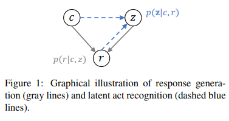
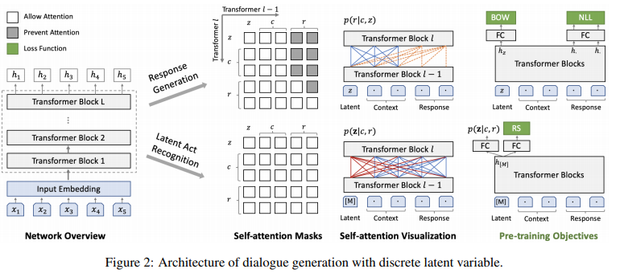
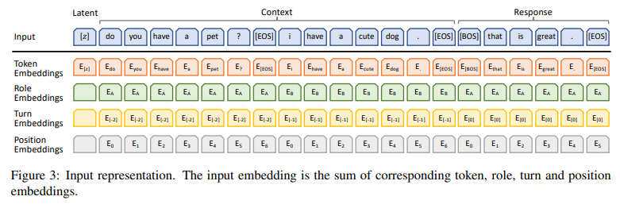
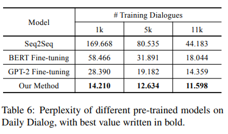

> **PLATO: Pre-trained Dialogue Generation Model with Discrete Latent Variable**  
Siqi Bao, Huang He, Fan Wang, Hua Wu, Haifeng Wang  
https://arxiv.org/abs/1910.07931

# 1. Introduction
Pre-training Fine-tuning paradigm은 dialogue generation과 같은 NLG에 대한 흥미로운 점을 제공.
그러나 related work들은 다음과 같은 세 가지 이유로 BERT를 fine-tuning하는 것에 약간의 문제가 있음을 보여줌
  * 인간 대화의 기본적인 언어 패턴은 일반 text의 언어 패턴과 크게 다를 수 있으므로 knowledge 또는 data distribution이 크게 차이가 난다.
  * uni-directional dialogue generation은 BERT에 적용되는 bi-directional NLG와 뚜렷하게 구별됨.
  * 대부분의 general NLP task들과 달리 dialogue generation에는 one-to-many relationship가 있으며, 여기서 context에는 종종 여러개의 적절한 대답이 있다.  
  
    
    
본 논문에서는 dialogue generation을 위한 pre-training model을 train하는 새로운 방법을 제안.  
1. data distribution을 줄이기 위해 large-scale Reddit, Twitter 대화가 generation model을 pre-traing하는데 많이 사용된다.
2. training mode의 차이를 완화하기위해 unified language modeling(Dong et al.,2019)를 사용.
3. 대화에서 발화간의 one-to-many relationship을 modeling하기 위해 discrete latent variable을 도입.

latent variable의 각 값은 latent speech act로 표시되는 응답의 특정 대화의도에 해당됨.
감정, 키워드, 도메인코드 등을 포함한 명시적 label을 기반으로 제어 가능한 dialogue generation과 구별되는 latent variable은 human annotation에서 제외되며 unsupervised 방법으로 corpus에서 자동으로 배울 수 있음.  

dialogue generation을 위한 model을 pre-train시키기 위해 response generation과 latent act recognition이라는 두가지 task를 도입.
두 task 모두 parameter sharing을 통해 unified network architecture에서 동시에 수행됨.  

context 및 latent variable에 따라 generation task는 target response의 likelihood를 maximize하려고 시도.
동시에 recognition task는 주어진 context와 target response에 따라 latent variable을 estimate하는 것을 목표로 한다.
latent variable에 대한 정확한 estimation은 response generation의 quality를 높이는 핵심요소임.

# 2. Dialogue Generation Pre-training
* Context에 따라 여러가지 적절한 response가 존재하여 다양한 대화 흐름이 가능함.
* one-to-many relationship을 modeling하는 기능은 dialogue generation system에 중요하다는 것이 알려져있다.(Zhao et al.,2017; Chen et al., 2019)
* one-to-many relationship modeling을 위해 discrete latent variable를 transformer block으로 encoding할 것을 제안.
* 여기서 response generation과 latent act recognition의 두 가지 task를 공동으로 수행.

## 2.1 Model Architecture
* 제안하는 model에는 dialogue context $c$, response $r$, latent variable $z$가 있음
    * dialogue context $c$는 몇 가지의 history utterance로 구성되어 있음.(knowledge grounded conversation의 경우 backgroun knowledge를 context에 concat하는 것이 일반적임.(Wolf et al.,2019))
    * response $r$은 주어진 context에 대한 적절한 response의 piece임.
    * latent variable $z$는 K-way categorical variable $z\in [1,K]$이며, 각 value는 response의 특정 latent speech act에 해당.

이러한 요소들 간의 확률적인 관계는 그림1과 같다.  

context $c$가 주어질때 replies에 대해 여러가지 적절한 speech act가 있다.
context와 선택된 하나의 latent speech act에 따라 response는 $p\left( r|c,z \right) $로 generation된다.
한 쌍의 context와 response가 주어지면 latent speech act는 $p\left( z|c,r \right) $로 estimation될 수 있음
따라서 dialogue generation에 대한 pre-train은 **response generation**과 **latent act recognition** 두 가지 task가 포함된다.

그림 2와 같이 두 task의 joint learning을 위한 unified infra를 제안.
infra의 backbone은 bi-directional과 uni-directional를 모두 지원하는 Dong et al.,2019의 transformer block에서 영감을 얻었음.  

해당 backbone은 특정 self-attention mask를 통해 유연하게 decoding한다.
response generation 및 latent act reccognition의 두 가지 task는 모두 shared parameter를 사용.  

context $c$와 특정한 speech act $z$가 주어지면 response generation은 다음과 같이 estimation 할 수 있음.
$$
p\left( r|c,z \right) =\prod _{ t=1 }^{ T }{ p\left( { r }_{ t }|c,z,{ r }_{ <t } \right) ,\quad (1) }
$$
여기서 $T$는 target response $r$의 길이이고 ${ r }_{ <t }$는 이전에 generation된 단어를 나타냄.  
response generation은 uni-directional decoding process이므로 response의 각 token은 그 앞의 token에만 attend함. (그림 2에서 주황색 점선)

latent act recognition의 task는 주어진 context에 대한 $z$에 대응하는 값을 식별하고 train data에서 target response를 식별하는것을 포함.
latent act recognition은 response generation과 network parameter를 공유하지만 bi-directional encoding을 위해 별도의 self-attention mask가 존재.  

그림 2에 표시된 것처럼 special mask symbol$[M]$을 input으로 사용하면 context 및 target response(빨간색 선)에서 정보를 계속 수집함.
이러한 방식으로, target response에 대한 해당 speech act는 $z\sim p\left( \mathbf{z}|c,r \right) $로 인식될 수 있으며, $p\left( \mathbf{z}|c,r \right) $은 discrete latent value에 대한 estimated posterior distribution이다.

## 2.2 Input Representation
multi-turn conversation modeling을 위해 input representation을 더욱 정교하게 만들었다.
network input에는 latent variable, dialogue context, response가 포함되며 input text는 Wordpiece에 의해 tokenization됨
각 token의 input embedding은 token, role, turn, position embedding의 합.  

예시가 그림3에 나와있으며 embedding에 대한 세부설명은 다음과 같다.

* input은 latent variable, dialogue context, response의 concat.
* 각 utterance의 끝에 $[EOS]$ token 추가.
* response의 시작부분에 또 다른 문장 시작 $[BOS]$가 추가되며 마지막 hidden state는 생성중에 다음 token을 예측하는데 사용됨.

z가 하나의 k-way categorical variable인 경우, token embedding ${ E }_{ [z] }$는 latent embedding space ${ E }_{ [z] }\in { \mathbb{R} }^{ K\times D }$로 mapping됨.  

대화에서 evolved된 character를 구별하기 위해 role embedding을 사용.
knowledge grounded conversation의 경우 background를 포함시키는 역할로 ${E}_{C}$를 사용.  

interactive conversation에는 multi-turn utterance가 있으며 turn embedding에서 relative order를 사용.
response에 대한 tuen embedding은 ${ E }_{ \left[ 0 \right]  }$으로 설정되고 마지막 utterance의 turn embedding은 ${ E }_{ \left[ -1 \right]  }$  

position embedding은 각 utterance에서 token position에 따라 추가됨.
latent variable은 role, turn, position embedding 사용안함.

## 2.3 Pre-training Objectives
* dialogue generation pre-training을 위해 세 가지 loss function을 사용
    * negative log-likelihood(NLL)
    * bag-of-words(BOW) loss
    * response selection (RS) loss

### 2.3.1 Response Generation
* 이 모델에서는 latent variable과 context에 따라 response가 생성됨.
* NLL loss를 pre-train에서 사용
$$
{ \mathcal{L}  }_{ NLL }=-{ E }_{ z\sim p\left( z|c,z \right)  }\\ =-{ E }_{ z\sim p\left( z|c,r \right)  }\sum _{ t=1 }^{ T }{ \log { p({ r }_{ t }|c,z,{ r }_{ <t }) }  } \quad (2)
$$

$z$는 probability distribution $p\left( z|c,r \right) $에서 샘플링된 training pair $\left( c,r \right) $의 latent speech act. latent value에 대한 posterior distribution은 latent act recognition을 통해 estimation됨.

$$
p\left( z|c,r \right) =softmax\left( { W }_{ 1 }{ h }_{ \left[ M \right]  }+{ b }_{ 1 } \right) \in { \mathbb{R} }^{ k }
$$

${ h }_{ \left[ M \right]  }\in { R }^{ D }$는 special mask의 final hidden state이고, ${ W }_{ 1 }\in { R }^{ K\times D }$와 ${ b }_{ 1 }\in { R }^{ K }$는 하나의 fully-connected layer의 weight,bias를 나타냄. 기존의 NLL loss 이외에도 bag-of-words loss는 latent discrete variable의 training process를 촉진하기 위해 사용됨.

$$
{ L }_{ BOW }=-{ E }_{ z\sim p(z|c,r) }\sum _{ t=1 }^{ T }{ \log { p\left( { r }_{ t }|c,z \right)  }  } \\ =-{ E }_{ z\sim p\left( z|c,r \right)  }\sum _{ t=1 }^{ T }{ \log { \frac { { e }^{ { f }_{ { r }_{ t } } } }{ \sum _{ v\in V }^{  }{ { e }^{ { f }_{ v } } }  }  }  } \quad (4)
$$

$V$는 전체 vocab을 나타내며 $f$는 non-autoregressive 방식으로 reponse내의 단어를 예측하는 함수.

$$
f=softmax\left( { W }_{ 2 }{ h }_{ z }+{ b }_{ 2 } \right) \in { R }^{ \left| V \right|  }\quad (5)
$$
${h}_{z}$는 latent variable의 final hidden state이며 $\left| V \right| $은 vocab 크기. ${ f }_{ { r }_{ t } }$는 단어 ${ r }_{ t }$의 estimated probability를 나타냄.  
NLL loss와 비교하여 BOW loss는 단어의 순서를 버리고 latent variable이 target response의 global information을 capture하도록 함.

### 2.3.2 Response Selection
response selection은 response가 dialogue context와 관련이 있고 background knowledge와 일치하는지 여부를 구별하는데 도움이 됨.
점수는 dialogue generation중 일관성의 지표로 간주되어 여러 candidate response에서 가장 일관성이 높은 점수를 선택.

response selection은 latent act recognition의 bi-directional encoder network와 함께 수행됨.  
positive training sample은 dialogue context 및 label ${l}_{r}=1$에 대응하는 target response $(c,r)$에서 나옴.
negative sample은 label ${l}_{r-}=0$인 corpus$(c,{r}^{-})$에서 무작위로 response를 선택하여 generation.
response selection의 binari crossentropy loss는 다음과 같이 정의됨.
$$
{\mathcal{ L} }_{ RS }=-\log { p\left( { l }_{ r }=1|c,r \right)  } -\log { p\left( { l }_{ { r }^{ - } }=0|c,{ r }^{ - } \right)  } \quad (6)
$$
special mask의 hidden state가 input으로 fed된 상태에서 fully-connected layer를 통해 probability를 estimation.
$$
p\left( { l }_{ r }=1|c,r \right) =sigmoid\left( { W }_{ 3 }{ h }_{ \left[ M \right]  }+{ b }_{ 3 } \right) \quad (7)
$$

요약하자면, pre-training model의 total objective는 통합 loss를 minimize하는것이다.
$$
\mathcal{L}={ \mathcal{L} }_{ NLL }+{ \mathcal{L} }_{ BOW }+{\mathcal{ L }}_{ RS }\quad (8
$$

## 2.4 Pre-training Procedure
Pre-train model은 12개의 transformer block이 포함되어 있으며 network의 parameter는 BERT-BASE를 통해 init.
large-scale conversation datasets - Twitter, Reddit를 pre-train data로 사용했으며 총 830만개의 train sample이 생성됨.
context 및 target response $(c,r)$의 각 train sample에 대해 latent act recognition 및 response generation task를 수행하기 위해 network를 두 번 통과.
pre-train process는 다음과 같이 요약됨.
1. Latent Act Recognition
   * 한 쌍의 context와 target response가 주어지면, posterior distribution $p\left( z|c,r \right) $을 estimation.
   * ${r}^{-}$를 임의로 선택하고 $\mathcal{{L}}_{RS}$를 계산.
2. Response Generation
   * latent variable $z\sim p\left( z|c,r \right) $를 계산하고, $\mathcal{{L}}_{NLL}$ 및 $\mathcal{{L}}_{BOW}$를 계산.
3. Optimization
   * $\mathcal{L}$을 획득하고 back-propagation을 통해 network parameter를 update.  
   
        
## 2.5 Fine-tuning and Inference
pre-trained model은 chit-chat, knowledge grounded conversation, conversational QA등 다양한 종류의 대화를 지원할 수 있을 정도로 유연하다.
small conversation dataset에 대한 fine-tuning은 식 (8)에 정의된 training objective에 따라 수행할 수 있다.
fine-tuning process가 수렴하면 다음과 같은 inference process를 통해 주어진 context에 대해 response를 얻을 수 있다.
1. Candidate Response Generation
    * 각 latent value $z\in \left[ 1,K \right] $에 따라 candidate response $r$을 generation.
2. Response Selection
    * 각 response의 probability $p\left( { l }_{ r }=1|c,r \right) $를 계산하고 final response로 가장 높은 가진 value를 선택.

fine-tuning 및 inference process는 specific objective없이 dialogue generation을 위해 설정되어있음.  

dialouge에 두 참가자 모두 서로에 대해 더 많은 정보를 제공하는 등 specific objective가 있는 경우 fine-tuning을 통해 RL로 미리 정의된 reward를 극대화 할 수 있음.
이러한 상황에서 latent variable는 RL 내에서 자연스럽게 act로 취급될 수 있으므로, 최대 reward를 제공하는 action을 선택함으로써 response selection을 간단하게 해결할 수 있음.

# 3. Experiments
## 3.1 Settings
### 3.1.1 Dataset
* Persona-chat은 수동으로 주석이 달린 dialogue와 해당 persona profile(background knowledge)을 제공하며, 여기서 두 참가자는 자연스럽게 대화하고 서로를 알아가려고 한다.
* Dailydialog는 일상생활에 대한 고품질 인간 대화를 포함하는 잡담 데이터 셋.
* DSTC7-AVSD에서 시스템은 dialogue context 및 background knowledge에 대한 response를 생성해야함.
* 사용가능한 data는 두 가지
    1. video caption 및 summary에 해당하는 text 정보. (single modal)
    2. text, audio 및 visual feature를 포함. (multi-modal)

# Discussion

* 1k dialogue data만 사용하더라도 높은 성능을 보여줌.
* BERT,GPT-2 비교를 통해 uni-directional model이 dialogue generation에 더 적합하다는 것을 보여줌.
* 우리의 방법은 다음 세가지 측면에서 GPT-2보다 우수한 성능을 얻음.
    1. pre-training은 일반 text와 비교하여 인간 대화에 더 가까운 Reddit, Twitter dataset으로 수행됨.
    2. pre-train process에서 context와 response내에서 bi-directional, uni-diretional 정보를 완전히 활용하기위해 보다 유연한 attention mechanism을 채택.
    3. 저자들의 모델은 discrete latent variable과 one-to-many relationship을 효과적으로 modeling했으며 그 효과는 표2에 나와있다.

