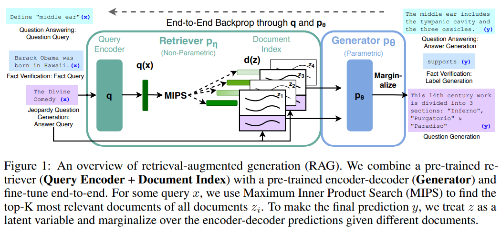

> **Retrieval-Augmented Generation for Knowledge-Intensive NLP Tasks**  
Patrick Lewis, Ethan Perez, Aleksandara Piktus, Fabio Petroni, Vladimir Karpukhin, Naman Goyal, Heinrich Küttler, Mike Lewis, Wen-tau Yih, Tim Rocktäschel, Sebastian Riedel, Douwe Kiela  
https://arxiv.org/abs/2005.11401

# Abstact
Pre-trained language model은 factual knowledge를 매개변수에 저장하고 downstream NLP task에 대해 fine-tuning을 수행할 때 좋은 결과를 얻는것으로 나타났다. 그러나 knowledge에 접근하고 정확하게 조작하는 것은 여전히 제한되어 있으므로 **knowledge-intensive** task에 대해서는 task-specific architecture보다 성능이 떨어진다.  
언어생성을 위해 Pre-trained model과 non-parametric memory를 결합한 Retrieval-Augmented Generation(RAG)를 제안하고 범용적인 fine-tuning 방법에 대해 제안한다. 광범위하고 지식집약적인 NLP task에서 모델을 평가하고 3개의 Open-domain QA Task에서 seq2seq model 및 task-specific retrieve&extract architecture보다 더 우수한 성능을 보여준다.  
Language Generation task의 경우 RAG model이 SotA seq2seq baseline보다 더 구체적이고 다양하며 사실적인 언어를 생성하는것을 보여준다.

# 1. Introduction
Pre-trained language model은 암시적인 지식기반으로서 외부 메모리에 접근하지 않고도 Pre-train 과정을 통해 많은 지식을 배우는것으로 나타났다.
그러나 메모리를 쉽게 확장하거나 수정할 수 없으며 예측에 대한 통찰력을 직접적으로 제공할 수 없는 단점이 있다.  
Parametric memory와 non-Parametric memory를 결합한 model은 지식을 수정하고 확장할 수 있으며 해석할 수 있기때문에 이러한 문제 중 일부를 해결했다.
최근에 제안된 REALM 및 ORQA는 좋은 결과를 보여주었지만 Open-domain extractive QA에 대해서는 성능평가를 하였다.

본 논문에서는 RAG(Retrieval-Augmented Generation)를 제안하며 이는 general-purpose fine-tuning approach를 통해 non-parametric memory를 사용한 pre-trained parametric memory generation model이다.
여기서 parametric memory는 Pre-trained seq2seq transformer이고 non-parametric memory는 pre-trained neural retriever를 사용하는 wikipedia의 dense vector index이다.
이러한 요소들은 end-to-end probabilistic model로 결합한다.

Document retriever는 입력에 따라 latent document를 제공하고 seq2seq model은 latent document와 입력을 통해 출력을 생성한다.
Answer basis 또는 answer token basis를 기준으로 top-k 근사치를 통해 latent variable을 marginalization한다.
T5 및 BART와 마찬가지로 RAG는 seq2seq task에서 fine-tuning되기 때문에 sequence genetor와 retriever가 함께 학습된다.

본 논문에서는 광범위하고 지식 집약적인 task에 대해 RAG를 실험한다.
모든 실험에서 Wikipedia 덤프(18년 12월)를 사용하고 100-word chnunk로 분할하여 총 21,015,324개의 document를 만든다.
DPR document encoder를 사용하여 각 document에 대한 document embedding을 계산하고 (inference:)효율적인 검색을 위해 Hierarchical Navigable Small World approximation를 사용하는 FAISS를 통해 단일 index를 만든다.

# 2. Methods
Input sequence $x$를 사용하여 text passage $z$를 검색하고 target
sequence $y$를 생성하는 RAG model에 대해 살펴본다. 그림1에서 알 수
있듯이 model은 두 가지 component를 황용한다:  
**(i)**: query $x$에(top-k truncated) 대해 distribution을 반환하는
parameter $\eta$를 가진 retriever ${ p }_{ \eta }\left( z|x \right) $  
**(ii)**: previous token ${ y }_{ 1:i-1 }$, original input $x$ 및
retrieved passage $z$의 context를 통해 현재 token을 생성하는 $\theta$로
parameterized된 generator ${ p }_{ \theta }\left( { y }_{ i }|x,z,{ y
}_{ 1:i-1 } \right) $  

Retriever 및 generator를 end-to-end로 학습하기 위해 검색된 document를 latent variable로 취급한다.
본 논문에서는 생성된 텍스트에 대한 분포를 생성하기 위해 latent document에 대해 다른 방식으로 marginalization하는 두 가지 모델을 제안한다.
1. RAG-Sequence: 모델은 동일한 문서를 사용하여 각 target token을 예측
2. RAG-Token: 모델이 다른 문서를 기반으로 각 target token을 예측

## 2.1 Models
* **RAG-Sequence Model**
RAG-Sequence Model은 동일하게 검색된 문서를 사용하여 target sequence를 생성한다.
top-K approximation을 통해 seq2seq probability $p\left( x|y \right) $를 얻기위해 검색된 passage를 marginalized single latent variable로 처리한다.  
$$
{ P }_{ RAG-Sequence }\left( y|x \right) =\sum _{ z\in top-k\left( p\left( \cdot |x \right)  \right)  }^{  }{ { p }_{ \eta  } } \left( z|x \right) \prod _{ i }^{ N }{ { p }_{ \theta  } } \left( { y }_{ i }|x,z,{ y }_{ 1:i-1 } \right) .
$$
* **RAG-Token Model**
RAG-Token Model은 각 target token에 대해 다른 latent passage를 사용한다.
이를 통해 generator는 답변을 생성할 때 여러 document에서 내용을 선택할 수 있다.
$$
{ P }_{ RAG-Token }\left( y|x \right) =\prod _{ i }^{ N }{ \sum _{ z\in top-k\left( p\left( \cdot |x \right)  \right)  }^{  }{ { p }_{ \eta  } } \left( { z }_{ i }|x \right) \prod _{ i }^{ N }{ { p }_{ \theta  } } \left( { y }_{ i }|x,{ z }_{ i },{ y }_{ 1:i-1 } \right) . }
$$

RAG는 target 길이가 1인 sequence로 간주하여 sequence classification task에 사용될 수 있으며, 이 경우 RAG-Sequence 및 RAG-Token은 동일하다.

## 2.2 Retriever: DPR
검색 구성요소 ${ p }_{ \eta  }\left( z|x \right) $는 [DPR](https://arxiv.org/abs/2004.04906)을 기준으로 하며 DPR은 bi-encoder architecture를 따른다.
$$
{ p }_{ \eta  }\left( z|x \right) \propto exp\left< \mathbf{d}\left( z \right) ,\mathbf{q}\left( x \right)  \right>
$$
여기서 $\mathbf{d}\left( z \right)$는 ${BERT}_{BASE}$ transformer에 의해 생성된 document의 dense representation이고 $\mathbf{q}\left( x \right)$는 다른 매개변수를 가진 ${BERT}_{BASE}$ transformer에 의해 생성된 query representation이다.  
가장 높은 prior probability ${ p }_{ \eta  }\left( z|x \right) $를 갖는 k개의 요소 $z$ 의 리스트 $top-k\left( { p }_{ \eta  }\left( \cdot |x \right)  \right) $를 효율적으로 계산하기 위해 FAISS 라이브러리에서 제공하는 MIPS(Maximum Inner Product Search) index를 사용한다.

학습은 TriviaQA, Natural Question를 통해 답변이 포함된 document를 검색하도록 수행.

## 2.3 Generator: BART
Generator 구성요소 ${ p }_{ \theta  }\left( { y }_{ i }|x,z,{ y }_{ 1:i-1 } \right) $는 BART의 encoder, decoder를 사용하여 모델링하며 400M parameter를 가진 BART-large를 사용한다.
BART를 통해 생성할때 input $x$와 검색된 컨텐츠 $z$를 결합하기위해 간단하게 concatenation한다.

## 2.4 Training
검색할 document를 감독하지 않고 Retriever와 Generator를 공동으로 학습한다.
입력/출력 쌍 $\left( { x }_{ j },{ y }_{ j } \right) $가 주어지면 Adam을 통해 $\sum _{ j }^{  }{ -log p\left( { y }_{ j }|{ x }_{ j } \right)  } $를 minimize한다.
학습중 document encoder를 업데이트하면 docmuent indexing을 정기적으로 업데이트 해야하므로 비용이 많이 소모된다. 그래서 query encoder와 generator를 fine-tuning하고 document encoder를 고정상태로 유지한다.

## 2.5 Decoding
Test 및 decoding 단계에서 RAG-sequence와 RAG-token은 ${ argmax }_{ y }p\left( y|x \right) .$를 근사하는 다른 방법을 필요로 한다.

**RAG-Token**  
RAG-Token Model은 transition probability를 가진 auto-regressive seq2seq
generator로 볼 수 있다.  
$$ { p }_{ \theta }^{ \prime }\left( { y }_{ i }|x,{ y }_{ 1:i-1 }
\right) =\sum _{ z\in top-k\left( p\left( \cdot |x \right) \right) }^{
}{ { p }_{ \eta } } \left( { z }_{ i }|x \right) { p }_{ \theta }\left(
{ y }_{ i }|x,{ z }_{ i },{ y }_{ 1:i-1 } \right) $$

Decoding 단계에서 ${ p }_{ \theta  }^{ \prime  }\left( { y }_{ i }|x,{ y }_{ 1:i-1 } \right) $를 standard beam decoder를 사용하여 구할 수 있다.

**RAG-Sequence**  
각 candidate codument $z$에 대해 beam search를 사용하여 ${ p }_{ \theta
}\left( { y }_{ i }|x,z,{ y }_{ 1:i-1 } \right) $에 대해 각 hypothesis를
scoring한다. 모든 beam에 대한 hypothesis $y$의 확률을 추정하기 위해 $y$
beam에 나타나지 않는 각 document $z$에 대해 추가 forward pass를 수행하고
generator score에 ${ p }_{ \eta }\left( z|x \right) $를 곱하여
margninal에 대한 beam 사이의 확률을 합한다. ("Thorough Decoding")

더 긴 sequence의 경우 효율적인 디코딩을 위해 $x,{ z }_{ i }$로 부터 beam search동안 $y$가 생성되지 않은 ${ p }_{ \theta  }\left( y|x,{z}_{i}\right) \approx 0$에 대한 근사값을 더 만들 수 있다.
이것은 candidate set $Y$가 생성된 후 추가적인 forward pass를 수행하지 않아도 된다.("Fast Decoding")

