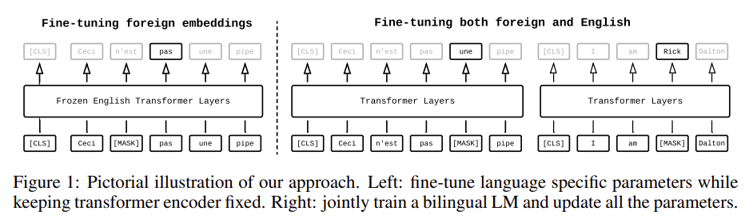
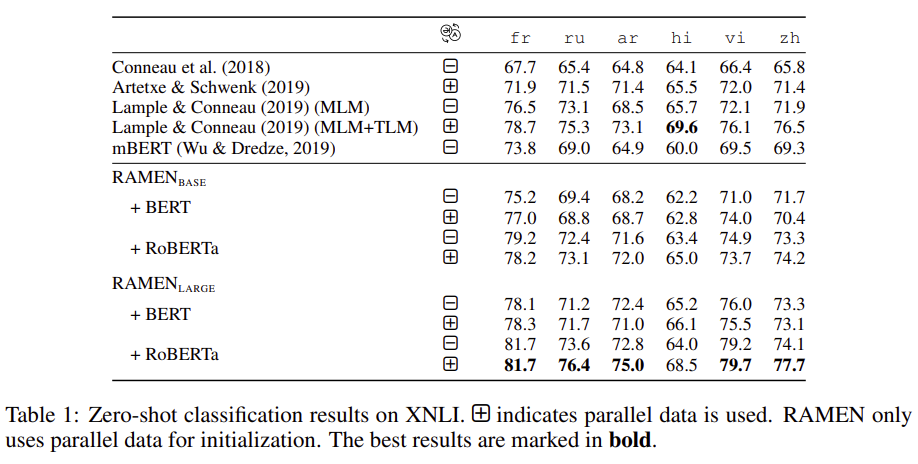
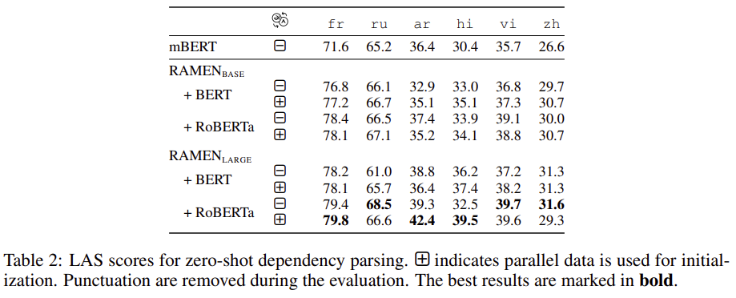
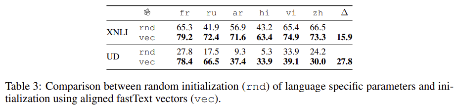
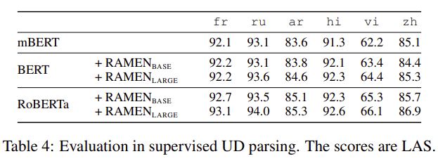
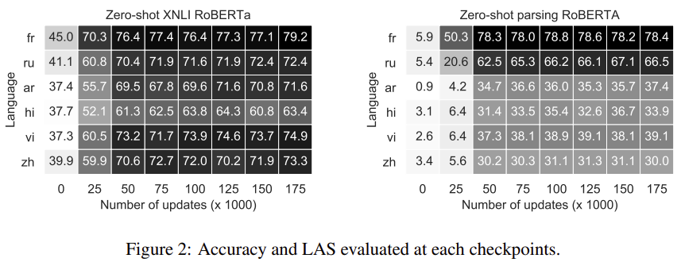

> From English To Foreign Languages: Transferring Pre-trained Language Models  
Ke Tran  
https://arxiv.org/abs/2002.07306

# Abstract
Multilingual pre-trained model을 사용하면 NLP task를 resource가 많은 언어에서 resource가 적은 언어로 zero-shot transfer를 할 수 있다.
그러나 pre-trained model을 개선하기 위한 연구는 영어에 중점을 두고 있다.
다른 언어에 대해 neural architecture를 처음부터 학습할 수 있지만 많은 computing resource가 필요하다.
본 논문에서는 limited computational budget으로 기존의 pre-trained model을 영어에서 다른 언어로 transfer하는 문제를 해결한다.

Single GPU를 사용하여 하루만에 BERT-BASE model을 얻을 수 있고 이틀안에 BERT-LARGE를 얻을 수 있다.
또한 6개 언어로 model을 평가하면 NLI 및 dependency parsing 두 가지 zero-shot task에서 model이 multilingual BERT보다 낫다는 것을 알 수 있다.

# 1. Introduction
Pre-trained model은 많은 NLP downstream task에서 인상적인 결과로 인해 많은 관심을 받았다.
또한 multilingual pre-train model을 사용하면 zero-shot cross-lingual transfer를 통해 다른 언어에 대한 많은 NLP application을 가능하게 한다.
Wu & Dredze(2019)는 5개의 NLP task(NLI, document classification, NER, POS tagging, dependency parsing)에서 여러 언어에 대한 multilingual BERT를 zero-shot transfer하여 잠재력을 보여줬다.

Multilingual model은 여러 언어로 언어 기술을 향상시키는데 중요한 요소지만 최근 연구는 영어에 중점을 두고 있다.
현재까지 3가지 multilingual pre-train model이 있다.
1. 104개 언어를 지원하는 multilingualBERT(mBERT)
2. 100개 언어를 지원하는 Cross-lingual language model(XLM)
3. 93개 언어를 지원하는 Agnostic SEntence Representations(LASER)

세 가지 접근방식 중 LASER는 neural machine translation을 기반으로 하며 학습을 위해 parallel data가 엄격하게 요구된다.

"Multilingual model은 항상 처음부터 학습되어야 하는가?"
"영어 pre-train model에서 배운 linguistic knowledge를 다른 언어로 옮길 수 있는가?"  
본 논문에서는 기존의 pre-trained model을 energy efficient 방식으로 영어에서 다른 언어로 빠르게 transfer하는 기술을 개발한다.
첫 단계로 영어와 대상 언어의 bilingual language model을 만드는것에 중점을 둔다.
Pre-trained english LM에서 시작하여 pre-trained english LM의 encoder layer를 고정한 상태로 유지하면서 target language specific parameters(i.e., word embeddings)를 학습한다.
그런 다음 영어와 target model을 모두 fine-tuning하여 bilingual LM을 얻는다.
Masked language model objective로 language model을 auto-encoding하는 방법을 적용하고 zero-shot transfer에서 제안된 방법의 장점을 보여준다.

본 논문에서 contribution은 다음과 같다.
* Tesla V100 16GB GPU 하나를 사용하여 하루에 영어와 대상 언어의 bilingual BERT-BASE를 얻기 위한 fast adaptation 방법을 제안.
* 두 가지 zero-shot cross-lingual transfer task(NLI, dependency parsing)에 대해 6개 언어의 성능을 평가. Model이 경쟁력 있는 성능을 제공하거나 mBERT보다 우수하다는 것을 보여줌.
* Bilingual LM이 supervised dependency parsing task에서 뛰어난 feature extractor역할을 할 수 있음을 보여줌.

# 2. Bilingual Pre-trained LMs
Pre-trained language model의 backgound에 대한 설명.
$E_{ e }$는 word-embedding이고 $\Psi \left( \theta  \right) $는 parameters $\theta$를 갖는 Transformer encoder 이다.
${ e }_{{ w }_{ i } }$는 word ${w}_{i}$의 embedding을 나타낸다. ($i.e.,\  { e }_{ { w }_{ i } }={ E }_{ e }\left[ { w }_{ 1 } \right] $)
명확성을 위해 positional embedding 및 bias를 생략한다.  
Pre-trained LM은 일반적으로 다음 계산을 수행한다.
1. input token을 contextualized representation으로 변환. $\left[ { c }_{ { w }_{ 1 } },\dots ,{ c }_{ { w }_{ n } } \right] =\Psi \left( { e }_{ { w }_{ 1 } },\dots ,{ e }_{ { w }_{ n } };\theta  \right) $
2. ${i}^{th}$번째 position $p\left( { y }_{ i }|{ c }_{ { w }_{ i } } \right) \propto exp\left( { c }_{ { w }_{ i } }^{ \intercal  },{ e }_{ { y }_{ i } } \right)$에서 output word ${y}_{i}$를 예측.

Autoencoding LM은 일부 input token을 special token [MASK]로 바꿔서 손상시킨다.
그런 다음 corrupted token에서 original token ${y}_{i}={w}_{i}$를 예측한다.
Autoregressive LM은 previous token들을 통해 next token$({y}_{i}={w}_{i+1})$을 예측한다.

English pre-trained LM이 주어지면 limit computational resource budget하에서 영어에 대한 bilingual LM과 주어진 target language $f$를 학습하고자 한다.
Bilingual language LM을 빠르게 만들기 위해 english pre-trained model을 target model에 adaptation한다.  
우리의 접근방식은 세 단계로 구성된다.
1. Target word와 이에 상응하는 영어 단어의 embedding이 서로 가깝도록 embedding space에서 target language word-embedding ${ E }_{ f }$ 를 초기화한다.(2.1절)
2. Target embedding과 English encoder $\Psi \left( \theta  \right)$에서 target LM을 만든다. 그런 다음 $\Psi \left( \theta  \right) $를 고정하고 target embedding을 fine-tuning한다.
3. 마지막으로 ${E}_{e}$, ${E}_{f}$ 및 $\Psi \left( \theta  \right)$ 의 bilingual LM을 구성하고 모든 parameter를 fine-tuning한다.

그림 1은 접근방식의 마지막 두 단계를 보여준다.

## 2.1 Initializing Target Embeddings
초기 외국어 word embedding ${ E }_{ f }\in \mathbb{{ R }}^{ \left| { V }_{ f } \right| \times d }$를 학습하는 우리의 접근방식은 trained english word embedding ${ E }_{ e }\in \mathbb{{ R }}^{ \left| { V }_{ e } \right| \times d }$를 ${E}_{f}$에 mapping하여 외국어 단어와 영어 단어가 의미가 비슷하면 embedding도 유사하다는 것이다.  
Gu et al.,(2018)에서 universal lexical sharing의 아이디어를 차용하여 영어 단어 embedding ${ E }_{ e }\left[ j \right] \in \mathbb{{ R }}^{ d }$의 linear combination으로 각 외국어 embedding ${ E }_{ f }\left[ i \right] \in \mathbb{{ R }}^{ d }$를 나타낸다.  
$$
{ E }_{ f }\left[ i \right] =\sum _{ j=1 }^{ \left| { V }_{ e } \right|  }{ { a }_{ ij } } { E }_{ e }\left[ j \right] ={ a }_{ i }{ E }_{ e }\quad (1)
$$
여기서 ${ a }_{ i }\in { R }^{ \left| { V }_{ e } \right|  }$는 sparse vector이고 $\sum _{ j }^{ \left| { V }_{ e } \right|  }{ { a }_{ ij } } =1$이다.

외국어 embedding을 초기화하는 단계에서 $a$를 잘 estimation하면 외국어 model을 tuning할 때 수렴 속도를 높이고 zero-shot transfer를 가능하게 할 수 있다.(5절)
다음과 같은 두 가지 시나리오에서 ${ a }_{ i }{ \forall  }_{ i }\in \left\{ 1,2,\dots ,\left| { V }_{ f } \right|  \right\} $를 추정하는 방법에 대해 설명한다.
1. 영어와 외국어의 parallel data.
2. 영어 및 외국어 monolingual data.

**Learning from Parallel Corpus:**  
영어-외국어 corpus가 주어졌을때, fast-align과 같은 toolkit을 사용하여 모든 (English-foreign) pair $\left( e,f \right) $에 대한 word translation probability $p\left( e|f \right) $를 추정할 수 있다.
다음과 같이 assign한다.
$$
{ a }_{ ij }=p\left( { e }_{ j }|{ f }_{ i } \right) \quad (2)
$$
${ a }_{ i }$는 word alignment에서 추정되므로 sparse vector이다.

**Learning from Monolingual Corpus:**  
Low resource language의 경우 parallel data를 사용하지 못할 수 있다.
이 경우에는 monolingual data(e.g., wikipedias)에만 의존한다.
두 언어의 word embedding으로 word translation probability를 추정한다.
이러한 언어의 word vector는 fastText(Bojanowski et al., 2017)를 사용하여 학습한 다음 영어와 shared space에 align된다.
Contextualized representation learning과 달리 word vector learning은 빠르고 computational resource가 저렴하다.  
외국어 aligned vector ${ \bar { E }  }_{ f }$와 영어 ${ \bar { E }  }_{ e }$가 주어지면 word translation matrix $A\in \mathbb{{ R }}^{ \left| { V }_{ f } \right| \times \left| { V }_{ e } \right|  }$로써 다음과 같다.  
$$
A=sparsemax\left( { \bar { E }  }_{ f }{ \bar { E }  }_{ e }^{ \intercal  } \right) \quad (3)
$$
여기서는 softmax대신 sparsemax를 사용한다.
Sparsemax는 sparse version의 softmax이며 주어진 외국어와 유사한 영어 단어를 제외하고 영어 vocab에서 대부분의 단어에 확률을 0으로 만든다.
이러한 속성은 외국어 embedding을 더 잘 초기화하기 때문에 우리의 접근 방식에서 바람직하다.

## 2.2 Fine-tuning Target Embeddings
외국어 word embedding을 초기화 한 후 english pre-trained LM의 영어 word embedding을 외국어 word embedding으로 대체하여 외국어 LM을 얻는다.
그런 다음 monolingual data에서 외국어 word embedding만 fine-tuning한다.
Training objective는 english pre-trainedLM의 training objective와 동일하다.
Trained encoder $\Psi(\theta)$는 association을 capture하는데 우수하기 때문에, 이 단계의 목적은 target LM이 association task를 위해 trained encoder를 이용할 수 있도록 target embedding을 추가로 optimization 하는것이다.

## 2.3 Fine-tuning Bilingual LM
Foreign language specific parameter를 pre-trained english LM에 plug하여 bilingual LM을 만든다.(그림 1)
새로운 model에는 영어와 외국어를 위한 두 개의 separate embedding layer 및 output layer가 있다.
Encoder layer는 공유됨.
그런 다음 영어 및 외국어 monolingual data를 사용하여 이 model을 fine-tuning한다.
여기서는 영어로 학습한 내용을 잊지 않고 zero-shot transfer에 결과 model을 사용할 수 있도록 model을 영어로 계속 tuning한다.
이 단계에서 encoder parameter는 target language의 syntactic aspect(i.e., word order, morphological agreement)을 배울 수 있도록 update된다.

# 3. Zero-shot Experiments
BERT-BASE, BERT-LARGE, RoBERTa-BASE, RoBERTa-LARGE pre-train model을 사용하여 RAMEN이라는 bilingual LM을 구축한다.
BERT-BASE를 사용하여 mBERT model과 성능을 비교할 수 있고 BERT-LARGE와 RoBERTa를 사용하여 target LM의 성능이 source LM의 성능과 관련이 있는지 여부를 조사할 수 있다.
우리는 두 가지 언어간 zero-shot task에서 model을 평가한다.
1. Cross-lingual NLI(XNLI)
2. Dependency parsing

## 3.1 Data
프랑스어, 러시아어, 아랍어, 중국어, 힌디어 및 베트남어 6가지 target language에 대한 접근방식을 평가한다.  
Parallel data를 사용하여 foreign specific parameter를 초기화하는 경우 Lample & Conneau (2019)의 task와 동일한 dataset을 사용한다.  
Monolingual data를 사용하여 foreign parameter를 초기화하는 경우 fastText에서 pre-train word vector를 사용하여 word translation probability를 estimation한다. (식3)
Orthogonal Procrustes(Artetxe et al., 2016; Lample et al., 2018b; Joulin et al., 2018)를 사용하여 이러한 vector를 common space에 align한다.

Pre-trained model에서 제공된 tokenizer를 사용하여 영어를 tokenization한다. target language의 경우 BERT 및 RoBERTa에서 fastBPE를 사용하여 각각 30,000개 및 50,000개의 code를 학습한다.
Source model에서 영어 vocab size와 일치하도록 외국어 BPE 어휘를 일치시킨다.
정확하게 외국 vocab size는 BERT에서 transfer 할때 32,000 RoBERTa 에서는 50,000으로 설정된다.

Classification task에서는 XNLI dataset을 사용하고 parsing task에서는 Universal Dependencies v2.4를 사용한다.

**Remark on BPE:**
Lample et al.,(2018a)에 따르면 언어간 subword를 공유하면 embedding space사이의 alignment가 향상된다.
Wu & Dredze(2019)는 겹치는 subword의 백분율과 mBERT의 언아간 zero-shot transfer 성능간의 강한 correlation을 관찰한다.
그러나 현재 접근방식에서 source와 target간의 subword는 공유되지 않는다. 영어와 외국어에 모두 포함된 subword는 두 가지 다른 embedding이 존재한다.

## 3.2 Estimating translation probabilities
Pre-trained model은 subword level에서 작동하므로 subword translation probability를 estimation해야한다.
따라서 각 parallel corpus에서 2M sentence pair를 subsampling하고 fast-align을 실행하기 전에 data를 subword로 tokenization한다.

aligned word vector로부터 subword translation probability를 estimation하려면 fastText의 제공된 vector가 subword level이 아니기 때문에 추가 처리 단계가 필요하다.
다음과 같은 근사법을 사용하여 subword vector를 얻는다: subword $s$의 vector ${e}_{s}$는 subword로 $s$를 갖는 모든 aligned word vector ${ e }_{ { w }_{ i } }$의 weighted average이다.  
$$
{ e }_{ s }=\sum _{ { w }_{ j }:s\in { w }_{ j } }^{  }{ \frac { p\left( { w }_{ j } \right)  }{ { n }_{ s } }  } { e }_{ { w }_{ j } }\quad (4)
$$

여기서 $p\left( { w }_{ j } \right)$는 word ${w}_{j}$의 unigram probability이고 ${ n }_{ s }=\sum _{ { w }_{ j }:s\in { w }_{ j } }^{  }{ p\left( { w }_{ j } \right)  } $이다.
각각의 aligned word vector에서 상위 50,000단어를 가져와 subword vector를 계산한다.

두 경우 모두 외국어 단어와 모든 단어가 영어 word embedding에서 초기화 될 수 있는것은 아니다. 이러한 단어는 Gaussian $\mathcal{N}\left( 0,\frac { 1 }{ { d }^{ 2 } }  \right) $에서 임의로 초기화 된다.

## 3.3 Hyper-parameters
RAMEN-BASE는 175k step RAMEN-LARGE는 275k step을 진행하며 처음 25,000 step은 language specific parameter를 위한것이다.
Mini-batch의 균형을 잡는 이 전략은 multilingual neural machine translation(Firat et al., 2016; Lee et al., 2017)에서 사용되었다.

Learning rate 1e-4, fast weight updates $k=5$, interpolation parameter $\alpha=0.5$로 Adam을 wrap하는 Lookahead optimizer를 사용.
Adam optimizer의 경우 처음 4000 step에서 learning rate를 1e-7에서 1e-4로 linear하게 증가시킨다음 inverse square root decay를 따른다.

XNLI 및 UD에서 RAMEN을 fine-tuning할때 32의 mini-batchsize, lr 1e-5를 사용.
Epoch은 XNLI 및 UD task에 대해 각각 4, 50으로 설정.

# 4. Results
## 4.1 Cross-lingual Natural Language Inference
XNLI testset 정확도는 표1과 같다.
결과를 discuss하기전에 이 실험에서 가장 공정한 비교는 mBERT와 RAMEN-BASE+BERT간의 단일 언어로만 비교한것이다.

먼저 BERT의 transfer result에 대해 discuss한다.
fastText vector에서 초기화된 RAMEN-BASE는 mBERT보다 평균 1.9포인트 약간 뛰어나고 아랍어에서 3.3포인트 뛰어나다.
RAMEN-BASE는 parallel data에서 초기화할때 평균 0.8 포인트를 추가로 얻는다.
BERT-LARGE는 BERT-BASE보다 뛰어났을뿐 아니라 외국어에 adaptation할때도 강점이 있었다.

RAMAN-BASE+RoBERTa는 RAMEN-BASE+BERT보다 평균 2.9 및 2.3 포인트 뛰어났다.

## 4.2 Universal Dependency Parsing
표2는 zero-shot dependency parsing을 위한 Labeled Attachment Score(LAS)를 나타낸다.
먼저 mBERT와 1개 언어로 초기화된 RAMEN-BASE+BERT를 비교한다. 후자는 아랍어를 제외한 5개 언어에서 전자보다 우수하다.
RAMEN+RoBERTa는 유사한 architecture(12 layer 및 24 layer) 및 초기화를 통해 대부분의 언어에서 RAMEN+BERT보다 성능이 우수하다.

# 5. Analysis
## 5.1 Impact of initialization
외부 embedding을 초기화흐는 것이 본 논문 접근방식의 backbone이다.
초기화가 양호하면 zero-shot transfer result가 향상되고 fast adaptation이 가능하다.
Good initialization의 중요성을 확인하기 위해 외부 word embedding이 있는 RAMEN-BASE+RoBERTa를 $\mathcal{N}\left( 0,\frac { 1 }{ { d }^{ 2 } }  \right) $에서 무작위로 초기과한다.  
표3은 랜덤 초기화의 XNLI 및 UD task의 결과를 보여준다.
Aligned fastText vector를 사용한 초기화와 비교하여 랜덤 초기화는 RAMEN-BASE의 zero-shot 성능을 XNLI의 경우 15.9%, UD의 경우 27.8포인트 줄인다.
또한 SOV language(Arabic and Hindi)의 zero-shot parsing에서 랜덤 초기화가 수행된다.

## 5.2 Are Contextual representations from RAMEN also good for supversived parsing?
모든 RAMEN model은 영어로 제작되었으며 zero-shot cross-lingual task를 위해 영어로 조정되었다.
실험에서 보여준 것처럼 이러한 task에서 RAMEN이 잘 작동할것으로 기대하는 것이 합리적이다.
그러나 supervised task에 대해 좋은 feature extractor인가?
UD dataset에 대한 supervised dependency parsing을 위한 model을 평가함으로써 질문에 대한 부분적인 답변을 제공한다.

RAMEN-based parser를 학습하고 평가하기 위해 UD에 제공된 train/dev/test split을 사용.
표4에는 supervised parser의 결과(LAS)가 요약되어 있다.
공정한 비교를 위해 mBERT를 기준으로 선택하고 모든 RAMEN model은 aligned fastText vector에서 초기화된다.
전반적으로 결과는 RAMEN의 contextual representation을 supervised task에 사용할 수 있음을 나타낸다.

## 5.3 How does linguistic knowledge transfer happen through each training stages?
각 교육단계에서 word embedding(0k update)초기화, fine-tuning target embedding(25K), 영어 및 target language 모두에서 model fine-tuning(at each 25K updates)의 성능을 평가한다.

Language similarity는 semantic보다 syntax에 더 많은 영향을 미친다.
영어 encoder를 tuning하지 않으면 프랑스어는 영어와 밀접한 관련이 있기 때문에 50.3의 결과인 반면 SOV language는 SVO encoder를 사용하여 4.2 및 6.4 포인트에 도달한다.
중국어는 SVO 순서를 가지고 head-final이지만 영어는 head-inital인것으로 간주된다.
아마도 이것이 중국어의 성능 저하를 설명하는것 같다.
