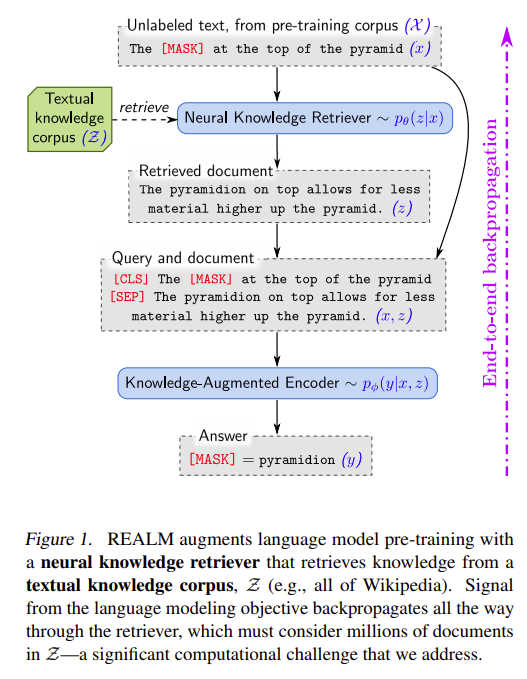
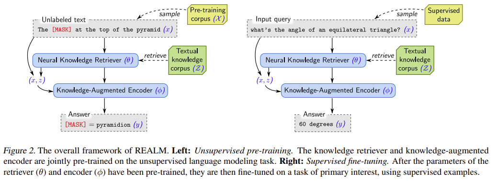
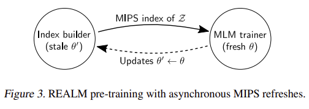
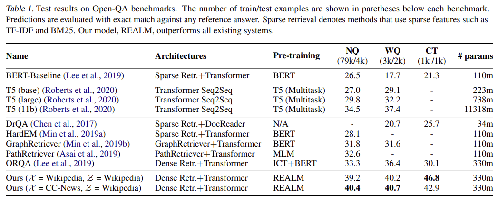
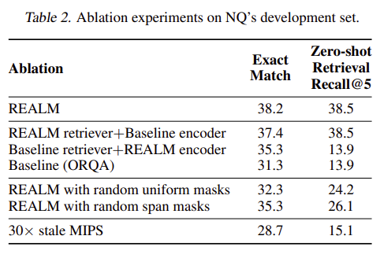
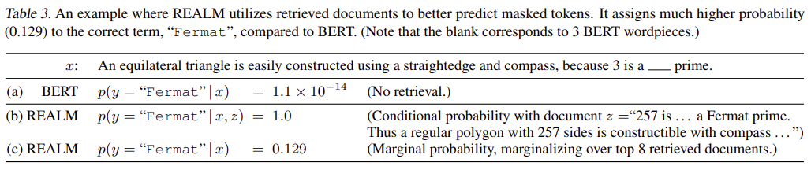
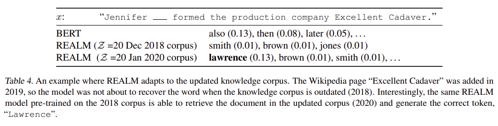

> **REALM: Retrieval-Augmented Language Model Pre-Training**  
Kelvin Guu, Kenton Lee, Zora Tung, Panupong Pasupat, Ming-Wei Chang  
https://kentonl.com/pub/gltpc.2020.pdf

# Abstract
Language model pre-training은 QA와 같은 NLP task에 많은 양의 world knowledge를 포착하는 것으로 나타났다.
그러나 이 knowledge는 neural network의 parameter에 암시적으로 저장되므로 더 큰 network가 더 많은 fact를 cover 해야한다.

보다 모듈적이고 해석 가능한 방식으로 knowledge를 capture하기위해 latent knowledge retriever를 사용하여 language model pre-train을 보강한다.
이를 통해 model은 pre-train, fine-tuning 및 inference 중에 사용되는 wikipedia와 같은 large corpus로부터 document를 검색하고 관찰할 수 있게 해준다.
Masked language model을 사용하고 수백만 document를 고려하는 retrieval 단계를 통해 knowledge retriever를 unsupervised 방식으로 pre-train하는 방법을 처음으로 보여준다.

Open-QA(Open-Domain Question Answering)의 까다로운 task를 fine-tuning하여 RetrievalAugmented Language Model pre-training(REALM)의 효과를 보여준다.
우리는 3가지 인기있는 Open-QA benchmark에서 명시적 및 암시적인 knowledge 저장을 위한 SotA model과 비교하여 이전의 모든 방법을 상당한 차이(4-16% 정확도)로 능가하는 동시에 interpretability 및 modularity 등의 이득을 제공하는 것을 발견한다.

# 1. Introduction
Language model pre-training의 최근 발전에 따르면 BERT, RoBERTa 및 T5 와 같은 model에는 놀라운 world knowledge가 저장되어 있다.
이러한 world knowledge는 massive text corpora로 부터 학습에 의해 획득하였다.
예시로 BERT는 다음 문장에서 누락된 단어를 올바르게 예측할 수 있다: *"The ___ is the currency of the United Kingdom"(answer: "pound").*

이러한 language model에서 학습된 world knowledge는 neural network의 parameter에 ***암시적***으로 저장된다.
이로 인해 network에 어떤 knowledge이 저장되어 있고 어디에 있는지 판단하기가 어렵다.
또한 storage space는 network의 크기에 따라 제한된다.
더 많은 world knowledge를 capture하려면 더 큰 network를 학습해야 하므로 속도가 느리거나 계산량이 비쌀 수 있다.

보다 해석가능하고 모듈 방식의 knowledge를 capture하기위해 학습된 textual knowledge retriever를 통해 language model pre-train을 보강하는 새로운 framework인 REALM(Retrieval-Augmented Language Model)을 제안한다.
Parameter에 knowledge를 저장하는 model과 달리 이 방법은 inference중에 어떤 knowledge를 검색하고 사용할지 결정하도록 model에 요청하여 world knowledge의 역할을 ***명시적***으로 노출한다.
Prediction을 수행하기 전에 language model은 retriever를 사용하여 wikipedia와 같은 large corpus에서 document를 검색한 다음 해당 문서를 탐색하여 prediction을 알려준다.
이 model을 end-to-end로 학습하려면 그림1과 같이 전체 textual knowledge를 고려하는 검색 단계를 통해 backpropagation이 필요하다.

REALM의 key intuition은 unsupervised text의 performance-based signal을 사용하여 retriever를 학습시키는 것이다. Language model의 perplexity를 개선하는 검색은 도움이 되고 보상되어야 하며 정보가 없는 검색은 penalty를 받는다. 예를 들어 그림1 에서 model이 "the ___ at the top of the pyramid"의 빈칸을 채워야하는 경우, retriever는 "The pyramidion on top allows for less material higher up the pyramid."라는 document를 선택하면 보상을 받는다.
우리는 예측 가능한 검색 방법을 latent variable language model로 modeling하고 marginal likelihood를 최적화하여 학습한다.

Pre-train동안 large-scale neural retrieval module을 통합하는것은 retriever가 각 pre-train step마다 수백만개의 후보 문서를 고려해야하고, 그 결정을 통해 backpropagate해야하기 때문에 계산상의 문제가 된다.
이를 해결하기 위해 각 document에 대해 수행된 계산을 caching하고 비동기적으로 업데이트 할 수 있도록 retriever를 구성하여 최상의 document 선택을 MIPS(Maximum Inner Product Search)로 공식화 할 수 있다.

# 2. Background
**Language model pre-training:**  
Language model pre-training의 목표는 일반적으로 unlabeled text corpora에서 유용한 language representation을 배우는 것이다.
결과적으로 pre-trained model은 primary interest(in our case, OpenQA)의 downstream task에 대해 추가로 학습(미세조정)될 수 있으며 종종 처음부터 학습보다 더 나은 일반화를 유도한다.

대중화된 masked language model(MLM) 변형에 중점을 둔다.
기본 형식으로 MLM은 input text에서 누락된 token을 예측하도록 학습한다.
Unlabeled pre-training corpus $\mathcal {X}$가 주어지면 sampled piece of text(e.g., $x="the\  [MASK]\  is\  the\  currency\  [MASK]\  the\  UK";\  y=\left( "pound","of" \right) $)에서 token을 무작위로 masking하여 training example $(x, y)$를 만들 수 있다. Model은 masked input $x$의 representation을 사용하여 각 mask에 들어가는 token을 예측한다. 좋은 MLM은 구문 및 의미 정보(e.g., to predict "of")를 ecndoing하고 world knowledge(e.g., to predict "pount")를 학습해야 한다.

**Open-Domain question answering (Open-QA):**  
World knowledge를 통합하는 model의 성능을 측정하려면 world knowledge에 중요한 downstream task가 필요하다.
NLP에서 가장 knowledge-intensive인 task중 하나는 Open-QA이다.
Open-QA의 "open"은 model이 SQuAD와 같은 기존의 독해 이해(RC:Reading Comprehension)task와 달리 답변을 포함하는 context를 받지 않는다는 것이다.
RC model은 single document를 이해하지만 Open-QA model은 수백만 개의 document에 대한 지식을 유지해야 한다.

본 논문에서는 textual knowledge corpus $\mathcal {Z}$를 knowledge source로 사용하는 Open-QA system에 중점을 둔다.
이러한 system중 다수는 검색 기반 접근방식을 사용한다.
질문 $x$가 주어지면 corpus $\mathcal {Z}$에서 관련 document $z$를 검색한 다음 document에서 정답을 추출한다.
우리의 접근방식인 REALM은 이 패러다임에서 영감을 얻어 이를 language model pre-train으로 확장한다.
대안으로 최근 일부 연구는 $x$에 seq2seq model을 사용하여 token-by-token으로 $y$를 generation하는 system을 제안했다.
우리는 experiment에서 두 패러다임의 SotA system과 비교할것이다.

# 3. Approach
REALM의 pre-training 및 fine-tuning task를 3.1절의 retrieve-then-predict generative process로 공식화는 것으로 부터 시작한다.
이후 3.2절에서 해당 process의 각 component에 대한 model architecture에 대해 설명한다.
3.3절에서는 REALM의 generative process의 likelihood를 maximizing하여 REALM pre-training 및 fine-tuning을 구현하는 방법을 보여준다. 도중 중요한 computational challenge를 해결하고 학습이 작동하는 이유를 설명하고, inductive biases를 주입하기 위한 전략을 논의한다.
전체 framework가 그림2에 나와있다.

## 3.1 REALM's generative process
Pre-train 및 Fine-tune에 대해 REALM은 일부 input $x$를 사용하여 가능한 output $y$에 대한 distribution $p\left( y|x \right) $를 학습한다.
Pre-train의 경우 task는 masked language modeling이다.
$x$는 일부 token이 masking된 pre-training corpus $\mathcal {X}$의 문장이며 model은 누락된 token의 value $y$를 예측해야 한다.
Fine-tuning의 경우 task는 Open-QA이다.
여기서 $x$는 질문 $y$는 답변이 된다.

REALM은 $p\left( y|x \right) $를 검색, 예측 두 단계로 분해한다.
Input $x$가 주어지면 먼저 knowledge corpus $\mathcal {Z}$에서 유용한 document $z$를 검색한다.
이것을 distribution  $p\left( z|x \right) $의 sample로 modeling한다.
이후 검색된 $z$와 original input $x$를 모두 condition으로 하여  $p\left( y|z,x \right) $로 modeling된 output $y$를 생성한다.
$y$를 생성할 수 있는 overall likelihood를 얻기 위해 $z$를 latent variable로 취급하고 가능한 모든 document $z$에 대해 marginalize한다.
$$
p\left( y|x \right) =\sum _{ z\in \mathcal{Z} }^{  }{ p\left( y|z,x \right) p\left( z|x \right)  } .\quad (1)
$$

## 3.2 Model Architecture
이제 두 가지 주요 component인 $p\left( z|x \right) $를 modeling하는 **neural knowledge retriever**과 $p\left( y|z,x \right) $를 modeling하는 **knowledge-augmented encoder**를 설명한다.

**Knowledge Retriever:**  
Retriever는 dense inner product model을 사용하여 다음과 같이 정의 된다.  
$$
p\left( z|x \right) =\frac { exp \ f\left( x,z \right)  }{ \sum _{ z\prime  }^{  }{ exp \ f\left( x,{ z }^{ \prime  } \right)  }  } ,\\ f\left( x,z \right) =\mathsf{{ Embed }}_\mathsf{{ input }}{ \left( x \right)  }^{ \intercal  } \mathsf{{ Embed }}_\mathsf{{ doc }}\left( z \right) ,
$$

여기서 $\mathsf{{ Embed }}_\mathsf{{ input }}$과 $\mathsf{{ Embed }}_\mathsf{{ doc }}$은 $x$와 $z$를 각각 $d$ 차원 vector에 mapping하는 embedding 함수이다.
$x$와 $z$사이의 relevance socre $f\left( x,z \right) $는 vector embedding의 inner product로 정의된다.
retrieval distribution은 모든 relevance score에 대한 softmax 이다.

BERT style transformer를 사용하여 embedding function을 구현한다.
Wordpiece tokenization을 적용, [CLS] token을 접두어로 붙이고, [SEP] token으로 segment 분리 및 input 마지막에 추가한다.
$$
\mathsf{{ join }_{ BERT }}\left( x \right) =\mathsf{[CLS]}x\mathsf{[SEP]}\\ \mathsf{{ join }_{ BERT }}\left( { x }_{ 1 },{ x }_{ 2 } \right) =\mathsf{[CLS]}{ x }_{ 1 }\mathsf{[SEP]}{ x }_{ 2 }\mathsf{[SEP]}
$$

Devlin et al.,(2018)과 같이 이것을 각 token에 대해 하나의 vector를 생성하는 Transformer에 feed 한다.
여기에는 "pooled" representation으 사용되는 $\mathsf{[CLS]}$에 해당하는 vector가 포함된다.
마지막으로, projection matrix $\mathbf{W}$로 표시되는 vector의 차원을 주링기 위해 linear projection을 수행한다.

$$
\mathsf{{ Embed }_{ input }}\left( x \right) =\mathbf{{ W }}_\mathsf{{ input }} \mathsf{{ BERT }_{ CLS }}\left( \mathsf{{ join }_{ BERT }}\left( x \right)  \right) \\ \mathsf{{ Embed }_{ doc }}\left( z \right) =\mathbf{{ W }}_\mathsf{{ doc }}\mathsf{{ BERT }_{ CLS }}\left( \mathsf{{ join }_{ BERT }}\left( { z }_\mathsf{{ title }},{ z }_\mathsf{{ body }} \right)  \right)
$$

여기서 $ { z }_\mathsf{{ title }}$은 문서 제목이고 ${ z }_\mathsf{{ body }}$는 본문을 뜻한다.
$\theta$는 transformer와 projection matrix를 포함하여 retriever와 관련된 모든 parameter를 나타낸다.

**Knowledge-Augmented Encoder**
Input $x$와 검색된 문서 $z$가 주어지면 augmented encoder는 $p\left( y|z,x \right) $로 정의된다.
$x$와 $z$를 하나의 sequence로 결합하여 Transformer에 feed 한다.(retriever에서 사용하는 것과 구별됨)
이를 통해 $y$를 예측하기 전에 $x$와 $z$간에 풍부한 cross-attention을 수행할 수 있다.
구체적인 예는 그림1을 참고.

이 단계에서 pre-train 및 fine-tune을 위한 architecture는 약간 다르다.
Masked language model pre-training task의 경우 $x$에서 각 [MASK] token 원래 값을 예측해야 한다.\mathsf{{ Embed }_{ doc }}\left( z \right)
그렇게 하기 위해 Devlin et al.,(2018)과 같은 MLM loss를 사용한다.
$$
p\left( y|z,x \right) =\prod _{ j=1 }^{ { J }_{ x } }{ p\left( { y }_{ j }|z,x \right)  } \\ p\left( { y }_{ j }|z,x \right) \propto exp\left( { w }_{ j }^{ \intercal  }\mathsf{{ BERT }_{ MASK}}\left( j \right)  \left( \mathsf{{ join }_{ BERT }}\left( x,{ z }_\mathsf{{ body }} \right)  \right)  \right)
$$

여기서 $\mathsf{ BERT }_{ MASK}\left( j \right)$는 $j$번째 masking된 token에 해당하는 transformer output vector를 나타낸다.
${ J }_{ x }$는 $x$의 [MASK] token 수이며 ${w}_{j}$는 token ${y}_{j}$에 대해 학습된 word embedding 이다.

Open-QA fine-tuning을 위해 answer string $y$를 생성하려고 한다.
이전의 RC work(Rajpurkar et al., 2016; Seo et al., 2016; Lee et al., 2016; Clark & Gardner, 2017)에 따라 정답 $y$가 일부 문서 $z$에서 연속적인 token sequence로 발견될 수 있다고 가정한다.
$S\left( z,y \right) $를 $z$에서 $y와 일치하는 span matching으로 설정한다.
그런 다음 $p\left( y|z,x \right) $를 다음과 같이 정의할 수 있다.

$$
p\left( y|z,x \right) \propto \sum _{ s\in S\left( z,y \right)  }^{  }{ \mathsf{exp}\left( \mathsf{MLP}\left( \left[ { h }_{ \mathsf{START}\left( s \right)  };{ h }_{ \mathsf{END}\left( s \right)  } \right]  \right)  \right)  } \\ { h }_{ \mathsf{START}\left( s \right)  }=\mathsf{{ BERT }_{ START}}\left( s \right)  \left( \mathsf{{ join }_{ BERT }}\left( x,{ z }_\mathsf{{ body }} \right)  \right) ,\\ { h }_\mathsf{{ END}\left( s \right)  }=\mathsf{{ BERT }_{ END}}\left( s \right)  \left( \mathsf{{ join }_{ BERT }}\left( x,{ z }_\mathsf{{ body }} \right)  \right),
$$

여기서 $\mathsf{{ BERT }_{START}}\left( s \right)$ 및 $\mathsf{{ BERT }_{ END}}\left( s \right)$는 각각 span의 시작 및 종료 token에 해당하는 transformer output vector를 나타내고 $\mathsf{MLP}$는 feed-forward neural network를 나타낸다.
우리는 $\phi $가 knowledge-augmented encoding과 관련된 모든 parameter를 나타내도록 할 것이다.

## 3. Training
Pre-training 및 fine-tuning에 대해 올바른 output $y$의 log-likelihood $\log { p\left( y|x \right)  } $를 maximizing하여 학습한다.
Knowledge retriver와 knowledge-augmented encoder는 다른 neural network 이므로 model parameter $\theta$ 및 $\phi$에 대해 $\log { p\left( y|x \right)  }$의 gradient를 계산하고 stochastic gradient sescent를 사용하여 최적화 할 수 있다. Key computational challenge는 marginal probability $p\left( y|x \right) =\sum _{ z\in Z }^{  }{ p\left( y|x,z \right) p\left( z|x \right)  } $ 가 knowledge corpus $\mathsf{Z}$의 모든 document $z$에 대한 합계를 포함한다는 것이다. 대신 $p\left( z|x \right) $에 따라 확률이 가장 높은 상위 $k$개의 document를 합하므로써 이것을 근사하게 된다.

이러한 근사치에도 불구하고 여전히 효율적인 상위 $k$개의 document를 찾는 방법이 필요하다.
$p\left( z|x \right) $에서 document의 순서는 inner product인 relevance score $f\left( x,z \right) =\mathsf{{ Embed }_{ input }}{ \left( x \right)  }^{ \intercal  }\mathsf{{ Embed }_{ doc }}\left( z \right) $에서와 동일하다.
따라서 MIPS(Maximum Inner Product Search)알고리즘을 사용하여 document 수에 따라 선형적으로 확장되는 실행시간 및 저장공간을 사용하여 상위 $k$개의 document를 찾을 수 있다. (Ram & Gray, 2012; Shrivastava & Li, 2014; Shen et al., 2015)

MIPS를 사용하려면 모든 ${ z\in Z }$에 대해 $\mathsf{{ Embed }_{ doc }}\left( z \right)$를 pre-compute하고 이러한 embedding에 대해 효율적인 search index를 구성해야 한다.
그러나 $\mathsf{{ Embed }_{ doc }}$의 parameter $\theta$가 나중에 update되면 이 data structure는 $p\left( z|x \right) $와 일치하지 않는다.
따라서 모든 gradient update 이후 search index가 "stale" 된다.

본 논문의 해결책은 수백번의 train step마다 모든 document를 비동기적으로 re-embedding 및 re-indexing하여 index를 "refresh" 하는것이다.
MIPS index는 refresh 이전에 stale 하지만 상위 $k$ document를 선택하는데만 사용된다.
상위 $k$개의 document를 검색한 후 $p\left( z|x \right) $와 gradient를 새로운 $\theta$ 를 사용하여 다시 계산한다.
4.5절에서 refresh가 빈번하게 발생하는 경우 이 절차를 통해 stable optimization이 이루어짐을 경험적으로 입증한다.

**Implementing asynchronous MIPS refresh:**
두 가지 task를 동시에 수행하여 MIPS index를 비동기적으로 refresh 한다.
Parameter에 대해 gradient update를 수행하는 primary trainer job 및 document를 embedding하고 index를 생성하는 secondary index builder job 으로 구성된다.
그림 3에 표시된 것처럼 trainer는 index builder에 해당 parameter ${\theta}^{\prime} $의 snapshot을 보낸다.
그런 다음 trainer는 계속 학습하고 index builder는 ${\theta}^{\prime} $를 사용하여 background에서 new index를 구성한다.
Index builder가 완료되고 new index를 trainer에서 다시 보낸다음 process가 반복된다.  

비동기식 refresh는 pre-train 및 fine-tune 모두에 사용될 수 있지만 실험에서는 pre-train에만 사용한다.
Fine-tuning에서 간단함 및 $\mathsf{{ Embed }_{ doc }}$를 update 하지 않기 위해 MIPS index를 한번만(pre-train된 $\theta$를 사용하여) 구축한다.
$\mathsf{{ Embed }_{ input }}$은 fine-tuning을 수행하므로 검색 기능은 query측면에서 여전히 update가 된다.

**What does the retriever learn?:**
REALM에 대한 knowledge retrieval이 잠재되어 있기 때문에 training objective가 어떻게 의미있는 검색을 돕는지 분명하지 않다.
여기에서는 prediction accuracy를 향상시키는 검색에 대한 보상 방법을 보여준다.

주어진 query $x$ 및 document $z$에 대해 $f\left( x,z \right)$는 knowledge retriver가 document $z$에 할당하는 "relevance score"임을 상기한다.
REALM pre-train 동안 knowledge retriever의 parameter $\theta$에 대한 gradient를 분석하여 gradient descent 한 단계가 점수를 어떻게 변화시키는지 알 수 있다.
$$
\triangledown \log { p\left( y|x \right)  } =\sum _{ z\in Z }^{  }{ r\left( z \right) \triangledown f\left( x,z \right)  } \\ r\left( z \right) =\left[ \frac { p\left( y|z,x \right)  }{ p\left( y|x \right)  } -1 \right] p\left( z|x \right) .
$$

각 문서 $z$에 대해 gradient는 retriever가 score $f\left( x,z \right)$를 $r\left( z \right)$ 만큼 변경하도록 한다.
$r\left( z \right)$가 양수이면 증가하고 음수이면 감소.
$r\left( z \right)$는 $p\left( y|z,x \right) >p\left( y|x \right)$ 인 경우에만 양수이다.
$p\left( y|x \right)$는 $p\left( z|x \right)$에서 document를 random sampling할 때 $p\left( y|z,x \right)$의 기대값이다.
따라서 document $z$는 기대보다 성능이 좋을 때마다 positive하게 update를 받는다.

## 3.4 Injecting inductive biases into pre-training
REALM을 개발하는 과정에서 아래 설명된 의미있는 검색으로 model을 개선시키는 몇 가지 추가 전략을 발견했다.

**Salient span masking:**
REALM을 pre-training 하는 동안 masked token을 예측하기 위해 world knowledge이 필요한 예제 $x$에 중점을 두고 싶다. 2절에서 설명한 것처럼 일부 MLM span에는 local context만 필요하다. World knowledge가 필요한 문제에 초점을 맞치기 위해 "영국" 또는 "1969년 7월"과 같은 뚜렷한 span을 숨긴다. CoNLL-2003 data에 대해 학습된 BERT based tagger를 사용하여 named-entity를 식별하고 날짜를 식별하는 정규식을 사용한다.
Masked language modeling task를 위한 문장 내에서 이러한 span중 하나를 선택하고 masking 한다.
4.5절에서 이것이 다른 masking strategy보다 훨씬 뛰어나다는 것을 보여준다.

**Null document:**
salient span masking을 사용하더라도 모든 masked token을 예측하기 위해 world knowledge를 필요로 하는것은 아니다.
검색이 필요하지 않을 때 일관성 있는 sink에 적절한 credit을 할당할 수 있도록 검색된 상위 $k$ 문서에 empty null document ∅를 추가하여 이를 수정한다.

**Prohibiting trivial retrievals:**
Pre-train corpus $\mathcal{X}$와 knowledge corpus $\mathcal{Z}$가 동일하면 지나치게 유익한 검색 후보  $z$가 존재한다: masking 된 문장 $x$가 document $z$로 부터 온 경우, knowledge augmented encoder는 masking 되지 않은 $x$ in $z$를 간단하게 예측할 수 있다.
이것은 $p\left( z|x \right)$에 대해 큰 값의 gradient를 초래한다.
이 문제가 너무 자주 발생하면 knowledge retriever는 $x$와 $z$사이의 정확한 문자열 일치를 찾기 위해 학습을 하게 되므로 다른 형태의 relevance는 capture하지 못한다.
이러한 이유로, pre-train중에 trivial candidate를 배제한다.

**Initialization:**
학습을 시작할 때 $\mathsf{{ Embed }_{ input }}\left( x \right) $ 및 $\mathsf{{ Embed }_{ doc }}\left( z \right) $에 대한 embedding이 없으면 검색된 문서 $z$는 $x$와 관련이 없을 것이다.
이로 인해 knowledge augmented encoder가 검색된 문서를 무시하는 법을 배우게 된다.
이 문제가 발생하면 knowledge retriever는 의미있는 gradient를 받지 않고 개선할 수 없으므로 악순환이 된다.
이러한 cold start 문제를 피하기 위해 ICT(Inverse Cloze Task)라는 간단한 training objective를 사용하여 $\mathsf{{ Embed }_{ input }} $ 및 $\mathsf{{ Embed }_{ doc }} $를 warm-start 한다.
여기서 문장이 주어지면 model이 해당 문장이 나온 document를 검색하도록 학습된다.
자세한 내용은 [Lee et al.,(2019)](https://arxiv.org/abs/1906.00300)를 참고.

# 4. Experiments
## 4.1 Open-QA Benchmarks
Open-QA에 대한 여러 benchmark가 제안되었다.
본 논문에서는 질문 작성자가 아직 답을 알지 못한 dataset에 중점을 둔다.
이를 통해 보다 현실적인 information-seeking need를 반영하는 질문이 나오고 질문이 특정 답변을 염두하여 작성될 때 발생할 수 있는 문제를 피할 수 있다.

## 4.2 Approaches compared
**Retrieval-based Open-QA:**
대부분의 Open-QA system은 먼저 knowledge corpus에서 관련있는 document를 검색한 다음 MRC system을 사용하여 document에서 답변을 추출한다.
이 패러다임에서 knowledge는 corpus에 명시적으로 저장된다.
검색을 구현하기 위한 여러가지 방법을 비교.

많은 접근법은 sparse bag-of-words matching와 같은 학습되지 않은 휴리스틱 검색을 사용하거나 관련 document의 small set을 선택하기 위해 질문에 entity linking를 사용한다.
이러한 문제는 일반적으로 학습된 model을 사용하여 rerank되지만 초기 휴리스틱 검색 단계에 따라 적용 범위가 제한될 수 있다.
표1의 DrQA, HardEM, GraphRetriever, PathRetriever가 위와 같은 접근법이다.

최근 일부 접근법은 MIPS index를 사용하여 학습 가능한 검색을 구현하도록 제안되었다. ORQA는 REALM과 유사한 latent variable model을 사용하여 Open-QA를 공식화하고 marginal likelihood를 maximizing하여 학습한다.
그러나 REALM은 새로운 language model pre-training 단계를 추가하고 고정 index를 사용하지 않고 MIPS index를 backpropagation한다.
REALM pre-training 및 ORQA의 retriever는 3.4절에 설명된 ICT를 사용하여 초기화된다.

**Generation-based Open-QA:**
Open-QA에 대한 새로운 대안은 질문을 sequence prediction task로 modeling 하는것이다.
질문을 간단히 encoding한 다음 이를 기반으로 token별로 답변을 decoding 한다.
GPT-2는 model에 대량의 knowledge를 주입할 수 있는 방법이 처음에는 불분명 했지만 sequence-to-sequence를 통해 주어진 context를 사용하지 않고 직접 답변을 생성하는것에 대한 가능성을 암시했다.
그러나 fine-tuning이 없기 때문에 성능면에서 경쟁력이 없었다.
T5는 주어진 context에서 명시적으로 추출하지 않고 직접 답변을 생성하는 것이 실행 가능한 접근법이지만, context document가 제공되는 MRC에서만 실험을 하였다.

가장 경쟁력 있고 비교 가능한 baseline을 위해 T5를 fine-tuning하는 연구와 비교한다.(Roberts et al., 2020) https://tinyurl.com/t5-openqa-colab

## 4.3 Implementation Details
**Fine-tuning:**
우리는 Lee et al.(2019)와 같은 hyper-parameter를 재사용 한다.
Knowledge corpus는 2018년 12월20일 영어 wikipedia를 사용.
Document는 greedy하게 288개의 BERT wordpiece로 나누어져 1300만 건이 넘는 검색 후보가 된다.
Fine-tuning 중 상위 5개 후보를 고려하고 12GB GPU가 있는 single machine에서 model을 실행할 수 있다.

**Pre-training:**
BERT의 default optimizer를 사용하여 batch size가 512이고 learning rate를 3e-5로 설정하여 64개의 Google Cloud TPU에서 200k step을 pre-train.
MIPS index의 document embedding step은 16개의 TPU에서 병렬화 된다. 각 예에서 null document ∅를 포함하여 8개가 넘는 후보 document를 검색하고 marginalize한다.

Pre-training corpus $\mathcal{X}$의 두 가지 선택을 실험한다.
1. Knowledge corpus $\mathcal{Z}$와 동일한 wikipedia
2. En news corpus CC-News

## 4.4 Main results
표1은 세 가지 Open-QA dataset에 대한 다양한 접근 방식의 정확성을 보여준다.
REALM은 이전의 모든 접근방식 보다 훨씬 뛰어나다.

Roberts et al.,(2020)에서 보고된 바와 같이 T5기반의 generative Open-QA system은 강력하며 T5-11B model이 previous SotA보다 성능이 뛰어나다.
T5의 크기를 늘리면 일관된 개선이 이루어 지지만 계산 비용이 많이 든다.
반대로 REALM은 최대 T5-11B model보다 성능이 뛰어나면서도 30배 더 작다.
T5는 pre-train동안 SQuAD의 추가 MRC dataset에 접근한다는 점을 유의해야 한다.
이러한 data에 접근하면 REALM에 도움이 될 수 있지만 실험에서는 사용하지 않았다.

REALM과 가장 직접적인 비교는 ORQA이며 fine-tuning setup, hyperparameters, training data는 동일하다.
ORQA에 비해 REALM의 개선은 순전히 더 나은 pre-train 방법 때문이다.
결과는 우리의 pre-train 방법을 (1) single corpus setting($\mathcal{X}=Wikipedia, \mathcal{Z}=Wikipedia$) (2)seperate corpus setting($\mathcal{X}=CC-News, \mathcal{Z}=Wikipedia$) 모두에 적용할 수 있음을 나타낸다.

20~80개의 document를 자주 검색하는 다른 검색 기반 시스템(Asai et al., 2019; Min et al., 2019a;b)과 비교하여 Google system은 5개 문서만 검색하면서 최고의 성능을 얻는다.

## 4.5 Analysis
표2에는 REALM의 중요한 component를 제거한 후 NaturalQuestions-Open에 대한 결과이다.
End-to-end 결과 외에도 fine-tuning을 적용하기 전에 상위 5개의 검색에서 gold answer가 얼마나 자주 나타나는지 보고 한다.
후자의 측정지표는 pre-training동안 검색 개선의 기여를 더 크게 분리한다.

**Encoder or Retriever:**
먼저 REALM pre-training이 retriever 또는 encoder 또는 둘 다를 향상시키는지 여부를 결정한다.
이를 위해 REALM pre-training 전에 retriever 또는 encoder의 parameter를 baseline 상태로 재설정하고 fine-tuning중에 feed 할수 있다.
Encoder와 retiriever는 모두 REALM 학습의 이점을 개별적으로 얻을 수 있지만 최상의 결과를 위해서는 두 component가 동시에 작동해야 한다.

**Masking scheme:**
Masking scheme (1) random token masking intro-duced in BERT (Devlin et al., 2018) and (2) random span masking proposed by SpanBERT (Joshi et al., 2019) 두가지를 비교한다.
이러한 span masking은 표준 BERT 교육 (Joshi et al., 2019)을 사용한 이전 연구에서 영향을 미치지 않는 것으로 나타 났지만 REALM에서는 중요하다.
직관적으로, latent variable learning은 검색의 유용성에 크게 의존하므로 일관된 학습 신호(consistent learning signal)에 더 민감하다.

**MIPS index refresh rate:**
Pre-train 과정에서 parallel process를 실행하여 corpus document를 다시 embedding 하고 MIPS index를 다시 작성한다.
결과적으로 약 500 training step마다 refresh를 수행한다.
빈번한 index refresh의 중요성을 보여주기 위해 느린 refresh 빈도를 사용하는 것과 비교한다.
표2의 결과는 stale index가 model 학습에 부정적인 영향을 줄 수 있으며 이를 줄이면 더 나은 최적화를 제공할 수 있음을 나타낸다.

**Examples of retrieved documents:**
표3은 REALM masked language model의 예측 예시를 보여준다.
예시에서 "Fermat"은 올바른 단어이며 REALM(행c)은 단어를 BERT model(행a)에 비해 훨씬 높은 확률로 제공한다.
REALM은 관련 사실(행b)이 있는 일부 document를 검색할 수 있기 때문에 정답의 marginalized probability가 크게 증가한다.
이것은 unsupervised text로만 학습된 경우에도 REALM이 mask된 단어를 채우기 위해 document 검색을 할 수 있음을 나타낸다.

# 6. Future Work
우리는 다음과 같은 task에 대해 관심이 있다.
1. 구조화된 지식으로부터 어떤 정보가 유용한지에 대한 의사결정을 배우는것
2. multilingual setting. 많은 양을 가진 언어로 지식을 검색하여 적은 양의 언어를 더 잘 표현하는것.
3. multi-model setting. text에서 거의 관찰되지 않는 지식을 제공할 수 있는 영상이나 비디오 검색.

# C. Adapting to new knowledge
