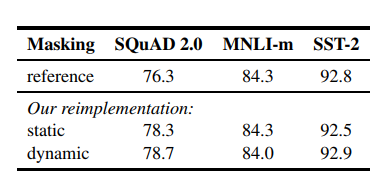

> **RoBERTa: A Robustly Optimized BERT Pretraining Approach**  
Yinhan Liu, Myle Ott, Naman Goyal, Jingfei Du, Mandar Joshi, Danqi Chen, Omer Levy, Mike Lewis, Luke Zettlemoyer, Veselin Stoyanov  
https://arxiv.org/abs/1907.11692

# Short Review: 개선된점만 정
## vs. BERT
* large-scale text copora dataset(160GB)
    1. BookCorpus + Wikipedia (16GB)
    2. CC-News (76GB)
        * CommonCrawl News Dataset의 영어부분에서 수집한 CC-News Dataset.
        * 2016년 9월 ~ 2019년 2월 사이에 크롤링된 6300만개의 영문 뉴스 기사 포함.
    3. OpenWebText (38GB)
        * OpenGPT2에서 설명한 WebText Corpus의 open-source recreation.
        * Reddit에서 공유되는 URL에서 추출한 Web Contents
    4. Stories (31GB)
        * CommonCrawl Data의 하위 집합을 포함.
        * 이야기와 같은 스타일의 Winograd schema와 일치하도록 filtering

* Dynamic Masking
    * 기존의 BERT는 data preprocessing과정에서 masking을 한번 수행.
    * 본 논문에서는 data를 10개 복제하여 각 sequencerk 40 epoch에 걸쳐 10가지 방법으로 masking되도록 처리.
    * 즉, 훈련 중 동일한 mask는 4번만 보게 됨. 이 전략은 큰 데이터셋을 pre-train할때 중요함.
    
    표 1: Dynamic Masking이 Static Masking과 비교하여 비슷하거나 약간 높다. 추가적인 이점을 감안하여 나머지 실험에서 Dynamic Masking 사용.
    

* Model Input Format and Next Sentence Prediction
    * BERT에서 pre-train단계에 두 개의 연결된 segment를 관찰하여 동일한 문서인지 아닌지에 대해 NSP loss를 통해 train된다.
    * Devlin et al.(2019)는 NSP를 제거하면 QNLI, MNLI, 및 SQuAD1.1에서 성능이 크게 저하된다고 하였다.
    * 그러나 최근연구(Lample and Conneau, 2019; Yang et al., 2019; Joshi et al., 2019)에서는 NSP를 손실의 필요성에 대해 의문을 제기함.
    * 이러한 불일치를 더 잘 이해하기 위해 몇 가지 대체 training format을 비교한다.
        * **SEGMENT-PAIR+NSP:** 기존의 BERT에서 사용된 원래 input format을 따르며 NSP를 사용함. 각 입력에는 여러개의 문장이 포함되며 한 쌍의 segment가 있지만 512미만 길이의 token으로 구성.
        * **SENTENCE-PAIR+NSP:** 각 입력에는 document의 인접부분 또는 다른 document의 sentence 쌍으로 구성됨. 이 입력은 512 token보다 훨씬 짧기 때문에 총 갯수가 **SEGMENT-PAIR+NSP**와 유사하게 유지되도록 batch size를 늘린다. NSP 또한 사용.
        * **FULL-SENTENCES:** 각 입력은 하나 이상의 document에서 연속적으로 sampling된 전체 sentence로 채워지므로 총 길이는 최대 512이다. document가 끝나면 다음 document에서 sentence를 sampling하며 document사이에 별도의 separator token을 추가함. NSP는 사용하지 않음.
        * **DOC-SENTENCES:** 입력이 document 경계를 넘을 수 없다는 점을 제외하고 **FULL-SENTENCES**와 유사하게 구성된다. document의 끝 부분에 sampling된 입력은 512개의 token보다 짧을 수 있으므로 이러한 경우 전체 batch와 비슷한 수의 전체 sentence를 얻기 위해 동적으로 batch size를 늘린다. NSP는 사용하지 않음.
    * **Results**
        * **SEGMENT-PAIR+NSP**와 **SENTENCE-PAIR+NSP**를 먼저 비교해보면 두 format모두 NSP를 유지하지만 후자는 single sentence를 사용한다.
        * single sentence를 사용하는 것이 downstream task에 대한 성능을 저해한다는 것을 알아냄.
        * 이유는 model이 long-range dependency를 capture할 수 없기 때문.
        * NSP loss를 사용하지 않는 **DOC-SENTENCES**과 비교하면 ${BERT}_{BASE}$보다 성능이 좋고 NSP loss를 제거하는 것이 downstream task의 성능을 약간 향상시키는것으로 나타났다.
        * single document(DOC-SENTENCES)에서 오는 sequence가 multiple document(FULL-SENTENES)의 sequence를 packing하는것보다 약간 더 잘 수행되는것으로 확인되었다.
        * 그러나 **DOC-SENTENCES**는 variable batch size를 사용해야하기 때문에 실험을 쉽게 진행할 수 있도록 나머지 실험들에 대해서는 **FULL-SENTENCES**를 사용.
        
        
        표 2: BookCorpus + WikiPedia에 Pre-train된 base model에 대한 결과. 
        
 
* Training with large batches
    * 기계번역(Neural Machine Translation)의 과거 연구는 매우 큰 mini batch를 사용한 학습은 학습속도가 적절하게 증가할 때 최적화 속도와 최종 작업 성능을 향상시킬 수 있음을 보여주었다. (Ott et al., 2018)
    * 최근 연구결과에 따르면 BERT는 대규모 batch training에도 적합하다. (You et al., 2019)
    * ${BERT}_{BASE}$는 1M step에 대해 batch size 256 sequence로 train하였다.
    * gradient accumulation을 통한 computation cost측면에서 보면, 2K sequence의 batch size로 125K step, 8K sequence의 batch size로 31K step과 동일하다.
    * 표 3을 통해 large batch를 통한 training이 masked language modeling뿐만 아니라 end-task accuracy도 향상시키는 것을 확인할 수 있다.
    * 실험에서는 8K sequence batch를 사용한다.
    
    
    표 3: 다양한 batch size로 train된 bert_base에 대한 결과. 모두 동일한 계산비용.
    
    
* Text Encoding(약간의 성능 향상이 있을거라는 가설, 실험은 진행하지 않음)
    * OpenGPT2의 BPE는 유니코드 문자 대신 byte를 기본 하위 단위로 사용하는 BPE를 사용함.
    * 이것을 사용하면 "unknown" token 없이도 input text를 encoding할 수 있는 적당한 크기의 하위 단어어휘를 train할 수 있음.
    * 본 논문에서는 이를 사용하였으며 encoding에 대한 실험은 future work로 남겨둠.
    
