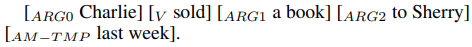
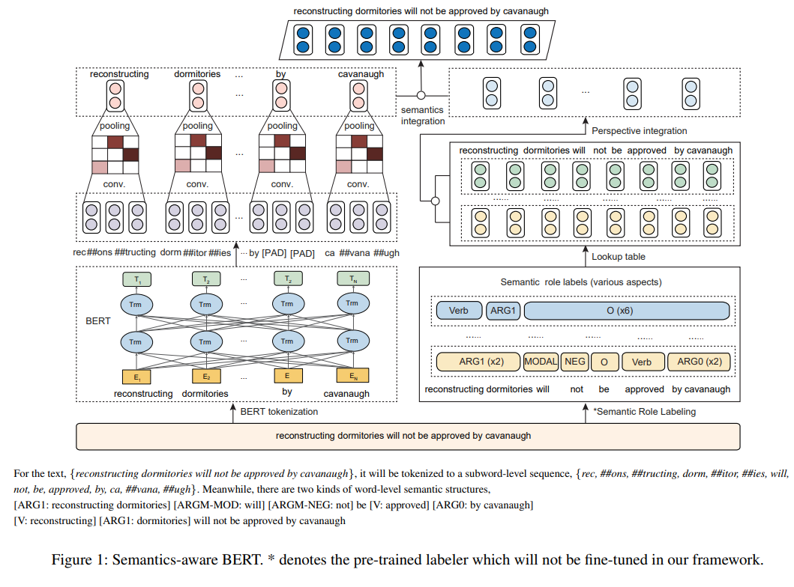
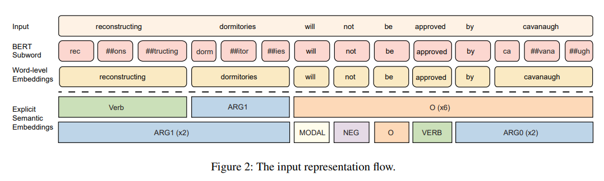
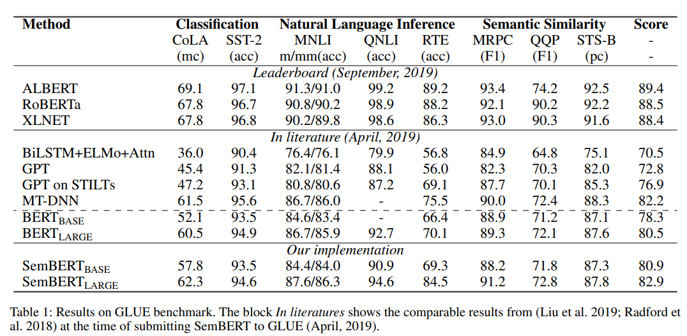
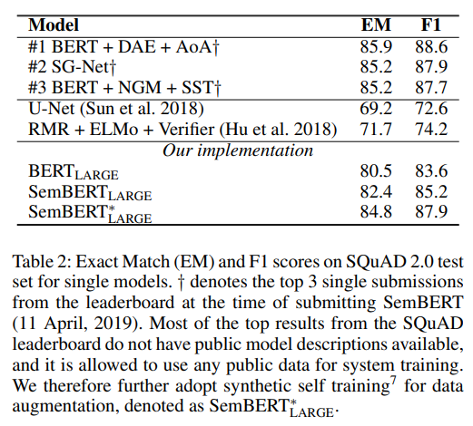
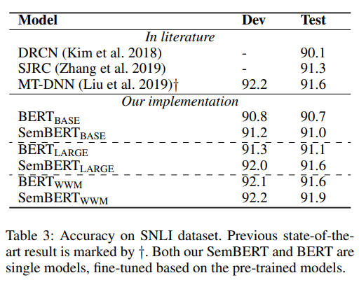
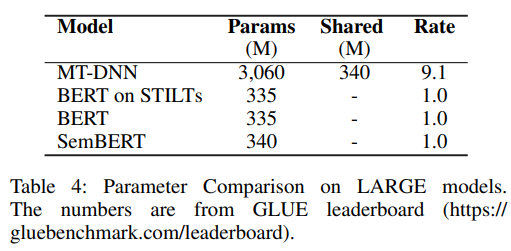
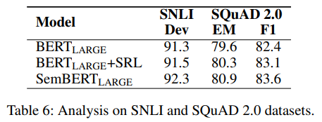
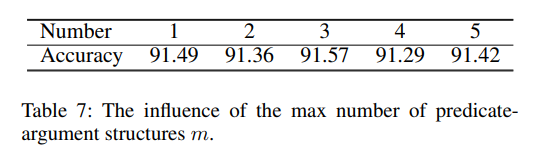
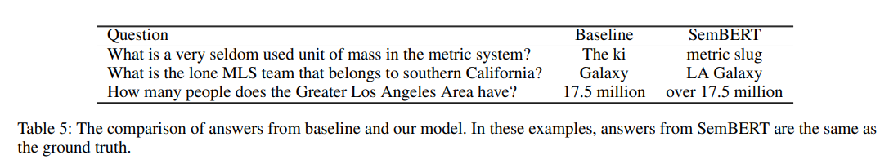

> Semantics-aware BERT for Language Understanding  
Zhuosheng Zhang, Yuwei Wu, Hai Zhao, Zuchao Li, Shuailiang Zhang, Xi Zhou, Xiang Zhou  
https://arxiv.org/abs/1909.02209

# Abstract
최근의 language representation 연구는 contexualized feature를 language model training에 통합하여 다양한 기계 독해 및 자연어추론 task에서 좋은 결과를 보여주었다.
그러나 ELMo, GPT 및 BERT를 포함한 기존의 language representation model은 character 또는 word embedding과 같은 일반적인 상황(plain context)에 맞는 feature만 활용한다.
language representation에 풍부한 semantic을 제공할 수 있는 구조화된 semantic information을 통합하는 것을 고려하지 않는다.  

Language understanding을 향상시키기 위해 우리는 pre-trained semantic role labeling으로부터 명시적인 semantic을 통합하고 개선된 language representation model인 Semantics-aware BERT(SemBERT)를 제안하여 BERT backbone을 통해 contextual semantic을 명시적으로 흡수할 수 있도록 하였다.
SemBERT는 task-specific modification없이 BERT의 편리한 fine-tuning 방식을 유지한다.  

BERT와 비교했을때 Semantics-aware BERT는 개념적으로는 단순하지만 강력했다.
10가지 기계 독해 및 자연어 추론 task에서 SotA를 달성하거나 기존의 결과를 개선하였다.

# 1. Introduction
최근 deep contextual language model(LM)은 language representation을 학습하는데 효과적인 것으로 나타났으며, 주요 Natural Langauge Understanding(NLU) task들에서 SotA를 달성하였다.
fine-grained contextual embedding을 통해 pre-trained model은 downsteam task에 쉽게 적용되거나 fine-tuning을 통해 사용될 수 있다.  

본 논문에서는 language modeling에만 초점을 둔 현재의 기술이 pre-trained representation의 power를 제한한다고 주장한다.
기존의 language model의 주요 한계는 representation 및 training objective에 대한 명확한 contextual feature을 취하는것에만 있으며, 명확한 contextual semantic 단서는 고려하지 않는다.
잘 학습된 pre-trained language model은 contextual semantic을 암시적으로 represent할 수 있지만 external knowledge를 통합하여 더욱 향상시킬 수 있다.
이를 위해 최근에 pre-trained language model에 extra knowledge를 통합하는 연구도 있었다.[[Zhang et al. 2020b]](https://arxiv.org/abs/1908.05147)  

많은 연구에서 deep learning model이 natural language text를 실제로 이해하지 못하고 adversarial attack으로부터 심각하게 어려움을 겪는것으로 나타났다.[[Jia and Liang. 2017](https://arxiv.org/abs/1707.07328)]
그들의 연구에서 deep learning model은 의미 없는 단어에 큰 attention을 주고 중요한 단어를 무시하였다.
Attractive question answering challenge를 통해 우리는 이전 model에 의해 생성된 많은 답변이 의미론적으로 불완전하다는 것을 관찰한다.(Section 6.3)
이는 현재의 NLU model이 불충분한 contextual semantic representation 및 learning으로 어려움을 겪고 있음을 보여준다.  

실제로 NLU task는 문장의 contextual semantic analysis 유사한 목적을 공유한다.
간단히 말해, 문장을 통한 semantic role labeling(SRL)은 누가, 언제, 왜 무엇을 했는지를 발견하는 것으로, 이는 자연스럽게 NLU task의 목표와 일치한다.
예를 들어 question answering task에서 질문은 일반적으로 contextual semantic의 관점에서 술어 관계로 편리하게 공식화 될 수 있는 누가, 언제, 무엇을, 어떻게, 왜 와 함께 형성된다.  

Human language에서 문장은 일반적으로 다양한 술어-논항(predicate-argument)구조를 포함하는 반면, neural model은 다중 의미 구조의 modeling을 거의 고려하지 않고 문장을 포함하여 representation으로 encoding한다. ([술어와 논항에 대한 참고[[1]](https://blog.naver.com/sonss1992/221520221825),[[2]](https://bab2min.tistory.com/378))
따라서 우리는 SemBERT를 제안함으로써 여러 술어별 논항 sequence에서 문장의 contextual semantic을 풍부하게 하고자 한다.  

우리의 모델은 3가지 요소로 구성된다.
1. 다양한 semantic role label로 입력 문장에 주석을 달기위한 out-of-shelf semantic role labeler
2. pre-trained language model을 사용하여 input raw text에 대한 representation을 만들고 semantic role label이 embedding되도록 맵핑하는 sequence encoder
3. text representation을 contextual explicit semantic embedding과 통합하여 downstream task에 대한 joint representation을 얻는 semantic integration component  

제안하는 SemBERT는 11가지 benchmark dataset에서 평가. SemBERT는 SNLI에서 SotA를 달성하고 GLUE benchmark 및 SQuAD2.0에서도 상당한 이점을 보여줌. Ablation study 및 분석을 통해 우리가 도입한 explicit semantic이 추가 성능 개선에 필수적이며 SemBERT가 효과적으로 semantics-enriched language representation model로 작동함을 입증함.

# 2. Background and Related Work
## 2.1 Language Modeling for NLU
NLU task는 자연에 대한 포괄적인 이해와 추론 능력이 필요하다. NLU 연구에서 일반적인 추세는 stacked attention mechanism 또는 large-scale corpus를 사용하여 model이 점점 더 정교해져 computational cost가 폭발적으로 증가한다.  

Distributed representation은 large-scale unlabeled text에서 단어의 co-occurence를 capture할 수 있기때문에 NLP model의 standard part로 사용되었다. 그러나 word vector를 학습하기위한 이러한 접근법은 sentence level에서 contextual encoding을 고려하여 각 단어에 대해 하나의 context independent representation만을 포함한다. 따라서 최근에 도입된 ELMo, GPT, BERT 및 XLNet을 포함한 cotnextual language model은 더 나은 representation을 위해 contextual sentence modeling을 강화한다. 그 중 BERT는 서로 다른 pre-training objective를 사용하여 context를 양방향으로 capture할 수 있다.  

새로 제안된 language model이 기존 embedding에 비해 향상된것은 language model에서 context에 맞는 feature를 추출하는데 중점을 두고 있기 때문이다. 이러한 contextual word embedding을 기존 task-specific architecture와 통합할 때 ELMo는 SQuAD에 대한 question answering, sentiment analysis, named entity recognition task에서 효과적이었다. 본 논문에서는 pre-trained BERT를 explicit context semantic을 학습하기위한 backbone encoder로 사용한다.

## 2.2 Explicit Contextual Semantics
최신의 pre-trained contextual language model을 포함한 distributed representation이 어느정도 semantic에 의해 강화되었지만, 이러한 implicit semantic은 NLU에 대해 강력한 contextual representation을 지원하기는 충분하지 않다. SQuAD에서 BERT가 생성한 semantically incomplete answer span에 대한 연구에 따르면 explicit semantic의 도입이 필요하다는 것을 생각할 수 있다.  

FrameNet, PropBank를 포함하여 공식적인 semantic frame이 몇가지 있는데 PropBank는 computational linguistic에서 더 널리 사용된다. 형식적 semantic은 일반적으로 semantic 관계를 술어-논항 구조로 제시한다. 예를들어, target 동사(predicate) sold가 주어졌을때 모든 논항은 다음과 같이 label이 지정된다.

$ARG0$은 판매자(agent)를 나타내고 $ARG1$은 판매한것(theme)을 나타내고 $ARG2$는 구매자(recipient)를 나타낸다. $AM-TMP$는 action의 timing을 나타내는 부속물(adjunct)이고 $V$는 술어(predicate)를 나타낸다.  

술어-논항 구조를 구문분석 하기위한 NLP task semantic role labeling(SRL)이 있다(Zhao, Chen, and Kit 2009; Zhao, Zhang, and Kit 2013).
최근에 end-to-end SRL system neural model이 소개되었다(He et al. 2017; Li et al. 2019). 이러한 연구에 힘입어 SRL을 NLU에 쉽게 통합할 수 있다.

# 3. Semantics-aware BERT
그림1은 semantics-aware BERT 프레임워크를 보여준다. SemBERT는 multiple sequence input을 처리할 수 있도록 설계되었다.
SemBERT에서 input sequence의 단어는 semantic role labeler로 전달되어 explicit semantic의 여러 술어 구조를 가져오고 해당하는 embedding은 linear layer이후 집계되어 최정 semantic embedding을 형성한다.
병행하여 input sequence는 BERT word-piece tokenizer에 의해 subword로 분할되고 subword representation은 convolution layer를 통해 word level로 다시 변환되어 contextual word representation을 얻는다.
마지막으로 word representation 및 semantic embedding이 concatentation되어 downstream task에 대한 joint representation을 형성한다.
  

## 3.1 Semantic Role Labeling
data pre-processing 과정에서 각 문장은 pre-trained semantic labeler를 사용하여 여러 semantic sequence로 주석처리 된다. semantic role의 PropBank 스타일을 사용하여 input sequence의 모든 token에 semantic label을 표시한다.
특정 sentence가 주어지면 다양한 술어-논항 구조가 된다. 그림1에서 볼 수 있듯이 [***reconstructing dormitories will not be approved by cavanaugh***] 이라는 문장에서 문장의 술어 관점에서 두 가지 semantic structure가 있다.  

다차원 semantic을 공개하기 위해 semantic label을 그룹화하고 encoding component에서 text embedding과 통합한다. input data flow는 그림2와 같다.
  

## 3.2 Encoding
Raw text sequence 및 semantic role label sequence는 pre-trained BERT를 feed하기위한 embedding vector로 표현된다.
Input sentence $X=\left\{ { x }_{ 1 },\dots ,{ x }_{ n } \right\} $은 길이가 $n$인 단어로, 먼저 word piece으로 tokenize된다.
이후 transformer encoder는 self-attention을 통해 각 token에 대한 contextual information을 capture하고 contextual embedding을 생성한다.  

각 술어와 관련된 $m$ label sequence의 경우 $T=\left\{ { t }_{ 1 },\dots ,t_{ n } \right\} $이다. 여기서 ${t}_{i}$는 $\left\{ { label }_{ 1 }^{ i },{ label }_{ 2 }^{ i },\dots ,{ label }_{ n }^{ i } \right\} $로 표시되는 $n$개의 label이다. 레이블은 word-level이므로 길이는 $X$의 원래 문장 길이 $n$과 같다. semantic signal을 embedding으로 간주하고 lookup table을 사용하여 이러한 label을 vector $\left\{ v_{ 1 }^{ i },v_{ 2 }^{ i },\dots ,v_{ n }^{ i } \right\} $에 맵핑하고 BiGRU layer에 feed하여 latent space에서 label sequence $m$에 대한 label representation을 얻는다. $$e\left( { t }_{ i } \right) =BiGRU\left( { v }_{ 1 }^{ i },{ v }_{ 2 }^{ i },\dots ,{ v }_{ n }^{ i } \right) \ where \ 0<i\le m. $$ 

$m$개의 label sequence의 경우 ${L}_{i}$는 token ${x}_{i}$의 label sequence를 나타낸다.
$$e\left( { L }_{ i } \right) =\left\{ e\left( { t }_{ 1 } \right) ,\dots ,e\left( { t }_{ m } \right)  \right\} .$$

Label representation의 $m$ sequence를 concatenation하고 그것들을 차원 $d$에서 joint representation을 얻기 위해 fully-connected layer로 feed한다.
$$
{ e }^{ \prime  }\left( { L }_{ i } \right) ={ W }_{ 2 }\left[ e\left( { t }_{ 1 },e\left( { t }_{ 2 } \right) ,\dots ,e\left( { t }_{ m } \right)  \right)  \right] +{ b }_{ 2 },\quad (1)\\ { e }^{ t }=\left\{ { e }^{ \prime  }\left( { L }_{ 1 },\dots ,{ e }^{ \prime  }\left( { L }_{ n } \right)  \right)  \right\} ,
$$
여기서 ${W}_{2}$와 ${b}_{2}$는 trainable parameter.

## 3.3 Integration
통합 모듈은 text embedding 및 label representation을 통합한다.
pre-trained BERT는 subword를 기반으로 하는 반면, 본 논문에서 제안된 semantic label은 word에 기초하고 있기 때문에 이러한 서로 다른 크기의 sequence들을 맞출 필요가 있다.
따라서 각 word에 대한 subword를 그룹화하고 max pooling과 convolutional neural network(CNN)을 사용하여 word-level representation을 얻는다.
빠른 속도 때문에 CNN을 선택했고, 예비 실험에서 CNN에 의해 capture된 local feature가 LM modeling에 RNN보다 더 나은 결과를 제공한다는 것을 보여주었다.  

하나의 단어를 예시로 든다. 단어 ${x}_{i}$가 subword $\left[ { s }_{ 1 },{ s }_{ 2 },\dots ,{ s }_{ l } \right] $ 로 구성되어 있다고 가정하면 여기서 $l$은 단어 ${x}_{i}$의 subword 갯수이다.
BERT에서 subword ${s}_{j}$를 $e({s}_{j})$로 표시한다.
먼저 Conv1D layer를 다음과 같이 사용한다. ${ e }_{ i }^{ \prime  }={ W }_{ 1 }\left[ e\left( { s }_{ i } \right) ,e\left( { s }_{ i+1 } \right) ,\dots ,e\left( { s }_{ i+k-1 } \right)  \right] +{ b }_{ 1 }.$
여기서 ${W}_{1}$ 및 ${b}_{1}$은 trainable parameter이고 $k$는 kernel size이다.
그런 다음 ReLU 및 max pooling을 ${x}_{i}$의 output embedding sequence에 적용한다.
$$
{ e }_{ i }^{ * }=ReLU\left( { e }_{ i }^{ \prime  } \right) ,e\left( { x }_{ i } \right) =MaxPooling\left( { e }_{ 1 }^{ * },\dots ,{ e }_{ l-k+1 }^{ * } \right) ,\quad (2)
$$

따라서 word sequence $X$에 대한 whole representation은 ${ e }^{ w }=\left\{ e\left( { x }_{ 1 } \right) ,\dots ,e\left( { x }_{ n } \right)  \right\} \in { \mathbb{R} }^{ n\times { d }_{ w } }$로 표현된다.
여기서 ${d}_{w}$는 word embedding의 dimension을 나타낸다.
aligned context 및 distilled semantic embedding은 fusion function $h={ e }^{ w }\Diamond { e }^{ t }$에 의해 병합된다.
여기서 $\Diamond$는 concatenation을 나타냄.
(summation, multiplication 및 attention mechanism을 시도했지만 concatenation이 가장 좋은 결과를 보여줌)

# 4. Model Implementation
SemBERT의 특정 구현 부분을 소개.
SEmBERT는 광범휘한 task를 위한 선행 encoder가 될 수 있으며 예측을 위한 linear layer만 있는 end-to-end model이 될 수도 있다.
simple하게 하기 위해 fine-tuniong후 예측을 직접 제공하는 간단한 fine-tuning만 보여줌.  

## 4.1 Semantic Role Labeler
Semantic label을 얻기 위해 pre-trained SRL module을 사용하여 모든 술어와 해당 논항을 한번에 예측한다.
[Peters et al.(2018)](https://arxiv.org/abs/1802.05365) 의 semantic role labeler를 구현했으며 CoNLL-2012 shared task를 위해 English OntoNote v5.0 benchmark에서 F1 84.6%를 달성하였다. 
구현시 총 104개의 label이 있으며 논항이 아닌 단어는 $O$를 사용하고 술어에는 동사 label을 사용.

## 4.2 Task-specific Fine-tuning
Section 3.에서는 semantics-aware BERT representation을 얻는 방법을 설명했다.
여기에서는 classification, regression 및 span-based MRC task에 SemBERT를 적용하는 방법을 보여준다.
Fused contextual semantic 및 LM representation $h$를 더 낮은 차원으로 변환하고 예측 분포를 얻는다.  

Classification 및 regression task의 경우 $h$는 class logit 또는 score를 얻기 위해 fully connection layer로 feed 된다.
Training objective는 classification task를 위한 CrossEntropy와 regresstion task를 위한 Mean Square Error loss 이다.  

span-based reading comprehension을 위해 $h$는 모든 token의 start logit 및 end logit을 얻기위해 fully connection layer로 feed 된다.
위치 $i$에서 $j$까지의 candidate span score는 ${s}_{i} + {e}_{j}$로 정의되며 $j\ge i$가 예측으로 사용되는 maximum scroing span 이다.
예측을 위해 pooled first token span의 점수를 비교한다: ${ s }_{ null }={ s }_{ 0 }+{ e }_{ 0 }$에서 null이 아닌 최고의 span ${ s }_{ i,j }^{ \wedge  }={ max }_{ j\ge i }\left( { s }_{ i }+{ e }_{ j } \right)$  까지.
${ s }_{ i,j }^{ \wedge  }>{ s }_{ null }+\tau $ 일때 null이 아닌 answer를 예측. 여기서 threshold $\tau$는 dev-set에서 선택되어 F1을 최대화한다.

# 5. Experiments
## 5.1 Setup
Pre-trained BERT 가중치를 사용하고 BERT와 동일한 fine-tuning 절차를 따름.
외부 SRL embedding 크기는 original encoder size의 15%이므로 model size가 약간 증가.
**Initial learning rate** in {8e-6, 1e-5, 2e-5, 3e-5} with warm-up rate of 0.1 and L2 weight decay of 0.01.
The **batch size** is selected in {16, 24, 32}. The maximum number of epochs is set in [2, 5] depending on tasks.
Texts are tokenized using **wordpieces**, with **maximum length** of 384 for SQuAD and 128 or 200 for other tasks.
The dimension of **SRL embedding is set to 10**. The default **maximum number of predicateargument** structures m is set to 3.  

## 5.2 Tasks and Datasets
* MRC
    * SQuAD2.0
* NLI
    * Stanford Natural Language Inference (SNLI)
    * Multi-Genre Natural Language Inference (MNLI)
    * Question Natural Language Inference (QNLI) 
    * Recognizing Textual Entailment (RTE)
* Semantic Similarity
    * Microsoft Paraphrase corpus (MRPC)
    * Quora Question Pairs (QQP)
    * Semantic Textual Similarity benchmark (STS-B)
* Classification
    * The Corpus of Linguistic Acceptability (CoLA)
    * Stanford Sentiment Treebank (SST-2)
    

## 5.3 Results

표1은 GLUE benchmark에 대한 결과를 보여줌.
SemBERT는 BERT보다 실질적인 이점을 제공하며 literature과 비교하여 모든 SotA를 능가함.
SemBERT는 동일한 평가 절차를 통해 BERT를 backbone으로 삼기 때문에, 새로 도입된 explicit contextual semantic으로 인해 이득을 얻게 됨을 확인할 수 있음.  

특히 RTE, MRPC, CoLA와 같은 small dataset에서 현저한 의미가 포함되어 있음을 보여줌으로써 small training data에서 더 잘 작동하는데 도움이 된다고 볼 수 있음.
이는 large-scale 주석 데이터를 사용할 수 없으므로 대부분의 NLP task에 중요함.  

표2는 SQuAD2.0에 대한 testset의 결과를 보여줌.
SemBERT는 EM과 F1에서 모두 BERT보다 뛰어남.
또한 leaderboard에 등록된 모든 작품보다 뛰어나거나 경쟁력이 있음을 보여줌.  

표3은 SemBERT가 SNLI benchmark에서 SotA를 달성했으며 모든 ensemble model보다 훨씬 뛰어난 성능을 보여줌.  

model parameter는 표4에서 확인할 수 있음.

# 6. Analysis
## 6.1 Ablation Study

우리의 방법에서 핵심 요소의 기여도를 평가하기 위해, 표6과 같이 SNLI와 SQuAD2.0 dev-set에 대한 ablation study를 수행한다.
SemBERT가 contextual semantic을 잘 흡수하여 이러한 semantic information을 통합하는 방법이 작동하는것인지 궁금하다.
따라서 직접 비교를 위해 BERT subword embedding과 SRL embedding을 concatenation하여 SRL이 CNN없이 word-level alignment를 위해 각 원래 word의 subword 수에 복사한다.
결과에서 concatenation을 통해 contextual semantic을 통합하는 것이 language understanding에 매우 유용하다는 것을 확인한다.
그러나 SemBERT는 BERT+SRL보다 뛰어나지만 원래 BERT보다 큰 margin으로 성능을 발휘한다.
이는 SemBERT가 일반적인 contextual representation과 contextual semantic을 동시에 통합하는데 효과적으로 작동함을 보여준다.  

## 6.2 The influence of the number $m$
술어 인수의 최대 개수 $m$의 영향을 1~5로 설정하여 조사한다.
결과는 표6과 같다.
우리는 적당한 수의 $m$이 더 좋은것을 확인할 수 있었다.

## 6.3 Model Prediction
SemBERT의 예측을 직관적으로 관찰하기 위한 baseline BERT 및 SemBERT의 SQuAD2.0에 대한 예측 예시목록은 표5와 같다.
baseline BERT model의 답변이 의미적으로 불완전한 반면 우리 모델이 더 의미론적으로 정확한 답변을 추출할 수 있음.
이는 explicit semantic을 활용하는 것이 의미있는 예측을 생성하도록 model을 안내할 가능성이 있음을 보여준다.
직관적으로 이러한 발전은 semantic role span에 대한 인식을 높이는데 기여할 것이며 이는 누가 누구에게 무엇을 했는지와 같은 패턴을 배우도록 model을 안내한다.

비교를 통해 SemBERT가 span-based SRL labeling을 통해 span segmentation이 향상될 수 있음을 관찰.
SRL을 segmentation tag로 변환하여 segmented span 내부 또는 외부에 있는 token을 표시함으로써 SQuAD2.0의 최상위 model에 대한 사례 연구를 수행.
결과는 EM 83.69 F1 87.02이며 이는 segmentation이 실제로 작동하지만 전체 architecture와 비교할때 약간 유리하다는 것을 보여줌.  

우리는 SRL signal을 사용하여 model이 sentence 내부의 span relationship을 capture할 수 있도록 돕고, semantic role label hint의 양면과 semantic role labeling에 걸친 segmentation 이점을 어느 정도 달성하는 데 도움이 되도록 하는 동기를 부여한다는 점에 유의할 필요가 있다.
Segmentation은 더 나은 semantic span segmentation이 있어도 semantic awareness로 간주될 수 있다.
직관적으로 이것은 우리 model이 BERT의 subword-level에서 itermediate word-level수준 및 final semantic representation으로 진화함을 나타냄.  

## 6.4 Influence of Accuracy of SRL
우리 model은 semantic role labeler에 의존한다.
Label의 정확도에 대한 영향을 조사하기 위해 label의 비율을 무작위로 [0%, 20%, 40%]로 변경함으로써 label을 계산식 오류로 분류한다. SQuAD의 F1점수는 각각 [87.93, 87.31, 87.24]이다.
이러한 이점은 BERT hidden state와 SRL representation의 concatenation에 기인한다고 볼 수 있다.

# 7. Conclusion
본 논문은 fine-grained language representation을 위한 semantic-aware BERT network architecture를 제안한다.
NLI, question answering, MRC, semantic similarity 및 text classification을 포함한 광범위한 NLU task에 대한 실험은 baseline BERT보다 우수함을 보여주었다.
우리의 model은 관련된 모든 NLU task에서 발표된 모든 task를 능가했다.
이는 explicit contextual semantic이 성능 향상을 위해 pre-trained language representation과 효과적으로 통합될 수 있음을 보여준다.
최근에는 대부분의 연구가 성능 향상을 위해 복잡한 mechanism을 경험적으로 쌓는데 중점을 두는 대신, 단순하지만 효과적인 방법을 통해 보다 정확한 이해와 추론을 위한 semantic signal을 융합하는데 약간의 관심을 기울이기를 희망한다.
