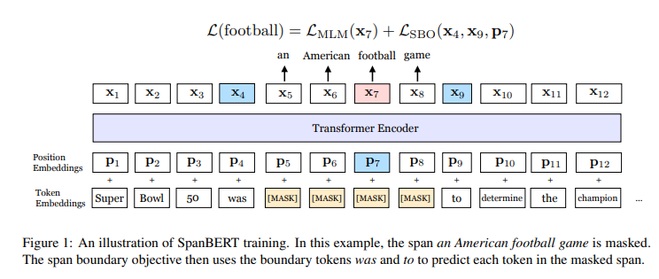
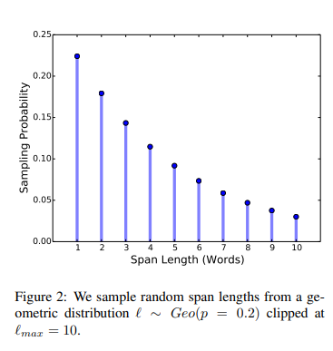

> **RoBERTa: A Robustly Optimized BERT Pretraining Approach**  
Mandar Joshi, Danqi Chen, Yinhan Liu, Daniel S. Weld, Luke Zettlemoyer, Omer Levy  
https://arxiv.org/abs/1907.10529

# Abstract
* text span을 잘 표현하고 예측하도록 design된 pre-train 방법인 SpanBERT를 제안
* 우리의 접근방식은 **(1) random token이 아닌 contiguous한 random span을 마스킹**하고 **(2) 개별 token representation에 의존하지 않고 mask 범위의 전체 내용을 예측**하도록 **span boundary representation**을 학습함으로써 BERT를 확장
* SpanBERT는 BERT와 다른 모델을 보다 성능면에서 상당한 이점을 보여줌

# 1. Introduction
BERT(Devlin et al., 2019)와 같은 pre-train 방법은 individual word, subword를 마스킹하여 self-supervised training을 통해 성능을 크게 향상시켰음.
그러나 많은 NLP task에는 text span간 relationship 추론이 포함됨.  

예시로 extractive question answering에서 "Denver Broncos"가 "NFL 팀"인지 결정하는 것은 "어떤 NFL 팀이 Super Bowl 50에서 우승 했습니까?"라는 질문에 대답하는데 중요함.
또 다른 예시로 "Denver Broncos"예측은 다음 단어가 "Broncos"라는 것을 알때 "Denver"만 예측하는 것보다 훨씬 어려운 self-supervised learning의 target이다.  

본 논문에서는 question answering과 conference resolution과 같은 span 선택 task에서 가장 큰 이득을 보이며 BERT를 능가하는 **span-level pre-train** 방법을 제시한다.
제안하는 방법은 BERT의 masking scheme과 training objective과 모두 다르다.
먼저 random individual token이 아닌 **random contiguous span**을 마스킹.
다음 boundary에서 관찰된 token으로부터 전체 마스크된 span을 예측하도록 모델을 학습시키는 **span-boundary objective(SBO)**를 제안.
span-based masking은 apper되는 context만 사용하여 모델이 전체 span을 예측하도록 한다.
또한 span-boundary objective는 모델이 **span-level information을 boundary token에 저장**하도록 하며, fine-tune중에 쉽게 접근할 수 있다.

그림 1은 논문에서 제안하는 방법을 보여줌

Next Sentence Prediction(NSP)를 사용하는 것보다 single segment를 사용하는 것이 대부분의 downstream task에서 성능을 크게 향상시켰다.
제안하는 pre-train과정은 다양한 task에서 모두 BERT를 능가하는 모델을 산출하였고 특히 span selection task에서 실질적으로 더 나은 성능에 도달하였다.(SQuAD 1.1 및 SQuAD 2.0에서 각각 F1 94.6% 및 88.7%에 도달)
또한 5개의 extractive question answering benchmark(NewsQA, TriviaQA, SearchQA, HotpotQA and Natural Question)에서도 비슷한 이점이 있었다.
document-level의 conference resolution task인 CoNLL-2012에서 SotA를 달성했다.  

마지막으로 SpanBERT는 span selection과 관련이 없는 task(TACRED, GLUE)에서도 성능이 향상됨을 보여주었다
더 많은 데이터를 추가하고(Yang et al., 2019-XLNet) 모델 크기를 늘리면(Lample and Conneau, 2019-XLM) 이점을 보여주지만, 본 논문은 우수한 pre-train task 및 objective를 잘 설계하는 것이 중요하다는 점을 보여줌.

# 2. Background: BERT
* BERT는 특정 downstream task에 맞게 fine-tune하기전에 deep transformer encoder를 pre-train하는 self-supervised 방식이다.
* BERT는 **MLM(Masked Language Modeling)**과 **NSP(Next Sentence Prediction)**라는 두 가지 training objective를 optimization함.

## Notation
* word 또는 subword로 구성된 sequence $X=({x}_{1},\dots,{x}_{n})$이 주어지면, BERT는 각 token에 대해 contexualized vector representation을 생성하는 encoder를 학습한다. ${ x }_{ 1 },\dots ,{ x }_{ n }=enc({ x }_{ 1 },\dots ,{ x }_{ n }).$
* encoder는 deep trasnformer를 통해 구현되므로 position enbedding ${ P  }_{ 1 },\dots ,{P }_{ n }$을 사용하여 sequence에서 각 token의 absolute position을 표시한다.

## Masked Language Modeling(MLM)
* MLM은 sequence에서 누락된 token을 예측하는 task.
* BERT 구현에서 mask는 token중 15%를 차지한다. 그중 80%는 **[MASK]**, 10%는 Random Token, 10%는 변경하지 않는다.
* BERT는 Y의 각 individial token을 무작위로 선정하지만 SpanBERT는 contiguous span을 무작위로 선택한다.(Sention 3.1)

## Next Sentence Prediction(NSP)
* NSP task는 XA, XB 두 sequence를 입력으로 사용하고 XB가 XA와 직접적인 연속인지 여부를 예측.
* 두 sequence 는 **[SEP]** special token으로 구분.
* **[CLS]**token이 XA, XB에 추가되어 모델 입력을 형성.
* 여기서 **[CLS]**를 통해 XB가 XA 뒤에 오는지 안오는지를 예측.(binary classification)
* SpanBERT에서는 NSP objective를 제거하고 single full-length sequence를 사용.(Section 3.3)

# 3. Model
SpanBERT의 접근방식은 BERT에서 영감을 얻었지만 **세 가지 방식**으로 bi-text classification framework를 벗어났다.
먼저 individual token이 아닌 **다른 방식으로 token span을 마스킹.**
span boundary에서 token representation만 사용하여 전체 mask된 span을 예측하고자 하는 새로운 auxiliary objective인 **span boundary objective(SBO)를 제안.**
마지막으로, SpanBERT는 각 training example에 대해 **하나의 contiguous한 text segment를 샘플링하므로 BERT의 NSP를 사용하지 않.**

## 3.1 Span Masking
* token으로 구성된 sequence $X=({ x }_{ 1 },\dots ,{ x }_{ n })$가 주어지면 masking budget(e.g., 15% of $X$)이 사용될때까지 **text span**을 반복적으로 샘플링하여 token $Y\subseteq X$를 선택
* 각 반복마다 geometric distribution $\ell \sim Geo\left( p \right) $를 통해 span 길이를 샘플링한다. 이 분포는 더 짧은 스팬으로 편향된다.(skewed)
* 이후 span의 시작점을 random하게(균일하게)선택한다.
* 예비 시험에서 $p=0.2$로 설정하고 ${ \ell  }_{ max }=10$에서 $\ell$를 clip. 이것은 $\bar { \ell  } =3.8$의 평균 span 길이를 반환한다.
* 또한 subword token이 아닌 **complete word로 span 길이를 측정하여 mask 범위를 더 길게** 만든다.
* 그림2는 span mask 길이의 분포를 보여준다.

* BERT와 마찬가지로 15%를 마스킹 - 80% **[MASK]**, 10% Random Token, 10% Original Token
* 그러나 이 마스킹은 span 수준에서 수행되므로 span의 모든 token은 **[MASK]** 또는 샘플링된 token으로 대체된다.

## 3.2 Span Boundary Objective (SBO)
* Span selection models(Lee et al., 2016, 2017; He et al., 2018)는 일반적으로 boundary token(시작 및 끝)을 사용하여 span의 fixed-length representation을 만든다.
* 이러한 model을 지원하기 위해 span 끝의 representation을 가능하면 많은 internal span content를 요약하는 것이 이상적이다.
* **boundary에서 관찰된 token의 representation만 사용하여 mask된 span의 각 token을 예측하는 SBO**를 도입하여 이를 수행한다.(그림 1)
* 공식화하면 masked span $\left( { x }_{ s },\dots ,{ x }_{ e } \right) \in Y$, 여기서 $\left( s,e \right) $는 시작 및 끝 위치를 나타낸다.
* external boundary token ${x}_{s-1}$과 ${x}_{e+1}$의 encoding target token ${P}_{i}$의 position embedding을 사용하여 span의 각 token ${x}_{i}$를 나타낸다.

$$
{ y }_{ i }=f\left( { x }_{ s-1 },{ x }_{ e+1 },{ P }_{ i } \right)
$$

* 본 논문에서는 GeLU activation function 및 Layer Normalization을 사용하여 representation function $f\left( \cdot  \right) $를 2-layer Feed-Forward Network로 구현한다

$$
h\quad =\quad LayerNorm\left( GeLU\left( { W }_{ 1 }\cdot \left[ { x }_{ s-1 };{ x }_{ e+1 }{ ;P }_{ 1 } \right]  \right)  \right) \\ f\left( \cdot  \right) \quad =\quad LayerNorm\left( GeLU\left( { W }_{ 2 }\cdot h \right)  \right)
$$

* 이후 vector representation ${y}_{i}$를 사용하여 ${x}_{i}$를 예측하고 정확히 MLM objective와 같은 cross-entropy loss를 계산한다.
* SpanBERT는 span boundary 및 mask된 span의 각 token에 대한 regular masked language modeling objective의 loss를 합산한다.

## 3.3 Single-Sequence Training
* Sention 2에서 설명한것처럼 BERT의 예제에는 두 개의 text sequence (XA, XB)와 연결여부(NSP)를 예측하기 위해 모델을 학습시키는 objective가 포함되어 있다.
* 위와 같은 설정이 NSP 목표없이 single sequence를 사용하는 것보다 더 나쁘다는 것을 발견.(자세한 내용 Section 4.3 참조)
* 저자들은 single-sequence training이 NSP를 사용한 bi-sequence training보다 우수하다고 추측.
    * (a): 더 긴 full-length context의 이점
    * (b): 다른 document의 context에 대한 conditioning이 mask language model에 noise를 추가하기 때문
* 따라서 NSP objective와 two-segment sampling procedure를 모두 제거하고 $n$ token까지 합한 두개의 half-segment가 아닌 최대 $n=512$ token의 **single contiguous segment를 샘플링**한다.
