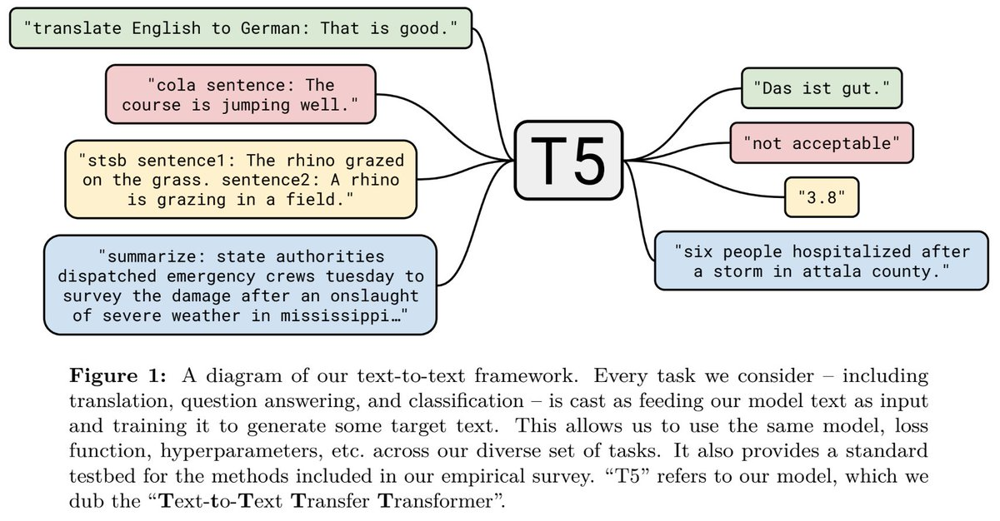
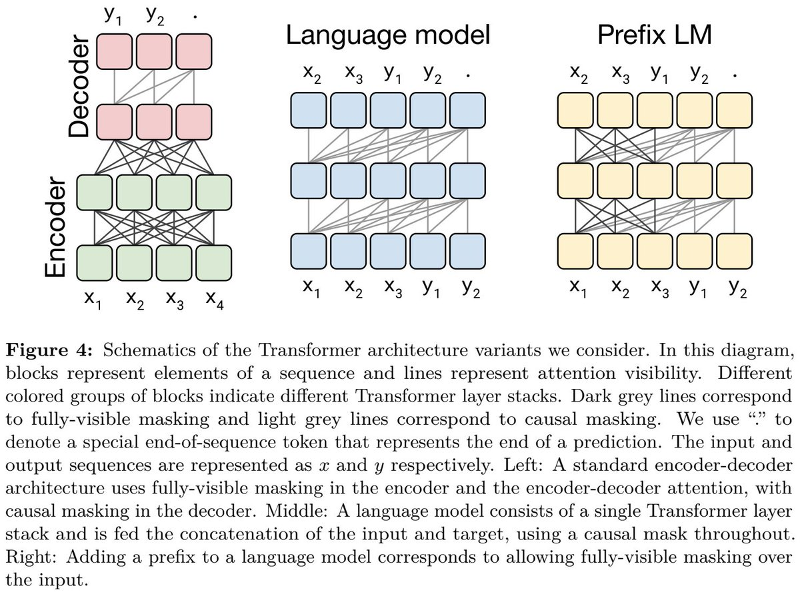
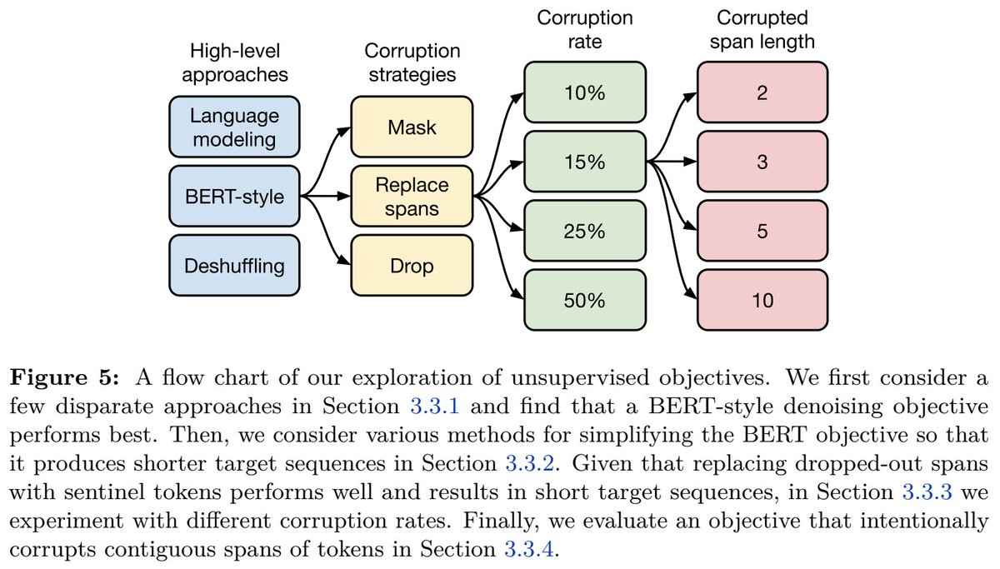
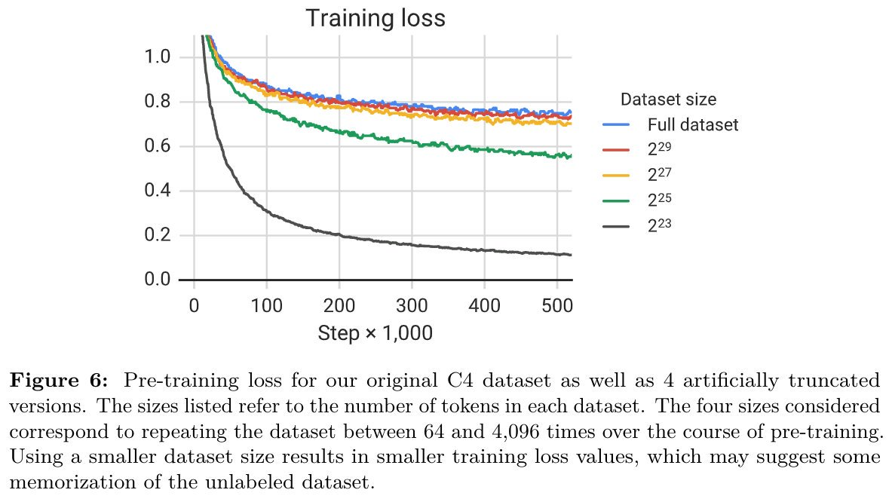

> **ALBERT: A Lite BERT for Self-supervised Learning of Language Representations**  
Colin Raffel, Noam Shazeer, Adam Roberts, Katherine Lee, Sharan Narang, Michael Matena, Yanqi Zhou, Wei Li, Peter J. Liu  
https://arxiv.org/abs/1910.10683

# Short Summary

* **unified text-to-text model을 사용하여 NLP task에서 transfer learning에 대한 체계적인 연구를 수행하여 GLUE, SuperGLUE, CNN/DM 및 SQuAD에서 SotA를 달성**

* 접근방식: 모든 언어문제를 text-to-text task로 변환.
  * 영어->독일어 번역 예시, input:"translate English to German: That is good." taget:"Das ist gut."
  * 감정분석 예시, input:"sentiment: This movie is terrible!", target: "negative"
    
    
    
* text-to-text 접근방식을 사용하면 동일한 model, loss function, decoding process, training procedure 등을 사용할 수 있음.
* 논문의 empirical survey에서 평가한 많은 아이디어에 대한 표준 testbed를 제공.

* pre-train dataset: label이 없는 크롤링 데이터 750GB("Colossal Clean Crawled Corpus(C4")
* Tensorflow dataset에서 사용가능 (https://www.tensorflow.org/datasets/catalog/c4)

* 논문의 대부분 실험에는 basic encoder-decoder Transformer architecture를 사용.
* text-to-text framework에서 generation, classification task에서 잘 작동하였으며 모델을 Text-to-Text Transfer Transformer"(T5)라고 부른다.

* empirical survey를 위해 encoder-decoder model과 language model을 포함한 다양한 architecture에 대해 비교.
* encoder-decoder architecture는 text-to-text setting에서 가장 잘 수행함.

* 다음으로 다양한 pre-training objective에 대하여 조사.
* BERT-style의 denoising objective는 일반적으로 다른 접근방식보다 성능이 뛰어나고 SpanBERT-style의 objective는 performance와 training speed의 조합이 가장 뛰어났음을 발견하였음.

* 다양한 unlabeled dataset를 비교하였고 일부의 경우 domain내 pre-train data가 downstream task에서 성능을 향상시키는 것을 발견.
* 그러나 C4 dataset는 매우크기 때문에 detrimental(해로운)할 수 있다.

* unsupervised pre-training은 표준적인 관행이지만 이 방식과 다른 대안은 MT-DNN과 같이 supervised, unsupervised data의 혼합 dataset을 pre-training하는것이다.
* mixing proportions(혼합 비율)이 맞으면 두 가지 방법 모두 비슷한 성능을 달성할 수 있음.

* scaling up은 성능을 향상시키는 강력한 방법이지만 어떻게 확장해야 하나?
* 더 많은 data에 대한 training, 더 긴(오래) model training, 특정 computational budget(계산비용 or 계산예산)에 따라 training을 비교하였음.
* TL;DR 결론적으로 많은 data, training a longer model 모두 성능을 향상시킴.

* 연구에서 얻은 통찰력을 통해 1조개의 data token에 대해 다양한 크기의 5가지 model을 training.(최대 110억개의 parameter)
* GLUE, SuperGLUE, SQuAD 및 CNN/DM에서 SotA를 얻었지만 WMT Translation을 얻지못함.

* SuperGLUE의 경우 이전 SotA보다 4.3%를 향상시켰으며 human performance의 범위내에 있다.(88.9 vs 89.8)
* SuperGLUE는 사람에게는 쉽지만 machine에게는 어려운 task만 포함하도록 설계되었다.
