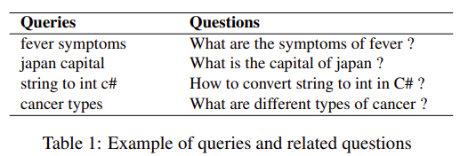
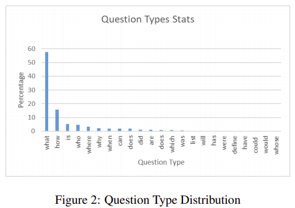
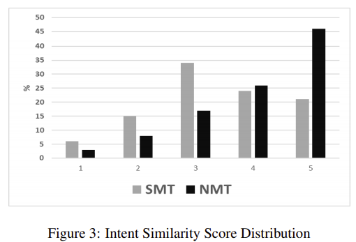

> **Translating Web Search Queries into Natural Language Questions**  
Adarsh Kumar, Sandipan Dandapat, Sushil Chordia  
https://arxiv.org/abs/2002.0263

# Abstract
사용자는 특정 질문을 염두해두고 검색엔진에 query하는데 이러한 query는 keyword 또는 sub-sentential fragment 이다.  
본 논문에서는 주어진 keyword 기반 query에서 올바른 natural question을 생성하는 방법을 제안하는데, 이는 query와 동일한 질문의도를 가지고 있다.  
Keyword 기반 web query를 잘 구성된 질문으로 변환하면 search engine, CQA(Community Question Answering) 웹사이트 및 bot communication과 같은 많은 응용프로그램에 사용될 수 있다.  
우리는 standard machine translation(MT) task에서 query-to-qeustion problem의 시너지 효과를 발견했다.  
Statistical MT, Neural MT model을 사용하여 query에서 question을 생성했으며 MT model이 자동 및 인간평가 측면에서 잘 수행되는 것을 확인할 수 있었다.

# 1. Introduction
Search engine은 지난 10년동안 모든 측면에서 크게 향상되었다. 이전에는 search engine의 주요 작업은 query와 가장 관련성이 높은 링크를 추출하여 표시하는 것이었다. 최근에는 검색어와 관련된 링크를 제공하는 대신 search engine이 질문에 대한 답변을 직접 시도하고 있다.  
예를 들어 최신 search engine(e.g., Bing and Google)에서 ***"japan's capital"*** 라는 query는 답변이 포함된 링크를 제공하는 대신 ***"Tokyo"*** 를 직접 답변한다. Search engine은 사용자의 시간을 절약하고 생산성을 높이기 위해 발전하고 있다.  
이외에도 관련 질문을 표시하고 탐색을 돕기위해 노력하고있다. 예를 들어 ***"열 증상(fever symptoms)"*** query의 경우 사용자는 대부분 ***"열 증상은 무엇입니까?"*** 라는 질문에 대한 답변을 원한다. 같은 질문에 대해 ***"열은 어떻게 치료합니까?", "고열의 원인은 무엇입니까?"*** 와 같은 질문이 관련성이 높다.  
관련 질문을 표시하려면 search engine에 query를 통해 질문을 추출할 수 있는 잘 짜여진 질문 모음이 있어야 한다. (White et al., 2015)은 search engine에서 발행된 query의 10% 이상이 질문의 의도를 가지고있는 반면 3% 만이 natural question으로 공식화되어 있음을 보여주었다.

이러한 query의 대부분은 주로 keyword 또는 sentence fragment 이다. 따라서 문법 정확성 및 불완전한 문장 형성 문제로 인해 질문의도가 있는 검색어를 사용하여 질문 모음을 직접 만들 수 없다. 이 문제를 극복하기 위해 질문 의도가 있는 query를 올바른 형식의 질문으로 변환하는 기술을 제안한다.  
이 기술은 search engine에서 사용할 수 있는 사용자가 잘 구성한 질문을 생성하는 데 사용할 수 있다. CQA 웹사이트에서 사용자가 질문을 검색하기 위해 일부 키워드를 입력하면 질문을 생성하고 질문 모음을 사용하여 질문 구성에 도움을 줄 수 있다. Digital assistant는 이 기술을 사용하여 자연스럽게 query intent를 구체화하고 사용자를 정확한 요구로 탐색할 수 있다.

Lin, 2018은 query to question 변환을 처음 제안했음. Lin의 아이디어는 템플릿 기반 접근법을 따르는 Zhao et al., 2011에 의해 더 확대 되었다. 이와 같은 연구는 단일 변수 템플릿을 사용했는데, 기본적으로 단일 단어 자리 표시자로 대체했다. 따라서 프레임워크는 기존 질문에 크게 의존한다.

또 다른 유사한 연구는 Kalady et al.,2010 이 수행한 연구이다. 구문 분석 트리와 named entity recognition을 사용하여 잘 구성된 문장에서 질문을 도출하였다. 이 시스템은 특정 유형의 질문으로 제한이 되며 query에서 question을 생성하는데 사용되는 대부분의 기술은 규칙기반이며, 이는 다양한 질문 규칙/ 서식, 문법 정확성, query와 생성된 question간의 관련성 등에 의해 제한된다.

본 논문에서는 검색 keyword에서 question 생성하는 새로운 접근 방식을 제안한다. Contribution은 query to question 문제를 translation problem으로 변환하여 문제를 줄였다는 것이다. 또한 웹 검색 로그에서 hquery, question parallel corpus를 작성하여 query와 question 쌍 사이의 사용자 의도를 유지하는 방법을 보여주었다. 표 1은 추출된 쌍 중 일부를 보여준다.

# 2. Approach
Query to qestion generation problem은 다음과 같이 공식화 될 수 있다.
sequence of query keywords $k\left( { k }_{ 1 },{ k }_{ 2 },\dots ,{ k }_{ n } \right) $가 주어지면 대응하는 natural question $q\left( { q }_{ 1 },{ q }_{ 2 },\dots ,{ q }_{ n } \right).$
이것은 source langauge sentence $k$와 target language sentence $q$사이의 translation problem 으로 볼 수 있다. $k$와 $q$는 모두 영어로 되어 있으며 $q$는 구문적, 의미적으로 올바른 언어 문장이지만 $k$는 문법적으로 잘못된 query 이다.  
먼저 SMT기반(Koehn et al., 2003) 접근 방식을 사용한다.
우리는 가장 널리 사용되는 vanilla Moses([Moses](http://www.statmt.org/moses))를 사용하여 SMT 시스템을 구축했다. 이를 기본 시스템으로 간주하여 SMT라고 한다.  
NMT기반 접근 방식은 (Bahdanau et al., 2014)에서 설명된 접근 방식을 사용한다.
NMT기반 모델은 attention model과 bidirectional RNN을 사용한다.
Query의 input sequence $k$가 주어지면 비슷한 질문 의도를 가진 질문 $q$를 생성하려고 한다.
Model 학습은 ${ argmax }_{ q }p\left( q|k \right) $를 maximize하는 $q$를 찾는다.
Model 학습이 끝난 후 sequence $k$가 주어지면 conditional probability를 최대화하는 sequence $q$가 생성된다.  
NMT model은 encoder와 decoder로 구성된다.
Encoder는 variable length input sequence에 대한 fiexed length representation을 학습하고 decoder는 fixed length learned representation을 input 으로 받아서 output sequence를 generation 한다.
예를 들어 input sequence vector $k\left( { k }_{ 1 },{ k }_{ 2 },\dots ,{ k }_{ n } \right) $가 주어지면 encoder는 fixed dimension vector $rep$로 encoding한다.
일반적으로 RNN은 다음과 같이 사용된다.
$$
{ h }_{ t }=f\left( { k }_{ t },{ h }_{ t-1 } \right) \quad (1)\\ rep=z\left( { h }_{ 1 },{ h }_{ 2 },\dots ,{ h }_{ T } \right) \quad (2)
$$
${h}_{t}$는 time $t$에서의 hidden state이고 ${k}_{t}$는 time $t$에서의 input sequence이다.
$f$와 $q$는 non-linear function이다.
이 model에서는 $f$를 LSTM으로 사용하고 식(3)과 같이 $z$를 정의한다.
$$
z\left( { h }_{ 1 },{ h }_{ 2 },\dots ,{ h }_{ t } \right) ={ h }_{ t }\quad (3)
$$
Encoder는 input sequence의 context vector를 $rep$에 저장하려고 한다.
Train하는 동안 decoder는 conditional probability를 maximize하는 방법을 배운다.
Decoder는 다음과 같이 translation sequence $k$에 대한 conditional probability를 정의한다.
$$
p\left( q \right) =\prod _{ t=1 }^{ T }{ p\left( { q }_{ t }|{ q }_{ 1 },{ q }_{ 2 },\dots ,{ q }_{ t-1 },rep \right)  } \quad (4)\\ =\prod _{ t-1 }^{ T }{ g\left( { q }_{ t-1 },{ s }_{ t },rep \right)  }
$$
여기서 $q=\left( { q }_{ 1 },{ q }_{ 2 },\dots ,{ q }_{ T } \right) $이고 $g$는 non-linear이다.
Conditional probability가 다음이 같이 변경되는 attention model을 사용하고 있다.
$$
p\left( { q }_{ i }|{ q }_{ 1 },{ q }_{ 2 },\dots ,{ q }_{ i-1 },k \right) =g\left( { q }_{ i-1 },{ s }_{ i },{ rep }_{ i } \right) \quad (5)
$$
여기서 ${s}_{i}$는 다음과 같다.
$$
{ s }_{ i }=g\left( { q }_{ i },{ s }_{ i-1 },{ rep }_{ i } \right) \quad (6)
$$
Context vector ${rep}_{i}$는 다음과 같이 계산된다.
$$
{ rep }_{ i }=\sum _{ j=1 }^{ { T }_{ x } }{ { a }_{ ij }{ h }_{ j } } \quad (7)
$$
각 annotation ${h}_{j}$의 weight ${a}_{ij}$는 다음과 같이 계산된다.
$$
{ a }_{ ij }=\frac { exp\left( { e }_{ ij } \right)  }{ \sum _{ m=1 }^{ { T }_{ x } }{ exp\left( { e }_{ im } \right)  }  } \quad (8)
$$
where
$$
{ e }_{ ij }=a\left( { s }_{ i-1 },{ h }_{ j } \right) \quad (9)
$$

이 방식을 통해 decoder는 attention할 input part를 결정할 수 있다.
BiRNN을 사용함으로써 이전 단어뿐만 아니라 다음 단어의 context를 저장하는데 도움이 된다.

# 3. Experimental Setup and Results
먼저 Moses SMT system을 사용하여 baseline experiment를 수행하고 NMT 기반 model과 비교한다.
Moses SMT system은 KenLM과 MERT를 default language model로 사용한다.
NMT 기반 model은 BiRNN을 model을 LSTM과 attention을 사용하여 구현하였다.
2개의 layer로 구성하며 각 layer마다 512개의 cell을 사용.
Embedding demension을 300으로 구성했고 source 및 target의 input vocabulary size는 150k 이다.
Initial learning rate는 0.5이고 learning rate decay factor는 0.99를 사용.
Batch size를 128으로 사용하고 학습은 6 epoch을 진행 하였음.

## 3.1 Data Used
여기서는 parallel data $(k,q)$ pair를 사용했으며 여기서 $k$는 질문 의도가 있는 query $q$는 동일한 질문 의도가 있는 natural question이다.
Bing의 web search log를 사용하여 parallel data를 만들었다.
Bing search log에는 3가지 기본 사항이 저장된다.
1. bing에서 query된 검색어 $(k)$
2. 검색 결과 페이지에서 해당 query에 대해 표시된 URLs $(U)$
3. 해당 검색어에 대해 사용자가 클리한 URL $(u\in U)$

우리는 CQA 웹사이트에 올라온 모든 query $(k)$를 필터링했는데, 여기에는 몇 가지 질문$(q)$와 답이 포함되어 있다.
클릭했던 CQA 웹사이트에서 질문 $(q)$를 추출하여 dataset에 대한 pair $(k, q)$를 생성했다.
이것에 대한 우리의 가설은 모든 search engine에서 query후 사용자는 만족스러운 링크를 클릭하고, 사용자의 질문 $(q)$을 포함하는 웹사이트의 클릭에 대해 그 다음 질문$(k)$은 질문 의도를 가지고 있다고 가정할 수 있다.

Dataset의 질문이 문법적으로 올바른지 확인하기 위해 WikiAnswers, Quora, Yahoo Answers와 같은 유명한 CQA 웹사이트만을 고려했다.
Query $(k)$가 10단어 미만인 $(k,q)$ pair만 유지했다.
또한 "wh"로 시작하는 단어 및 다른 질문 단어(e.g., who, where, who, hoy, is, can, did, list, are etc.)로 시작하는 $(k,q)$ pair만 선택하도록 했다.
이 모든 필터링 이후 query-question pair $(k,q)$는 1300만개만 남았다.
여기서 무작위로 추출하여 5000개를 dev, test set으로 사용하였다.

우리는 query 약 50%가 5단어 미만을 가지고 있다는 것을 발견했다.
Query와 question의 평균 길이는 각각 5.6 과 8.5 이다.
Question의 85%는 "what(53%)", "how(21%)", "is(6%)", "who(5%)"의 유형이다.
그림 1은 query length distribution을 나타내고, 그림2는 dataset의 다양한 유형의 질문 비율을 나타낸다.

## 3.2 Results
시스템 성능을 평가하기 위해 MT evaluation metric BLEU를 사용.
먼저 experiment를 수행하는 task의 어려움을 추정하기 위해 hypothesis translation으로 input을 복제했다.(we shall call it Identity Model(ID))
19.33 BLEU 점수를 보여주었으며 이것은 query와 question사이에 많은 어휘가 겹치기 때문이다.

Baseline SMT는 52.49인 반면 NMT system은 58.63을 보여주었다.
NMT system은 SMT system과 비교하여 6.14 절대적인 BLEU 점수 향상을 제공한다.
SMT 및 NMT system은 모두 ID model에 비해 크게 개선되었다.
SMT와 NMT model에서 모두 높은 점수(>50)를 달성하는 것은 query keyword와 question keyword가 중복되기 때문이다. (ID 모델의 BLEU 점수에 반영됨)

## 3.3 Human Evaluation
우리는 생성된 output의 품질을 판단하기위해 human evaluation을 수행했다.
12명(search engine 사용경험 5년 이상)을 통해 약 1000개의 query-question pair를 수동으로 평가했다.

각 query-generation output pair에 대해 참가자에게 다음과 같은 질문을 했다.
* 질문이 문법적으로 정확한가?
* query와 generation된 output의 의도는 얼마나 비슷한가?

첫 번째 질문은 yes-no에 기초한 질문이고 두번째 질문의 경우 참가자들은 pair 사이에서 1~5사이의 질문 의도 유사성을 판단하도록 요청했다.

두 model 출력을 문법적 정확성 측면에서 볼때 SMT에서 생성된 출력의 약 63%가 문법적으로 정확하고 NMT에서는 출력의 86%가 문법적으로 정확했다.
SMT는 종종 표2의 예시와 같이 잘못된 단어 선택으로 인해 오류가 발생했다.

의도 유사성 측면에서 볼때 NMT model에 의해 생성된 질문의 약 72% 매우 높은점수(4 또는 5점)를 받았고 SMT는 45%가 매우 높은 점수를 받았다.
그림 3은 인간 평가자로부터 얻은 두 모델의 score distribution을 보여준다.
BLEU socre evaluation 뿐만 아니라 human evaluation 측면에서도 NMT model이 SMT model보다 높은 성능을 보여줌을 확인할 수 있었다.

