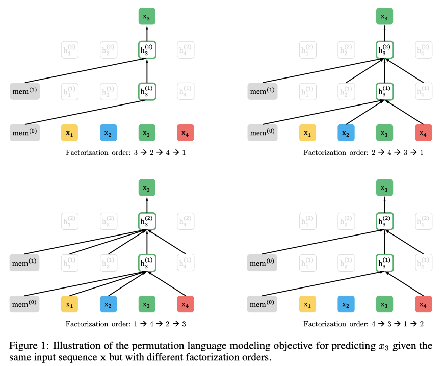
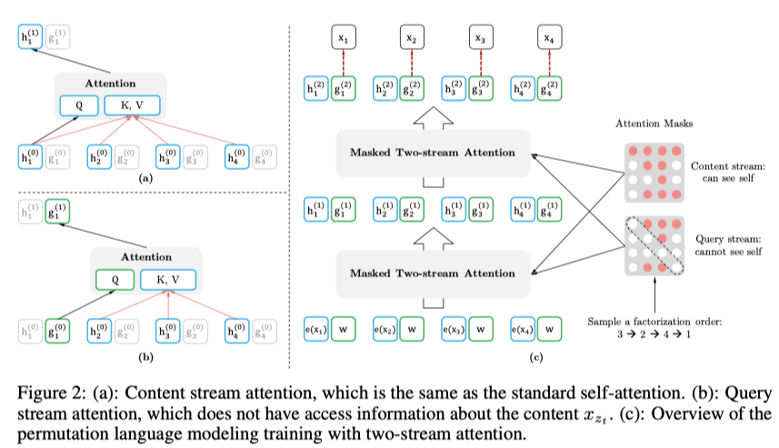
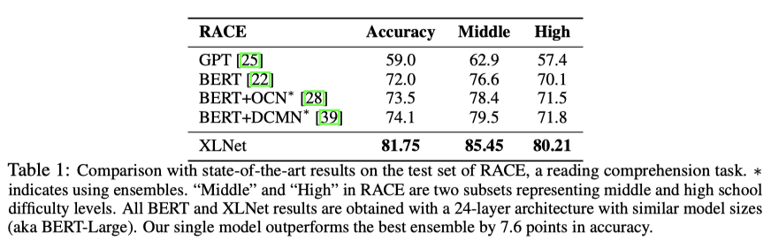
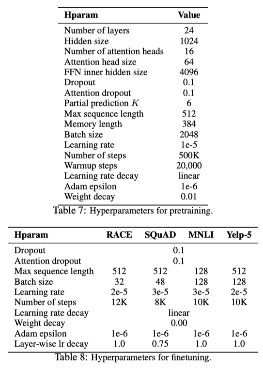
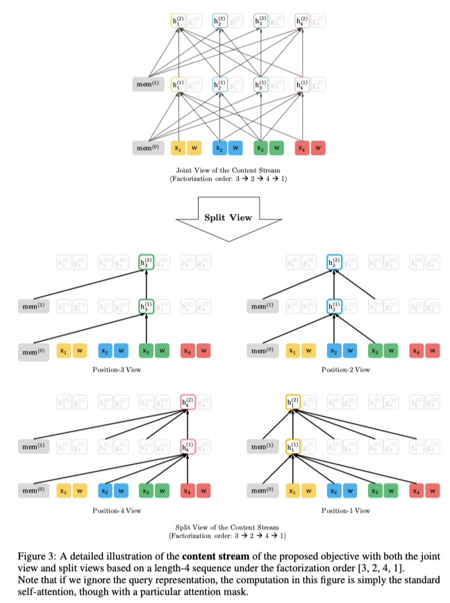
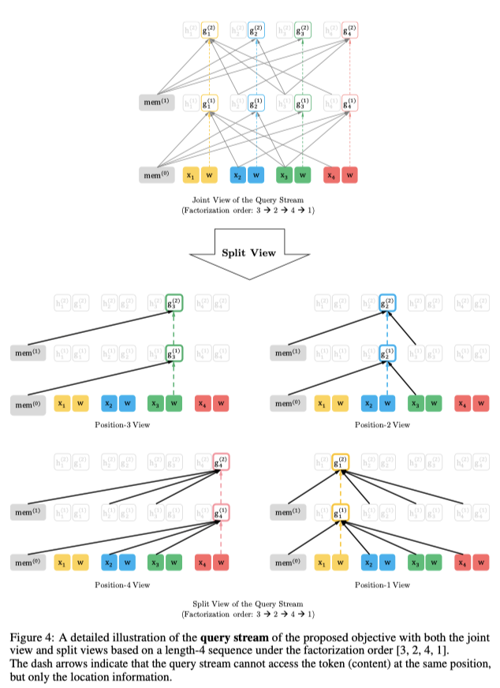

> **XLNet: Generalized Autoregressive Pretraining for Language Understanding**  
Zhilin Yang, Zihang Dai, Yiming Yang, Jaime Carbonell, Ruslan Salakhutdinov, Quoc V. Le  
https://arxiv.org/abs/1906.08237

# 1. Introduction
Unsupervised Representation Learning은 Large-scale의 corpora를 통해 Pre-train하고, Downstream task에 대해 fine-tune을 수행함. 이러한 Unsupervised Representation Learning은 NLP Domain에서 좋은 성능을 보여주었으며 이에 관한 연구 중 **Autoregressive(AR)** **Auto-encoding(AE)**이 가장 좋은 결과를 보여줌.  

AR language modeling은 previous token을 통해 sentence의 probability distribution을 추정한다.
$$
p(X)=p({ x }_{ 1 })p({ x }_{ 2 }|{ x }_{ 1 }),\cdots ,p({ x }_{ 1 },\cdots ,{ x }_{ T-1 })
$$ 
즉, AR language modeling은 현재 token을 계산하기 위해 $1$부터$T-1$까지 token의 conditional probability를 통해 probability distribution을 추정하기 때문에 양방향 context를 modeling하는데는 적합하지 않다. AR language modeling은 density distribution을 estimation하면서 language modeling을 수행하는데 이에 반해 BERT와 같은 AE기반의 language modeling은 오류가 있는 데이터로 부터 원본 데이터를 재구성하는 것에 목표로 한다.  

BERT는 input sequence에서 특정 부분에 **[MASK]**를 적용하여 input sequence를 복원하도록 학습하는데, bi-directional context를 사용하기 때문에 성능을 향상시킬 수 있었다. 그러나 pre-train에 사용하는 **[MASK]**가 fine-tune 단계에서는 사용되지 않아 pre-train과 fine-tune간에 불일치 문제가 존재한다.  

또한, BERT는 predicted token이 input sequence에서 **[MASK]**처리되어 있기 때문에 AR language modeling에서 곱의 규칙을 통해 얻을 수 있는 joint probability를 계산할 수 없다. joint probability를 사용하지 않는다는 것은 input sequence로 부터 predicted token들이 서로 독립적이라고 추정하게되며, 이는 **고차원(high-order), 장거리 의존성(long-term dependency)이 있는 자연어에서 지나치게 단순화** 된다고 볼 수 있다.  

이를 통해 본 연구에서는 기존의 language pre-training의 장단점에 직면하여 AR language modeling과 AE를 최대한 활용하는 generalized autoregressive method를 제안한다.
* 기존의 AR model들은 previous tokens를 통해 modeling을 하였지만 XLNet은 인수분해 순서의 모든 순열에 대해 log-likelihood를 최대화 할 수 있게 학습한다. 이를 통해 각 위치의 context는 왼쪽과 오른쪽의 token으로 구성될 수 있으며 각 위치는 양방향 문맥을 capture하여 학습한다.
* XLNet은 generalized AR language model이기 때문에 pre-train과 fine-tune간에 차이가 존재하지 않는다. 곱의 법칙을 통해 token들의 joint probability를 계산하기 때문에 BERT에서 발생한 token들을 독립적으로 추정하게 되는 문제를 발생시키지 않는다.
* 추가적으로 XLNet은 pre-training을 위한 architecture design을 개선한다.
    1. **segment recurrence mechanism**과 Transformer-XL의 **relative encoding scheme**을 pre-training에 적용하여 길이가 긴 sequence에 대해서 성능을 향상시킨다.
    2. XLNet과 같은 permutation-based language modeling에 Transformer-XL architecture를 naive하게 적용하는 것은 어렵기 때문에 Transformer-XL network를 reparameterize(모델 재구성?)하는 방법을 제안한다.
    
# 2. Proposed Method
## 2.1 Background
- AR language modeling과 BERT의 language model pre-training을 비교.  

text sequence $x=[{ x }_{ 1 },\cdots ,{ x }_{ T }]$가 주어지면 다음 식의 likelihood를 maximizing하는 방향으로 pre-traing을 진행한다.

$$
\underset { \theta  }{ max } \quad \log { { p }_{ \theta  } } (x)=\sum _{ t=1 }^{ T }{ \log { { p }_{ \theta  } } ({ x }_{ t }|{ x }_{ <t }) } =\sum _{ t=1 }^{ T }{ \log { \frac { { exp({ h }_{ \theta  }({ x }_{ 1:t-1 }) }^{ \intercal  }e({ x }_{ t })) }{ \sum _{ x\prime  }^{  }{ { exp({ h }_{ \theta  }({ x }_{ 1:t-1 }) }^{ \intercal  }e(x\prime )) }  }  }  } \quad (1)
$$

${ h }_{ \theta  }({ x }_{ 1:t-1 })$은 RNN 또는 transformer와 같은 neural model로부터 생성된 content representation이며, $e(x)$는 embedding을 나타낸다. BERT는 text sequence $x$에 대해 token 일부(e.g., 15%)를 **[MASK]**로 설정함으로써 손상된 $\hat{x}$를 구성한다. masked token을 $\overline { x }$라 할때 training objective는 $\hat { x }$로부터 $\overline { x }$를 재구성하는 것이다.

$$
\underset { \theta  }{ max } \quad \log { { p }_{ \theta  }(\overline { x } |\hat { x } ) } \approx \sum _{ t=1 }^{ T }{ { m }_{ t } } \log { { p }_{ \theta  }({ x }_{ t }|\hat { x } ) } =\sum _{ t=1 }^{ T }{ { m }_{ t }\log { \frac { exp({ H }_{ \theta  }{ (\hat { x } ) }_{ t }^{ \intercal  }e({ x }_{ t })) }{ \sum _{ x\prime  }^{  }{ exp({ H }_{ \theta  }{ (\hat { x } ) }_{ t }^{ \intercal  } } e(x\prime )) }  }  } \quad (2)
$$

${ m }_{ t }=1$이면 ${x}_{t}$는 **[MASK]** 이며, ${ H }_{ \theta }$는 length-T text sequence $x$ 로 부터 transformer를 통해 얻어지는 hidden vector ${ H }_{ \theta  }(x)=[{ H }_{ \theta  }{ (x) }_{ 1 },{ H }_{ \theta  }{ (x) }_{ 2 },\cdots ,{ H }_{ \theta  }{ (x) }_{ T }]$ 이다.
- 두 가지 pre-train의 장단점을 비교
    - **Independence Assumption:** BERT는 마스킹된 token $\overline { x }$가 독립되게 재구성된다는 가정에 기초하여 joint conditional probability $p(\overline { x } |\hat { x } )$를 인수분해 한다. 반면에 AR language modeling은 식1과 같이 곱의 규칙을 사용하여 ${ p }_{ \theta }(x)$를 인수분해 한다.
    - **Input noise:** BERT의 input에는 downstream task에서는 사용하지 않는 **[MASK]**와 같은 symbol이 사용되기 때문에 pre-train과 fine-tune간에 차이가 발생한다.
    - **Context dependency:** AR representation ${ h }{ \theta  }({ x }_{ 1:t-1 })$ 는 위치 $t$까지의 token에 대해서만 계산되지만 반면에 BERT representation ${ H }_{ \theta  }{ (x) }_{ t }$는 bidirectional contextual information에 접근할 수 있다. 결과적으로 BERT는 bi-directional context를 더 잘 capture할 수 있도록 pre-train된다.

## 2.2 Objective: Permutation Language Modeling

AR language modeling과 BERT는 다른 language modeling보다 고유한 장점을 가지고 있는데 단점을 피하면서 둘의 장점을 가져오는 pre-training objective에 초점을 맞춘다. [orderless NADE](https://arxiv.org/abs/1605.02226)에서 아이디어를 차용하여 **AR model의 장점을 유지하고 model이 bi-directional context를 capture**할 수 있도록 permutation language modeling objective를 제안.
길이가 $T$인 시퀀스 $x$에 대해 $T!$ 만큼 autoregressive 인수분해를 수행. model parameter들이 모든 인수분해 순서들에 걸쳐 공유되면, model은 양측의 모든 위치에서 정보를 모으는 방법을 train하게 된다. ${ Z }_{ T }$는 길이 $length-T$의 index sequence $[1,2,...,T]$의 모든 가능한 permutation 집합이라 정의한다. ${ z }_{ t }$와 ${z}_{<t}$를 사용하여 permutation $z\in { Z }_{ T }$의 $t$번째 element와 첫 번째 element $t-1$를 나타낸다.  
제안하는 permutation language modeling은 다음과 같이 표현할 수 있다.

$$
\underset { \theta  }{ max } \quad { { \mathbb{E} } }_{ z\sim { Z }_{ T } }\left[ \sum _{ t=1 }^{ T }{ \log { { P }_{ \theta  }({ x }_{ { z }_{ t } }|{ x }_{ { Z }_{ <t } } } ) }  \right] .\quad (3)
$$

text sequence $x$에 대해 인수분해 순서 $z$를 sampling하고 인수분해 순서에 따라 likelihood ${ p }_{ \theta }(x)$를 decompose 한다. 동일한 parameter $\theta$가 공유되어 학습되는 동안, ${x}_{t}`는$ ${x}_{i}\cancel{=}{x}_{t}$인 모든 element를 보기 때문에 bi-directional context를 capture할 수 있다.  
* **Remark on Permutation:** 제안하는 방식은 sequence 순서가 아닌 인수분해 순서만 바꾼다. 즉 원래의 sequence 순서를 유지하고 원본 sequence에 해당하는 positional encoding을 사용하여 인수분해 순서 permutation에 해당하는 attention mask를 얻는다.

## 2.3 Architecture: Two-Stream Self-Attnetion for Target-Aware Representations

permutation language modeling을 standard transformer에 naive하게 적용하기는 어려움이 있음. 위와 같은 문제를 확인하기 위해 softmax를 사용하여 next-token의 distribution ${ p }_{ \theta  }({ X }_{ { z }_{ t } }|{ x }_{ { { z }_{ <t } } })$를 parameter화 한다고 가정.

$$
{ p }_{ \theta  }({ X }_{ { z }_{ t } }=x|{ x }_{ { z }_{ <t } })=\frac { exp({ e(x) }^{ \intercal  }{ h }_{ \theta  }({ x }_{ { z }_{ <t } })) }{ \sum _{ x\prime  }^{  }{ exp({ e(x\prime ) }^{ \intercal  }{ h }_{ \theta  }({ x }_{ { z }_{ <t } })) }  }
$$

${ h }_{ \theta  }({ x }_{ { z }_{ <t } })$는 masking후 transformer로 부터 생성된 ${ x }_{ { z }_{ <t } }$의 hidden representation 을 의미한다. representation ${ h }_{ \theta  }({ x }_{ { z }_{ <t } })$는 ${z}_{t}$에 의존성이 없다는 것을 주목하자. 결과적으로 유용한 representation을 배울 수 없는 위치에 상관없이 동일한 distribution이 예측하게 된다. (Appendix A.1 참고)
위의 문제를 해결하기 위해 next-token의 distribution이 target position을 인식할수 있게 re-parameterize 한다.

$$
{ p }_{ \theta  }({ X }_{ { z }_{ t } }=x|{ x }_{ { z }_{ <t } })=\frac { exp({ e(x) }^{ \intercal  }{ g }_{ \theta  }({ x }_{ { z }_{ <t } },{ z }_{ t })) }{ \sum _{ x\prime  }^{  }{ exp({ e(x\prime ) }^{ \intercal  }{ g }_{ \theta  }({ x }_{ { z }_{ <t } },{ z }_{ t })) }  } ,\quad (4)
$$

${ g }_{ \theta  }({ x }_{ { z }_{ t } }{ z }_{ t })$는 target position ${ z }_{ t }$를 추가적으로 받는 새로운 유형의 representation을 나타낸다.  

### Two-Stream Self-Attention  
target-aware representation은 target prediction에서 모호성을 제거하지만, 식 ${ g }_{ \theta  }({ x }_{ { z }_{ <t } },{ z }_{ t })$를 어떻게 수식화 할것인지는 문제로 남아있다. target position ${ z }_{ t }$에 "stand"하고 position ${ z }_{ t }$에 의존하여 context ${ x }_{ { z }_{ <t } }$의 attention을 통해 정보를 합치는 것을 제안한다. 제안하는 parameterization이 동작하려면 standard transformer architecture를 사용할 수 없는 두 가지 이유가 있다.
1. token ${ x }_{ { z }_{ t } },{ g }_{ \theta  }({ x }_{ { z }_{ <t } },{ z }_{ t })$를 예측하기 위해 position ${ z }_{ t }$만 사용해야 한다. context ${ x }_{ { z }_{ t } }$ 를 사용하면 objective는 너무 간단해진다.
2. $j>t$일 때 다른 token ${ x }_{ { z }_{ j } }$를 예측하기 위해 ${ x }_{ { z }_{ t } }$는 완전한 context information을 제공하기 위해 content를 encoding 해야한다.

위를 해결하기 위해 하나가 아닌 두 세트의 hidden representation을 사용하도록 제안한다.
- **content representation:** ${ h }_{ \theta  }({ x }_{ { z }_{ \le t } })$(abbreviated as ${ h }_{ { z }_{ t } }$)는 transformer의 standard hidden state와 비슷한 역할을 한다. 이 representation은 content와 ${ x }_{ { z }_{ t } }$를 모두 encoding 한다.
- **query representation:** ${ g }_{ \theta  }({ x }_{ { z }_{ <t } },{ z }_{ t })$(abbreviated as ${ g }_{ { z }_{ t } }$)는 contextual information ${ x }_{ { z }_{ <t } }$와 position ${ z }_{ t }$에 접근할 수 있지만 content ${ x }_{ { z }_{ t } }$에는 접근할 수 없다.  

첫번째 layer query stream은 trainable vector로 initialzed 된다. (i.e., ${ g }_{ i }^{ (0) }=w$)  
content stream은 word embedding의 값으로 구성된다. (i.e., ${ h }_{ i }^{ (0) }=e({ x }_{ i })$)  
각각의 self-attention layer $m=1,...,M$의 경우, representation의 two stream들은 다음과 같이 공유 parameter집합으로 업데이트 된다.(그림 2(a)와 (b))

$$
{ g }_{ { z }_{ t } }^{ (m) }\leftarrow Attention(Q={ g }_{ { z }_{ t } }^{ (m-1) },KV={ h }_{ { z }_{ <t } }^{ (m-1) };\theta ),\quad (query\quad stream:use\quad { z }_{ t }\quad but\quad cannot\quad see\quad { x }_{ { z }_{ t } }
$$

$$
{ h }_{ { z }_{ t } }^{ (m) }\leftarrow Attention(Q={ h }_{ { z }_{ t } }^{ (m-1) },KV={ h }_{ { z }_{ \le t } }^{ (m-1) };\theta ),\quad (content\quad stream:use\quad both\quad { z }_{ t }\quad and\quad { x }_{ { z }_{ t } }).
$$

$Q,K,V$는 attention operation에서 query, key, value를 나타낸다. content representation의 update rule은 standard self-attention과 같으므로, fine-tune중에 query stream을 제거하거 content stream을 normal transformer(-XL)로 사용할 수 있다. last-layer query representation ${ g }_{ { z }_{ t } }^{ (M) }$를 사용하여 식(4)를 계산할 수 있다.
- **Partial Prediction**  
permutation language modeling은 장점이 있지만, 순열로 인해 최적화가 어렵고 수렴이 오래걸린다. 최적화의 어려움을 해결하기 위해, 인수분해 순서에서 마지막 token만 예측한다. $z$를 non-target subsequence ${ z }_{ \le c }$와 target subsequence ${ z }_{ >c }$로 분할한다. $c$는 cutting point이다. objective는 non-target subsequence에서 **target subsequence conditioned의 log-likelihood를 maximize**하는 것이다.  
${ z }_{ >c }$는 인수분해 순서 $z$가 주어진 sequence에서 가장 긴 context를 가지므로 target으로 선택된다. hyperparameter $K$는 prediction단계에서 $1/K$개의 token을 선택하기 위해 사용된다. (i.e., $\left| z \right| /(\left| z \right| -c)\approx K$) **unselected token들은 query representation이 계산되지 않기 때문에 메모리를 아끼고 속도를 향상시킬 수 있다.**
$$  
\underset { \theta  }{ max } \quad {\mathbb{E} }_{ z\sim { Z }_{ T } }\left[ \log { { p }_{ \theta  }({ x }_{ { Z }_{ >c } }|{ x }_{ { Z }_{ \le c } }) }  \right] ={ \mathbb{E} }_{ z\sim { Z }_{ T } }\left[ \sum _{ t=c+1 }^{ \left| z \right|  }{ \log { { p }_{ \theta  }({ x }_{ { z }_{ t } }|{ x }_{ { z }_{ <t } }) }  }  \right] .\quad (5)
$$  

## 2.4 Incorporating Ideas from Transformer-XL
앞에서 제안한 objective function이 AR framework에 맞기때문에 SotA AR language model인 transformer-XL에서 사용되는 두가지 중요한 기술  **relative positional encoding scheme**과 **segment recurrence mechasnism**을 pre-training framework에 포함시켰다. 제안된 permutation setting에 recurrence mechanism을 통합하고 previous segment의 hidden state를 다시 사용할 수 있는 방법을 설명한다. 긴 sequence에서 두개의 segment를 입력으로 받는다고 다음처럼 가정.  
$$
\tilde { x } ={ s }_{ 1:T }\quad and\quad x={ s }_{ T+1:2T }\quad
$$

$\tilde { z }$와 $z$를 $\left[ 1\cdots T \right]$와 $\left[ T+1\cdots 2T \right]$의 permutation이라고 가정한다.  
그 다음, permutation $\tilde { z }$를 통해 첫 번째 segment를 계산하고 각 layer $m$에 대해 얻어진 content representation ${ \tilde { h } }^{ (m) }$를 cache한다. next segment $x$에서 memory를 포함하는 attention update는 다음과 같다.

$$
{ h }_{ { z }_{ t } }^{ (m) }\leftarrow Attention(Q={ h }_{ { z }_{ t } }^{ (m-1) },KV=\left[ { \tilde { h }  }^{ (m-1) },{ h }_{ { z }_{ \le t } }^{ (m-1) } \right] ;\theta )
$$

$[.,.]$은 sequence dimension사이에 concatenation 의미함. positional encoding은 original sequence의 실제 position에만 의존하기 때문에 ${ \tilde { h } }^{ (m) }$이 계산되면 $\tilde { z }$와는 독립적이다. 이롤 통해 previous segment의 인수분해 순서에 대한 정보 없이 memory 를 caching하여 다시 사용할 수 있다. model은 last segment의 모든 인수분해 순서에대해 메모리를 활용하는 방법을 train한다고 추측한다. (자세한 그림은 부록 A.4 참고) query stream도 동일한 방법으로 계산할 수 있다. 그림 2(c)는 제안하는 permutation language modeling을 two-stream attention으로 보여주는 것이다.

## 2.5 Modeling Multiple Segments

많은 downstream task는 multiple input segment를 포함하고 있다. 예를 들면 QA같은 경우 question과 context paragraph로 구성됨. XLNet이 autoregressive framework에서 multiple segment를 어떻게 pre-train하는지 설명한다. BERT와 마찬가지로 random하게 선택된 segment를 concatenation하여 하나의 sequence로 permutation language modeling을 진행한다. XLNet의 input은 다음과 같다.

$$
[A,SEP,B,SEP,CLS]
$$

ablation study(Section 3.7참고)에 따라 XLNet-Large는 next sentence prediction을 수행하지 않았다.  
* **Relative Segment Encoding**  
  * architecture상으로 차이점은 BERT의 경우 word embedding에 각 position에 따라 absolute segment embedding을 적용하였고, XLNet은 transformer-XL에서 제안한 아이디어를 확장하여 relative segment encoding을 사용.  
  * sequence에서 $i$와 $j$인 position pair가 있고 $i$와 $j$가 같은 segment에 있을때, segment encoding ${ s }_{ ij }={ s }_{ + }$또는 ${ s }_{ ij }={ s }_{ - }$를 사용. ${ s }_{ + }$ 와 ${ s }_{ - }$는 각 attention head의 learnable model parameter.  
  * $i$가 $j$에 attend될 때, segment encoding ${s}_{ij}$는 attention weight ${ a }_{ ij }={ ({ q }_{ i }+b) }^{ \intercal  }{ s }_{ ij }$를 계산하는데 사용되며, ${q}_{i}$는 query vector같은 standard attention operation이고, $b$는 learnable head-specific bias vector이다. 다음으로 value ${a}_{ij}$가 normal attention weight에 더해짐.  

  * **relative segment encoding은 두가지 이점이 있음.**
      1. relative encoding의 inductive bias는 일반화를 향상.
      2. absolute segment encoding을 사용하여 불가능한 두 개 이상의 segment가 있는 task에 대한 fine-tune 가능성을 열어줌.

## 2.6 Discussion and Analysis
### 2.6.1 Comparison with BERT

식 $(2), (5)$에서 BERT와 XLNet은 sequence token의 subset만을 예측한다는 것을 알 수 있다.
모든 토큰이 mask처리되면, BERT는 의미있는 예측을 할 수 없기 때문에 필수적인 선택이다.
또한 BERT와 XLNet에서 partial prediction은 충분한 context가 있는 token만 예측하여 최적화가 어려워진다.
BERT와 XLNet의 차이점을 이해하기 위해 예시 $[New, York, is, a, city]$에 대해 비교해보자.
예시에서 $[New, York]$ 두 개의 token을 예측하고 $\log { p } (New\ York | is\ a\ city)$를 maximize한다고 가정한다.
또한, XLNet의 인수분해 순서는 $[is, a, city, New, York]$이라고 가정한다.
BERT와 XLNet의 object는 다음과 같다.

$$
{\mathcal{ J }}_{ BERT }=\log { p } (\mathrm{New}\ |\ is\ a\ city)+\log { p } (\mathrm{York}\ |\ is\ a\  city)
$$

$$
{\mathcal{ J }}_{ XLNet }=\log { p } (\mathrm{New}\ |\ is\ a\ city)+\log { p } (\mathrm{York}\ |\ {\color{Red}New},is\ a\  city)
$$

XLNet은 BERT에서 누락되는 (New, York) pair의 dependency를 capture할 수 있다.
예시를 통해 BERT는 (New, city)와 (York, city)와 같은 일부 dependency를 학습하지만 XLNet은 항상 동일한 대상에서 더 많은 dependenct pair를 학습하고 "denser"한 효과적인 train을 하는게 분명하다.
일반적인 점을 증명하기 위해 공식표현으로 설명한다.
이전연구 [Zhang et al., 2019](https://arxiv.org/abs/1901.09381)에서, sequence $\mathbf{x}=\left[ { x }_{ 1 },\cdots ,{ x }_{ T } \right]$가 주어지면 target-context pair $\mathcal{I}=\left\{ \left( x,\mathcal{U} \right)  \right\}$를 정의한다.
$\mathcal{U}$는 ${x}$의 context를 구성하는 $\mathbf{x}$의 token의 set이다.
pre-training동안 $\log { p } (x\ |\ \mathcal{U})$을 통해 model이 $\mathcal{U}$에 대한 $x$의 dependency를 train하기를 원한다.
예를 들어, 위의 문장이 주어지면 interest pair $\mathcal{I}$는 다음과 같이 인스턴스화 할 수 있다.

$$
\mathcal{I}=\left\{ \left( x=\mathrm{York},\mathcal{U}=\{ \mathrm{New}\}  \right) ,\quad (x=\mathrm{York},\mathcal{U}=\{ \mathrm{city}\} ),\quad (x=\mathrm{York},\mathcal{U}=\{ \mathrm{New,city}\} ),\cdots  \right\} .
$$

target token $\mathcal{T}$와 non-target token $\mathcal{N}=\mathrm{x}\setminus\mathcal{T}$가 주어지면 BERT와 XLNet은 $\log { p } (\mathcal{T}\ |\ \mathcal{N})$를 maximize하지만 다른 공식을 사용한다.

$$
{ \mathcal{J} }_{ BERT }=\sum _{ x\in \mathcal{T} }^{  }{ \log { p } (x\ |\ \mathcal{N});\qquad { \mathcal{J} }_{ XLNet }=\sum _{ x\in \mathcal{T} }^{  }{ \log { p } (x\ |\ \mathcal{N}\cup { \mathcal{T} }_{ <x }) }  } 
$$

$\mathcal{T}_{<x}$는 $x$이전의 인수분해 순서를 갖는 $\mathcal{T}$내의 token을 의미한다.
직관적으로, $\mathcal{U}\subseteq\mathcal{V}_{x}$와 같은 target-context pair $\left( x,\mathcal{U} \right) \in \mathcal{I}$가 존재하면, loss term $\log { p } (x\ |\ {\mathcal{ V} }_{ x })$는 $x$와 $\mathcal{U}$사이 dependency에 대한 training signal을 제공한다.
편의상 target-context pair $\left( x,\mathcal{U} \right) \in \mathcal{I}$가 $\mathcal{U}\subseteq\mathcal{V}_{x}$일 때, model(objective)로부터 *covered* 된다고 한다.
정의로부터, 다음 두가지를 생각해본다.
  1. $\mathcal{U}\subseteq \mathcal{N}$인 경우 BERT와 XLNet 모두 $\left( x,\mathcal{U} \right)$를 *covered*한다.
  2. $\mathcal{U}\subseteq \mathcal{N}\cup { \mathcal{T} }_{ <x }\quad and\quad \mathcal{U}\cap { \mathcal{T} }_{ <x }{ \cancel{=} }\cancel{\mathrm{0}}$인 경우 dependency는 XLNet만 처리할 수 있다. 결과적으로 XLNet이 BERT보다 더 많은 dependency를 처리 할 수 있고 Section3을 통해 경험적으로 성능이 향상되는것을 확인할 수 있다.

### 2.6.2 Comparison with Language Modeling

GPT와 같은 standard AR language model은 dependency $\left( x=\mathrm{York},\mathcal{U}=\left\{ \mathrm{New} \right\} \right)$는 *cover* 할 수 있지만, $\left( x=\mathrm{New},\mathcal{U}=\left\{ \mathrm{York} \right\} \right)$는 할 수 없다.
context-target pair $\left( x,\mathcal{U} \right)$에 대해 고려해보면 다음과 같다.  
  * $\mathcal{U}\cap { \mathcal{T} }_{ <x }\cancel{=}\cancel{\mathrm{0}}$일 때, $\mathcal{T}_{<x}$는 original sequence의 $x$보다 앞의 token을 나타내며, AR language modeling은 dependency를 *cover* 할 수 없다. 비교해보면 XLNet은 모든 dependency를 cover할 수 있다.
  * ELMo[24]와 같은 접근법은 shallow한 방식으로 forward 및 backward language model을 concatenation한다. 이는 두 방향 간의 deep interaction을 modeling하는데는 적합하지 않다.

### 2.6.3 Bridging the Gap Between Language Modeling and Pre-training

- density estimation을 기반으로한 language modeling은 빠르게 발전하는 분야이다.
- 그러나 2.6.2절에서 분석한 것처럼 bidirectional context를 modeling하는 기능이 없기 때문에 pre-train과 fine-tune에서 차이가 있었다.
- XLNet은 language modeling을 일반화하고 이러한 격차를 좁혔다. 또한 transformer-xl을 XLNet에 통합하여 최신 language modeling progress의 유용성을 보여준다.

# Appendix. Target-Aware Representation via Two-Stream Self-Attention

## A.1 A Concrete Example of How Standard LM Parameterization Fails

- 이 절에서는 2.3절에서 permutation objective가 standard language model parameterizaion이 실패하는 구체적인 예를 제시한다.
- 다음 관계를 만족하는 두개의 다른 permutation ${ \mathrm{z} }^{ (1) }$과 ${ \mathrm{z} }^{ (2) }$이 있다고 가정한다.

$$
{ \mathrm{z} }_{ <t }^{ (1) }={ \mathrm{z} }_{ <t }^{ (2) }={ \mathrm{z} }_{ <t }\quad but\quad { z }_{ t }^{ (1) }=i\cancel{=}j={ z }_{ t }^{ (2) }.
$$

- 이후 naive parameterization에 두 permutation을 대입하면 다음과 같다.

$$
\underbrace { { p }_{ \theta  }({ X }_{ i }=x|{ \mathrm{x} }_{ { \mathrm{z} }_{ <t } }) }_{ { z }_{ t }^{ (1) }=i,{ \mathrm{z} }_{ <t }^{ (1) }={ \mathrm{z} }_{ <t } } =\underbrace { { p }_{ \theta  }({ X }_{ j }=x|{ \mathrm{x} }_{ { \mathrm{z} }_{ <t } }) }_{ { z }_{ t }^{ (1) }=j,{ \mathrm{z} }_{ <t }^{ (2) }={ \mathrm{z} }_{ <t } } =\frac { exp({ e(x) }^{ \intercal  }h\left( { \mathrm{x} }_{ { \mathrm{z} }_{ <t } } \right) ) }{ \sum _{ x\prime  }^{  }{ exp({ e(x\prime ) }^{ \intercal  }h\left( { \mathrm{x} }_{ {\mathrm{ z }}_{ <t } } \right)) }  } .
$$

- 두개의 다른 target position $i$와 $j$는 동일한 model prediction을 공유한다. 그러나 두 position의 ground-truth distribution은 분명하게 달라져야 한다.

## A.2 Two-Stream Attention

- 이 절에서 transformer-xl backbone과 함께 two-stream attention의 세부 구현을 설명한다.
- Initial representation: $\forall t=1,\dots ,T:\quad { h }_{ t }=e\left( { x }_{ t } \right) \quad and\quad { g }_{ t }=w$
- 이전 segment로부터 cached된 layer-m content representation(memory): ${ \tilde { h } }^{ (m) }$
- transforemr-xl $m=1,\cdots ,M$에 대해 relative positional encoding과 position-wise feed-forward를 갖는 attention이 연속으로 사용되어 representation을 다음과 같이 update한다.

$$
\forall t=1,\dots ,T:\quad { \hat { h }  }_{ { z }_{ t } }^{ (m) }=\mathrm{LayerNorm}\left( { h }_{ { z }_{ t } }^{ (m-1) }+\mathrm{RelAttn}\left( { h }_{ { z }_{ t } }^{ (m-1) },\left[ { { \tilde { \mathrm{h} }  }^{ (m-1) },{ \mathrm{h} }_{ { \mathrm{z} }_{ \le t } }^{ (m-1) } } \right]  \right)  \right) \\ { h }_{ { z }_{ t } }^{ (m) }=\mathrm{LayerNorm}\left( { \hat { h }  }_{ { z }_{ t } }^{ (m) }+\mathrm{PosFF}\left( { \hat { h }  }_{ { z }_{ t } }^{ (m) } \right)  \right) \\ { \hat { g }  }_{ { z }_{ t } }^{ (m) }=\mathrm{LayerNorm}\left( { g }_{ { z }_{ t } }^{ (m-1) }+\mathrm{RelAttn}\left( { g }_{ { z }_{ t } }^{ (m-1) },\left[ { \tilde { \mathrm{h} }  }^{ (m-1) },{ \mathrm{h} }_{ { \mathrm{z} }_{ \le t } }^{ (m-1) } \right]  \right)  \right) \\ { g }_{ { z }_{ t } }^{ (m) }=\mathrm{LayerNorm}\left( { \hat { g }  }_{ { z }_{ t } }^{ (m) }+\mathrm{PosFF}\left( { \hat { g }  }_{ { z }_{ t } }^{ (m) } \right)  \right) 
$$

- target-aware prediction distribution: 
$$
{ p }_{ \theta  }\left( { X }_{ { z }_{ t } }=x|{ \mathrm{x} }_{ { z }_{ <t } } \right) =\frac { exp\left( { e }(x)^{ \intercal  }{ g }_{ { z }_{ t } }^{ (M) } \right)  }{ \sum _{ x\prime  }^{  }{ exp\left( { e(x\prime ) }^{ \intercal  }{ g }_{ { z }_{ t } }^{ (M) } \right)  }  } ,
$$

## A.3 Hyperparameters

### Hyperparameters for Pre-train and Fine-tune

## A.4 Visualizaing Memory and Permutation

- A.4절에서는 reusing memory mechanism(aka the recurrence mechanism), attention mask를 사용하여 인수분해 순서를 바꾸는 방법과 two-attention stream의 차이점을 비롯하여 제안하는 permutation language modeling objective를 자세히 보여준다.
- 그림3과 그림4와 같이 current position ${z}_{t}$가 주어지면, attention mask는 인수분해 순서에 의해 결정되어, 인수분해 순서에서 ${z}_{t}$이전의 token만 사용한다. (i.e. position ${z}_{i}$ with $i<t$)
- 또한 그림3,4를 비교하여 content stream과 query stream이 어떻게 다른 작동을 하는지 확인할 수 있다.
- 큰 차이점은 query stream은 self-attention을 할 수 없고 token의 position에 접근할 수 없다. 반면에 content stream은 normal self-attention과 동일하게 작동한다.

