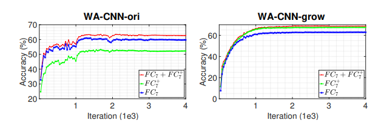

> **Growing a Brain: Fine-Tuning by Increasing Model Capacity(CVPR17)**  
Yu-Xiong Wang, Deva Ramanan, Martial Hebert  
https://ieeexplore.ieee.org/document/8099806

# Abstract
* 최근의 visual recognition system은 ImegeNet에서 knowledge transfer를 위해 fine-tuning을 사용한다.
* fine-tuning중에 구성요소와 parameter들이 어떻게 변하는지 분석하였고 model capacity의 증가가 fine-tuning을 통해 보다 자연스러운 model adaptation이 가능하게 한다는것을 발견했다.
* 기존의 layer를 확장하거나 전체 network를 심화하여 CNN을 "growing"하는것이 기존의 fine-tune보다 훨씬 뛰어나다는 것을 입증한다.

# 1. Motivation
Deep convolutional neural network(CNN)는 "big data"(매우 많은 이미지 데이터)를 가진 "big model"(수억개의 parameter를 가진)을 학습할 수 있는 능력을 통해 visual understanding을 변화시켰다.
그러나 이러한 데이터는 label이 필요하고 새로운 category, task들에 대해 많은 양의 labeling 작업을 하는것은 일반적으로 비현실적이다.
다행히 "base" 데이터 집합(e.g., ImegaNet)에 대해 교육을 받으면 CNN이 광범위한 task에서 transfer되는것처럼 보인다.
그러나 open question은 "pre-trained CNN을 novel categories 및 tasks에 adaptation시키는 최고의 방법은 무엇?" 이라고 볼 수 있음.
* **Fine-tuning:**
    * fine-tuning은 neural network를 이용한 transfer learning에 대한 strategy이다.
    * basic pipeline은 pre-trained network의 마지막 "classifier" layer를 대상 작업의 새로운 randomly initialized layer로 대체하는 작업이다.
    * 수정된 network는 target training set에서 적절하게 조정된 gradient descent의 추가적인 pass로 fine-tune된다.
    * 사실상 현대의 visual recognition system은 이와같인 pipeline을 사용함
    * 널리 사용되고 있지만 fine-tuning은 비교적 잘 이해되지 않고있다.
    * 그 질문으로 pre-trained weight는 실제로 변경되는 부분은 얼마인가? 식의 질문이 있을 수 있다.
* **Developmental networks:**
    * 이 문제를 해결하기 위해 model capacity가 증가하는 "developmental" neural network를 새로운 task로 탐구한다.
    * 그림 1과 같이 unit 추가에 대한 두가지 접근 방식을 탐구한다. 더 깊게(more layers) 더 넓게(more channels per layer)
    * developmental network는 source task에 대해 정확하며 잊어버리지 않고 배울 수 있다.
    * 마지막으로, developmental network가 특히 여러 task에 걸쳐 지속적인 transfer를 용이하게 한다는 것을 보여준다.
    
    그림 1: 몇가지 예시에서 새로운 category 인식을 위한 model capacity를 증가시킴으로써 pre-trained CNN의 transfer 및 developmental learning. 풍분한 데이터를 갖는 source task(e.g., ImegeNet classification)에서 network(e.g., AlexNet)가 pre-train. 고정 capacity model을 fine-tuning하는 dominant paradigm과 달리 두 가지 방식으로 새로운 대상 task(e.g., SNU-397 scene classification)에 적용할때 이 network를 확장한다. (1) 더 많은 layer (더 깊게) (2) layer당 channel을 추가 (더 넓게)
* **Developmental learning:**
    * 본 논문의 접근방식은 인지 과학에서의 developmental learning과 가까워 보인다.
    * 인간들중 특히 어린이는 이전에 습득한 knowledge를 새로운 시나리오로 지속적으로 transfer 할 수 있는 탁월한 능력을 갖추고 있다.
    * neuroscience[26], psychology[16]의 많은 논문들은 그러한 연속적인 knowledge 습득이 아동의 성장,발달과 긴밀히 연관되어 있음을 시사한다.
* **Contributions:**
본 논문을 통해 contribution하는 점은 세가지이다.
     1. 고정 capacity model을 fine-tuning하는 dominant paradigm이 차선책임을 입증함.
     2. model capacity를 증가시키기 위한 몇가지 방법을 탐구함. more layer, more channel per layer가 도움이 된다는 것을 일관되게 발견함.
     3. "pace of learning"(학습속도)가 model의 기존 단위와 균형을 이룰 수 있도록 추가 unit을 적절하게 normalization하고 확장해야 함을 보여준다.
        
# 2. Related Work
transfer learning에 대한 연구가 많이 있었지만 대부분 고정 capacity model을 가정함[32, 3, 6, 58, 15].
본 논문에서는 새로운 layer의 추가와 기존 layer의 확장을 포함하는 capacity를 늘리는 다양한 방법을 체계적으로 탐구한다.
본 논문과 가장 관련이 있는것은 reinforcement learning을 위해 원래 제안된[34] 진보적인 network이다.
[34, 38]은 target network를 source network의 두 배로 넓히는데 집중하지만, 새로운 unit만 fine-tuning한다.
대조적으로 본 논문에서는 새로운 unit의 작은 부분을 추가하고 전체 network를 fine-tuning하여 old unit의 adaptation이 고성능을 위해 중요한점이라는 것을 보여준다.
넓은 의미에서 본 논문의 접근은 발달 학습[26, 16, 36]과 평생 학습[41, 25, 39, 29]과 관련이 있음.
새로운 data를 기억할 때 capacity를 증가시키는 non-parametric shallow model(얕은 모델)과는 달리, 제안하는 network는 새로운 task로부터 capacity를 cumulatively하게 증가시킴.

# 3. Approach Overview
예를들어, 1,000개의 category가 있는 ImageNet에 pre-trained된 vanilla AlexNet과 같이 풍부한 데이터에서 pre-trained된 CNN architecture를 고려해본다[20, 33].
그림 1에서 알 수 있듯이 CNN은 feature representation module $\mathcal{F}$(5개의 convolutional layer와 2개의 fc layer)및 classifier module $\mathcal{C}$(1000개의 unit이 있는 최종 fc layer) 구성된다.
이 CNN을 제한된 train data(e.g., 397개의 장면 분류 dataset SUN-397)가 있는 새로운 task로 transfer하는것은 보통 fine-tuning을 통해 수행됨.
classic fine-tuning에서 target CNN은 다음과 같이 인스턴스화되고 초기화된다.
  1. representation modeul $\mathcal{F}_{T}$는 parameter ${ \Theta  }_{ T }^\mathcal{ F }={ \Theta  }_{ S }^\mathcal{ F }$를 갖는 source CNN의 $\mathcal{{F}}_{S}$로부터 복사됨.
  2. 새로운 classifier model $\mathcal{C}_{T}$는 parameter ${ \Theta  }_{ T }^{ C }$가 랜덤하게 초기화됨.
    * parameter ${ \Theta  }_{ T }^\mathcal{ F }$와 ${ \Theta  }_{ T}^\mathcal{ C }$는 backpropagation을 진행함으로써 fine-tune되며 ${ \Theta  }_{ T }^\mathcal{ F }$에 대한 learning rate는 더 작다.
    * ${ \Theta  }_{ T }^\mathcal{ F }$와 ${ \Theta  }_{ S }^\mathcal{ F }$가 동일한 network structure를 가지므로, representation capacity가 transfer동안 고정됨.
* 본 논문의 근본적인 thesis는 fine-tuning이 transfer learning동안 $increasing\ \ representational\ \ capacity$를 통해 향상될것이라는 것이다.
* 제안한 architecture를 $developmental\ \ network$라고 부르며, new representaion module $\mathcal{ F }_{ T }^{ * }=\mathcal{ F }_{ T }\cup { \left\{ { u }_{ s } \right\}  }_{ s=1 }^{ S }$이고 classifier module은 $\mathcal{C}_{T}$이다.
* adding $S$ new units ${ \left\{ { u }_{ s } \right\}  }_{ s=1 }^{ S }$ into $\mathcal{ F }_{ T }$
* 개념적으로 새로운 unit은 다양한 방법으로 기존의 network에 추가할 수 있다.
* 그러나 최근의 분석에 따르면 early network layer는 generic feature를 encoding하고, later layer들은 task-specific feature를 encoding한다.
* 이러한 분석에서 영감을 얻어 본 논문에서는 later layer에서 새로운 unit을 탐색하는것을 선택한다.
* 그림 2b와 같이 깊이있는 network(DA-DNN)로 이어지는 완전히 새로운 최상위 layer를 구성하거나 기존의 최상위 layer를 넓혀서 그림 2c와 같이 WA-CNN(width augmented network)을 만든다.
* 본 논문에서는 section 4에서 두 가지 유형의 network configuration을 설명한다.
* 그림 2d의 depth and width augmented network(DWA-CNN)과 recursively하게 width augmented된 WWA-CNN을 sention 5에서 설명한다.
 
그림 2: classic fine-tuning (a)와 augmented된 model capacity를 가지는 developmental network(b-e)의 시각화

# 4. Developmental Networks
## 4.1. Depth Augmented Networks (그림 2b)
* representation capacity를 증가시키는 방법은 ${L}_{K}$의 top부분에 ${ \left\{ { u }_{ s } \right\}  }_{ s=1 }^{ S }$를 통해 size $S$의 새로운 top layer ${L}_{a}$를 추가하는 것이다.
* 그림 2b와 같이 깊이가 증가된 representation module $\mathcal{ F }_{ T }^{ * }$로 이어질 수 있다.
* ${L}_{a}$를 기존 unit의 새로운 구성을 허용하는 adaptation layer로 본다. 따라서 새로운 task에 adaptation하기위해 pre-trained layer를 크게 수정하지 않아도 된다.
* layer ${L}_{a}$의 새로운 activation ${ h }^{ a }=f\left( { W }^{ a }{ h }^{ k } \right) $는 classifier module $\mathcal{C}_{T}$에 fed되는 representation이 된다.
* ${W}^{a}$는 layer ${L}_{a}$와 ${L}_{K}$ 사이의 weight

## 4.2. Width Augmented Networks (그림 2c)
* 다른 방법은 그림2c와 같이 network의 깊이를 고정시키면서 기존 layer에 ${ \left\{ { u }_{ s } \right\}  }_{ s=1 }^{ S }$를 추가하여 network를 확장하는 방법이다.
* generality를 잃지않고 모든 unit을 top layer ${L}_{K}$에 추가해야한다.
* 새로운 top representation layer ${ L }_{ K }^{ * }$는 두개의 block으로 구성된다.
    1. 기존의 ${L}_{K}$
    2. width가 증가된 representation module $\mathcal{F}^{*}_{T}$를 따르는 ${ \left\{ { u }_{ s } \right\}  }_{ s=1 }^{ S }$인 ${L}^{+}_{K}$
* ${L}^{+}_{K}$와 ${L}_{K-1}$사이에 weight ${W}^{K+}$를 추가한다.(randomly initialized)
* cissifier module에는 ${h}^{K}$와 ${h}^{K+}$의 concatenation을 fed한다.
* ${ h }^{ K }=f\left( { W }^{ K }{ h }^{ K-1 } \right)  $
* ${ h }^{ K-1 }=f\left( { W }^{ K+ }{ h }^{ K-1 } \right) $

## 4.3. Learning at the Same Pace
* target performance를 높이기 위해 이상적인것은 new and old units가 서로 협력하는 것이다.
* 그러나 width augmented network의 경우, unit들은 fine-tuning중에 다른 속도로 학습하기 시작한다.
* layer ${L}_{k}$의 unit은 adaptation을 위한 작은 수정만 필요하지만 새로운 layer ${L}^{+}_{k}$의 unit은 랜덤하게 초기화로부터 시작한다.
* 이러한 activation을 연결하지 않으면 해당 network가 제한되어 성능이 저하되고 붕괴될 수 있다.
* 이것이 related work들에서 network expansion이 fine-tuning보다 성능이 낮은것을 보여주는 이유이다.
* 이를 해결하기 위해 추가적으로 normalization과 adaptive scaling schmeme을 제안함.
    * $\mathcal{ F }_{ T }^{ * }$의 weight initialization을 수행
    * 식(1)과 같이 activation ${h}^{k}$와 ${h}^{k+}$에 $\mathcal{L}_{2}$-norm normalization 적용
    
$$
{ \hat { h }  }^{ k }={ h }^{ k }/{ \left\| { h }^{ k } \right\|  }_{ 2 },{ \hat { h }  }^{ k+ }={ h }^{ k+ }/{ \left\| { h }^{ k+ } \right\|  }_{ 2 }.\quad \quad (1)
$$

* activation을 normalization하면 규모가 scale된다.
* norm을 1로 normalization하면 학습 속도가 느려지고 network학습하기가 어려워진다.
* [23]과 같이 더 큰값(e.g., 10 or 20)으로 normalization하여 network가 잘 학습할 수 있도록 한다.
* normalization된 값을 scaling하기위해 각 channel에 scaling parameter $\gamma $를 도입한다.
$$
{ y }_{ i }^{ k }={ \gamma  }_{ i }{ \hat { h }  }_{ i }^{ k },{ y }_{ j }^{ k+ }={ \gamma  }_{ i }{ \hat { h }  }_{ j }^{ k+ }.\quad \quad (2)
$$
* depth augmented network의 경우 normalization 및 scailing이 추가 단계가 크게 중요하진 않지만, 영향은 있다.
* fine-tuning동안 scaling factor $\gamma$는 backpropagation에 의해 fine-tuned 됨.
    
# 5. Experimental Evaluation
* 이 section에서는 pre-trained CNN을 사용하여 scene classification, fine-grained recognition, action recognition여러 supervised learning task 수행을 위한 developmental network 사용을 탐구한다.
* augmented network capacity가 classic fine-tuning보다 더 성능이 높은 이유를 정성적으로 이해할 수 있도록 fine-tuning절차에 대한 심층 분석을 제공한다.
* 마지막으로, cumulatively하게 증가하는 것이 고정된 large network를 fine-tuning하는것보다 우수한지 조사하고 cumulatively하게 여러 task에 adaptation할 때 network에 새로운 capacity를 누적해서 추가하는 방법을 설명한다.
* **Implementation details:**
    * ImegeNet(ILSVRC 2012)에 Pre-trained된 AlexNet의 Caffe 구현 사용
    * VGG16[37]을 사용하여 일련의 실험도 수행
    * target task를 위해 classifier layer와 augmented layer를 무작위로 초기화
    * 이미지를 256x256 사이즈로 resizing후 fine-tuning동안 random crops와 flip포함한 standard augmented data를 수행한다.
    * 공정한 실험을 위해 "step" learning rate policy를 사용한 SGD를 통해 학습 속도가 fine-tuning동안 10 factor만큼 떨어짐
    * 새로운 layer는 fine-tuned layer보다 10배 큰 learning rate로 fine-tuned된다.
    * momentum 0.9, weight decay 0.0005
    
## 5.1. Evaluation and Analysis on SUN-397
* SUN-397 dataset을 통한 성능검증. 매개변수는 동일.

* **Learning with augmented network capacity:**
  * pre-trained AlexNet을 확장하여 실험 진행
  * depth augmented network(DACNN)의 경우 new fc layer $F{C}_{a}$ 를 추가. size=4,096
  * width augmendted network(WA-CNN)의 경우 ${S}^{W}$ size의 new unit $F{C}^{+}_{7}$를 $F{C}_{7}$에 추가
      * ${ S }^{ W }\in \left\{ 1024,2048 \right\} $
  * 점차적으로 fine-tuning 정도를 높이는 네가지 시나리오에서 학습을 진행한다.
      1. "New": pre-trained layer를 고정하면서 확장된 레이어를 포함한 new layer만 fine-tune한다.
      2. "$F{C}_{7}$-New:" $F{C}_{7}$ layer로부터 fine-tune
      3. "$F{C}_{6}$-New:" $F{C}_{6}$ layer로부터 fine-tune
      4. "All": 전체 network fine-tune
  * 표1 은 기존의 fine-tuning과 성능 비교를 한 요약
  * DA-CNN과 WA-CNN 모두 vanilla CNN보다 높은 성능을 보여줌.

* **Increasing network capacity through combination or recursion:**
  * 그림 2d,2e와 같이 network를 더 깊게 넓게 확대하여 실험을 진행
  * jointly depth and width augmented network(DWA-CNN)(그림 2d)의 경우 $F{C}_{a}$를 $F{C}_{7}$에 추가하고 $F{C}_{7}$의 크기를 ${F}^{DW}$로 확장한다. ${ S }^{ DW }\in \left\{ 1024,2048 \right\} $
  * recursively width augmented network(WWA-CNN)(그림 2e)의 경우 size ${S}^{WW}_{7}$의 $F{C}^{+}_{7}$ 및 size ${S}^{WW}_{7}$의 $F{C}^{+}_{6}$의 $F{C}^{+}_{6}$을 사용하여 $F{C}_{7}$을 확장한다.
  * ${ S }_{ 7 }^{ WW }\in \left\{ 1024,2048,4096 \right\} $이고 ${S}^{WW}_{6}$은 ${ S }_{ 7 }^{ WW }$의 절반이다.
  * 표1에서 DWA-CNN, WWA-CNN을 DACNN, WA-CNN과 비교한다.
  * 일반적으로 2-layer WWA-CNN은 가장좋은 성능을 보여줬으며 model capacity를 다양하고 보완적인 수준에서 보강하는 것이 중요함을 나타낸다.
  * DWA-CNN은 WA-CNN보다 조금 떨어지는데 이것은 network를 더 깊게 또는 더 넓게 만들때 다른 학습 행동을 의미한다.
  * 따라서, 이들의 조합은 중요한 작업이 아니다.

표1: SUN-397 dataset의 task에서 고정된 model capacity를 가진 network의 fine-tuning과 augmendted model capacity를 가진 developmental network의 정확도(%) 비교. 

* **Diagnostic analysis:**
  * 표1을 통해 최상의 성능을 요약했지만 표2의 augmented unit ${ S }^{ D },{ S }^{ W },{ S }^{ DW },{ S }^{ WW }$에 대한 실험은 network architecture의 변형이 classic fine-tuning보다 훨씬 뛰어나며 견고하다는 것을 보여준다.
  * 전반적으로 augmented model capacity가 증가하면 성능이 향상되지만 new unit의 수가 증가하면 성능이 감소한다.

표2: SUN-397에서 다른 new unit 갯수를 가진 developmental network 변형에 대한 정확도(%) 비교.

* **Importance of reconciling the learning pace of new and old units**
  * 이전 연구들에서 network expansion이 추가 이점을 보여주지 못한것은 new unit과 old unit의 다른 학습속도를 고려하지 않았기 때문이라고 주장한다.
  * initialization과 같은 다양한 전략을 탐색한후에 pre-trained layer와 expanded layer를 연결하면서 간단한 normalization, scaling scheme 기법이 width augmented network에 크게 기여한다는 것을 발견했다. (표3)
  * WA-CNN의 경우 위의 기법을 적용하면 성능이 큰폭으로 오르는 반면 DA-CNN의 경우는 적용을 하지 않아도 baseline을 넘는다.
  * 즉, new unit이 새로운 layer를 형성하기 위해 추가될때는 상대적으로 더 많은것을 처음부터 배울 수 있는 자유를 가지므로 추가적인 scaling은 중요하지 않다. 반면 pre-trained layer를 확장하기위해 unit을 추가할때는 synergy 효과 제약으로 기존 유닛과 협업을 해야하므로 필요하다.

표3: normalization, scaling scheme을 도입한 경우와 도입하지 않은 경우 dapth(DA-CNN) width(WA-CNN) network의 정확도(%) 비교. 제안하는 normalization, scaling scheme기법은 new unit과 old unit의 학습속도를 조정하므로 특히 WA-CNN에서 크게 이점을 발휘한다.

* **Learning without forgetting:**
  * 제안하는 network는 source task에 대해 정확해야 한다. 표4는 원본 ImageNet dataset에 대한 classification 성능을 보여줌으로써 잊지 않고 학습하는 능력을 검증한다.

표4: ImegeNet validation set를 잊지 않고 학습하는 능력을 입증. SUN-397에서 fine-tuning된 DA-CNN 및 WA-CNN을 ImegeNet training set로 augmendted layer와 함께 학습. 본 논문의 접근방식은 target task 성능향상에 중점을 두지만 source task에서도 정확한것을 확인할 수 있음.

### 5.2. Understanding of Fine-Tuning Procedures
* fine-tuning 절차를 다양한 관점에서 분석하여 fine-tuning이 pre-trained network를 수정하는 방법과 왜 model capacity를 늘리는것이 도움이 되었는지에 대한 insight를 도출한다.
* SUN-397 validation set을 사용하며 명확한 분석과 비교를 위해 DA-CNN과 WA-CNN에 초점을 맞춘다.
* 두 model은 2048개의 new unit이 있다.

* **Feature visualization:**
  * feature space의 topology를 대략적으로 이해하기 위해 standard t-SNE algorithm을 사용하여 feature를 시각화한다.
      1. 그림3 상단 왼쪽: pre-trained network의 4096-dim feature $F{C}_{7}$
      2. 그림3 상단 오른쪽: fine-tuned network의 4096-dim feature $F{C}_{7}$
      3. 그림3 하단 왼쪽: 6144-dim의 wider feature $F{ C }_{ 7 }+F{ C }_{ 7 }^{ + }$
      4. 그림3 하단 오른쪽: 2048-dim의 deeper feature $F{C}_{a}$
  * semantic category에 따라 다른 색깔을 가진다.
  * classic fine-tuning이 pre-trained된 network의 의미론적 분리를 어떻게든 향상시키는 반면, 제안하는 network는 모두 향상된 classification 성능과 호환되는 semantic clustering 구조를 상당히 명확하게 나타낸다.

그림3: SUN-397 validation set를 통한 상위 layer를 t-SNE 시각화. DA-CNN, WA-CNN이 훨씬더 의미론적으로 분리되어 있음.

* **Maximally activating images:**
  * fine-tuning이 어떻게 feature space를 변화시키는지 더 자세히 분석하기 위해 some unit을 최대로 activate하는 top5 이미지를 검색한다.
  * 그림4는 interesting transition을 보여준다.
      * pre-trained network가 source task(첫번째 그림)에 특정하게 집중된 개념을 학습하는 동안, 그러한 개념은 새로운 target task(두번째 그림)에 대한 개념의 혼합으로 확장된다.
  * fine-tuning은 target task에 대한 적합한 개념 중 하나를 재 집중화하려고 시도하지만 capablity는 제한적이다.(세번째 그림)
  * 제안하는 width augmendted network는 이러한 재 집중화를 촉진하여 차별 패턴(네번째 그림)을 유도한다.
  * 그림 5에서 depth augmented network의 $F{C}_{a}$에 있는 단위에 대해 이미지를 최대로 활성화하는 것을 보여준다.

그림 4: 4개의 $F{C}_{7}$ unit에 대해 이미지를 최대로 활성화하는 top 5. 왼쪽부터: ImegeNet validation image for pre-trained network, SUN-397 validation image for pre-trained, fine-tuned, WA-CNN networks. 이미지의 각 행은 network의 공통 단위에 해당하며, 이는 제안하는 WA-CNN이 새로운 target task에 대한 기존 단위의 특수화를 용이하게 한다는 것을 나타낸다. 예를들어, 맨 아래 줄은 ImegeNet pre-trained network에서 펭귄처럼 수직으로 반복되는 패턴 fine-tuned network에서는 여러 혼합된 개념으로, WA-CNN은 옷장과 같인 수직 반복 패턴으로의 전환을 보여준다.

그림 5: depth augmented netowkr(DA-CNN)의 6개 $FC$에 대해 SUN-397에서 이미지를 최대로 할성화하는 top 5. 좌측 및 우측 column들 내의 5개 이미지들의 각 행은 각 target task에 대한 scene-level 개념. e.g. 강당 및 수의학실이 첫번째 행에 배치됬다. 

## 5.4. A Single Universal Higher Capacity Model?
* 흥미로운 한가지 질문은 본 논문의 결과가 standard model이 source task(e.g., ImageNet)에 대해서도 더 높은 capacity를 사용해야 한다는 것을 의미할수 있는지? 라는것이다.
* 이를 위해 AlexNet(WA-CNN)의 점진적 확대를 시도한다. 특히 source domain에서 표6은 network의 점진적 확장이 처음부터 교육된 고정된 wide network를 능가한다는 것을 보여준다.
* 더욱 중요한 점은 표 7을 보면 target domain에서 점진적 확대가 고정된 wide network를 fine-tuning하는것보다 현저하게 우수한것으로 나타났다.

표 6: standard AlexNet, scratch부터 학습된 wide AlexNet(WA-CNNscratch), 점진적으로 train된 wide network (WA-CNN-grow)들의 정확도 성능 비교. 점진적 학습은 source task에서도 도움이 되는것처럼 보인다.

표 7: standard AlexNet(CNN-FT)의 standard fine-tuning과 wide AlexNet(WA-CNN-ori)의 standard fine-tuning 간의 target dataset에 대한 classification 정확도(%) 비교. 동일한 모델 capacity를 가진 WA-CNN은 WA-CNN-ori보다 훨씬 더 뛰어난 성능을 보여줌.

* **Cooperative learning(협동 학습):**
* 그림 6과 그림7은 old unit과 new unit사이의 협동 학습 행동에 대한 deep한 분석을 제공하며 developmental learning이 unit의 다양성을 장려하는 방식으로 network를 regularization 하는것처럼 보여진다.

그림 6: CUB200-2011 testset에서 WA-CNN의 $F{C}_{7}$,$F{C}^{+}_{7}$ 및 이둘의 조합에 대한 learning curves. 왼쪽과 오른쪽 그림은 다른 learning behavior을 보여줌: WA-CNN-ori의 unit은 source에 지나치게 특화된것으로 보이는 반면 WA-CNN의 새로운 unit은 새로운 target task에 대해 더 잘 조정된 다양한 expert로 보인다. 흥미롭게도 expert들은 기존 및 새로운 unit보다 더 나은 adaptation을 허용한다.(그림 7)

그림 7: 대표적인 $F{C}_{7}$(첫번째 행) unit 및 $F{C}^{+}_{7}$(두번째 행)에 대해 CUB200-2011 이미지를 최대로 활성화하는 top 5. 각 이미지 행은 WA-CNN-ori(왼쪽)와 WACNN-grow(오른쪽)의 두 network에서 공통단 unit에 해당함. WA-CNN-ori와 비교하여 WA-CNNgrow는 차별적인 pattern(상단: 물속의 새, 하단: 노란색 배가있는 새)을 capture함으로써 기존 task가 새로운 task에 adaptation하는것을 용이하게 함.

* **Continual transfer across multiple tasks:**
* 본 논문의 접근 방식은 특히 표8에 나와있는 것처럼 model capacity를 누적으로 증가시킬 수 있기 때문에 여러 task에 걸쳐 지속적으고 원활한 transfer에 적합하다.

표 8: SUN-397을 통한 점진적인 grwoing을 통해 확장된 AlexNet은 MIT-67의 성능을 획기적으로 향상 시켰으며 400개의 scene category dataset(Places)을 통해 train된 Places AlexNet과 ImegeNEt VGG16의 성능을 훨씬 능가하는 성능을 보여줌.

# 6. Conclusions
* fine-tuning CNN에 대해 심도있는 연구를 수행함.
* network의 변화와 방법을 분석하면서 model capacity 증가는 기존 network가 target task에 보다 잘 adaptation하고 specialization하는데 크게 도움이 된다는 결론을 얻었음.
* depth와 width가 augmented된 network를 모두 분석하여 fine-tuning에 유용하며 확장을 위한 일관된 이점을 가지고 있다고 결론을 내림.
* 새로 추가된 unit이 기존 unit과 비교되는 학습 속도를 가젹야 되는 이슈를 normalization과 scaling scheme를 통해 해결.
* 마지막으로, model capacity의 증가의 이점을 보여주는 실험을 하였으며 몇가지 SOTA를 보여주었음.
