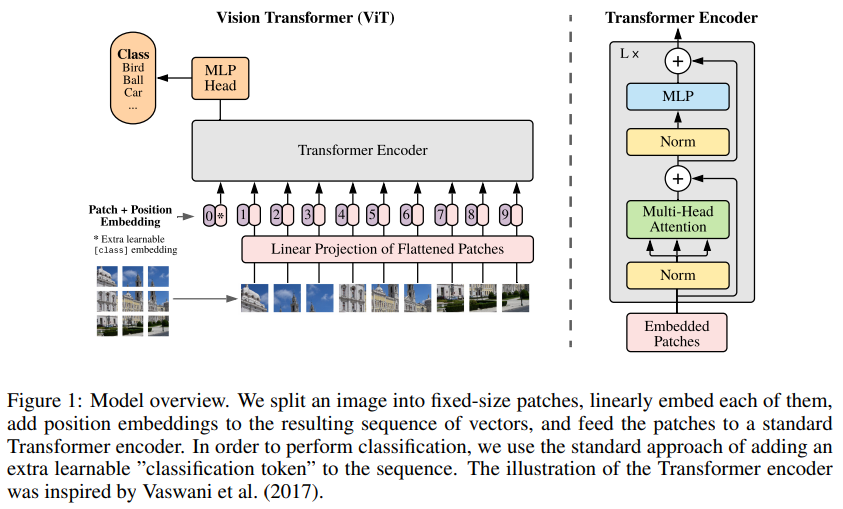
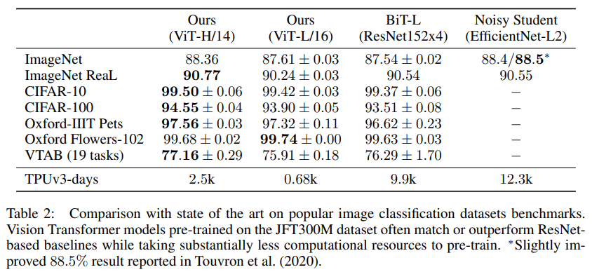
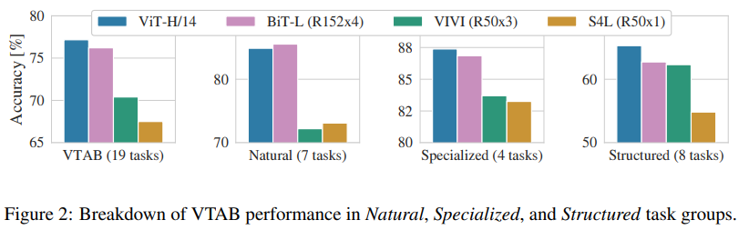
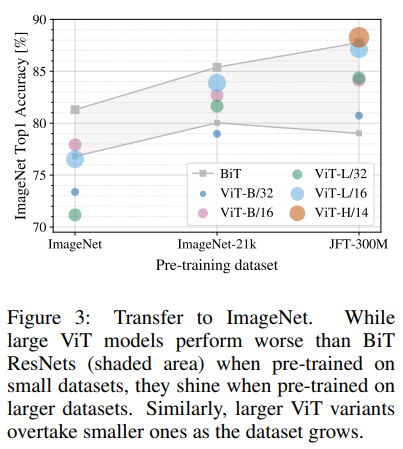
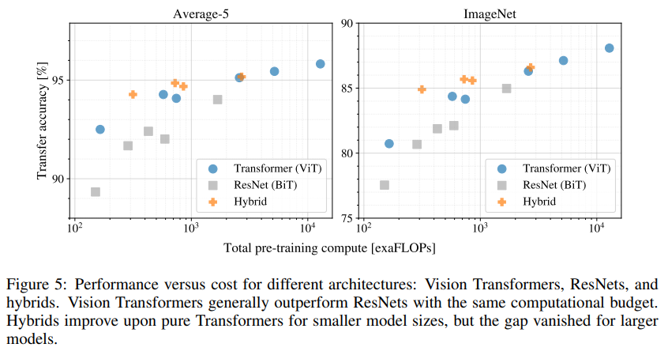
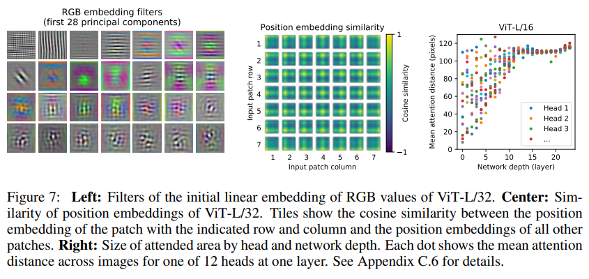
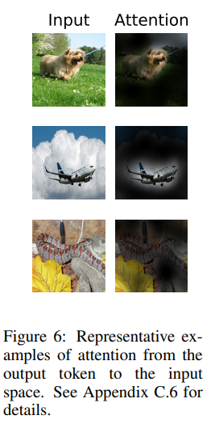
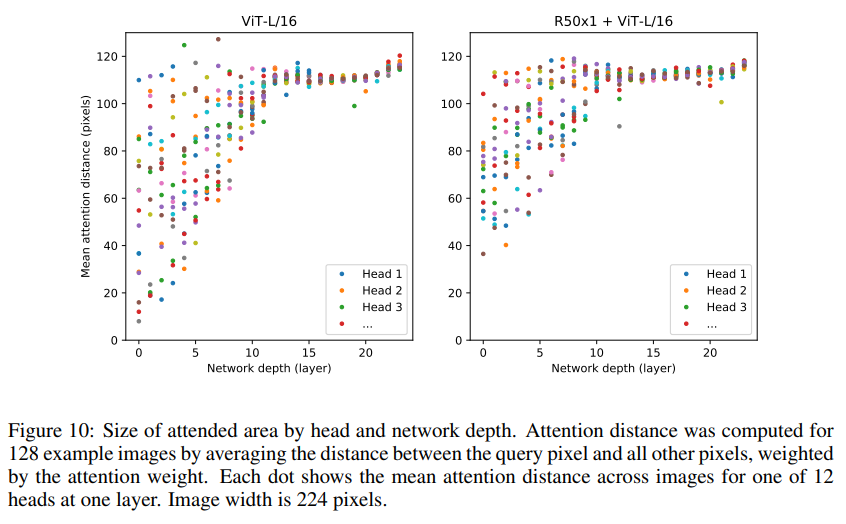
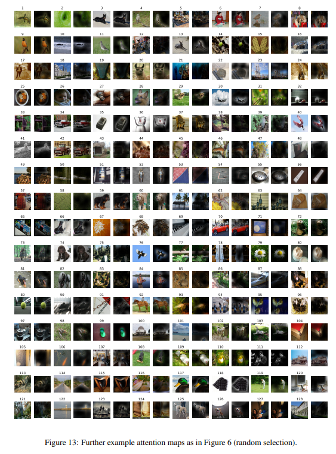

> **An Image is Worth 16X16 Words: Transformers for Image Recognition at Scale**  
Alexey Dosovitskiy, Lucas Beyer, Alexander Kolesnikov, Dirk Weissenborn, Xiaohua Zhai, Thomas Unterthiner, Mostafa Dehghani, Matthias Minderer, Georg Heigold, Sylvain Gelly, Jakob Uszkoreit, Neil Houlsby  
https://arxiv.org/abs/2010.11929

# Abstract
 Transformer architecture는 NLP task에서는 표준이 되었지만 computer vison task에서는 아직 제한적이다.
Computer vision task에서 attention은 CNN과 함께 적용되거나 전체구조를 유지하면서 CNN의 특성 요소를 대체하는데 사용된다.  
본 논문에서는 CNN에 대한 이러한 의존이 필요하지 않으며 image patch의 seqeuence가 transformer에 적용될 때 image classification task에서 잘 수행될 수 있음을 보여준다.  
많은 양의 데이터에 대해 사전 학습을 수행하고 여러가지 recognition benchmark(ImageNet, CIFAR-100, VTAB 등)에 대해 transfer learning을 수행하면 Vision Transformer는 훨씬 적은 computational resource를 가지며 동시에 SotA CNN과 비교하여 더 우수한 결과를 얻을 수 있다.

# 1. Introduction
Transformers는 NLP에서 선택되는 모델이 되었다.
대부분의 접근 방식은 large text corpus에서 pre-train을 수행하고 task-specific dataset에 대해 fine-tuning을 수행하는 것이다(BERT).
Transformers의 계산 효율성 및 확장성으로 100B 이상의 parameter를 사용하여 전례없는 크기의 모델을 학습 할 수 있게 되었다.

그러나 computer vision에서는 CNN이 여전히 많이 사용된다.
NLP 성공에 영감을 받아 여러 연구들에서 CNN과 유사한 architecture를 self-attention과 결합하려고 시도하며([Wang et al., 2018](https://arxiv.org/abs/1906.01787); [Carion et al., 2020](https://arxiv.org/abs/2005.12872)) 일부는 CNN을 완전히 대체한다([Ramachandran et al., 2019](https://arxiv.org/abs/1906.05909); [Wang et al. , 2020a](https://arxiv.org/abs/2003.07853)).  
후자의 연구들은 이론적으로는 효율적이지만 specialized attention pattern을 사용하기 때문에 최신 하드웨어 가속기에서는 아직 효과적으로 사용하기 어렵다. 따라서 large-scale image recognition task에서 ResNet-like architecture는 여전히 SotA.

NLP의 Transformer 성공에 영감을 받아, 가능한 최소한의 수정으로 Transformer를 이미지에 직접 적용하는 실험을한다. 이를 위해 image를 patch로 분할하고 이러한 패치의 linear embedding sequence를 Transformer에 대한 입력으로 feed한다. Image patch는 NLP 애플리케이션의 token(word)과 동일한 방식으로 처리된다.

이러한 모델은 ImageNet과 같은 중간 규모의 dataset에서 학습할때 적당한 결과를 산출하여 비슷한 크기의 ResNet보다 조금 아래의 정확도를 달성한다. 이는 겉보기에 실망스러운 결과를 예상 할 수 있다. Transformer는 translation equivariance 및 locality와 같은 CNN 고유의 inductive bias가 없기 때문에 불충분한 양의 data에 대해 학습할 때 일반화가 잘 되지 않는다.

그러나 large-scale dataset(14M-300M Images)에서 모델을 학습하면 이와 다르다. large-scale training이 inductive bias를 능가한다는 것을 알게 되었다. Transformer는 충분한 규모로 사전 학습되고 더 적은 데이터 포인트가있는 작업으로 전송 될 때 좋은 결과를 얻는다.  
JFT-300M 데이터 세트에 대해 사전 훈련 된 Vision Transformer는 여러 Image Recognition Benchmark에서 SotA에 접근하거나 이를 능가하여 ImageNet에서 88.36%, ImageNet-ReaL에서 90.77%, CIFAR-100에서 94.55%, 77.16%의 정확도를 달성했다.

# 2. Related Work
Transformer는 NMT(Neural Machine Translation)을 위한것이며 많은 NLP task에서 SotA를 달성했다.
Large Transformer-based model은 종종 large-scale corpus에 대해 pre-train을 수행하고 해당되는 task에 fine-tuning을 수행한다.
BERT는 denoising self-supervised pre-training task를 사용하는 반면 GPT 계열은 language modeling방식으로 pre-train을 수행한다.

Self-attention을 image에 naive하게 적용하려면 각 픽셀이 다른 모든 픽셀에 attention해야한다.
이는 픽셀수의 quadratic cost를 가지고 실제 input size로 확장되지 않는다.
따라서 image generation 측면에서 Transformer를 적용하기 위해 시도된 몇 가지 연구들이 있다.

가장 최근의 연구인 [iGPT](https://cdn.openai.com/papers/Generative_Pretraining_from_Pixels_V2.pdf)는 image resolution과 color sapce를 줄인 후 이미지에 대해 transformer를 적용한다. Model은 unsupervised 방식으로 학습되고 이후 fine-tuning을 수행하거나 linear를 수행하여 ImageNet에서 72%의 정확도를 달성하였다. 해당 연구는 SotA결과를 얻기 위해 추가적인 데이터에 의존한다.

[Sun et al.(2017)](https://arxiv.org/abs/1707.02968)은 CNN 성능이 dataset 크기에 따라 어떻게 확장되는지 연구하고 [Kolesnikov et al. (2020)](https://arxiv.org/abs/1912.11370); [Djolonga et al. (2020)](https://arxiv.org/abs/2007.08558)은 ImageNet-21k 및 JFT-300M과 같은 large-scale dataset에서 CNN transfer learning에 대한 경험적 탐색을 수행하며, 모두 본 논문이 초점을 두고 있다.

# 3. Method
## 3.1 Vision Transformer(ViT)

 이미지용 Transformer는 NLP용으로 설계된 architecture를 따르며 그림1과 같다.
Standard Transformer는 token embedding의 1D sequence를 입력으로 받는다.  
이미지를 처리하기 위해 $\mathbf{x}\in \mathbb{ R }^{ H\times W\times C }$ 를 flatten된 2D patch ${ x }_{ p }\in { R }^{ N\times \left( { P }^{ 2 }\cdot C \right)  }$ sequence로 재구성한다.  
$\left( H,W \right) $는 원본 이미지의 resolution이고 $\left( P,P \right) $ 는 각 이미지 patch의 resolution이다.
$N=HW/{ P }^{ 2 }$는 Transformer의 sequence length이다.  
Transformer는 모든 layer를 일정한 width를 사용하므로 학습 가능한 linear projection은 각 vectorized patch를 dimension $D$(식 1)에 mapping하며, 그 결과를 patch embedding이라고 한다.

BERT의 $[class]$ token과 유사하게 Transformer encoder의 output state $\left( { z }_{ 0 }^{ L } \right) $가 image representation $y$로 사용되는 embedded patch의 sequence $\left( { z }_{ 0 }^{ 0 }={ x }_{ class } \right) $ 앞에 학습 가능한 embedding을 추가한다(식 4).  
Pre-train 및 fine-tuning중에 classification head는 $\left( { z }_{ L }^{ 0 } \right) $ 에 추가된다.

Position embedding은 위치 정보를 유지하기 위해 patch embedding에 더해진다.  
Appendix C.3에서 position embedding의 2D-aware variants에 대해 탐색한다.

Transformer Encoder는 Multi-headed self-attention 및 MLP block으로 구성된다. Layernorm(LN)은 모든 block 이전에 적용되고 residual connection은 모든 block 이후에 적용된다.  
$$
\mathbf{ z }_{ 0 }=\left[ \mathbf{ x }_{ class };\mathbf{ x }_{ p }^{ 1 }\mathbf{E};\mathbf{ x }_{ p }^{ 2 }\mathbf{E};\cdots ;\mathbf{ x }_{ p }^{ N }\mathbf{E} \right] +\mathbf{ E }_{ pos },\quad \mathbf{E}\in \mathbb{ R }^{ \left( { p }^{ 2 }\cdot C \right) \times D },\mathbf{ E }_{ pos }\in \mathbb{ R }^{ \left( N+1 \right) \times D }\quad (1)
$$
$$
\mathbf{ z }_{ \ell  }^{ \prime  }=\mathrm{MSA}\left( \mathrm{LN}\left( \mathbf{ z }_{ \ell -1 } \right)  \right) +\mathbf{ z }_{ \ell -1 },\quad \ell =1\dots L\quad (2)
$$
$$
\mathbf{ z }_{ \ell  }=\mathrm{MLP}\left( \mathrm{LN}\left( \mathbf{ z }_{ \ell  }^{ \prime  } \right)  \right) +\mathbf{ z }_{ \ell  }^{ \prime  },\quad \ell =1\dots L\quad (3)
$$
$$
\mathbf{y}=\mathrm{LN}\left( \mathbf{ z }_{ L }^{ 0 } \right) \quad (4)
$$

**Hybrid Architecture.**  
이미지를 patch로 나누는 대신 ResNet의 중간 feature map에서 input sequence를 형성할 수 있다.  
Hybrid Model에서 patch embedding projection $\mathbf{E}$(식 1) 는 ResNet의 early stage로 대체된다.  
ResNet의 중간 2D feature map중 하나는 sequence로 flatten되고 transformer dimension에 projection된 다음 transformer의 input sequence로 feed된다.  
Classification input embedding 및 position embedding은 위에서 설명한대로 transformer에 대한 input에 추가된다.

## 3.2 Fine-tuning and Higher Resolution
일반적으로 large-scale dataset에 대해 ViT를 pre-train하고 downstream task에 대해 fine-tuning을 수행한다.
이를 위해 pre-trained prediction head를 제거하고 0으로 초기화된 $D\times K$ feedforward layer를 추가한다.
여기서 $K$는 downstream class의 개수이다.

Pre-train 보다 높은 resolution으로 fine-tuning하는것은 종종 도움이 된다.
더 높은 resolution의 이미지를 feed할 때 patch 크기를 동일하게 유지하므로 sequence length가 더 길어진다.
Vision Transformer는 임의의 sequence length를 처리할 수 있지만 pre-trained position embedding은 의미가 없을 수 있다.
따라서 원본 이미지에서의 위치에 따라 pre-trained position embedding의 2D interpolation을 수행한다.
Resolution 조정 및 patch 추출은 이미지의 2D 구조에 대한 inductive bias가 Vision Transformer에 수동으로 주입되는 유일한 지점이다.

# 4. Experiments
ResNet, Vision Transformer(ViT) 및 Hybrid에 대해 representation learning 검증을 수행한다.
다양한 크기의 dataset에 대해 pre-train하고 benchmark를 수행한다.

pre-training 계산비용을 고려할 때 ViT는 더 낮은 비용으로 대부분의 recognition benchmark에서 SotA를 달성하였다.

## 4.1 Setup
**Datasets.**  
Pre-train dataset
* ILSVRC-2012 ImageNet dataset(ImageNet) - 1k 클래스 및 1.3M 이미지
* ImageNet-21k - 21,000 클래스 및 14M 이미지
* JFT - 18k 클래스 및 303M 이미지

Transfer Learning dataset
* ImageNet 및 ReaL labels
* CIFAR 10/100
* Oxford-IIIT Pets
* Oxford Flowers-102
* 19-task VTAB classification suite

**Model Variants.**
* BERT에 사용되는 구성을 기반으로 함.
* 접미사는 "B"(Base), "L"(Large), "H"(Huge) 를 뜻함.
* 예를들어 ViT-L/16 의 경우는 Large 사이즈 이며 16x16 의 패치크기를 가짐.

**Training & Fine-tuning.**  
Pre-train
* Adam optimizer, ${ \beta  }_{ 1 }=0.9,{ \beta  }_{ 2 }=0.999, batch size=4096$
* weight decay: 0.1

Fine-tuning
* SGD w/ momentum, $batch size=512$
* using linear learning rate warmup and decay
* Higher resolution: 512 for ViT-L/16 and 518 for ViT-H/14

## 4.2 Comparison to State of the Art

모든 모델은 TPUv3에서 학습되었으며 pre-train에 소요된 일수를 확인할 수 있다.

ViT-L/16 모델은 모든 dataset에서 BiT-L과 일치하거나 더 좋은 성능을 보여줌과 동시에 훨씬 적은 computational resource를 필요로 한다.
더 큰 모델인 Vit-H/14는 ImageNet 및 CIFAR-100과 VTAB에서 성능이 더욱 향상되었다.

VTAB task에 대해 각각의 그룹으로 분할하고 이전 SotA와 비교함.

## 4.3 Pre-training Data Requirements
ViT는 large-scale JFT-300M dataset에서 pre-train 하였을 때 좋은 성능을 보여준다.
ResNet보다 vision에 대한 inductive bias가 적을때 dataset의 크기가 얼마나 중요한지에 대한 실험을 수행한다.

가장 작은 dataset에 대해 pre-train을 수행한 경우 ViT-Large 모델은 정규화에도 불구하고 ViT-Base보다 성능이 떨어진다.
그러나 ImageNet-21k dataset을 사용하면 성능이 비슷하다.
JFT-300M dataset에서는 ViT가 BiT보다 더 좋은 성능을 보여줌을 확인할 수 있다.

결과적으로 더 작은 dataset의 경우 convolutional inductive bias가 유리하지만 큰 dataset의 경우 관련 패턴을 학습하는 것이 충분하고 이점이 있다는 직감가질 수 있다.

## 4.4 Scaling Study
JFT-300M dataset에서 transfer performance에 대해 다양한 모델의 확장 연구를 수행한다.  
Dataset 크기는 모델 성능에 병목 현상이 없으며 각 모델의 pre-train 비용 대비 성능을 평가한다. 그림5에 transfer performance vs pre-training compute에 대한 내용이 있다.

1. ViT는 performance/compute trade-off 에서 ResNet보다 효율적이다. ViT는 동일한 성능을 달성하기 위해 약 2배 적은 컴퓨팅을 사용함.
2. Hybrid는 적은 computational cost에서 ViT를 능가하지만 큰 computational cost에서는 차이가 사라진다.
3. ViT는 시도된 범위내에서 "saturate"되지 않는 것으로 보이며 향후 확장이 가능해보인다.

## 4.5 Inspecting Vision Transformer

ViT가 이미지를 처리하는 방법을 이해하기위해 분석을 수행한다.
ViT의 첫번째 layer는 flatten patch를 더 낮은 차원의 space에 projection한다.

그림7 왼쪽은 학습된 embedding filter의 구성요소를 보여준다.
구성요소는 각 patch내 미세 구조의 low-dimensional representation에서 그럴듯한 basic function과 유사하다.

Projection 이후 학습된 position embedding이 patch representation에 추가된다.
그림7 가운데는 모델이 position embedding의 유사성에서 이미지 내 거리를 encoding하는 방법을 학습함을 보여준다.  
즉, 더 가까운 patch는 더 유사한 position embedding을 갖는 경향이 있으며 행-열 구조가 나타난다.

Self-attention을 통해 ViT는 가장 낮은 layer에서도 전체 이미지에 대한 정보를 통합할 수 있다.
Self-attention의 weight를 기반으로 정보가 통합되는 이미지 공간의 평균 거리를 계산한다.(그림7 오른쪽)  
"attention distance"는 CNN의 receptive field size와 유사하다.

일부 head는 이미 최하위 layer에 있는 대부분의 이미지에 attention을 하여 global하게 모델에서 사용됨을 보여준다.
또한 network 깊이에 따라 attention distance가 증가한다.
모델이 의미상의 분류와 관련된 이미지 영역을 담당한다는 것을 알 수 있다.(그림6)

## 4.6 Self-supervision
Transformer는 NLP task에서 인상적인 성능을 보여주었다.
그러나 대부분의 성공은 확장성뿐만 아니라 self-supervised pre-training에서 비롯된다.
또한 BERT에서 사용되는 MLM(Masked Language Modeling)을 모방하여 self-supervision을 위한 Masked Patch Prediction에 대한 예비탐색을 수행한다.

Self-supervised pre-training을 수행한 ViT-B/16 모델은 ImageNet에서 79.9%의 정확도를 달성하여 scratch로 부터 train을 수행한것보다 2%가 향상되었지만 supervised pre-training보다는 4% 떨어졌다.

자세한 내용은 Appendix B.1.2에 있으며 contrastive pre-training에 대한 탐구는 future work으로 남김.

# 5. Conclusion
Image recognition에서 Transformer를 직접 적용하는 방법을 제안했다.
Computer Vision에서 Self-attention을 사용하는 이전 연구들과 달리, 본 논문에서는 architecture에 image-specific inductive bias를 사용하지 않았다.
대신 이미지를 patch로 해석하고 NLP에서 사용되는 standard transformer encoder로 처리한다.  
간단하면서도 확장가능한 전략은 large-scale dataset에 대한 pre-train과 결합될 때 놀랍도록 잘 작동하였다.
따라서 Vision Transformer는 많은 image classification dataset에서 SotA를 능가하거나 능가하는 동시에 pre-train 비용이 상대적으로 저렴하다.

이러한 결과는 고무적이지만 많은 challenge가 남아있다.  
첫째, dctection 및 segmentation과 같은 computer vision task에 ViT를 적용하는 것이다.  
둘째, pre-training method에 대해 연구하는 것이다.
초기 실험에서 self-supervised pre-training이 개선된점을 보여주었지만, supervised pre-training을 능가하지만 못하였다.  
셋째, 모델의 크기가 증가하여도 "saturate"상태가 아닌것으로 보이기 때문에 ViT를 더 확장한다.

# Appendix
## B. Experiment details
### B.1.2 Self-supervision
Self-supervision experiment를 위해 Masked Patch Prediction을 사용한다.
이를 위해 embedding을 학습가능한 $[MASK]$ embedding(80%), 임의의 다른 patch embedding(10%), 그대로 유지(10%)하여 patch embedding의 50%를 corrupt한다.  
마지막으로 각각의 patch representation을 사용하여 모든 corrupted patch의 3-bit mean color(총 512 color)를 예측한다.

JFT에서 batch size가 4096인 1M step(약 14epochs)에 대해 self-supervised learning을 수행했다.
다음과 같이 총 3가지 설정으로 실험을 수행하였으며 1번의 세팅이 가장 좋았다.
1. 3-bit color 예측
2. 16x16 patch의 4x4 축소 버전 예측
3. L2를 사용한 전체 patch에 대한 regression

BERT와 같이 corruption rate 15%도 사용하였지만 약간 더 나빳다.

## C. Additional Analysis
### C.6 Attention Distance

ViT가 Self-attention을 사용하여 이미지 전체에 정보를 통합하는 방법을 이해하기 위해 각 layer에서 self-attention weight에 따른 average distance를 분석했다. (그림 10)  
"Attention distance"는 하위 layer의 head에서 매우 다양하며 일부 head는 이미지의 많은 부분에 attention하고 일부 head는 근처 작은 영역에 attention한다.  
깊이가 증가하면 모든 head의 attention distance가 증가한다.
Network의 후반부에서 대부분의 head는 token 전반에 걸쳐 widely하게 attention한다.

### C.7 Attention Map
Output token에서 input space로의 attention map을 계산하기 위해 Attention Rollout([Abnar & Zuidema, 2020](https://arxiv.org/abs/2005.00928))을 사용했다.  
모든 head에서 ViT-L/16의 attention weight를 평균하고 다음 모든 layer의 weight matrix를 반복적으로 곱함.

